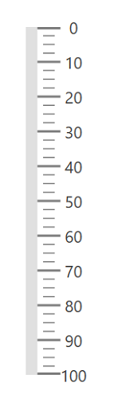

# Orientation in WPF Linear Gauge (SfLinearGauge)

The `LinearGauge` control supports horizontal and vertical orientations. By default, the `LinearGauge` is rendered with horizontal orientation. You can change the orientation using the [`Orientation`](https://help.syncfusion.com/cr/wpf/Syncfusion.UI.Xaml.Gauges.SfLinearGauge.html#Syncfusion_UI_Xaml_Gauges_SfLinearGauge_Orientation) property.





    <gauge:SfLinearGauge Orientation="Vertical">

    <gauge:SfLinearGauge.MainScale>

    <gauge:LinearScale ScaleBarStroke="#E0E0E0" MajorTickStroke="Gray" 
                       MinorTickStroke="Gray" LabelStroke="#424242"
                       ScaleBarSize="10" MinorTicksPerInterval="3">
    </gauge:LinearScale>

    </gauge:SfLinearGauge.MainScale>

    </gauge:SfLinearGauge>





            SfLinearGauge sfLinearGauge = new SfLinearGauge();

            sfLinearGauge.Orientation = System.Windows.Controls.Orientation.Vertical;
           
            LinearScale linearScale = new LinearScale();

            linearScale.ScaleBarStroke = new SolidColorBrush(Color.FromRgb(224, 224, 224));

            linearScale.MajorTickStroke = new SolidColorBrush(Colors.Gray);

            linearScale.MinorTickStroke = new SolidColorBrush(Colors.Gray);

            linearScale.LabelStroke = new SolidColorBrush(Color.FromRgb(66, 66, 66));

            linearScale.ScaleBarSize = 10;

            linearScale.MinorTicksPerInterval = 3;

            sfLinearGauge.MainScale = linearScale;





