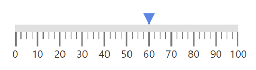
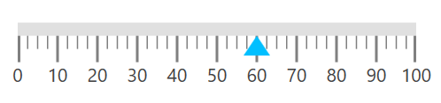
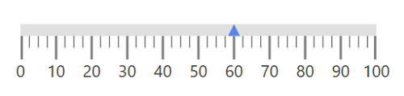

# Pointers support in WPF Linear Gauge (SfLinearGauge)

The [`LinearGauge`](https://help.syncfusion.com/cr/wpf/Syncfusion.UI.Xaml.Gauges.SfLinearGauge.html) provides support to mark values using the `BarPointer` and `SymbolPointer`.

## Bar pointer

`BarPointer` is used to mark scale values. It starts at the beginning of gauge and ends at the pointer value. You can add bar pointer using the [`PointerType`](https://help.syncfusion.com/cr/wpf/Syncfusion.UI.Xaml.Gauges.LinearPointer.html#Syncfusion_UI_Xaml_Gauges_LinearPointer_PointerType) property. 





    <gauge:SfLinearGauge>

    <gauge:SfLinearGauge.MainScale>

    <gauge:LinearScale ScaleBarStroke="#E0E0E0" MajorTickStroke="Gray"

     MinorTickStroke="Gray" LabelStroke="#424242" ScaleBarSize="20" MinorTicksPerInterval="3">

    <gauge:LinearScale.Pointers>

    <gauge:LinearPointer PointerType="BarPointer" Value="75" BarPointerStroke="#36D1DC"

    BarPointerStrokeThickness="10"/>

    </gauge:LinearScale.Pointers>

    </gauge:LinearScale>

    </gauge:SfLinearGauge.MainScale>

    </gauge:SfLinearGauge>





            SfLinearGauge sfLinearGauge = new SfLinearGauge();

            LinearScale linearScale = new LinearScale();

            linearScale.ScaleBarStroke = new SolidColorBrush(Color.FromRgb(224, 224, 224));

            linearScale.MajorTickStroke = new SolidColorBrush(Colors.Gray);

            linearScale.MinorTickStroke = new SolidColorBrush(Colors.Gray);

            linearScale.LabelStroke = new SolidColorBrush(Color.FromRgb(66, 66, 66));

            linearScale.ScaleBarSize = 20;

            linearScale.MinorTicksPerInterval = 3;

            LinearPointer linearPointer1 = new LinearPointer();

            linearPointer1.PointerType = LinearPointerType.BarPointer;

            linearPointer1.Value = 75;

            linearPointer1.BarPointerStroke = new SolidColorBrush(Color.FromRgb(54, 209, 220));

            linearPointer1.BarPointerStrokeThickness = 10;

            linearScale.Pointers.Add(linearPointer1);

            sfLinearGauge.MainScale = linearScale;





### Bar pointer customization

The UI of `Bar pointer` is customized using the [`BarPointerStroke`](https://help.syncfusion.com/cr/wpf/Syncfusion.UI.Xaml.Gauges.LinearPointer.html#Syncfusion_UI_Xaml_Gauges_LinearPointer_BarPointerStroke) and [`BarPointerStrokeThickness`](https://help.syncfusion.com/cr/wpf/Syncfusion.UI.Xaml.Gauges.LinearPointer.html#Syncfusion_UI_Xaml_Gauges_LinearPointer_BarPointerStrokeThickness) properties.





    <gauge:SfLinearGauge>

    <gauge:SfLinearGauge.MainScale>

    <gauge:LinearScale ScaleBarStroke="#E0E0E0" MajorTickStroke="Gray" MinorTickStroke="Gray" LabelStroke="#424242"

    ScaleBarSize="20" MinorTicksPerInterval="3">

    <gauge:LinearScale.Pointers>

    <gauge:LinearPointer PointerType="BarPointer" Value="75" BarPointerStroke="Orange"

    BarPointerStrokeThickness="10"/>

    </gauge:LinearScale.Pointers>

    </gauge:LinearScale>

    </gauge:SfLinearGauge.MainScale>

    </gauge:SfLinearGauge>





            SfLinearGauge sfLinearGauge = new SfLinearGauge();

            LinearScale linearScale = new LinearScale();

            linearScale.ScaleBarStroke = new SolidColorBrush(Color.FromRgb(224, 224, 224));

            linearScale.MajorTickStroke = new SolidColorBrush(Colors.Gray);

            linearScale.MinorTickStroke = new SolidColorBrush(Colors.Gray);

            linearScale.LabelStroke = new SolidColorBrush(Color.FromRgb(66, 66, 66));

            linearScale.ScaleBarSize = 20;

            linearScale.MinorTicksPerInterval = 3;

            LinearPointer linearPointer1 = new LinearPointer();

            linearPointer1.PointerType = LinearPointerType.BarPointer;

            linearPointer1.Value = 75;

            linearPointer1.BarPointerStroke = new SolidColorBrush(Colors.Orange);

            linearPointer1.BarPointerStrokeThickness = 10;

            linearScale.Pointers.Add(linearPointer1);

            sfLinearGauge.MainScale = linearScale;





## Symbol pointer in linear scale

In `SymbolPointer`, the value is pointed by a symbol on the scale.





    <gauge:SfLinearGauge>

    <gauge:SfLinearGauge.MainScale>

    <gauge:LinearScale  ScaleBarStroke="#E0E0E0" MajorTickStroke="Gray"

    MinorTickStroke="Gray" LabelStroke="#424242"

    ScaleBarSize="10" MinorTicksPerInterval="3">

    <gauge:LinearScale.Pointers>

    <gauge:LinearPointer PointerType="SymbolPointer" Value="60"

    SymbolPointerHeight="15" SymbolPointerWidth="15"

    SymbolPointerPosition="Above" SymbolPointerStroke="#5B86E5"/>

    </gauge:LinearScale.Pointers>

    </gauge:LinearScale>

    </gauge:SfLinearGauge.MainScale>

    </gauge:SfLinearGauge>





            SfLinearGauge sfLinearGauge = new SfLinearGauge();

            LinearScale linearScale = new LinearScale();

            linearScale.ScaleBarStroke = new SolidColorBrush(Color.FromRgb(224, 224, 224));

            linearScale.MajorTickStroke = new SolidColorBrush(Colors.Gray);

            linearScale.MinorTickStroke = new SolidColorBrush(Colors.Gray);

            linearScale.LabelStroke = new SolidColorBrush(Color.FromRgb(66, 66, 66));

            linearScale.ScaleBarSize = 10;

            linearScale.MinorTicksPerInterval = 3;

            LinearPointer linearPointer = new LinearPointer();

            linearPointer.PointerType = LinearPointerType.SymbolPointer;

            linearPointer.Value = 60;

            linearPointer.SymbolPointerHeight = 15;

            linearPointer.SymbolPointerWidth = 15;

            linearPointer.SymbolPointerPosition = LinearSymbolPointersPosition.Above;

            linearPointer.SymbolPointerStroke = new SolidColorBrush(Color.FromRgb(91, 134, 229));

            linearScale.Pointers.Add(linearPointer);

            sfLinearGauge.MainScale = linearScale;





### Symbol pointer customization

You can modify the size of symbol pointer by changing the [`SymbolPointerHeight`](https://help.syncfusion.com/cr/wpf/Syncfusion.UI.Xaml.Gauges.LinearPointer.html#Syncfusion_UI_Xaml_Gauges_LinearPointer_SymbolPointerHeight) and [`SymbolPointerWidth`](https://help.syncfusion.com/cr/wpf/Syncfusion.UI.Xaml.Gauges.LinearPointer.html#Syncfusion_UI_Xaml_Gauges_LinearPointer_SymbolPointerWidth) properties. The stroke of symbol pointer is changed using the [`SymbolPointerStroke`](https://help.syncfusion.com/cr/wpf/Syncfusion.UI.Xaml.Gauges.LinearPointer.html#Syncfusion_UI_Xaml_Gauges_LinearPointer_SymbolPointerStroke) property. 





    <gauge:SfLinearGauge>

    <gauge:SfLinearGauge.MainScale>

    <gauge:LinearScale ScaleBarStroke="#E0E0E0" MajorTickStroke="Gray"

    MinorTickStroke="Gray" LabelStroke="#424242"

    ScaleBarSize="10" MinorTicksPerInterval="3">

    <gauge:LinearScale.Pointers>

    <gauge:LinearPointer   PointerType="SymbolPointer" Value="60"

    SymbolPointerHeight="15" SymbolPointerWidth="20"

    SymbolPointerStroke="DeepSkyBlue"/>

    </gauge:LinearScale.Pointers>

    </gauge:LinearScale>

    </gauge:SfLinearGauge.MainScale>

    </gauge:SfLinearGauge>





            SfLinearGauge sfLinearGauge = new SfLinearGauge();

            LinearScale linearScale = new LinearScale();

            linearScale.ScaleBarStroke = new SolidColorBrush(Color.FromRgb(224, 224, 224));

            linearScale.MajorTickStroke = new SolidColorBrush(Colors.Gray);

            linearScale.MinorTickStroke = new SolidColorBrush(Colors.Gray);

            linearScale.LabelStroke = new SolidColorBrush(Color.FromRgb(66, 66, 66));

            linearScale.ScaleBarSize = 10;

            linearScale.MinorTicksPerInterval = 3;

            LinearPointer linearPointer = new LinearPointer();

            linearPointer.PointerType = LinearPointerType.SymbolPointer;

            linearPointer.Value = 60;

            linearPointer.SymbolPointerHeight = 15;

            linearPointer.SymbolPointerWidth = 20;

            linearPointer.SymbolPointerStroke = new SolidColorBrush(Colors.DeepSkyBlue);

            linearScale.Pointers.Add(linearPointer);

            sfLinearGauge.MainScale = linearScale;





## Positioning symbol pointer

`SymbolPointer` in the scale can be placed above, below, or in between the scale by choosing the following options available in the [`SymbolPointerPosition`](https://help.syncfusion.com/cr/wpf/Syncfusion.UI.Xaml.Gauges.LinearPointer.html#Syncfusion_UI_Xaml_Gauges_LinearPointer_SymbolPointerPosition) property:

1.	Above

2.	Below (Default)

3.	Cross





    <gauge:SfLinearGauge>

    <gauge:SfLinearGauge.MainScale>

    <gauge:LinearScale ScaleBarStroke="#E0E0E0" MajorTickStroke="Gray"

    MinorTickStroke="Gray" LabelStroke="#424242"

    ScaleBarSize="10" MinorTicksPerInterval="3" >

    <gauge:LinearScale.Pointers>

    <gauge:LinearPointer  PointerType="SymbolPointer" Value="60"

    SymbolPointerPosition="Cross" SymbolPointerHeight="10" SymbolPointerWidth="10"

    SymbolPointerStroke="#5B86E5"/>

    </gauge:LinearScale.Pointers>

    </gauge:LinearScale>

    </gauge:SfLinearGauge.MainScale>

    </gauge:SfLinearGauge>





            SfLinearGauge sfLinearGauge = new SfLinearGauge();

            LinearScale linearScale = new LinearScale();

            linearScale.ScaleBarStroke = new SolidColorBrush(Color.FromRgb(224, 224, 224));

            linearScale.MajorTickStroke = new SolidColorBrush(Colors.Gray);

            linearScale.MinorTickStroke = new SolidColorBrush(Colors.Gray);

            linearScale.LabelStroke = new SolidColorBrush(Color.FromRgb(66, 66, 66));

            linearScale.ScaleBarSize = 10;

            linearScale.MinorTicksPerInterval = 3;

            LinearPointer linearPointer = new LinearPointer();

            linearPointer.PointerType = LinearPointerType.SymbolPointer;

            linearPointer.Value = 60;

            linearPointer.SymbolPointerPosition = LinearSymbolPointersPosition.Cross;

            linearPointer.SymbolPointerHeight = 10;

            linearPointer.SymbolPointerWidth = 10;

            linearPointer.SymbolPointerStroke = new SolidColorBrush(Color.FromRgb(91, 134, 229));

            linearScale.Pointers.Add(linearPointer);
  
            sfLinearGauge.MainScale = linearScale;





### Change symbol pointer shapes

The [`SymbolPointerStyle`](https://help.syncfusion.com/cr/wpf/Syncfusion.UI.Xaml.Gauges.LinearPointer.html#Syncfusion_UI_Xaml_Gauges_LinearPointer_SymbolPointerStyle) property is used to select symbol pointer style.



    <gauge:SfLinearGauge>

    <gauge:SfLinearGauge.MainScale>

    <gauge:LinearScale ScaleBarStroke="#E0E0E0" MajorTickStroke="Gray"

    MinorTickStroke="Gray" LabelStroke="#424242"

    ScaleBarSize="10" MinorTicksPerInterval="3">

    <gauge:LinearScale.Pointers>

    <gauge:LinearPointer PointerType="SymbolPointer" Value="60" SymbolPointerStyle="Custom">

    <gauge:LinearPointer.SymbolPointerTemplate>
                               
    <DataTemplate>

    <Rectangle Width="10" Height="10" Stroke="Red" StrokeThickness="10">

    </Rectangle>

    </DataTemplate>
                                
    </gauge:LinearPointer.SymbolPointerTemplate>
                            
    </gauge:LinearPointer>

    </gauge:LinearScale.Pointers>

    </gauge:LinearScale>

    </gauge:SfLinearGauge.MainScale>

    </gauge:SfLinearGauge>



### Adding multiple pointers

In addition to the default pointer, you can add "n" number of [`Pointers`](https://help.syncfusion.com/cr/wpf/Syncfusion.UI.Xaml.Gauges.LinearScale.html#Syncfusion_UI_Xaml_Gauges_LinearScale_Pointers) to a linear scale using the [`Pointers`](https://help.syncfusion.com/cr/wpf/Syncfusion.UI.Xaml.Gauges.LinearScale.html#Syncfusion_UI_Xaml_Gauges_LinearScale_Pointers) property.





    <gauge:SfLinearGauge>

    <gauge:SfLinearGauge.MainScale>

    <gauge:LinearScale ScaleBarStroke="#E0E0E0" MajorTickStroke="Gray"
    MinorTickStroke="Gray" LabelStroke="#424242"
    ScaleBarSize="20" MinorTicksPerInterval="3">

    <gauge:LinearScale.Pointers>

    <gauge:LinearPointer PointerType="SymbolPointer" Value="60"
     SymbolPointerHeight="15" SymbolPointerWidth="15" SymbolPointerPosition="Above" SymbolPointerStroke="#5B86E5"/>

    <gauge:LinearPointer PointerType="BarPointer" Value="75" BarPointerStroke="#36D1DC" BarPointerStrokeThickness="10"/>

    </gauge:LinearScale.Pointers>

    </gauge:LinearScale>

    </gauge:SfLinearGauge.MainScale>

    </gauge:SfLinearGauge>





           SfLinearGauge sfLinearGauge = new SfLinearGauge();

            LinearScale linearScale = new LinearScale();

            linearScale.ScaleBarStroke = new SolidColorBrush(Color.FromRgb(224, 224, 224));

            linearScale.MajorTickStroke = new SolidColorBrush(Colors.Gray);

            linearScale.MinorTickStroke = new SolidColorBrush(Colors.Gray);

            linearScale.LabelStroke = new SolidColorBrush(Color.FromRgb(66, 66, 66));

            linearScale.ScaleBarSize = 20;

            linearScale.MinorTicksPerInterval = 3;

            LinearPointer linearPointer1 = new LinearPointer();

            linearPointer1.PointerType = LinearPointerType.BarPointer;

            linearPointer1.Value = 75;

            linearPointer1.BarPointerStroke = new SolidColorBrush(Color.FromRgb(54, 209, 220));

            linearPointer1.BarPointerStrokeThickness = 10;

            linearScale.Pointers.Add(linearPointer1);

            LinearPointer linearPointer = new LinearPointer();

            linearPointer.PointerType = LinearPointerType.SymbolPointer;

            linearPointer.Value = 60;

            linearPointer.SymbolPointerHeight = 15;

            linearPointer.SymbolPointerWidth = 15;

            linearPointer.SymbolPointerPosition = LinearSymbolPointersPosition.Above;

            linearPointer.SymbolPointerStroke = new SolidColorBrush(Color.FromRgb(91, 134, 229));

            linearScale.Pointers.Add(linearPointer);

            sfLinearGauge.MainScale = linearScale;





## Setting animation for pointer

The [`EnableAnimation`](https://help.syncfusion.com/cr/wpf/Syncfusion.UI.Xaml.Gauges.LinearPointer.html#Syncfusion_UI_Xaml_Gauges_LinearPointer_EnableAnimationProperty) is a Boolean property, which is used to enable or disable the animation of the [`Pointers`](https://help.syncfusion.com/cr/wpf/Syncfusion.UI.Xaml.Gauges.LinearScale.html#Syncfusion_UI_Xaml_Gauges_LinearScale_Pointers) in linear gauge and the animation speed can be controlled with [`AnimationDuration`](https://help.syncfusion.com/cr/wpf/Syncfusion.UI.Xaml.Gauges.LinearPointer.html#Syncfusion_UI_Xaml_Gauges_LinearPointer_AnimationDuration) property.





        <gauge:SfLinearGauge>

            <gauge:SfLinearGauge.MainScale>

                <gauge:LinearScale ScaleBarStroke="#E0E0E0" MajorTickStroke="Gray"
                    MinorTickStroke="Gray" LabelStroke="#424242"
                    ScaleBarSize="20" MinorTicksPerInterval="3">

                    <gauge:LinearScale.Pointers>

                        <gauge:LinearPointer EnableAnimation="True" AnimationDuration="500" PointerType="SymbolPointer" Value="60"
                        SymbolPointerHeight="15" SymbolPointerWidth="15" SymbolPointerPosition="Above" SymbolPointerStroke="#5B86E5"/>

                        <gauge:LinearPointer EnableAnimation="True" AnimationDuration="1000" PointerType="BarPointer" Value="75" BarPointerStroke="#36D1DC" BarPointerStrokeThickness="10"/>

                    </gauge:LinearScale.Pointers>

                </gauge:LinearScale>

            </gauge:SfLinearGauge.MainScale>

        </gauge:SfLinearGauge>





             SfLinearGauge sfLinearGauge = new SfLinearGauge();

            LinearScale linearScale = new LinearScale()
            {

                ScaleBarStroke = new SolidColorBrush(Color.FromRgb(224, 224, 224)),
                MajorTickStroke = new SolidColorBrush(Colors.Gray),
                MinorTickStroke = new SolidColorBrush(Colors.Gray),
                LabelStroke = new SolidColorBrush(Color.FromRgb(66, 66, 66)),
                ScaleBarSize = 20,
                MinorTicksPerInterval = 3,
            };

            LinearPointer linearPointer1 = new LinearPointer()
            {

                PointerType = LinearPointerType.BarPointer,
                Value = 75,
                BarPointerStroke = new SolidColorBrush(Color.FromRgb(54, 209, 220)),
                BarPointerStrokeThickness = 10,
                EnableAnimation = true,
                AnimationDuration = 1000
            };

            linearScale.Pointers.Add(linearPointer1);

            LinearPointer linearPointer = new LinearPointer()
            {

                PointerType = LinearPointerType.SymbolPointer,
                Value = 60,
                SymbolPointerHeight = 15,
                SymbolPointerWidth = 15,
                SymbolPointerPosition = LinearSymbolPointersPosition.Above,
                SymbolPointerStroke = new SolidColorBrush(Color.FromRgb(91, 134, 229)),
                EnableAnimation = true,
                AnimationDuration = 500
            };

            linearScale.Pointers.Add(linearPointer);

            sfLinearGauge.MainScale = linearScale;

            this.Content = sfLinearGauge;





