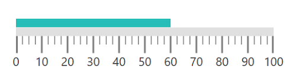
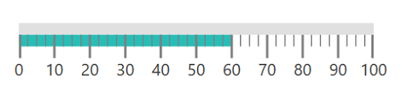
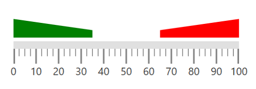

# Ranges 

Range is a visual element, which begins and ends at specified values within a scale. You can add any number of ranges to a scale using the array of range objects.

## Setting start and end values for range

The start and end values of ranges are set using the [`StartValue`](https://help.syncfusion.com/cr/wpf/Syncfusion.SfGauge.WPF~Syncfusion.UI.Xaml.Gauges.LinearRange~StartValue.html) and [`EndValue`](https://help.syncfusion.com/cr/wpf/Syncfusion.SfGauge.WPF~Syncfusion.UI.Xaml.Gauges.LinearRange~EndValue.html) properties.





    <gauge:SfLinearGauge>

    <gauge:SfLinearGauge.MainScale>

    <gauge:LinearScale ScaleBarStroke="#E0E0E0" MajorTickStroke="Gray"

    MinorTickStroke="Gray" LabelStroke="#424242"

    ScaleBarSize="10" MinorTicksPerInterval="3">

    <gauge:LinearScale.Ranges>

    <gauge:LinearRange StartValue="0" EndValue="60"

    RangeStroke="#27BEB7"  StartWidth="10" EndWidth="10" RangeOffset="0.4" />

    </gauge:LinearScale.Ranges>

    </gauge:LinearScale>

    </gauge:SfLinearGauge.MainScale>

    </gauge:SfLinearGauge>





            SfLinearGauge sfLinearGauge = new SfLinearGauge();

            LinearScale linearScale = new LinearScale();

            linearScale.ScaleBarStroke = new SolidColorBrush(Color.FromRgb(224, 224, 224));

            linearScale.MajorTickStroke = new SolidColorBrush(Colors.Gray);

            linearScale.MinorTickStroke = new SolidColorBrush(Colors.Gray);

            linearScale.LabelStroke = new SolidColorBrush(Color.FromRgb(66, 66, 66));

            linearScale.ScaleBarSize = 10;

            linearScale.MinorTicksPerInterval = 3;

            LinearRange linearRange = new LinearRange();

            linearRange.StartValue = 0;

            linearRange.EndValue = 60;

            linearRange.RangeStroke = new SolidColorBrush(Color.FromRgb(39, 190, 183));

            linearRange.StartWidth = 10;

            linearRange.EndWidth = 10;

            linearRange.RangeOffset = 0.4;

            linearScale.Ranges.Add(linearRange);

            sfLinearGauge.MainScale = linearScale;





## Range customization

The UI element of a range is customized by changing the [`RangeStroke`](https://help.syncfusion.com/cr/wpf/Syncfusion.SfGauge.WPF~Syncfusion.UI.Xaml.Gauges.LinearRange~RangeStroke.html) of the linear range, and the appearance of linear range is customized by setting the [`StartWidth`](https://help.syncfusion.com/cr/wpf/Syncfusion.SfGauge.WPF~Syncfusion.UI.Xaml.Gauges.LinearRange~StartWidth.html) and [`EndWidth`](https://help.syncfusion.com/cr/wpf/Syncfusion.SfGauge.WPF~Syncfusion.UI.Xaml.Gauges.LinearRange~EndWidth.html) properties. By setting the [`RangeOpacity`](https://help.syncfusion.com/cr/wpf/Syncfusion.SfGauge.WPF~Syncfusion.UI.Xaml.Gauges.LinearRange~RangeOpacity.html) of LinearRange, the opacity of the range can be modified.





    <gauge:SfLinearGauge>

    <gauge:SfLinearGauge.MainScale>

    <gauge:LinearScale ScaleBarStroke="#E0E0E0" MajorTickStroke="Gray"

    MinorTickStroke="Gray" LabelStroke="#424242"

    ScaleBarSize="10" MinorTicksPerInterval="3" ScaleBarLength="300">

    <gauge:LinearScale.Ranges>

    <gauge:LinearRange StartValue="0" EndValue="50" RangeStroke="#F95C85"  StartWidth="5"
                                           
    EndWidth="20"  RangeOpacity="1"/>

    </gauge:LinearScale.Ranges>

    </gauge:LinearScale>

    </gauge:SfLinearGauge.MainScale>

    </gauge:SfLinearGauge>





            SfLinearGauge sfLinearGauge = new SfLinearGauge();

            LinearScale linearScale = new LinearScale();

            linearScale.ScaleBarStroke = new SolidColorBrush(Color.FromRgb(224, 224, 224));

            linearScale.MajorTickStroke = new SolidColorBrush(Colors.Gray);

            linearScale.MinorTickStroke = new SolidColorBrush(Colors.Gray);

            linearScale.LabelStroke = new SolidColorBrush(Color.FromRgb(66, 66, 66));

            linearScale.ScaleBarSize = 10;

            linearScale.MinorTicksPerInterval = 3;

            LinearRange linearRange = new LinearRange();

            linearRange.StartValue = 0;

            linearRange.EndValue = 50;

             linearRange.RangeOpacity = 1;

            linearRange.RangeStroke = new SolidColorBrush(Color.FromRgb(249, 92, 133));

            linearRange.StartWidth = 5;

            linearRange.EndWidth = 20;

            linearScale.Ranges.Add(linearRange);

            sfLinearGauge.MainScale = linearScale;





## Binding range stroke to ticks and labels

You can bind the range’s stroke to tick lines and labels within its range by setting the [`BindWithRangeStrokeToLabels`](https://help.syncfusion.com/cr/wpf/Syncfusion.SfGauge.WPF~Syncfusion.UI.Xaml.Gauges.LinearScale~BindRangeStrokeToLabels.html). Stroke of the labels can be set related to stroke of the specified ranges. Similarly, by setting the [`BindWithRangeStrokeToTicks`](https://help.syncfusion.com/cr/wpf/Syncfusion.SfGauge.WPF~Syncfusion.UI.Xaml.Gauges.LinearScale~BindRangeStrokeToTicks.html), stroke of the ticks can be set related to stroke of the specified ranges.





    <gauge:SfLinearGauge>

    <gauge:SfLinearGauge.MainScale>

    <gauge:LinearScale BindRangeStrokeToLabels="True" BindRangeStrokeToTicks="True"
                                  
    ScaleBarStroke="#E0E0E0" MajorTickStroke="Gray"
                                  
    MinorTickStroke="Gray" LabelStroke="#424242"
                                  
    ScaleBarSize="10" MinorTicksPerInterval="3">

    <gauge:LinearScale.Ranges>

    <gauge:LinearRange StartValue="0" EndValue="35"  StartWidth="15" EndWidth="15" 

    RangeOffset="5" RangeStroke="Green"/>

    <gauge:LinearRange StartValue="35" EndValue="65" 

    StartWidth="15" EndWidth="15" RangeOffset="5" RangeStroke="Yellow"/>
                                            
    <gauge:LinearRange StartValue="65" EndValue="100"  StartWidth="15" EndWidth="15" 

    RangeOffset="5" RangeStroke="Red"/>

    </gauge:LinearScale.Ranges>

    </gauge:LinearScale>

    </gauge:SfLinearGauge.MainScale>

    </gauge:SfLinearGauge>





            SfLinearGauge sfLinearGauge = new SfLinearGauge();

            LinearScale linearScale = new LinearScale();

            linearScale.ScaleBarStroke = new SolidColorBrush(Color.FromRgb(224, 224, 224));

            linearScale.MajorTickStroke = new SolidColorBrush(Colors.Gray);

            linearScale.MinorTickStroke = new SolidColorBrush(Colors.Gray);

            linearScale.LabelStroke = new SolidColorBrush(Color.FromRgb(66, 66, 66));

            linearScale.ScaleBarSize = 10;

            linearScale.MinorTicksPerInterval = 3;

            linearScale.BindRangeStrokeToLabels = true;

            linearScale.BindRangeStrokeToTicks = true;

            LinearRange linearRange = new LinearRange();

            linearRange.StartValue = 0;

            linearRange.EndValue = 35;

            linearRange.StartWidth = 15;

            linearRange.EndWidth = 15;

            linearRange.RangeOffset = 5;

            linearRange.RangeStroke = new SolidColorBrush(Colors.Green);

            linearScale.Ranges.Add(linearRange);

            LinearRange linearRange1 = new LinearRange();

            linearRange1.StartValue = 35;

            linearRange1.EndValue = 65;

            linearRange1.StartWidth = 15;

            linearRange1.EndWidth = 15;

            linearRange1.RangeOffset = 5;

            linearRange1.RangeStroke = new SolidColorBrush(Colors.Yellow);

            linearScale.Ranges.Add(linearRange1);

            LinearRange linearRange2 = new LinearRange();

            linearRange2.StartValue = 65;

            linearRange2.EndValue = 100;

            linearRange2.StartWidth = 15;

            linearRange2.EndWidth = 15;

            linearRange2.RangeOffset = 5;

            linearRange2.RangeStroke = new SolidColorBrush(Colors.Red);

            linearScale.Ranges.Add(linearRange2);

            sfLinearGauge.MainScale = linearScale;





## Setting range position

The range can be placed above or below the scale by one of the following ways:

### Setting range offset for linear range

Using the [`RangeOffset`](https://help.syncfusion.com/cr/wpf/Syncfusion.SfGauge.WPF~Syncfusion.UI.Xaml.Gauges.LinearRange~RangeOffset.html) property, the linear range can be positioned with respect to the linear scale.





    <gauge:SfLinearGauge>

    <gauge:SfLinearGauge.MainScale>

    <gauge:LinearScale RangePosition="Below"

    ScaleBarStroke="#E0E0E0" MajorTickStroke="Gray" MinorTickStroke="Gray" LabelStroke="#424242"

    ScaleBarSize="10" MinorTicksPerInterval="3">

    <gauge:LinearScale.Ranges>

    <gauge:LinearRange StartValue="0" EndValue="60" RangeStroke="#27BEB7" RangeOffset="-40" StartWidth="10"

    EndWidth="10"/>

    </gauge:LinearScale.Ranges>

    </gauge:LinearScale>

    </gauge:SfLinearGauge.MainScale>

    </gauge:SfLinearGauge>





           SfLinearGauge sfLinearGauge = new SfLinearGauge();

            LinearScale linearScale = new LinearScale();

            linearScale.RangePosition = LinearRangesPosition.Below;

            linearScale.ScaleBarStroke = new SolidColorBrush(Color.FromRgb(224, 224, 224));

            linearScale.MajorTickStroke = new SolidColorBrush(Colors.Gray);

            linearScale.MinorTickStroke = new SolidColorBrush(Colors.Gray);

            linearScale.LabelStroke = new SolidColorBrush(Color.FromRgb(66, 66, 66));

            linearScale.ScaleBarSize = 10;

            linearScale.MinorTicksPerInterval = 3;

            LinearRange linearRange = new LinearRange();

            linearRange.StartValue = 0;

            linearRange.EndValue = 60;

            linearRange.RangeOffset = -40;

            linearRange.RangeStroke = new SolidColorBrush(Color.FromRgb(39, 190, 183));

            linearRange.StartWidth = 10;

            linearRange.EndWidth = 10;

            linearScale.Ranges.Add(linearRange);

            sfLinearGauge.MainScale = linearScale;





### Setting range position in linear scale

The range can be placed above or below the scale by choosing one of the following options available in the [`RangePosition`](https://help.syncfusion.com/cr/wpf/Syncfusion.SfGauge.WPF~Syncfusion.UI.Xaml.Gauges.LinearScale~RangePosition.html) property:

1.	Above(Default)
2.	Below





    <gauge:SfLinearGauge>

    <gauge:SfLinearGauge.MainScale>

    <gauge:LinearScale RangePosition="Below"

    ScaleBarStroke="#E0E0E0" MajorTickStroke="Gray" MinorTickStroke="Gray" LabelStroke="#424242"

    ScaleBarSize="10" MinorTicksPerInterval="3" ScaleBarLength="300">

    <gauge:LinearScale.Ranges>

    <gauge:LinearRange StartValue="0" EndValue="60"

     RangeStroke="#27BEB7"  StartWidth="10" EndWidth="10"  />

    </gauge:LinearScale.Ranges>

    </gauge:LinearScale>

    </gauge:SfLinearGauge.MainScale>

    </gauge:SfLinearGauge>





          SfLinearGauge sfLinearGauge = new SfLinearGauge();

            LinearScale linearScale = new LinearScale();

            linearScale.RangePosition = LinearRangesPosition.Below;

            linearScale.ScaleBarStroke = new SolidColorBrush(Color.FromRgb(224, 224, 224));

            linearScale.MajorTickStroke = new SolidColorBrush(Colors.Gray);

            linearScale.MinorTickStroke = new SolidColorBrush(Colors.Gray);

            linearScale.LabelStroke = new SolidColorBrush(Color.FromRgb(66, 66, 66));

            linearScale.ScaleBarSize = 10;

            linearScale.MinorTicksPerInterval = 3;

            LinearRange linearRange = new LinearRange();

            linearRange.StartValue = 0;

            linearRange.EndValue = 60;

            linearRange.RangeStroke = new SolidColorBrush(Color.FromRgb(39, 190, 183));

            linearRange.StartWidth = 10;

            linearRange.EndWidth = 10;

            linearScale.Ranges.Add(linearRange);

            sfLinearGauge.MainScale = linearScale;





### Adding multiple ranges

You can add “n” number of ranges to a scale using the `LinearRange` property of range as shown in the following code.





    <gauge:SfLinearGauge>

    <gauge:SfLinearGauge.MainScale>

    <gauge:LinearScale ScaleBarStroke="#E0E0E0" MajorTickStroke="Gray"

    MinorTickStroke="Gray" LabelStroke="#424242"

    ScaleBarSize="10" MinorTicksPerInterval="3" ScaleBarLength="300">

    <gauge:LinearScale.Ranges>

    <gauge:LinearRange StartValue="0" EndValue="35"  StartWidth="25" EndWidth="10" 

     RangeOffset="5" RangeOpacity="1" RangeStroke="Green"/>

    <gauge:LinearRange StartValue="65" EndValue="100"  StartWidth="10" EndWidth="25" 

     RangeOffset="5" RangeOpacity="1" RangeStroke="Red"/>

    </gauge:LinearScale.Ranges>

    </gauge:LinearScale>

    </gauge:SfLinearGauge.MainScale>

    </gauge:SfLinearGauge>





            SfLinearGauge sfLinearGauge = new SfLinearGauge();

            LinearScale linearScale = new LinearScale();

            linearScale.ScaleBarStroke = new SolidColorBrush(Color.FromRgb(224, 224, 224));

            linearScale.MajorTickStroke = new SolidColorBrush(Colors.Gray);

            linearScale.MinorTickStroke = new SolidColorBrush(Colors.Gray);

            linearScale.LabelStroke = new SolidColorBrush(Color.FromRgb(66, 66, 66));

            linearScale.ScaleBarSize = 10;

            linearScale.MinorTicksPerInterval = 3;

            LinearRange linearRange = new LinearRange();

            linearRange.StartValue = 0;

            linearRange.EndValue = 35;

            linearRange.StartWidth = 25;

            linearRange.EndWidth = 10;

            linearRange.RangeOffset = 5;

            linearRange.RangeOpacity = 1;

            linearRange.RangeStroke = new SolidColorBrush(Colors.Green);

            linearScale.Ranges.Add(linearRange);

            LinearRange linearRange1 = new LinearRange();

            linearRange1.StartValue = 65;

            linearRange1.EndValue = 100;

            linearRange1.StartWidth = 10;

            linearRange1.EndWidth = 25;

            linearRange1.RangeOffset = 5;

            linearRange1.RangeOpacity = 1;

            linearRange1.RangeStroke = new SolidColorBrush(Colors.Red);

            linearScale.Ranges.Add(linearRange1);

            sfLinearGauge.MainScale = linearScale;





