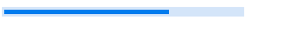
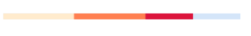
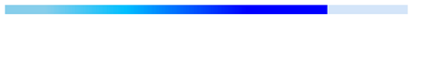
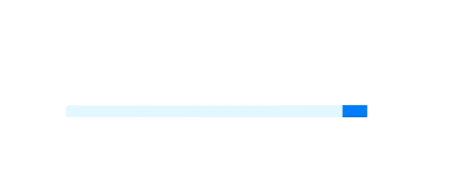
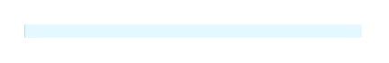

# Appearance
You can highly customize the appearance of the linear progressbar in the following ways.

## Corner radius
The [IndicatorCornerRadius](https://help.syncfusion.com/cr/wpf/Syncfusion.UI.Xaml.ProgressBar.ProgressBarBase.html#Syncfusion_UI_Xaml_ProgressBar_ProgressBarBase_IndicatorCornerRadiusProperty) property is used to frame rounded edges in the linear progressbar as demonstrated in the following code sample.



<Syncfusion:SfLinearProgressBar Progress="70" IndicatorCornerRadius="10"/>       


 SfLinearProgressBar linear = new SfLinearProgressBar { Progress = 70, IndicatorCornerRadius=10};
linear.Width = 500;
linear.Height = 20;
grid.Children.Add(linear);



## Padding
Padding helps to generate space between track bar and progressbar in the linear progressbar. The [IndicatorPadding](https://help.syncfusion.com/cr/wpf/Syncfusion.UI.Xaml.ProgressBar.SfLinearProgressBar.html#Syncfusion_UI_Xaml_ProgressBar_SfLinearProgressBar_IndicatorPaddingProperty) property is used to set the padding value.

      
<Syncfusion:SfLinearProgressBar Progress="70" IndicatorPadding="5"/>       


SfLinearProgressBar linear = new SfLinearProgressBar();
linear.IndicatorPadding = new Thickness(5);
linear.Progress = 70;
linear.Width = 500;
linear.Height = 20;
grid.Children.Add(linear);



## Color Customization
You can customize the color of the linear progressbar's progress color and track color. The following properties are used to customize the color in the progressbar.

•[ProgressColor](https://help.syncfusion.com/cr/wpf/Syncfusion.UI.Xaml.ProgressBar.ProgressBarBase.html#Syncfusion_UI_Xaml_ProgressBar_ProgressBarBase_ProgressColor): Represents the color of the progress indicator.

•[TrackColor](https://help.syncfusion.com/cr/wpf/Syncfusion.UI.Xaml.ProgressBar.ProgressBarBase.html#Syncfusion_UI_Xaml_ProgressBar_ProgressBarBase_TrackColorProperty): Represents the color of the track indicator.


      
<Syncfusion:SfLinearProgressBar Progress="70" ProgressColor="LawnGreen" TrackColor="DarkOliveGreen"/>


SfLinearProgressBar linear = new SfLinearProgressBar();
linear.Progress = 70;
linear.ProgressColor = new SolidColorBrush(Colors.LawnGreen);
linear.TrackColor = new SolidColorBrush(Colors.DarkOliveGreen);
grid.Children.Add(linear);      



## Range Colors

You can visualize multiple ranges with different solid colors that are mapped to each range to enhance the readability of progress.
The solid colors can be mapped to the specific ranges using the [RangeColor](https://help.syncfusion.com/cr/wpf/Syncfusion.UI.Xaml.ProgressBar.RangeColor.html).

•[Color](https://help.syncfusion.com/cr/wpf/Syncfusion.UI.Xaml.ProgressBar.RangeColor.html#Syncfusion_UI_Xaml_ProgressBar_RangeColor_Color): Represents the color to the specified range.

•[Start](https://help.syncfusion.com/cr/wpf/Syncfusion.UI.Xaml.ProgressBar.RangeColor.html#Syncfusion_UI_Xaml_ProgressBar_RangeColor_Start): Represents the start range of the color.

•[End](https://help.syncfusion.com/cr/wpf/Syncfusion.UI.Xaml.ProgressBar.RangeColor.html#Syncfusion_UI_Xaml_ProgressBar_RangeColor_End): Represents the end range of the color.
You can visualize the multiple ranges with different solid colors that are mapped to each range to enhance the readability of progress.



      <Syncfusion:SfLinearProgressBar Progress="80">
            <Syncfusion:SfLinearProgressBar.RangeColors>
                <Syncfusion:RangeColorCollection>
                    <Syncfusion:RangeColor Color="BlanchedAlmond" Start="10" End="30"/>
                    <Syncfusion:RangeColor Color="Coral" Start="30"  End="60"/>
                    <Syncfusion:RangeColor Color="Crimson" Start="60" End="100"/>
                </Syncfusion:RangeColorCollection>
            </Syncfusion:SfLinearProgressBar.RangeColors>
        </Syncfusion:SfLinearProgressBar>


SfLinearProgressBar linear = new SfLinearProgressBar();             
RangeColorCollection rangeColors = new RangeColorCollection();
rangeColors.Add(new RangeColor() { Color = Colors.BlanchedAlmond, Start = 5, End = 30 });
rangeColors.Add(new RangeColor() { Color = Colors.Coral, Start = 30, End = 60 });
rangeColors.Add(new RangeColor() { Color = Colors.Crimson, Start = 60, End = 100 });
linear.RangeColors = rangeColors;
linear.Progress = 80;
linear.Width = 500;
linear.Height = 20;
grid.Children.Add(linear);



## Gradient
Gradient shows change in intensity of the colors during the progress. [IsGradient](https://help.syncfusion.com/cr/wpf/Syncfusion.UI.Xaml.ProgressBar.RangeColor.html#Syncfusion_UI_Xaml_ProgressBar_RangeColor_IsGradient) property in  [RangeColor](https://help.syncfusion.com/cr/wpf/Syncfusion.UI.Xaml.ProgressBar.RangeColor.html) class to get the gradient effect in the colors applied to the progressbar.


      <Syncfusion:SfLinearProgressBar Progress="80>
            <Syncfusion:SfLinearProgressBar.RangeColors>
                <Syncfusion:RangeColorCollection>
                <Syncfusion:RangeColor IsGradient="True" Color="SkyBlue" Start="10" End="30"/>                    
                    <Syncfusion:RangeColor IsGradient="True" Color="DeepSkyBlue" Start="30" End="60"/>
                    <Syncfusion:RangeColor IsGradient="True" Color="Blue" Start="60" End="100"/>
                </Syncfusion:RangeColorCollection>
            </Syncfusion:SfLinearProgressBar.RangeColors>
        </Syncfusion:SfLinearProgressBar>


SfLinearProgressBar linear = new SfLinearProgressBar();             
RangeColorCollection rangeColors = new RangeColorCollection();
rangeColors.Add(new RangeColor() { IsGradient=true, Color =   Colors.SkyBlue, Start = 10, End = 30 });
rangeColors.Add(new RangeColor() { IsGradient = true,Color =  Colors.DeepSkyBlue, Start = 30, End = 60 });
rangeColors.Add(new RangeColor() { IsGradient = true,Color =  Colors.Blue, Start = 60, End = 100 });
linear.RangeColors = rangeColors;
linear.Progress = 80;
linear.Width = 500;
linear.Height = 20;
grid.Children.Add(linear);



## AnimationDuration
You can customize the duration for completing one animation cycle and it applies when the `IsIndeterminate` is true. The default value is 3000 milli seconds.


<Grid Name="grid">
    <Syncfusion:SfLinearProgressBar
        Width="250"
        Height="4"
        AnimationDuration="00:00:01"
        IsIndeterminate="True"
        Progress="50" />
</Grid> 


SfLinearProgressBar linear = new SfLinearProgressBar();
linear.Progress = 50;
linear.IsIndeterminate = true;
linear.Width = 250;
linear.Height = 4;
linear.AnimationDuration= new TimeSpan(0,0,1);
grid.Children.Add(linear);



## AnimationEasing
You can customize the easing function to apply for linear and circular progress bar animation and it applies when the `IsIndeterminate` is true. T


<Grid Name="grid">
    <Syncfusion:SfLinearProgressBar
    Width="250"
    Height="4"
    IndicatorCornerRadius="10"
    IsIndeterminate="True"
    Progress="50">
    <Syncfusion:SfLinearProgressBar.AnimationEasing>
        <BounceEase
        Bounces="20"
        Bounciness="5"
        EasingMode="EaseOut" />
    </Syncfusion:SfLinearProgressBar.AnimationEasing>
    </Syncfusion:SfLinearProgressBar>
</Grid>


SfLinearProgressBar linear = new SfLinearProgressBar();
linear.Progress = 50;
linear.IsIndeterminate = true;
linear.Width = 250;
linear.Height = 4;
BounceEase bounceEase = new BounceEase();
bounceEase.Bounces = 20;
bounceEase.Bounciness = 5;
bounceEase.EasingMode = EasingMode.EaseOut;
linear.AnimationEasing = bounceEase;
grid.Children.Add(linear);


