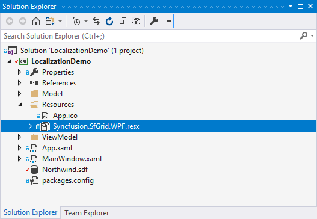
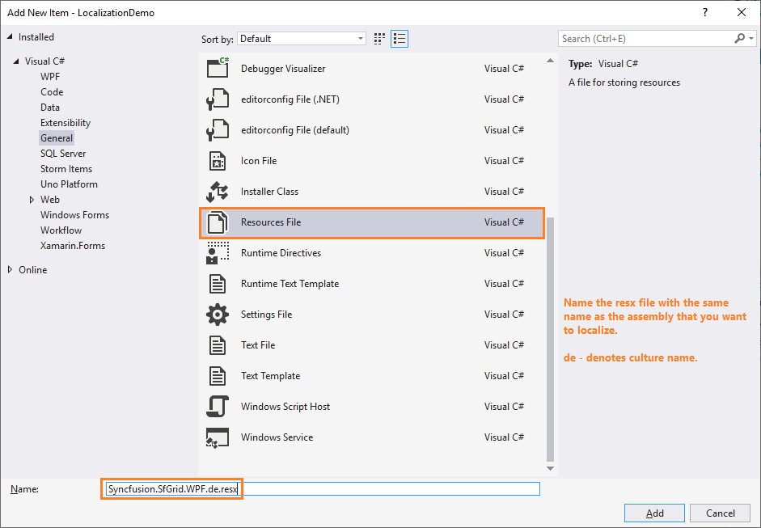

# Localization of Syncfusion&reg; WPF Controls

Localization is the process of translating the application resources into different language for the specific cultures. You can localize the syncfusion&reg; WPF controls by adding a resource file for each language.

## Changing application culture

When you change the application culture, you can localize the application based on application culture by creating .resx file.





public partial class MainWindow
{
    public MainWindow() 
    {     
        InitializeComponent();  
        System.Threading.Thread.CurrentThread.CurrentUICulture = new System.Globalization.CultureInfo("de");   
    }
} 
 




Partial Public Class MainWindow
    Public Sub New()
        InitializeComponent()
        System.Threading.Thread.CurrentThread.CurrentUICulture = new System.Globalization.CultureInfo("de")
    End Sub
End Class





## Creating .resx files

You can create .resx files for any language by following these steps:

N> You can get the default resource files of all Syncfusion&reg; WPF libraries from [GitHub](https://github.com/syncfusion/wpf-controls-localization-resx-files).

1) Right-click your project and add a new folder named as `Resources`. 

2) Add the [default resource files](https://github.com/syncfusion/wpf-controls-localization-resx-files) to the libraries you are using to the `Resources` folder and ensure `AccessModifier` is specified as `Public`. 

N> Consider, you are using `SfDataGrid` and `Ribbon` in your application. Then, you need to copy and include `Syncfusion.SfGrid.WPF.resx` (since `SfDataGrid` present in `Syncfusion.SfGrid.WPF` library) and `Syncfusion.Tools.Wpf.resx` (since `Ribbon` present in `Syncfusion.Tools.WPF` library) files in your application under `Resources` folder. So, now you can know the key names and values of default stings used in `Syncfusion.Tools.WPF.dll` and `Syncfusion.SfGrid.WPF.dll` libraries.    

3) Now, right-click `Resources` folder and select `Add` and then `NewItem`. In the `Add New Item` wizard, select the Resource File option and name the filename as `Syncfusion.SfGrid.WPF.<culture name>.resx`. For example, you have to give name as `Syncfusion.SfGrid.WPF.de.resx` for `German` culture. In the same way, add new resource files for other libraries used in your application.

4) Now, select `Add` and add resource file for German culture in `Resources` folder and set `AccessModifier` property to `No code generation`.  

5) Now, you can copy the key names from the default resource files and assign values based on the culture and the resource files' targets. 

N> Download demo from the [GitHub](https://github.com/SyncfusionExamples/wpf-datagrid-localization).

## Editing default culture strings

You can change default string of any control by adding the default .resx files ([from GitHub](https://github.com/syncfusion/wpf-controls-localization-resx-files)) to `Resources` folder of your application. If it is added, Syncfusion&reg; WPF controls reads the default string from the .resx files of application. 
