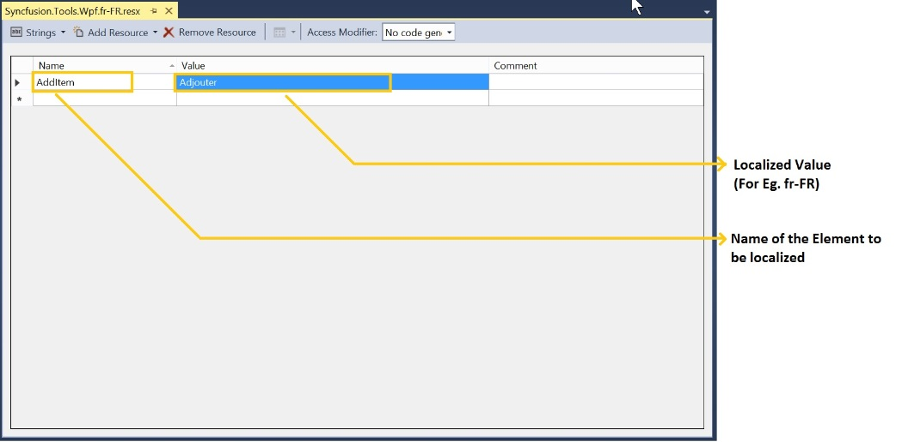
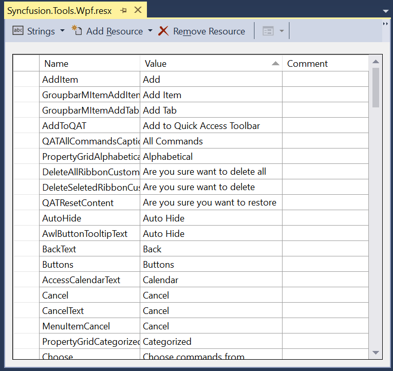

# Getting Started for Localization

Localization is the process of making application as multi-lingual, by formatting the content according to cultures. This involves configuring the application for a specific language. Culture is the combination of language and location, for example `en-US` is the culture for English spoken in United States; `en-GB` is the culture for English spoken in Great Britain. 

Syncfusion controls allows to set custom resource through the Resx file with standard filename as [AssemblyName].[CultureInfo Code].resx, for example Syncfusion.Tools.wpf.fr-FR.resx, Syncfusion.SfSchedule.wpf.fr-FR.resx and by giving the string values in the resource file for a specific culture and set the culture in the application. The string values should be set to the controls respective resource key.

The following are the steps to localize a control:

1. Add Resources file for the different cultures.
2. Assign the value to each culture using key
3. Assign a Current UI Culture to the application.

## Assign the value to each culture by using key

To localize WPF controls, the resource file needs to be created as per following steps:

1. Create a folder named "Resources" in the application.
2. Open the "Add New Item" Dialog using Ctrl+Shift+A keys.
3. Create a resource file, Resx file, and name it Syncfusion.Tools.Wpf.resx For example, Syncfusion.Tools.Wpf.fr-FR.resx

N> In case, the Shared assembly controls is used in the application, then create another resource file in name Syncfusion.Shared.Wpf.resx For example, Syncfusion.Shared.Wpf.fr-FR.resx and the naming convention needs to be followed mandatorily.

## How to assign UI Culture to the application

To assign "Values" in Resource, the resource file needs to be updated according to the following steps.

1.Open the required file by double clicking it from Solutions Explorer.

2.Add the key, Name, and its corresponding localized value by editing its field as shown in the following image.

3.Similarly add all the keys, Name, needed for the required assembly. For example (Syncfusion.Tools.Wpf.dll). The following screenshot displays the String property names for Tools.WPF controls with French values.

## Assign a Current UI culture to the application

Mention the culture to be referred while initializing the application, so that application refer to the appropriate value provided in resource file.





public partial class MainWindow
{
public MainWindow() 
{     
	InitializeComponent();  
   	System.Threading.Thread.CurrentThread.CurrentUICulture = new System.Globalization.CultureInfo("fr-FR");   
}
} 
 




Partial Public Class MainWindow
Public Sub New()
	InitializeComponent()
	   System.Threading.Thread.CurrentThread.CurrentUICulture = new System.Globalization.CultureInfo("fr-FR")
End Sub
End Class





N> If the resource file has been created without defining the culture name (for example, Syncfusion.Tools.WPF.resx), then predefined value has been applied to the resources which is maintained in the dependent assembly. Predefined value has been currently maintained in en-US culture. Also, you can download the default files from [here](https://help.syncfusion.com/wpf/introduction/common-supports#localization)

## Localization Resource File

The following table represents the available Resource file to the assemblies and it can be downloaded from below table.

<table>
<tr>
<th>
Assembly Name</th><th>
Resource File</th></tr>
<tr>
<td>
syncfusion.Diagram.Wpf  </td><td>
{{'[Syncfusion.Diagram.Wpf.resx](https://github.com/SyncfusionExamples/WPF-localization-ResX-file/tree/master/Syncfusion.Diagram.Wpf#"")'| markdownify }}  </td></tr>
<tr>
<td>
Syncfusion.Edit.Wpf  </td><td>
{{'[Syncfusion.Edit.Wpf.resx](https://github.com/SyncfusionExamples/WPF-localization-ResX-file/tree/master/Syncfusion.Edit.Wpf#"")'| markdownify }}  </td></tr>
<tr>
<td>
Syncfusion.Grid.Wpf  </td><td>
{{'[Syncfusion.Grid.Wpf.resx](https://github.com/SyncfusionExamples/WPF-localization-ResX-file/tree/master/Syncfusion.Grid.Wpf#"")'| markdownify }}  </td></tr>
<tr>
<td>
Syncfusion.OlapChart.Wpf  </td><td>
{{'[Syncfusion.OlapChart.WPF.resx](https://github.com/SyncfusionExamples/WPF-localization-ResX-file/tree/master/Syncfusion.OlapChart.Wpf#"")'| markdownify }}  </td></tr>
<tr>
<td>
Syncfusion.OlapClient.Wpf  </td><td>
{{'[Syncfusion.OlapClient.WPF.resx](https://github.com/SyncfusionExamples/WPF-localization-ResX-file/tree/master/Syncfusion.OlapClient.Wpf#"")'| markdownify }}  </td></tr>
<tr>
<td>
Syncfusion.OlapGauge.Wpf  </td><td>
{{'[Syncfusion.OlapGauge.Wpf.resx](https://github.com/SyncfusionExamples/WPF-localization-ResX-file/tree/master/Syncfusion.OlapGauge.Wpf#"")'| markdownify }}  </td></tr>
<tr>
<td>
Syncfusion.OlapGrid.Wpf  </td><td>
{{'[Syncfusion.OlapGrid.WPF.resx](https://github.com/SyncfusionExamples/WPF-localization-ResX-file/tree/master/Syncfusion.OlapGrid.Wpf#"")'| markdownify }}  </td></tr>
<tr>
<td>
Syncfusion.OlapShared.Wpf  </td><td>
{{'[Syncfusion.OlapShared.WPF.resx](https://github.com/SyncfusionExamples/WPF-localization-ResX-file/tree/master/Syncfusion.OlapShared.Wpf#"")'| markdownify }}  </td></tr>
<tr>
<td>
Syncfusion.OlapTools.Wpf  </td><td>
{{'[Syncfusion.OlapTools.WPF.resx](https://github.com/SyncfusionExamples/WPF-localization-ResX-file/tree/master/Syncfusion.OlapTools.Wpf#"")'| markdownify }}  </td></tr>
<tr>
<td>
Syncfusion.PdfViewer.Wpf  </td><td>
{{'[Syncfusion.PdfViewer.WPF.resx](https://github.com/SyncfusionExamples/WPF-localization-ResX-file/tree/master/Syncfusion.PdfViewer.WPf#"")'| markdownify }}  </td></tr>
<tr>
<td>
Syncfusion.PivotAnalysis.Wpf  </td><td>
{{'[Syncfusion.PivotAnalysis.Wpf.resx](https://github.com/SyncfusionExamples/WPF-localization-ResX-file/tree/master/Syncfusion.PivotAnalysis.Wpf#"")'| markdownify }}  </td></tr>
<tr>
<td>
Syncfusion.ReportDesigner.Wpf  </td><td>
{{'[Syncfusion.ReportDesigner.Wpf.resx](https://github.com/SyncfusionExamples/WPF-localization-ResX-file/tree/master/Syncfusion.ReportDesigner.Wpf#"")'| markdownify }}  </td></tr>
<tr>
<td>
Syncfusion.ReportViewer.Wpf  </td><td>
{{'[Syncfusion.ReportViewer.Wpf.resx](https://github.com/SyncfusionExamples/WPF-localization-ResX-file/tree/master/Syncfusion.ReportViewer.Wpf#"")'| markdownify }}  </td></tr>
<tr>
<td>
Syncfusion.SfChart.Wpf  </td><td>
{{'[Syncfusion.SfChart.WPF.resx](https://github.com/SyncfusionExamples/WPF-localization-ResX-file/tree/master/Syncfusion.SfChart.Wpf#"")'| markdownify }}  </td></tr>
<tr>
<td>
Syncfusion.SfDiagram.Wpf  </td><td>
{{'[Syncfusion.UI.Xaml.Diagram.resx](https://github.com/SyncfusionExamples/WPF-localization-ResX-file/tree/master/Syncfusion.SfDiagram.Wpf#"")'| markdownify }}  </td></tr>
<tr>
<td>
Syncfusion.SfGrid.Wpf  </td><td>
{{'[Syncfusion.SfGrid.WPF.resx](https://github.com/SyncfusionExamples/WPF-localization-ResX-file/tree/master/Syncfusion.SfGrid.Wpf#"")'| markdownify }}  </td></tr>
<tr>
<td>
Syncfusion.SfInput.Wpf  </td><td>
{{'[Syncfusion.SfInput.Wpf.resx](https://github.com/SyncfusionExamples/WPF-localization-ResX-file/tree/master/Syncfusion.SfInput.Wpf#"")'| markdownify }}  </td></tr>
<tr>
<td>
Syncfusion.SfRichTextBoxAdv.Wpf  </td><td>
{{'[Syncfusion.SfRichTextBoxAdv.WPF.resx](https://github.com/SyncfusionExamples/WPF-localization-ResX-file/tree/master/Syncfusion.SfRichTextBoxAdv.Wpf#"")'| markdownify }}  </td></tr>
<tr>
<td>
Syncfusion.SfRichTextRibbon.Wpf  </td><td>
{{'[Syncfusion.SfRichTextRibbon.WPF.resx](https://github.com/SyncfusionExamples/WPF-localization-ResX-file/tree/master/Syncfusion.SfRichTextRibbon.Wpf#"")'| markdownify }}  </td></tr>
<tr>
<td>
Syncfusion.SfSchedule.Wpf  </td><td>
{{'[Syncfusion.Schedule.WPF.resx](https://github.com/SyncfusionExamples/WPF-localization-ResX-file/tree/master/Syncfusion.SfSchedule.Wpf#"")'| markdownify }}  </td></tr>
<tr>
<td>
Syncfusion.SfShared.Wpf  </td><td>
{{'[Syncfusion.SfShared.Wpf.resx](https://github.com/SyncfusionExamples/WPF-localization-ResX-file/tree/master/Syncfusion.SfShared.Wpf#"")'| markdownify }}  </td></tr>
<tr>
<td>
Syncfusion.SfSpellChecker.Wpf  </td><td>
{{'[Syncfusion.SfSpellChecker.WPF.resx](https://github.com/SyncfusionExamples/WPF-localization-ResX-file/tree/master/Syncfusion.SfSpellchecker.Wpf#"")'| markdownify }}  </td></tr>
<tr>
<td>
Syncfusion.SfSpreadsheet.Wpf  </td><td>
{{'[Syncfusion.SfSpreadsheet.Wpf.resx](https://github.com/SyncfusionExamples/WPF-localization-ResX-file/tree/master/Syncfusion.SfSpreadsheet.Wpf#"")'| markdownify }}  </td></tr>
<tr>
<td>
Syncfusion.Shared.Wpf  </td><td>
{{'[Syncfusion.Shared.Wpf.resx](https://github.com/SyncfusionExamples/WPF-localization-ResX-file/tree/master/Syncfusion.Shared.Wpf#"")'| markdownify }}  </td></tr>
<tr>
<td>
Syncfusion.Spreadsheet.Wpf  </td><td>
{{'[Syncfusion.Spreadsheet.Wpf.resx](https://github.com/SyncfusionExamples/WPF-localization-ResX-file/tree/master/Syncfusion.Spreadsheet.Wpf#"")'| markdownify }}  </td></tr>
<tr>
<td>
Syncfusion.Tools.Wpf  </td><td>
{{'[Syncfusion.Tools.Wpf.resx](https://github.com/SyncfusionExamples/WPF-localization-ResX-file/tree/master/Syncfusion.Tools.Wpf#"")'| markdownify }}  </td></tr>
</table>
