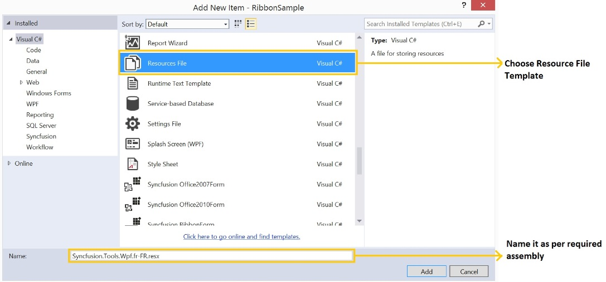
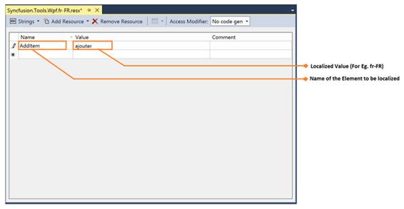
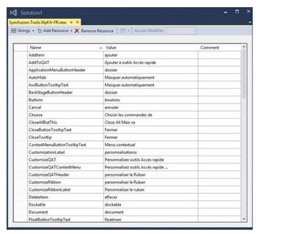

# Getting Started for Localization

Localization is the process of making your application multi-lingual, by formatting the content according to cultures. This involves configuring the application for a specific language. Culture is the combination of language and location, for example En-US is the culture for English spoken in United States; En-GB is the culture for English spoken in Great Britain. Syncfusion controls allows you to set custom resource through the Resx file with standard filename as [AssemblyName].[CultureInfo Code].resx, for example Syncfusion.Tools.wpf.fr-FR.resx, Syncfusion.SfSchedule.wpf.fr-FR.resx. And by giving the string values in the resource file for a specific culture and set the culture in the application. The string values should be set to the controls respective resource key.

The following are the steps to localize a control:

1. Add Resources file for the different cultures.
2. Assign the value to each culture using key
3. Assign a Current UI Culture to the application.

## How to Add a Resource file, like Syncfusion.Tools.Wpf.dll Assembly?

### Assign the value to each culture by using key

To localize WPF controls, the resource file needs to be created as per following steps:

1. Create a folder named Resources in the application.
2. Open the Add New Item Dialog using Ctrl+Shift+A keys.
3. Create a resource file, Resx file, and name it Syncfusion.Tools.Wpf.resx For example, Syncfusion.Tools.Wpf.fr-FR.resx

N> In case, the Shared dll controls is used in the application, then create another resource file in name Syncfusion.Shared.Wpf.resx For example, Syncfusion.Shared.Wpf.fr-FR.resx and the naming convention needs to be followed mandatorily.

### How to assign UI Culture to the application?

To assign Values in Resource, the resource file needs to be updated according to the following steps.

1. Open the required file by double clicking it from Solutions Explorer.
2. Add the key, Name, and its corresponding localized value by editing its field as shown in the following image.

3. Similarly add all the keys, Name, needed for the required assembly. For example (Syncfusion.Tools.Wpf.dll). The following screenshot displays the String property names for Tools.WPF controls with French values.

N> The default resource file for applicable assemblies can be downloaded from the table provided at the end.

### Assign a Current UI culture to the application

Mention the culture to be referred while initializing the application, so that you can refer to the appropriate value provided in resource file. The following code illustrates the implementation of culture information settings.



public MainWindow() 
{     
	InitializeComponent();  
   	System.Threading.Thread.CurrentThread.CurrentUICulture = newSystem.Globalization.CultureInfo("fr-FR");   
}
 


## Localization Resource file

<table>
<tr>
<td>
**Assembly**  </td><td>
**Resource** **file** **(.resx**)**  </td></tr>
<tr>
<td>
Syncfusion.Tools.wpf.dll  </td><td>
{{'[Syncfusion.Tools.Wpf.resx](https://syncfusion.atlassian.net/secure/attachment/197843/Syncfusion.Tools.Wpf.resx#"")'| markdownify }}  </td></tr>
<tr>
<td>
Syncfusion.Shared.wpf.dll  </td><td>
{{'[Syncfusion.Shared.Wpf.resx](https://syncfusion.atlassian.net/secure/attachment/197842/Syncfusion.Shared.Wpf.resx#"")'| markdownify }}  </td></tr>
<tr>
<td>
Syncfusion.ReportViewer.wpf.dll.  </td><td>
{{'[Syncfusion.ReportViewer.Wpf.resx](https://syncfusion.atlassian.net/wiki/download/attachments/48955541/Syncfusion.ReportViewer.Wpf.resx?version=1&modificationDate=1429777829642&api=v2#"")'| markdownify }}  </td></tr>
<tr>
<td>
Syncfusion.ReportDesigner.wpf.dll  </td><td>
{{'[Syncfusion.ReportDesigner.Wpf.resx](https://syncfusion.atlassian.net/wiki/download/attachments/48955541/Syncfusion.ReportDesigner.Wpf.resx?version=1&modificationDate=1429778208537&api=v2#"")'| markdownify }}  </td></tr>
<tr>
<td>
Syncfusion.SfSchedule.WPF.dll  </td><td>
{{'[Syncfusion.Schedule.WPF.resx](https://syncfusion.atlassian.net/secure/attachment/198894/Syncfusion.Schedule.WPF.resx#"")'| markdownify }}  </td></tr>
<tr>
<td>
Syncfusion.Diagram.wpf.dll  </td><td>
{{'[Syncfusion.Diagram.Wpf.resx](https://syncfusion.atlassian.net/secure/attachment/198885/Syncfusion.Diagram.Wpf.resx#"")'| markdownify }}  </td></tr>
<tr>
<td>
Syncfusion.OlapChart.WPF.dll  </td><td>
{{'[Syncfusion.OlapChart.WPF.resx](https://syncfusion.atlassian.net/wiki/download/attachments/48955541/Syncfusion.OlapChart.WPF.resx?version=1&modificationDate=1429782554725&api=v2#"")'| markdownify }}  </td></tr>
<tr>
<td>
Syncfusion.OlapGrid.WPF.dll  </td><td>
{{'[Syncfusion.OlapGrid.WPF.resx](https://syncfusion.atlassian.net/wiki/download/attachments/48955541/Syncfusion.OlapGrid.WPF.resx?version=1&modificationDate=1429782601212&api=v2#"")'| markdownify }}  </td></tr>
<tr>
<td>
Syncfusion.OlapClient.WPF.dll  </td><td>
{{'[Syncfusion.OlapClient.WPF.resx](https://syncfusion.atlassian.net/wiki/download/attachments/48955541/Syncfusion.OlapClient.WPF.resx?version=1&modificationDate=1429782644966&api=v2#"")'| markdownify }}  </td></tr>
<tr>
<td>
Syncfusion.OlapGauge.WPF.dll  </td><td>
{{'[Syncfusion.OlapGauge.wpf.resx](https://syncfusion.atlassian.net/wiki/download/attachments/48955541/Syncfusion.OlapGauge.wpf.resx?version=1&modificationDate=1429782671861&api=v2#"")'| markdownify }}  </td></tr>
<tr>
<td>
Syncfusion.OlapShared.WPF.dll  </td><td>
{{'[Syncfusion.OlapShared.WPF.resx](https://syncfusion.atlassian.net/wiki/download/attachments/48955541/Syncfusion.OlapShared.WPF.resx?version=1&modificationDate=1429782739175&api=v2#"")'| markdownify }}  </td></tr>
<tr>
<td>
Syncfusion.OlapTools.WPF.dll  </td><td>
{{'[Syncfusion.OlapTools.WPF.resx](https://syncfusion.atlassian.net/wiki/download/attachments/48955541/Syncfusion.OlapTools.WPF.resx?version=1&modificationDate=1429782790451&api=v2#"")'| markdownify }}  </td></tr>
<tr>
<td>
Syncfusion.PivotAnalysis.WPF.dll  </td><td>
{{'[Syncfusion.PivotAnalysis.Wpf.resx](https://syncfusion.atlassian.net/wiki/download/attachments/48955541/Syncfusion.PivotAnalysis.Wpf.resx?version=1&modificationDate=1429782815969&api=v2#"")'| markdownify }}  </td></tr>
<tr>
<td>
Syncfusion.SfGrid.WPF.dll  </td><td>
{{'[Syncfusion.SfGrid.WPF.resx](https://syncfusion.atlassian.net/secure/attachment/198980/Syncfusion.SfGrid.WPF.resx#"")'| markdownify }}  </td></tr>
<tr>
<td>
Syncfusion.Spreadsheet.Wpf.dll  </td><td>
{{'[Syncfusion.Speradsheet.Wpf.resx](https://syncfusion.atlassian.net/wiki/download/attachments/48955541/Syncfusion.Speradsheet.Wpf.resx?version=1&modificationDate=1429786635340&api=v2#"")'| markdownify }}  </td></tr>
<tr>
<td>
Syncfusion.Grid.WPF.dll  </td><td>
{{'[Syncfusion.Grid.Wpf.resx](https://syncfusion.atlassian.net/secure/attachment/199075/Syncfusion.Grid.Wpf.resx#"")'| markdownify }}  </td></tr>
</table>
