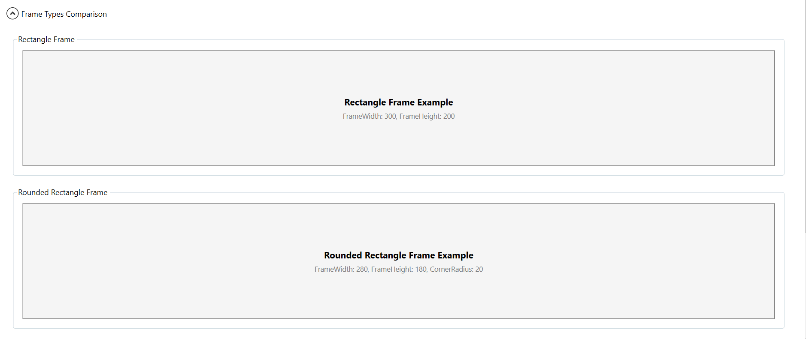
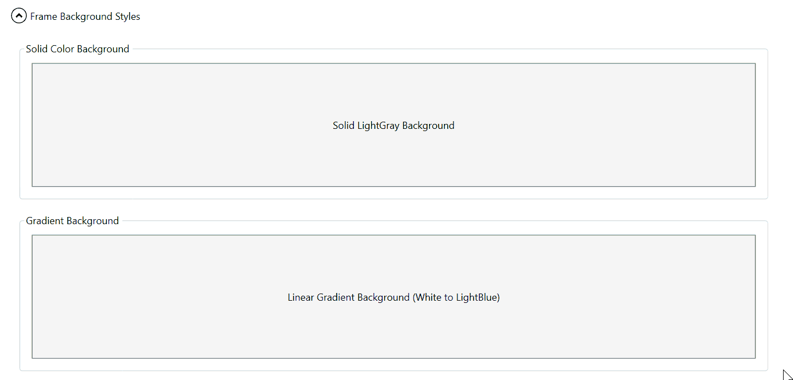
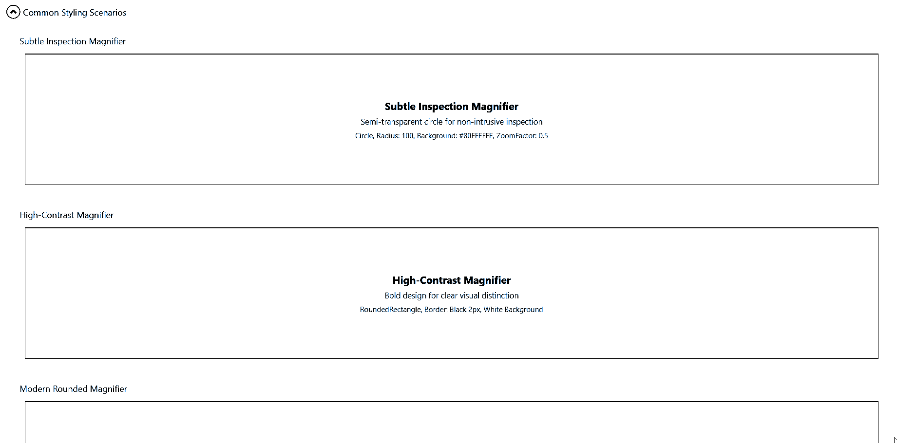

# Appearance and styling

The Magnifier control provides extensive customization options to match your application's visual design. You can configure the frame shape, size, colors, and other visual properties to create the desired appearance.

## Frame Types

The [`FrameType`](https://help.syncfusion.com/cr/wpf/Syncfusion.Windows.Shared.Magnifier.html#Syncfusion_Windows_Shared_Magnifier_FrameType) property determines the shape of the magnifier frame. Three frame types are available:

* **Rectangle** - A standard rectangular frame with sharp corners
* **RoundedRectangle** - A rectangular frame with rounded corners
* **Circle** - A circular frame

### Rectangle Frame

The Rectangle frame type displays the magnified content in a rectangular shape. Configure the size using the [`FrameWidth`](https://help.syncfusion.com/cr/wpf/Syncfusion.Windows.Shared.Magnifier.html#Syncfusion_Windows_Shared_Magnifier_FrameWidth) and [`FrameHeight`](https://help.syncfusion.com/cr/wpf/Syncfusion.Windows.Shared.Magnifier.html#Syncfusion_Windows_Shared_Magnifier_FrameHeight) properties.

**XAML Example:**

```xml
<syncfusion:Magnifier.Current>
    <syncfusion:Magnifier FrameType="Rectangle"
                          FrameWidth="300"
                          FrameHeight="200"
                          FrameBackground="White"
                          ZoomFactor="0.3"/>
</syncfusion:Magnifier.Current>
```

**C# Example:**

```csharp
var magnifier = new Magnifier
{
    FrameType = FrameType.Rectangle,
    FrameWidth = 300,
    FrameHeight = 200,
    FrameBackground = Brushes.White,
    ZoomFactor = 0.3
};
Magnifier.SetCurrent(targetElement, magnifier);
```

### RoundedRectangle Frame

The RoundedRectangle frame type provides a softer appearance with rounded corners. Use the [`FrameCornerRadius`](https://help.syncfusion.com/cr/wpf/Syncfusion.Windows.Shared.Magnifier.html#Syncfusion_Windows_Shared_Magnifier_FrameCornerRadius) property to control the degree of rounding.

**XAML Example:**

```xml
<syncfusion:Magnifier.Current>
    <syncfusion:Magnifier FrameType="RoundedRectangle"
                          FrameWidth="280"
                          FrameHeight="180"
                          FrameCornerRadius="20"
                          FrameBackground="AliceBlue"
                          ZoomFactor="0.4"/>
</syncfusion:Magnifier.Current>
```

**C# Example:**

```csharp
var magnifier = new Magnifier
{
    FrameType = FrameType.RoundedRectangle,
    FrameWidth = 280,
    FrameHeight = 180,
    FrameCornerRadius = 20,
    FrameBackground = new SolidColorBrush(Colors.AliceBlue),
    ZoomFactor = 0.4
};
Magnifier.SetCurrent(targetElement, magnifier);
```

### Circle Frame

The Circle frame type displays the magnified content in a circular shape. Configure the size using the [`FrameRadius`](https://help.syncfusion.com/cr/wpf/Syncfusion.Windows.Shared.Magnifier.html#Syncfusion_Windows_Shared_Magnifier_FrameRadius) property.

**XAML Example:**

```xml
<syncfusion:Magnifier.Current>
    <syncfusion:Magnifier FrameType="Circle"
                          FrameRadius="120"
                          FrameBackground="WhiteSmoke"
                          ZoomFactor="0.35"/>
</syncfusion:Magnifier.Current>
```

**C# Example:**

```csharp
var magnifier = new Magnifier
{
    FrameType = FrameType.Circle,
    FrameRadius = 120,
    FrameBackground = new SolidColorBrush(Colors.WhiteSmoke),
    ZoomFactor = 0.35
};
Magnifier.SetCurrent(targetElement, magnifier);
```



## Frame Background

The [`FrameBackground`](https://help.syncfusion.com/cr/wpf/Syncfusion.Windows.Shared.Magnifier.html#Syncfusion_Windows_Shared_Magnifier_FrameBackground) property sets the background color or brush for the magnifier frame. This helps distinguish the magnified content from the underlying UI.

### Solid Color Background

**XAML:**

```xml
<syncfusion:Magnifier FrameType="RoundedRectangle"
                      FrameWidth="250"
                      FrameHeight="180"
                      FrameBackground="LightGray"
                      ZoomFactor="0.4"/>
```

**C#:**

```csharp
magnifier.FrameBackground = Brushes.LightGray;
// Or using color
magnifier.FrameBackground = new SolidColorBrush(Color.FromRgb(211, 211, 211));
```

### Gradient Background

**XAML:**

```xml
<syncfusion:Magnifier FrameType="Rectangle"
                      FrameWidth="300"
                      FrameHeight="200"
                      ZoomFactor="0.3">
    <syncfusion:Magnifier.FrameBackground>
        <LinearGradientBrush StartPoint="0,0" EndPoint="1,1">
            <GradientStop Color="White" Offset="0"/>
            <GradientStop Color="LightBlue" Offset="1"/>
        </LinearGradientBrush>
    </syncfusion:Magnifier.FrameBackground>
</syncfusion:Magnifier>
```

**C#:**

```csharp
var gradientBrush = new LinearGradientBrush
{
    StartPoint = new Point(0, 0),
    EndPoint = new Point(1, 1)
};
gradientBrush.GradientStops.Add(new GradientStop(Colors.White, 0));
gradientBrush.GradientStops.Add(new GradientStop(Colors.LightBlue, 1));
magnifier.FrameBackground = gradientBrush;
```



## Size Configuration

Configure the magnifier frame size based on the selected frame type.

### Rectangle and RoundedRectangle Size

For Rectangle and RoundedRectangle frames, use `FrameWidth` and `FrameHeight`:

```csharp
magnifier.FrameType = FrameType.RoundedRectangle;
magnifier.FrameWidth = 320;   // Width in pixels
magnifier.FrameHeight = 240;  // Height in pixels
```

### Circle Size

For Circle frames, use `FrameRadius`:

```csharp
magnifier.FrameType = FrameType.Circle;
magnifier.FrameRadius = 150;  // Radius in pixels (diameter = 300)
```

## Common Styling Scenarios

### Subtle Inspection Magnifier

A semi-transparent magnifier for non-intrusive content inspection:

```xml
<syncfusion:Magnifier FrameType="Circle"
                      FrameRadius="100"
                      FrameBackground="#80FFFFFF"
                      ZoomFactor="0.5"/>
```

### High-Contrast Magnifier

A bold magnifier for clear visual distinction:

```xml
<syncfusion:Magnifier FrameType="RoundedRectangle"
                      FrameWidth="280"
                      FrameHeight="200"
                      FrameCornerRadius="15"
                      FrameBackground="White"
                      BorderBrush="Black"
                      BorderThickness="2"
                      ZoomFactor="0.25"/>
```

### Modern Rounded Magnifier

A contemporary design with soft edges:

```xml
<syncfusion:Magnifier FrameType="RoundedRectangle"
                      FrameWidth="300"
                      FrameHeight="220"
                      FrameCornerRadius="30"
                      FrameBackground="#F0F0F0"
                      ZoomFactor="0.3"/>
```



## Best Practices

* **Choose appropriate frame types**: Use Circle for general inspection, Rectangle for detailed analysis of rectangular content.
* **Background contrast**: Select frame backgrounds that provide good contrast with your UI for better visibility.
* **Size considerations**: Larger frames provide more context but can obscure more of the underlying UI. Balance between visibility and usability.
* **Corner radius**: For RoundedRectangle frames, a corner radius of 15-25 pixels typically provides a good balance between aesthetics and usability.
* **ZoomFactor coordination**: Adjust ZoomFactor along with frame size. Larger frames may work better with higher ZoomFactor values (0.4-0.6), while smaller frames benefit from lower values (0.2-0.4).
