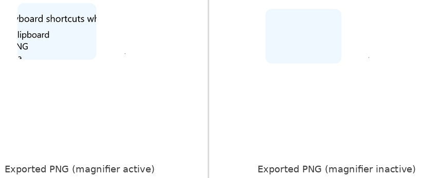
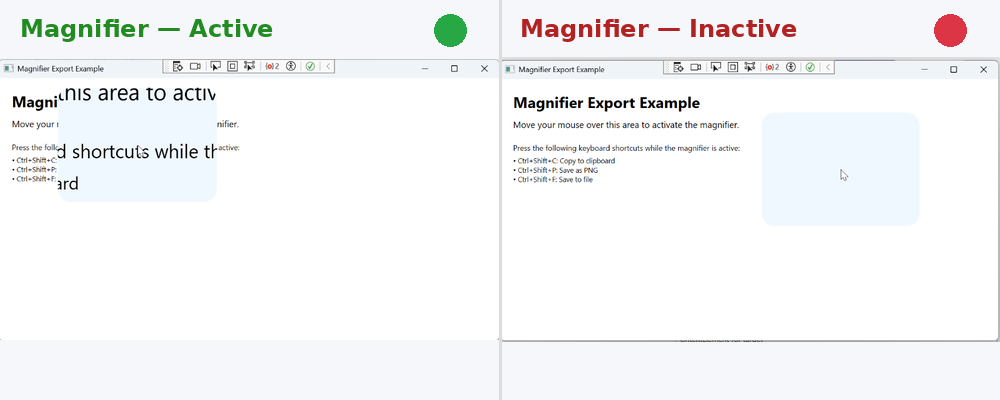

# Exporting Magnified Content

The Magnifier control provides the ability to export the currently magnified content to various image formats or copy it to the system clipboard. This feature is useful when you need to capture and save the zoomed view for documentation, sharing, or further analysis.

## Export Methods

The Magnifier control provides the following methods for exporting magnified content:

| Method | Description |
|--------|-------------|
| [`CopyToClipboard()`](https://help.syncfusion.com/cr/wpf/Syncfusion.Windows.Shared.Magnifier.html#Syncfusion_Windows_Shared_Magnifier_CopyToClipboard) | Copies the magnified content to the system clipboard as an image. Users can then paste it into other applications. |
| [`Save(Stream)`](https://help.syncfusion.com/cr/wpf/Syncfusion.Windows.Shared.Magnifier.html#Syncfusion_Windows_Shared_Magnifier_Save_System_IO_Stream_) | Saves the magnified content to a stream using the default BMP encoder. |
| [`Save(Stream, BitmapEncoder)`](https://help.syncfusion.com/cr/wpf/Syncfusion.Windows.Shared.Magnifier.html#Syncfusion_Windows_Shared_Magnifier_Save_System_IO_Stream_System_Windows_Media_Imaging_BitmapEncoder_) | Saves the magnified content to a stream with a specified bitmap encoder (PNG, JPEG, GIF, etc.). |
| [`Save(string)`](https://help.syncfusion.com/cr/wpf/Syncfusion.Windows.Shared.Magnifier.html#Syncfusion_Windows_Shared_Magnifier_Save_System_String_) | Saves the magnified content to a file. The encoder is automatically determined by the file extension. |
| [`Save(string, BitmapEncoder)`](https://help.syncfusion.com/cr/wpf/Syncfusion.Windows.Shared.Magnifier.html#Syncfusion_Windows_Shared_Magnifier_Save_System_String_System_Windows_Media_Imaging_BitmapEncoder_) | Saves the magnified content to a file with a specified bitmap encoder. |
| [`SaveToXps(Stream)`](https://help.syncfusion.com/cr/wpf/Syncfusion.Windows.Shared.Magnifier.html#Syncfusion_Windows_Shared_Magnifier_SaveToXps_System_IO_Stream_) | Saves the magnified content to a stream in XPS format. |
| [`SaveToXps(string)`](https://help.syncfusion.com/cr/wpf/Syncfusion.Windows.Shared.Magnifier.html#Syncfusion_Windows_Shared_Magnifier_SaveToXps_System_String_) | Saves the magnified content to an XPS file. |

## How to Export Magnified Content

The example provided below demonstrates one way to trigger export operations (not the only way). You can call export methods in any event handler or mechanism that fires while the magnifier is in an active state. The magnifier is active when the mouse is over the target element and the magnified frame is visible.

The following example uses the `PreviewKeyDown` event on the Window to call different export methods based on keyboard shortcuts. This approach allows users to quickly export content while the magnifier is active without losing focus.

### XAML

```xml
<Window x:Class="MagnifierSample.MainWindow"
        xmlns="http://schemas.microsoft.com/winfx/2006/xaml/presentation"
        xmlns:x="http://schemas.microsoft.com/winfx/2006/xaml"
        xmlns:syncfusion="http://schemas.syncfusion.com/wpf"
        PreviewKeyDown="Window_PreviewKeyDown"
        Title="Magnifier Export Example" Height="450" Width="800">
    
    <Grid Name="RootGrid">
        <syncfusion:Magnifier x:Name="MagnifierControl"
                              ZoomFactor="0.4" 
                              FrameType="RoundedRectangle"
                              FrameWidth="250"
                              FrameHeight="180"
                              FrameCornerRadius="20"
                              FrameBackground="AliceBlue"/>
        
        <!-- Sample content to magnify -->
        <StackPanel Margin="20" VerticalAlignment="Top">
            <TextBlock Text="Magnifier Export Example" 
                       FontSize="24" 
                       FontWeight="Bold" 
                       Margin="0,0,0,10"/>
            <TextBlock Text="Move your mouse over this area to activate the magnifier." 
                       FontSize="14" 
                       Margin="0,0,0,20"/>
            <TextBlock Text="Press the following keyboard shortcuts while the magnifier is active:" 
                       FontSize="12" 
                       Margin="0,0,0,5"/>
            <TextBlock Text="• Ctrl+Shift+C: Copy to clipboard" FontSize="11"/>
            <TextBlock Text="• Ctrl+Shift+P: Save as PNG" FontSize="11"/>
            <TextBlock Text="• Ctrl+Shift+F: Save to file" FontSize="11"/>
        </StackPanel>
    </Grid>
</Window>
```

### C#

```csharp
using System;
using System.IO;
using System.Windows;
using System.Windows.Input;
using System.Windows.Media.Imaging;
using Syncfusion.Windows.Shared;

public partial class MainWindow : Window
{
    public MainWindow()
    {
        InitializeComponent();
        
        // Attach the magnifier to the root grid
        Magnifier.SetCurrent(RootGrid, MagnifierControl);
    }

    private void Window_PreviewKeyDown(object sender, KeyEventArgs e)
    {
        // Ensure export is enabled
        if (!MagnifierControl.EnableExport)
            return;

        // Check for Ctrl + Shift modifier keys
        if (Keyboard.Modifiers != (ModifierKeys.Control | ModifierKeys.Shift))
            return;

        try
        {
            // Ctrl + Shift + C → Copy to Clipboard
            if (e.Key == Key.C)
            {
                e.Handled = true;
                MagnifierControl.CopyToClipboard();
            }
            // Ctrl + Shift + S → Save to stream (BMP format)
            else if (e.Key == Key.S)
            {
                e.Handled = true;
                using var stream = File.Create("Magnifier_Export.bmp");
                MagnifierControl.Save(stream);
            }
            // Ctrl + Shift + P → Save to stream with PNG encoder
            else if (e.Key == Key.P)
            {
                e.Handled = true;
                using var stream = File.Create("Magnifier_Export.png");
                MagnifierControl.Save(stream, new PngBitmapEncoder());
            }
            // Ctrl + Shift + F → Save by filename
            else if (e.Key == Key.F)
            {
                e.Handled = true;
                MagnifierControl.Save("Magnifier_Export.png");
            }
            // Ctrl + Shift + E → Save by filename with encoder
            else if (e.Key == Key.E)
            {
                e.Handled = true;
                MagnifierControl.Save("Magnifier_Export.jpg", new JpegBitmapEncoder());
            }
            // Ctrl + Shift + X → Save to XPS stream
            else if (e.Key == Key.X)
            {
                e.Handled = true;
                using var stream = File.Create("Magnifier_Export.xps");
                MagnifierControl.SaveToXps(stream);
            }
            // Ctrl + Shift + Z → Save to XPS file
            else if (e.Key == Key.Z)
            {
                e.Handled = true;
                MagnifierControl.SaveToXps("Magnifier_Export.xps");
            }
        }
        catch (Exception ex)
        {
            MessageBox.Show($"Export failed: {ex.Message}");
        }
    }
}
```

**In this example:**
* The `PreviewKeyDown` event handler checks if `EnableExport` is `true` before attempting any export operation.
* Different keyboard shortcuts trigger different export methods.
* Files are saved directly without opening a dialog to keep the magnifier active during export.

## Important Notes and Limitations

### Export Behavior

* **Only magnified content is exported**: The export captures only what is currently visible inside the magnifier frame, not the entire target element.
* **Magnifier must be active**: The magnifier must be in an active state (visible and positioned over the target element) to properly export the magnified content.
* **Inactive magnifier exports**: If the mouse leaves the target element, the magnifier hides. Attempting to export while the magnifier is hidden will only capture the frame background or the configured magnifier properties, not the actual content.





### EnableExport Property

All export methods depend on the [`EnableExport`](https://help.syncfusion.com/cr/wpf/Syncfusion.Windows.Shared.Magnifier.html#Syncfusion_Windows_Shared_Magnifier_EnableExport) property being set to *`true`*. If `EnableExport` is *`false`*, export operations will not execute. By default `EnableExport` is *`true`*.

### File Format Support

When using `Save(string)`, the file extension determines the encoder:
* `.bmp` → BMP format
* `.png` → PNG format
* `.jpg` or `.jpeg` → JPEG format
* `.gif` → GIF format
* `.tif` or `.tiff` → TIFF format
* `.wdp` → WMP format

**XPS Format Note**: XPS format files are not natively supported in Windows 10 and Windows 11. However, XPS files can be viewed using online XPS viewer tools or by installing XPS Viewer in Windows.

### Maintaining Active State During Export

If you open a file dialog or any UI element that causes focus loss, the magnifier may become inactive (hidden). To maintain the magnifier's active state during export:
* Use simple filenames without specifying full paths. This saves files to the application's output directory without requiring user interaction, keeping the magnifier focused and active.
* Avoid showing modal dialogs that require user interaction while exporting.
* Use background operations or asynchronous methods if additional processing is needed.

This ensures the magnifier remains visible and the exported content accurately reflects the magnified view.
