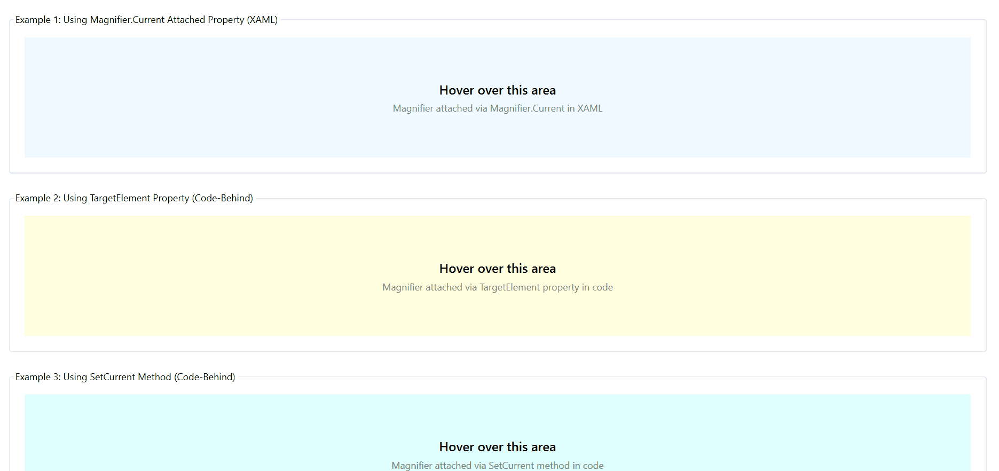

# Getting Started with WPF Magnifier

This section guides you through the initial setup and basic usage of the [Magnifier](https://help.syncfusion.com/cr/wpf/Syncfusion.Windows.Shared.Magnifier.html) control in WPF applications. You will learn how to add the control to your application, attach it to a target element, and configure its basic properties.

## Prerequisites

Before you begin, ensure the following:

### Assembly reference

You can add the Syncfusion.Shared.WPF assembly reference to your WPF project using one of the following methods:

**Option 1: NuGet Package (Recommended)**

Install the [Syncfusion.Shared.WPF](https://www.nuget.org/packages/Syncfusion.Shared.WPF) NuGet package. It is recommended to install the latest version.

Using Package Manager Console:
```powershell
Install-Package Syncfusion.Shared.WPF
```

Using .NET CLI:
```bash
dotnet add package Syncfusion.Shared.WPF
```

**Option 2: Assembly Reference**

Add a direct reference to `Syncfusion.Shared.WPF.dll` from the installed location in your WPF project.

### Namespace declaration

Import the Syncfusion namespace in your XAML or code files.

**XAML:**
```xml
xmlns:syncfusion="clr-namespace:Syncfusion.Windows.Shared;assembly=Syncfusion.Shared.WPF"
```

**C#:**
```csharp
using Syncfusion.Windows.Shared;
```

## Adding Magnifier using XAML

You can declaratively add a Magnifier in XAML using the [`Magnifier.Current`](https://help.syncfusion.com/cr/wpf/Syncfusion.Windows.Shared.Magnifier.html#Syncfusion_Windows_Shared_Magnifier_CurrentProperty) attached property. This attaches a magnifier instance to any UI element.

```xml
<Grid x:Name="XamlExample" Background="AliceBlue" Height="150">
    <syncfusion:Magnifier.Current>
        <syncfusion:Magnifier ZoomFactor="0.5" 
                              FrameType="Circle" 
                              FrameBackground="LightGray"/>
    </syncfusion:Magnifier.Current>
    
    <TextBlock Text="Hover over this area" 
               VerticalAlignment="Center"
               HorizontalAlignment="Center"/>
</Grid>
```

**In this example:**
* The `Magnifier.Current` attached property is set on the `Grid` element
* The magnifier automatically targets the `Grid` and all its children
* The magnifier appears when the mouse enters the grid and hides when it leaves

## Adding Magnifier using C#

You can create and attach a magnifier programmatically using either the [`TargetElement`](https://help.syncfusion.com/cr/wpf/Syncfusion.Windows.Shared.Magnifier.html#Syncfusion_Windows_Shared_Magnifier_TargetElement) property or the [`SetCurrent`](https://help.syncfusion.com/cr/wpf/Syncfusion.Windows.Shared.Magnifier.html#Syncfusion_Windows_Shared_Magnifier_SetCurrent_System_Windows_DependencyObject_Syncfusion_Windows_Shared_Magnifier_) method.

### Method 1: Using TargetElement Property

```csharp
// Create magnifier and set TargetElement property
targetElementMagnifier = new Magnifier
{
    ZoomFactor = 0.4,
    FrameType = FrameType.Rectangle,
    FrameWidth = 200,
    FrameHeight = 200,
    FrameBackground = Brushes.LightBlue,
    TargetElement = TargetElementExample  // Assign target element
};
```

### Method 2: Using SetCurrent Method

```csharp
// Create magnifier and attach using SetCurrent method
setCurrentMagnifier = new Magnifier
{
    ZoomFactor = 0.35,
    FrameType = FrameType.RoundedRectangle,
    FrameWidth = 220,
    FrameHeight = 180,
    FrameCornerRadius = 15,
    FrameBackground = Brushes.White
};
Magnifier.SetCurrent(SetCurrentExample, setCurrentMagnifier);
```

**Note:** Both methods achieve the same result. Use `TargetElement` property when you want to set the target as part of property initialization, or use `SetCurrent` method when you prefer a static helper approach.



## Key properties and behavior

### ZoomFactor

The [`ZoomFactor`](https://help.syncfusion.com/cr/wpf/Syncfusion.Windows.Shared.Magnifier.html#Syncfusion_Windows_Shared_Magnifier_ZoomFactor) property determines the relative size of the area displayed inside the magnifier frame. It accepts values between `0.0` and `1.0`:

* **Lower values** (e.g., `0.2`) provide higher magnification (smaller area is shown, but more zoomed in).
* **Higher values** (e.g., `0.8`) provide lower magnification (larger area is shown with less zoom).
* **Value of `1.0`** shows the content at its original size (no magnification).

The `ZoomFactor` property is automatically coerced to this range:
* Values greater than `1.0` are set to `1.0`.
* Values less than `0.0` are set to minimum value slightly greater than `0.0`.

### FrameType

The [`FrameType`](https://help.syncfusion.com/cr/wpf/Syncfusion.Windows.Shared.Magnifier.html#Syncfusion_Windows_Shared_Magnifier_FrameType) property determines the shape of the magnifier frame. Available options:

* **Rectangle**: A rectangular frame with configurable width and height.
* **RoundedRectangle**: A rectangular frame with rounded corners (configurable corner radius).
* **Circle**: A circular frame with configurable radius.

### Visibility behavior

The magnifier automatically manages its visibility based on mouse pointer position:

* **Shows**: When the mouse pointer enters the bounds of the `TargetElement`.
* **Hides**: When the mouse pointer leaves the bounds of the `TargetElement`.

This behavior ensures the magnifier appears only when needed and does not interfere with the rest of the UI when inactive.


 
