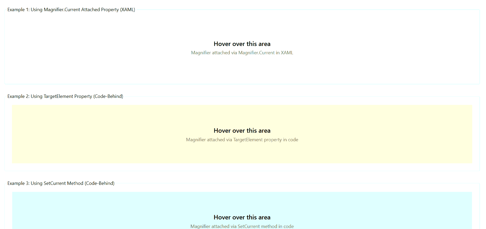

# WPF Magnifier Overview

The Magnifier control displays a zoomed view of UI content in a movable frame that follows the mouse pointer. It helps users inspect small elements or details without changing the application layout.

## Key Features

* **Multiple frame shapes** - Display magnified content in Rectangle, RoundedRectangle, or Circle frames.
* **Configurable zoom levels** - Control magnification using the ZoomFactor property with values between 0 and 1.
* **Automatic activation** - The magnifier appears when the mouse enters the target element and hides when it leaves.
* **Flexible attachment** - Attach to any UIElement using XAML attached properties or code-behind.
* **Customizable appearance** - Set frame size, background color, corner radius, and other visual properties.
* **Export capabilities** - Save magnified content to image files or copy to clipboard.

## Magnifier Demo

## Use Cases

The Magnifier control is useful when users need to examine UI content more closely without permanently zooming the entire interface. Common scenarios include:

* **Accessibility** - Helps users with visual impairments read small text and UI elements.
* **Data inspection** - Allows detailed examination of charts, images, and complex visualizations.
* **Precision tasks** - Supports design review and alignment verification where exact details matter.

The control works as an overlay and does not affect the layout or structure of your application. It provides temporary magnification that appears on demand and disappears when not needed.
