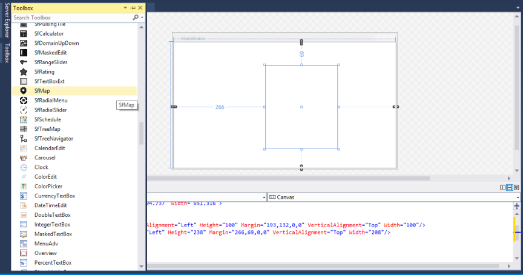
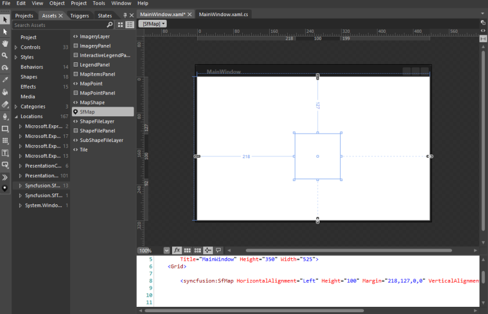
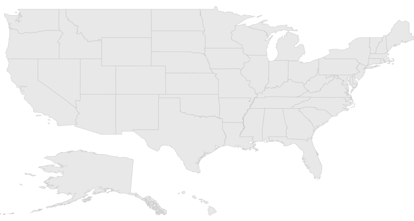
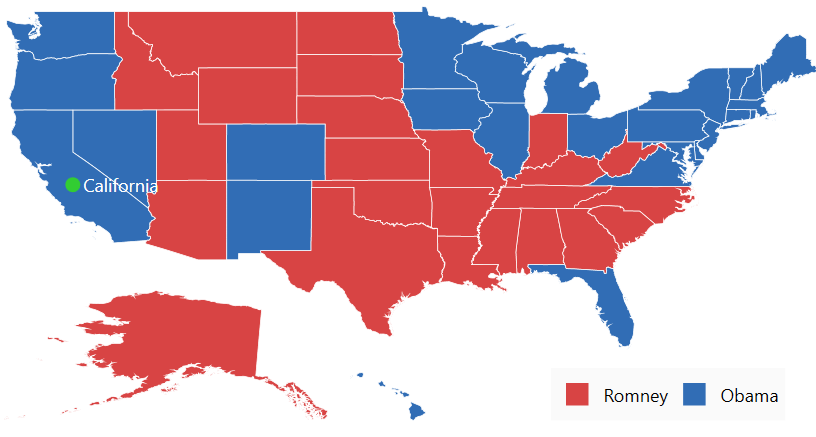
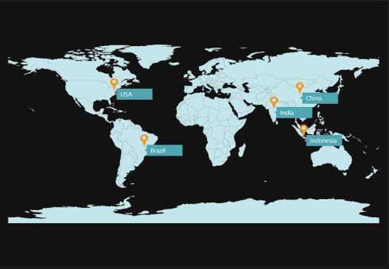

# Getting Started with WPF Maps (SfMap)

This section explains the steps required to configure the [`SfMap`](https://help.syncfusion.com/cr/wpf/Syncfusion.UI.Xaml.Maps.SfMap.html) and add basic elements to it using various APIs.

## Adding SfMap reference

You can add SfMap reference using one of the following methods:

**Method 1: Adding SfMap reference from nuget.org**

Syncfusion WPF components are available in [`nuget.org`](https://www.nuget.org/). To add SfMap to your project, open the NuGet package manager in Visual Studio, search for [Syncfusion.SfMaps.WPF](https://www.nuget.org/packages/Syncfusion.SfMaps.WPF), and then install it.

**Method 2: Adding SfMap reference from toolbox**

You can drag the SfMap control from the  toolbox and drop it to the designer. It will automatically reference the required assemblies and add the namespace to the page. 

**Method 3: Adding SfMap assemblies manually from the installed location**

If you prefer to manually reference the assemblies instead referencing from NuGet, add the following assemblies in respective projects.

Location: {Installed location}/{version}/WPF/Assemblies

You can refer to [this](https://help.syncfusion.com/wpf/control-dependencies#sfmaps) link to know about the assemblies required for adding map to your project.

## Create SfMap control 

There are three possible ways to create a simple SfMap control.

### Through Visual Studio

To create the SfMap control through Visual Studio, drag SfMap from Toolbox and drop it to the designer. 

It generates the following the SfMap control.

### Through Expression Blend

The SfMap control can also be created and configured by using Expression Blend. Follow these steps to do so.

1. Create a WPF project in Expression Blend and reference the following assemblies.
1. Syncfusion.SfMaps.Wpf
2. Syncfusion.Shared.Wpf     
2. Search for SfMap in the Toolbox.
3. Drag SfMap to the designer. It generates the SfMap control with one child element.

### Through XAML and C#

#### Adding namespace

Add the following namespace.





xmlns:syncfusion="clr-namespace:Syncfusion.UI.Xaml.Maps;assembly=Syncfusion.SfMaps.WPF"





using Syncfusion.UI.Xaml.Maps;





## Initializing maps

You can create the SfMap control programmatically through XAML and C#. In the following code example. 




       
<syncfusion:SfMap>
</syncfusion:SfMap>





SfMap syncMap = new SfMap(); 
           




## Adding layers

The maps control is maintained through [`Layers`](https://help.syncfusion.com/cr/wpf/Syncfusion.UI.Xaml.Maps.MapLayer.html). It can be either ShapeFileLayer or ImageryLayer. The following example will show to add ShapeFileLayer on map. 





<syncfusion:SfMap>
	<syncfusion:SfMap.Layers>
		<syncfusion:ShapeFileLayer></syncfusion:ShapeFileLayer>
	</syncfusion:SfMap.Layers>
</syncfusion:SfMap>





SfMap maps = new SfMap();
ShapeFileLayer shapeLayer = new ShapeFileLayer();
syncMap.Layers.Add(shapeLayer);
         




## Configure the SfMap Control

### Read and Load the Shapes

The Maps control supports reading and loading shape files. A shape file is a set of files that are stored in a non-topological geometry and the attribute information for the spatial features and records in a data set. Spatial features and records are stored as shapes that consist of set vector coordinates.  A computer program can read the content of the shape files and parse them as vector elements. The Maps control also reads and parses the spatial information of a shape file into the graphical elements. 

As mentioned earlier, a shape file can be a set of files or a single file. Generally, the shape file contains the following files:

Main file (.shp)

dBase file (.dbf)

All files must adhere to the 8.3 naming conventions. The Main file and dBase file must have the same prefix, i.e., they must have the same file name. This naming convention allows you to identify specific geographical information.

The main file (.shp) contains a fixed-length file header followed by the variable-length records. Each variable-length record is made up of a fixed-length record header followed by the variable-length record contents.  

The dBase file (.dbf) contains any desired feature attributes or attributes keys, where other tables can be joined. Its format is a standard .dbf file used by many table-based applications in Windows™ and DOS.  Any set of fields can be present in the table.

For more information about the 8.3 naming convention, shape files and their descriptions, visit the following link:

[http://www.esri.com/library/whitepapers/pdfs/shapefile.pdf](http://www.esri.com/library/whitepapers/pdfs/shapefile.pdf)

Maps read the main file and create the map shapes. The associated .dbf file contents are then incorporated with the shapes created from the main files.

## Attach the Shape file with Map

To read the shape file using Map, the shape file’s main file and .dbf file need to be added as an embedded resource in the application project. Then, the main file’s path has to be given in the Uri file of the shape file layer.

### About the Uri property

Uri is the string type property that retrieves the location of the shape file that is added as an embedded resource. 

### Structure of Uri property

The Uri property contains the following information:

Namespace

Subfolder names

ShapeFilename.shp





<syncfusion:SfMap>
	<syncfusion:SfMap.Layers>
		<syncfusion:ShapeFileLayer Uri="GettingStarted.ShapeFiles.usa_state.shp">
		</syncfusion:ShapeFileLayer>
	</syncfusion:SfMap.Layers>
</syncfusion:SfMap>





SfMap maps = new SfMap();
ShapeFileLayer shapeLayer = new ShapeFileLayer();
shape.Uri = "GettingStarted.ShapeFiles.usa_state.shp";
maps.Layers.Add(shapeLayer);
this.Content = maps;
         




In the above code sample, GettingStarted is the namespace, ShapeFile is the subfolder name, and usa_state.shp is the name of the shape file. 

The above code example results in the following output

## Data Binding in Map

Data can be bound to the shape file layer using the [`ItemsSource`](https://help.syncfusion.com/cr/wpf/Syncfusion.UI.Xaml.Maps.ShapeFileLayer.html#Syncfusion_UI_Xaml_Maps_ShapeFileLayer_ItemsSource), [`ShapeIDPath`](https://help.syncfusion.com/cr/wpf/Syncfusion.UI.Xaml.Maps.ShapeFileLayer.html#Syncfusion_UI_Xaml_Maps_ShapeFileLayer_ShapeIDPath), and [`ShapeIDTableField`](https://help.syncfusion.com/cr/wpf/Syncfusion.UI.Xaml.Maps.ShapeFileLayer.html#Syncfusion_UI_Xaml_Maps_ShapeFileLayer_ShapeIDTableField) properties.

The [`Populate data`](https://help.syncfusion.com/wpf/maps/PopulateData) section gives the detailed explanation of data binding.





<Grid>
    <Grid.DataContext>
        <local:ViewModel />
    </Grid.DataContext>

    <syncfusion:SfMap>
        <syncfusion:SfMap.Layers>
            <syncfusion:ShapeFileLayer ItemsSource="{Binding ElectionResults}"
                                       ShapeIDPath="State"
                                       ShapeIDTableField="STATE_NAME"
                                       Uri="GettingStarted.ShapeFiles.usa_states.shp">
                <syncfusion:ShapeFileLayer.ShapeSettings>
                    <syncfusion:ShapeSetting ShapeValuePath="Electors" />
                </syncfusion:ShapeFileLayer.ShapeSettings>
            </syncfusion:ShapeFileLayer>
        </syncfusion:SfMap.Layers>
    </syncfusion:SfMap>
</Grid>
	 




public partial class MainWindow : Window
{
    public MainWindow()
    {
        InitializeComponent();
        ViewModel viewModel = new ViewModel();
        this.DataContext = viewModel;
        SfMap maps = new SfMap();
        ShapeFileLayer shapeLayer = new ShapeFileLayer();
        shapeLayer.Uri = "GettingStarted.ShapeFiles.usa_state.shp";
        shapeLayer.ItemsSource = ViewModel.ElectionResults;
        shapeLayer.ShapeIDTableField = "STATE_NAME";
        shapeLayer.ShapeIDPath = "State";
        ShapeSetting shapeSetting = new ShapeSetting();
        shapeSetting.ShapeValuePath = "Electors";
        shapeLayer.ShapeSettings = shapeSetting;
        maps.Layers.Add(shapeLayer);
        this.Content = maps;
    }
}





## Adding markers

Markers are used to identify the shapes. They can be added to the shape file layers as demonstrated in the following code sample. Markers can be customized using the customization properties in the shape file layer.

The detailed explanation of marker and its customization are provided under [`Markers`](https://help.syncfusion.com/wpf/maps/markers) section.





<Grid>
    <Grid.DataContext>
        <local:ViewModel />
    </Grid.DataContext>

    <syncfusion:SfMap>
        <syncfusion:SfMap.Layers>
            <syncfusion:ShapeFileLayer Uri="GettingStarted.ShapeFiles.usa_state.shp"
                                       Markers="{Binding Models}">
            </syncfusion:ShapeFileLayer>
        </syncfusion:SfMap.Layers>
    </syncfusion:SfMap>
</Grid>




	
ViewModel viewModel = new ViewModel();
this.DataContext = viewModel;
SfMap maps = new SfMap();
ShapeFileLayer shapeLayer = new ShapeFileLayer();
shapeLayer.Uri = "GettingStarted.ShapeFiles.usa_state.shp";
shapeLayer.Markers = viewModel.Models;
maps.Layers.Add(shapeLayer);
this.Content = maps;





The following code sample shows how to define a marker class and add markers.





public class Model
{
    public string Label { get; set; }
    public string Longitude { get; set; }
    public string Latitude { get; set; }
}

public class ViewModel
{
    public ObservableCollection<Model> Models { get; set; }
    public ViewModel()
    {
        this.Models = new ObservableCollection<Model>
        {
            new Model() { Label = "California", Latitude = "37", Longitude = "-120" }
        };
    }
}





## Color mapping

The color mapping support allows you customize the shape colors based on the underlying value of shape received from the bound data. Both the range color mapping and equal color mapping are supported in maps.

The detailed explanation of color mapping is provided in [`Shapes Color Customization`](https://help.syncfusion.com/wpf/maps/shapes-color-customization) section.





<syncfusion:ShapeSetting.FillSetting>
    <syncfusion:ShapeFillSetting AutoFillColors="False">
        <syncfusion:ShapeFillSetting.ColorMappings>
            <syncfusion:EqualsColorMapping Value="Romney"
                                           Color="#D84444" />
            <syncfusion:EqualsColorMapping Value="Obama"
                                           Color="#316DB5" />
        </syncfusion:ShapeFillSetting.ColorMappings>
    </syncfusion:ShapeFillSetting>
</syncfusion:ShapeSetting.FillSetting>




	
// ShapeFillSetting
ShapeFillSetting shapeFillSetting = new ShapeFillSetting
{
    AutoFillColors = false
}

// EqualColorMapping
EqualsColorMapping romeyColorMapping = new EqualsColorMapping
{
    Color = (Color)new ColorConverter().ConvertFrom("#D84444"),
    LegendLabel = "Romney",
    Value = "Romney"
}
EqualsColorMapping obamaColorMapping = new EqualsColorMapping
{
    Color = (Color)new ColorConverter().ConvertFrom("#316DB5"),
    LegendLabel = "Obama",
    Value = "Obama"
}

// Adding EqualColorMapping to ColorMappings.
shapeFillSetting.ColorMappings.Add(romeyColorMapping);
shapeFillSetting.ColorMappings.Add(obamaColorMapping)
shapeSetting.FillSetting = shapeFillSetting
shapeLayer.ShapeSettings = shapeSetting;





## Adding legends

Legends interpret what the map displays. They can be added to the shape file layer as demonstrated in the following code sample. Legends will be displayed based on the data bound to the layer, and color mapping plays a major role in enabling legends. 

The detailed explanation of legend is provided under [`Legend`](https://help.syncfusion.com/wpf/maps/legend) section.





<syncfusion:ShapeFileLayer x:Name="shapeLayer"
                           LegendColumnSplit="2"
                           LegendPositionX="950"
                           LegendPositionY="580"
                           LegendVisibility="Visible"
                           LegendIcon="Rectangle">
</syncfusion:ShapeFileLayer>





// Adding legend
shapeLayer.LegendColumnSplit = 2;
shapeLayer.LegendPositionX = 950;
shapeLayer.LegendPositionY = 580;
shapeLayer.LegendVisibility = Visibility.Visible;
shapeLayer.LegendIcon = LegendIcons.Rectangle;





The following code sample gives you the complete code for map with markers and legends.





<Grid>
    <Grid.DataContext>
        <local:ViewModel />
    </Grid.DataContext>

    <syncfusion:SfMap x:Name="map"
                      EnableZoom="False"
                      EnablePan="False">
        <syncfusion:SfMap.Layers>
            <syncfusion:ShapeFileLayer x:Name="shapeLayer"
                                       Background="White"
                                       EnableSelection="True"
                                       Uri="GettingStarted.ShapeFiles.usa_state.shp"
                                       ItemsSource="{Binding ElectionResults}"
                                       MapItemsVisibility="Hidden"
                                       ShapeIDPath="State"
                                       ShapeIDTableField="STATE_NAME"

                                       Markers="{Binding Models}"
                                       MarkerIconFill="LimeGreen"
                                       MarkerLabelForeground="White"

                                       LegendColumnSplit="2"
                                       LegendPositionX="370"
                                       LegendPositionY="240"
                                       LegendVisibility="Visible"
                                       LegendIcon="Rectangle">

                <syncfusion:ShapeFileLayer.ShapeSettings>
                    <syncfusion:ShapeSetting ShapeFill="#E5E5E5"
                                             ShapeStroke="White"
                                             ShapeStrokeThickness="0.5"
                                             SelectedShapeColor="#CEBF93"
                                             ShapeValuePath="Electors"
                                             ShapeColorValuePath="Candidate">
                        <syncfusion:ShapeSetting.FillSetting>
                            <syncfusion:ShapeFillSetting AutoFillColors="False">
                                <syncfusion:ShapeFillSetting.ColorMappings>
                                    <syncfusion:EqualsColorMapping Value="Romney"
                                                                   Color="#D84444" />
                                    <syncfusion:EqualsColorMapping Value="Obama"
                                                                   Color="#316DB5" />
                                </syncfusion:ShapeFillSetting.ColorMappings>
                            </syncfusion:ShapeFillSetting>
                        </syncfusion:ShapeSetting.FillSetting>
                    </syncfusion:ShapeSetting>
                </syncfusion:ShapeFileLayer.ShapeSettings>
            </syncfusion:ShapeFileLayer>
        </syncfusion:SfMap.Layers>
    </syncfusion:SfMap>
</Grid>





// Setting DataContext.
ViewModel viewModel = new ViewModel();
this.DataContext = viewModel;

// SfMap.
SfMap maps = new SfMap();

// ShapeFileLayer.
ShapeFileLayer shapeLayer = new ShapeFileLayer();
shapeLayer.Background = new SolidColorBrush(Colors.White);
shapeLayer.EnableSelection = true;
shapeLayer.Uri = "GettingStarted.ShapeFiles.usa_state.shp";
shapeLayer.ItemsSource = viewModel.ElectionResults;
shapeLayer.MapItemsVisibility = Visibility.Hidden;
shapeLayer.ShapeIDPath = "State";
shapeLayer.ShapeIDTableField = "STATE_NAME";
shapeLayer.Markers = viewModel.Models;
shapeLayer.MarkerIconFill = new SolidColorBrush(Colors.LimeGreen);
shapeLayer.MarkerLabelForeground = new SolidColorBrush(Colors.White);

// Adding legend
shapeLayer.LegendColumnSplit = 2;
shapeLayer.LegendPositionX = 950;
shapeLayer.LegendPositionY = 580;
shapeLayer.LegendVisibility = Visibility.Visible;
shapeLayer.LegendIcon = LegendIcons.Rectangle;

// ShapeSetting
ShapeSetting shapeSetting = new ShapeSetting();
shapeSetting.ShapeFill = (SolidColorBrush)new BrushConverter().ConvertFrom("#E5E5E5");
shapeSetting.ShapeStroke = new SolidColorBrush(Colors.White);
shapeSetting.ShapeStrokeThickness = 0.5;
shapeSetting.SelectedShapeColor = (SolidColorBrush)new BrushConverter().ConvertFrom("#CEBF93");
shapeSetting.ShapeValuePath = "Electors";
shapeSetting.ShapeColorValuePath = "Candidate";

// ShapeFillSetting
ShapeFillSetting shapeFillSetting = new ShapeFillSetting
{
    AutoFillColors = false
};
    
// EqualColorMapping
EqualsColorMapping romeyColorMapping = new EqualsColorMapping
{
    Color = (Color)new ColorConverter().ConvertFrom("#D84444"),
    LegendLabel = "Romney",
    Value = "Romney"
};

EqualsColorMapping obamaColorMapping = new EqualsColorMapping
{
    Color = (Color)new ColorConverter().ConvertFrom("#316DB5"),
    LegendLabel = "Obama",
    Value = "Obama"
};

// Adding EqualColorMapping to ColorMappings.
shapeFillSetting.ColorMappings.Add(romeyColorMapping);
shapeFillSetting.ColorMappings.Add(obamaColorMapping);

shapeSetting.FillSetting = shapeFillSetting;

shapeLayer.ShapeSettings = shapeSetting;
    
// Adding ShapeFileLayer into Map.
maps.Layers.Add(shapeLayer);
maps.EnableZoom = false;
maps.EnablePan = false;
this.Content = maps;





The following screenshot illustrates the result of the above code sample.

You can download the complete [`Getting started`](https://github.com/SyncfusionExamples/WPF-UG-getting-started-samples/tree/master/GettingStartedMap) sample.

## Theme

SfMap supports various built-in themes. Refer to the below links to apply themes for the SfMap,

  * [Apply theme using SfSkinManager](https://help.syncfusion.com/wpf/themes/skin-manager)
	
  * [Create a custom theme using ThemeStudio](https://help.syncfusion.com/wpf/themes/theme-studio#creating-custom-theme)

  

## See also

[How to show google map in WPF SfMap](https://www.syncfusion.com/kb/11928/how-to-show-google-map-in-wpf-map-sfmap)

[How to view bing map using WPF SfMap](https://www.syncfusion.com/kb/10799/how-to-view-bing-map-using-wpf-map-control-sfmap)

[How to render custom data source in SfMap](https://www.syncfusion.com/kb/3237/how-to-render-customdatasource-in-sfmap)

[How to customize the markers in maps](https://www.syncfusion.com/kb/7656/how-to-customize-the-markers-in-maps)

[How to drilldown map layers](https://www.syncfusion.com/kb/7647/how-to-drilldown-map-layers)
