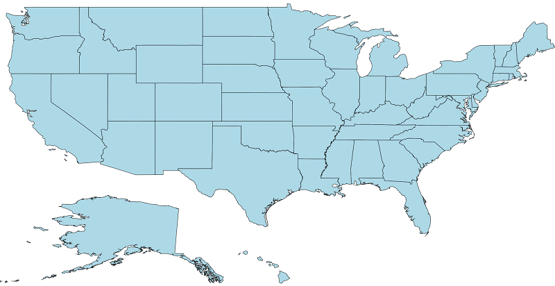
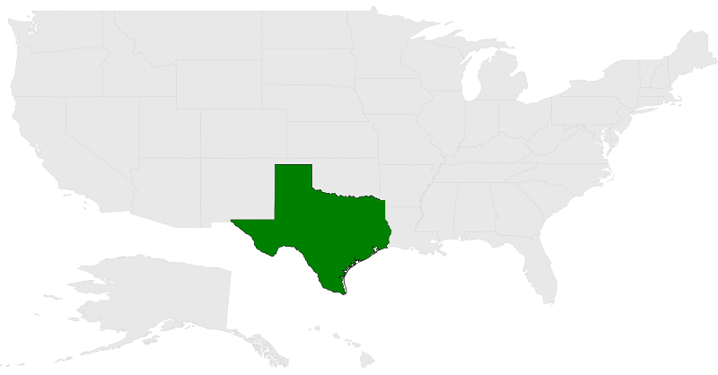
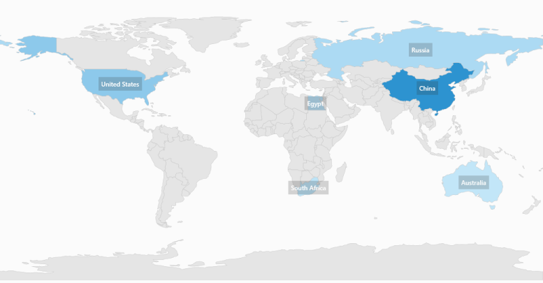
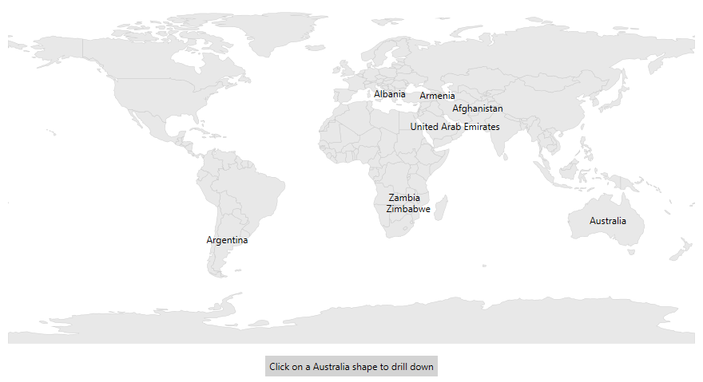
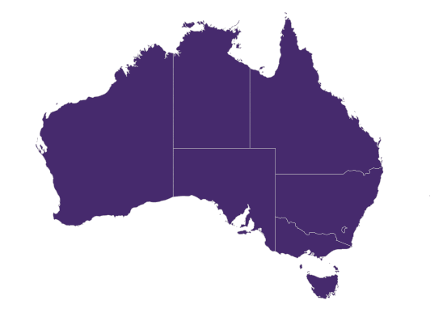

# Layers in syncfusion SfMap control

The maps control is maintained through [`Layers`](https://help.syncfusion.com/cr/wpf/Syncfusion.UI.Xaml.Maps.MapLayer.html), a map can accommodate one or more layers.

The maps control consists the following two layers:

* Imagery layer

* Shape file layer

## Imagery layer

The [`MapsProvider`](https://help.syncfusion.com/wpf/maps/map-providers) section explains about the imagery layer.

## Shape file layer

Using shape file layer, custom shape files can be rendered and the shapes can be customized.

### Shape settings

This section defines how to customize the shapes in a map.

You can customize a shape's fill, stroke, and stroke thickness using the [`ShapeFill`](https://help.syncfusion.com/cr/wpf/Syncfusion.UI.Xaml.Maps.ShapeSetting.html#Syncfusion_UI_Xaml_Maps_ShapeSetting_ShapeFill), [`ShapeStroke`](https://help.syncfusion.com/cr/wpf/Syncfusion.UI.Xaml.Maps.ShapeSetting.html#Syncfusion_UI_Xaml_Maps_ShapeSetting_ShapeStroke),[`ShapeStrokeThickness`](https://help.syncfusion.com/cr/wpf/Syncfusion.UI.Xaml.Maps.ShapeSetting.html#Syncfusion_UI_Xaml_Maps_ShapeSetting_ShapeStrokeThickness) properties.

Refer to the following code sample for customizing shapes.





		<maps:SfMap>
            <maps:SfMap.Layers >
                <maps:ShapeFileLayer Uri="GettingStarted.ShapeFiles.usa_state.shp" >
                    <maps:ShapeFileLayer.ShapeSettings>
                        <maps:ShapeSetting  ShapeFill="LightBlue" ShapeStroke="Black" ShapeStrokeThickness="1" >
                        </maps:ShapeSetting>
                    </maps:ShapeFileLayer.ShapeSettings>
                </maps:ShapeFileLayer>
            </maps:SfMap.Layers>
        </maps:SfMap>





			SfMap maps = new SfMap();
            ShapeFileLayer shapeLayer = new ShapeFileLayer();
            shapeLayer.Uri = "GettingStarted.ShapeFiles.usa_state.shp";
            ShapeSetting shapeSetting = new ShapeSetting();
            shapeSetting.ShapeFill = new SolidColorBrush(Colors.LightBlue);
            shapeSetting.ShapeStroke = new SolidColorBrush(Colors.Black);
            shapeSetting.ShapeStrokeThickness = 1;
            shapeLayer.ShapeSettings = shapeSetting;
            maps.Layers.Add(shapeLayer);
            this.Content = maps;





### Customize selected shapes

The shape selection is enabled when the [`EnableSelection`](https://help.syncfusion.com/cr/wpf/Syncfusion.UI.Xaml.Maps.ShapeFileLayer.html#Syncfusion_UI_Xaml_Maps_ShapeFileLayer_EnableSelection) property is set to true. To customize the selected shapes alone, use the following properties:

[`SelectedShapeColor`](https://help.syncfusion.com/cr/wpf/Syncfusion.UI.Xaml.Maps.ShapeSetting.html#Syncfusion_UI_Xaml_Maps_ShapeSetting_SelectedShapeColor): Sets the color for selected shapes in a map.

[`SelectedShapeStroke`](https://help.syncfusion.com/cr/wpf/Syncfusion.UI.Xaml.Maps.ShapeSetting.html#Syncfusion_UI_Xaml_Maps_ShapeSetting_SelectedShapeStroke): Sets the border color for selected shapes in a map.

[`SelectedShapeStrokeThickness`](https://help.syncfusion.com/cr/wpf/Syncfusion.UI.Xaml.Maps.ShapeSetting.html#Syncfusion_UI_Xaml_Maps_ShapeSetting_SelectedShapeStrokeThickness): Sets the border thickness for selected shapes in a map.





        <syncfusion:SfMap >
            <syncfusion:SfMap.Layers>
                <syncfusion:ShapeFileLayer EnableSelection="True"  Uri="GettingStarted.ShapeFiles.usa_state.shp">
                    <syncfusion:ShapeFileLayer.ShapeSettings>
                        <syncfusion:ShapeSetting  SelectedShapeColor="Green" SelectedShapeStroke="Black" ShapeStrokeThickness="1" >
                        </syncfusion:ShapeSetting>
                    </syncfusion:ShapeFileLayer.ShapeSettings>
                </syncfusion:ShapeFileLayer>
            </syncfusion:SfMap.Layers>
        </syncfusion:SfMap>





            SfMap maps = new SfMap();
            ShapeFileLayer shapeLayer = new ShapeFileLayer();
            shapeLayer.EnableSelection = true;
            shapeLayer.Uri = "GettingStarted.ShapeFiles.usa_state.shp";
            ShapeSetting shapeSetting = new ShapeSetting();
            shapeSetting.SelectedShapeColor = new SolidColorBrush(Colors.Green);
            shapeSetting.SelectedShapeStroke = new SolidColorBrush(Colors.Black);
            shapeSetting.SelectedShapeStrokeThickness = 1;
            shapeLayer.ShapeSettings = shapeSetting;
            maps.Layers.Add(shapeLayer);





## Appearance customization

ItemsTemplate is a type of DataTemplate that is used to override the default template for map items. `Data` is the property that holds the object for a map item.





        <syncfusion:SfMap>
            <syncfusion:SfMap.Layers>
                <syncfusion:ShapeFileLayer Background="White" ItemsSource="{Binding Countries}" 
                                           ShapeIDPath="Name" ShapeIDTableField="NAME" 
                                           Uri="DataMarkers.ShapeFiles.world1.shp">
                    <syncfusion:ShapeFileLayer.ItemsTemplate>
                        <DataTemplate>
                            <Grid Background="#332D2D2D">
                                <TextBlock Margin="5" Foreground="White" Opacity="1" FontSize="12" 
                                           FontWeight="SemiBold" FontFamily="Segoe UI" 
                                           Text="{Binding Data.Name}"/>
                            </Grid>
                        </DataTemplate>
                    </syncfusion:ShapeFileLayer.ItemsTemplate>
                    <syncfusion:ShapeFileLayer.ShapeSettings>
                        <syncfusion:ShapeSetting ShapeFill="#E5E5E5" ShapeStroke="#C1C1C1" 
                                                 ShapeStrokeThickness="0.5" ShapeValuePath="Population" 
                                                 ShapeColorValuePath="Population" >
                            <syncfusion:ShapeSetting.FillSetting>
                                <syncfusion:ShapeFillSetting AutoFillColors="False">
                                    <syncfusion:ShapeFillSetting.ColorMappings>
                                        <syncfusion:RangeColorMapping To="1500000000" From="750000000" Color="#2A91CF"/>
                                        <syncfusion:RangeColorMapping To="750000000" From="1000" Color="#3D9FD8"/>
                                        <syncfusion:RangeColorMapping From="0" To="1000" Color="#C7E9FA"/>
                                    </syncfusion:ShapeFillSetting.ColorMappings>
                                </syncfusion:ShapeFillSetting>
                            </syncfusion:ShapeSetting.FillSetting>
                        </syncfusion:ShapeSetting>
                    </syncfusion:ShapeFileLayer.ShapeSettings>
                </syncfusion:ShapeFileLayer>
            </syncfusion:SfMap.Layers>
        </syncfusion:SfMap>





    public class Country
    {
        private string name;
        public string Name
        {
            get { return name; }
            set { name = value; }
        }

        private double population;

        public double Population
        {
            get { return population; }
            set { population = value; }
        }

    }

    public class ViewModel
    {
        private ObservableCollection<Country> countries;
        public ObservableCollection<Country> Countries
        {
            get { return countries; }
            set { countries = value; }
        }

        public ViewModel()
        {
            Countries = new ObservableCollection<Country>
            {
                new Country { Name = "Russia", Population = 143228300},
                new Country { Name = "China",  Population = 1347350000 },
                new Country { Name = "Australia", Population = 22789701  },
                new Country { Name = "South Africa", Population = 50586757},
                new Country { Name = "United States", Population = 314623000 },
                new Country { Name = "Egypt", Population = 82724000},
            };
        }
    }





## Displaying layer in the view

The [`BaseMapIndex`](https://help.syncfusion.com/cr/wpf/Syncfusion.UI.Xaml.Maps.SfMap.html#Syncfusion_UI_Xaml_Maps_SfMap_BaseMapIndex) property allows drill-down from main layer to another layer.

In the ShapeSelected event, the BaseMapIndex property has been used to change the layer when Australia shape is selected.





<Grid>
        <Grid.RowDefinitions>
            <RowDefinition/>
            <RowDefinition Height="Auto"/>
        </Grid.RowDefinitions>
        <Grid.DataContext>
            <local:DrilldownViewModel/>
        </Grid.DataContext>
        
        <maps:SfMap x:Name="map">
            <maps:SfMap.Layers>
                <maps:ShapeFileLayer EnableSelection="True" x:Name="layer1" Uri="DataMarkers.ShapeFiles.world1.shp" 
                                     ItemsSource="{Binding DataSource}" ShapeIDPath="Country" 
                                     ShapeIDTableField="NAME" 
                                     ShapesSelected="layer1_ShapesSelected">
                    <maps:ShapeFileLayer.ShapeSettings>
                        <maps:ShapeSetting  ShapeColorValuePath="Country" ShapeValuePath="Country">
                        </maps:ShapeSetting>
                    </maps:ShapeFileLayer.ShapeSettings>
                    <maps:ShapeFileLayer.ItemsTemplate>
                        <DataTemplate>
                            <TextBlock Text="{Binding Data.Country}" IsHitTestVisible="False"/>
                        </DataTemplate>
                    </maps:ShapeFileLayer.ItemsTemplate>
                </maps:ShapeFileLayer>
                <maps:ShapeFileLayer x:Name="layer2" Uri="DataMarkers.ShapeFiles.australia.shp">
                    <maps:ShapeFileLayer.ShapeSettings>
                        <maps:ShapeSetting ShapeFill="#462A6D"/>
                    </maps:ShapeFileLayer.ShapeSettings>
                </maps:ShapeFileLayer>
            </maps:SfMap.Layers>
        </maps:SfMap>
        <Label x:Name="label" Grid.Row="1"
               HorizontalAlignment="Center" Background="LightGray" Margin="10"
               Content="Click on a Australia shape to drill down"/>
    </Grid>
		




   private void layer1_ShapesSelected(object sender, SelectionEventArgs args)
   {
            MapShape mapShape = (args.Items as ObservableCollection<MapShape>)[0];

            if (mapShape != null)
            {
                if (mapShape.ShapeValue.ToString() == "Australia")
                {
                    this.map.BaseMapIndex = 1;
                    label.Visibility = Visibility.Collapsed;
                }
            }
    }

    public class DrilldownViewModel
    {
        public DrilldownViewModel()
        {
            DataSource = new ObservableCollection<DrilldownModel>();
            DataSource.Add(new DrilldownModel("Afghanistan", "Asia"));
            DataSource.Add(new DrilldownModel("Albania", "Europe"));
            DataSource.Add(new DrilldownModel("United Arab Emirates", "Asia"));
            DataSource.Add(new DrilldownModel("Argentina", "South America"));
            DataSource.Add(new DrilldownModel("Armenia", "Asia"));
            DataSource.Add(new DrilldownModel("French Southern and Antarctic Lands", "Seven seas (open ocean)"));
            DataSource.Add(new DrilldownModel("Australia", "Australia"));
            //..
            //..
            DataSource.Add(new DrilldownModel("Zambia", "Africa"));
            DataSource.Add(new DrilldownModel("Zimbabwe", "Africa"));
        }
        public ObservableCollection<DrilldownModel> DataSource { get; set; }

    }

    public class DrilldownModel
    {
        public DrilldownModel(string country, string con)
        {
            this.Country = country;
            this.Continent = con;
        }
        public string Continent
        {
            get;
            set;
        }
        public string Country
        {
            get;
            set;
        }

    }





## Events

The [`ShapeSelected`](https://help.syncfusion.com/cr/wpf/Syncfusion.UI.Xaml.Maps.ShapeFileLayer.html) event will be triggered when a map shape is selected. A corresponding model data is passed as an argument.

The [`ShapesUnSelected`](https://help.syncfusion.com/cr/wpf/Syncfusion.UI.Xaml.Maps.ShapeFileLayer.html) event will be triggered when a map shape is un selected. A corresponding model data is passed as an argument.




		<syncfusion:SfMap >
            <syncfusion:SfMap.Layers>
                <syncfusion:ShapeFileLayer EnableSelection="True"  Uri="GettingStarted.ShapeFiles.usa_state.shp"  ShapesSelected="ShapeFileLayer_ShapesSelected" ShapesUnSelected="ShapeFileLayer_ShapesUnSelected">
                 </syncfusion:ShapeFileLayer>
            </syncfusion:SfMap.Layers>
        </syncfusion:SfMap>
		




    public partial class MainWindow : Window
    {
        public MainWindow()
        {
            InitializeComponent();
            SfMap maps = new SfMap();
            ShapeFileLayer shapeLayer = new ShapeFileLayer();
            shapeLayer.ShapesUnSelected += ShapeFileLayer_ShapesUnSelected;
            shapeLayer.ShapesSelected += ShapeFileLayer_ShapesSelected;
            shapeLayer.EnableSelection = true;
            shapeLayer.Uri = "GettingStarted.ShapeFiles.usa_state.shp";
            maps.Layers.Add(shapeLayer);
            this.Content = maps;
        }

        private void ShapeFileLayer_ShapesSelected(object sender, SelectionEventArgs args)
        {
            var data = args.Items;
        }

        private void ShapeFileLayer_ShapesUnSelected(object sender, SelectionEventArgs args)
        {
            var data = args.Items;
        }
    }




## see also

[How to customize the markers in maps](https://www.syncfusion.com/kb/7656/how-to-customize-the-markers-in-maps)

[How to drilldown map layers](https://www.syncfusion.com/kb/7647/how-to-drilldown-map-layers)

[How to specify ItemTemplate to shape file layer]( https://www.syncfusion.com/kb/10001/how-to-specify-itemtemplate-to-shape-file-layer) 

[How to render custom data source in SfMap](https://www.syncfusion.com/kb/3237/how-to-render-customdatasource-in-sfmap)

