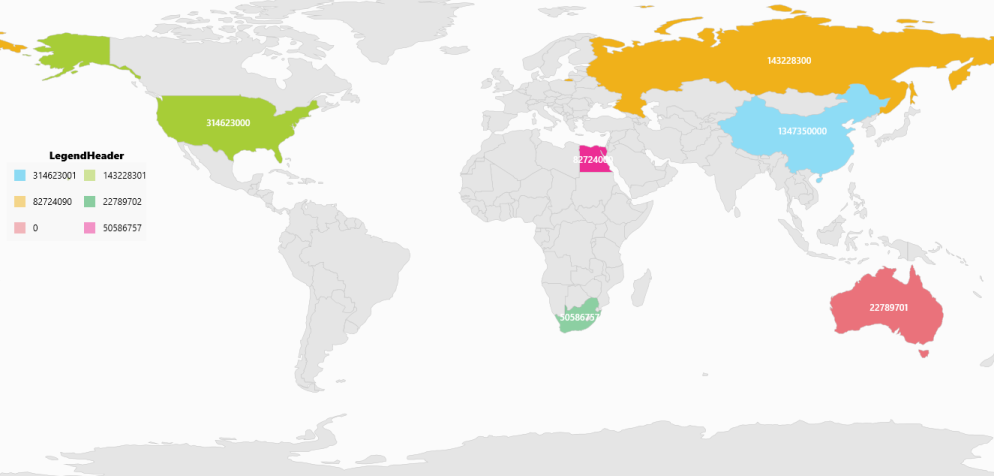
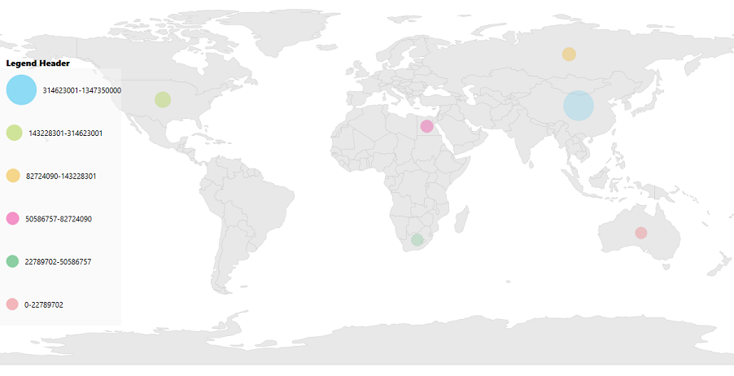

# Legend in WPF Maps (SfMap)

A legend is a key to symbolism used on a map, usually containing swatches of symbols with descriptions. It provides valuable information for interpreting what the map is showing you, and can be represented in various colors and shapes based on the data.

## Legend visibility

Legends are visible by setting the [`LegendVisibility`](https://help.syncfusion.com/cr/wpf/Syncfusion.UI.Xaml.Maps.ShapeFileLayer.html#Syncfusion_UI_Xaml_Maps_ShapeFileLayer_LegendVisibility) property of the visibility type as `Visible` in the ShapeFileLayer.

## Legend Position

Map legends can be positioned by setting the [`LegendPosition`](https://help.syncfusion.com/cr/wpf/Syncfusion.UI.Xaml.Maps.ShapeFileLayer.html#Syncfusion_UI_Xaml_Maps_ShapeFileLayer_LegendPosition) property in ShapeFileLayer. Also, the legend can be positioned based on the margin values for the X-axis and the Y-axis with the help of the `LegendPositionX` and `LegendPositionY` properties available in ShapeFileLayer. For positioning the legend based on margins, corresponding to a map, `LegendPosition` must be set with value of `Default`.

<table>
<tr>
<th>
Property</th><th>
Type</th><th>
Description</th></tr>
<tr>
<td>
LegendPosition</td><td>
LegendPosition (enum) </td><td>
Gets or sets the standard position for the legend.</td></tr>
<tr>
<td>
LegendPositionX</td><td>
Double</td><td>
Gets or sets the margin value for the x axis.</td></tr>
<tr>
<td>
LegendPositionY</td><td>
Double</td><td>
Gets or sets the margin value for the y axis.</td></tr>
</table>

## Legend header

A header for the legend can be added by setting the [`LegendHeader`](https://help.syncfusion.com/cr/wpf/Syncfusion.UI.Xaml.Maps.ShapeFileLayer.html#Syncfusion_UI_Xaml_Maps_ShapeFileLayer_LegendHeader) property of the string type.

## Legend categories

Legends are categorized as two types:

* Legends for shape layers.
* Legends for bubbles.

These can be set by using the [`LegendType`](https://help.syncfusion.com/cr/wpf/Syncfusion.UI.Xaml.Maps.ShapeFileLayer.html#Syncfusion_UI_Xaml_Maps_ShapeFileLayer_LegendType) property of the type LegendType.

### Shapes

Bubble type legends are always bubbles with varying sizes.  The size of the bubbles is obtained from the [`SizeRatio`](https://help.syncfusion.com/cr/wpf/Syncfusion.UI.Xaml.Maps.BubbleMarkerSetting.html#Syncfusion_UI_Xaml_Maps_BubbleMarkerSetting_SizeRatio) from the BubbleMarkerSetting.

Layer shape type legends can be different shapes for the legend. The shapes can be set by using the [`LegendIcon`](https://help.syncfusion.com/cr/wpf/Syncfusion.UI.Xaml.Maps.ShapeFileLayer.html#Syncfusion_UI_Xaml_Maps_ShapeFileLayer_LegendIcon), of the LegendIcon type. 

### Arranging the Legends 

Legends are arranged in matrix format. The number of columns in the arranging matrix can be set by setting the [`LegendColumnSplit`](https://help.syncfusion.com/cr/wpf/Syncfusion.UI.Xaml.Maps.ShapeFileLayer.html#Syncfusion_UI_Xaml_Maps_ShapeFileLayer_LegendColumnSplit) property of the int type. 





    <syncfusion:SfMap>
        <syncfusion:SfMap.Layers>
            <syncfusion:ShapeFileLayer 
                    LegendType="Layers" LegendHeader="LegendHeader"
                    LegendColumnSplit="2" LegendPositionX="10"
                    LegendPositionY="300" LegendVisibility="Visible"
                    LegendIcon="Rectangle" ItemsSource="{Binding Countries}" ShapeIDPath="Name"  
                    ShapeIDTableField="NAME" Uri="DataMarkers.ShapeFiles.world1.shp">
                <syncfusion:ShapeFileLayer.ShapeSettings>
                    <syncfusion:ShapeSetting ShapeColorValuePath="Population" ShapeFill="#E5E5E5" 
                                                 ShapeStroke="#C1C1C1" ShapeStrokeThickness="0.5" 
                                                 ShapeValuePath="Population" >
                        <syncfusion:ShapeSetting.FillSetting>
                            <syncfusion:ShapeFillSetting AutoFillColors="False">
                                <syncfusion:ShapeFillSetting.ColorMappings>
                                    <syncfusion:RangeColorMapping Color="#7F20BCEE" To="1347350000" From="314623001"/>
                                    <syncfusion:RangeColorMapping Color="#7FA7CE38" To="314623001" From="143228301"/>
                                    <syncfusion:RangeColorMapping Color="#7FF1B21A" To="143228301" From="82724090"/>
                                    <syncfusion:RangeColorMapping Color="#7F1DA249" To="50586757" From="22789702"/>
                                    <syncfusion:RangeColorMapping Color="#7FEB737C" To="22789702" From="0"/>
                                    <syncfusion:RangeColorMapping Color="#7FED2D95" To="82724090" From="50586757"/>
                                </syncfusion:ShapeFillSetting.ColorMappings>
                            </syncfusion:ShapeFillSetting>
                        </syncfusion:ShapeSetting.FillSetting>
                    </syncfusion:ShapeSetting>
                </syncfusion:ShapeFileLayer.ShapeSettings>
            </syncfusion:ShapeFileLayer>
        </syncfusion:SfMap.Layers>
    </syncfusion:SfMap>





    public class Country
    {
        private string name;
        public string Name
        {
            get { return name; }
            set { name = value; }
        }

        private double population;

        public double Population
        {
            get { return population; }
            set { population = value; }
        }

    }

    public class ViewModel
    {
        private ObservableCollection<Country> countries;
        public ObservableCollection<Country> Countries
        {
            get { return countries; }
            set { countries = value; }
        }

        public ViewModel()
        {
            Countries = new ObservableCollection<Country>
            {
                new Country { Name = "Russia", Population = 143228300},
                new Country { Name = "China",  Population = 1347350000 },
                new Country { Name = "Australia", Population = 22789701  },
                new Country { Name = "South Africa", Population = 50586757},
                new Country { Name = "United States", Population = 314623000 },
                new Country { Name = "Egypt", Population = 82724000},
            };
        }
    }







    <syncfusion:SfMap>
        <syncfusion:SfMap.Layers>
            <syncfusion:ShapeFileLayer 
                    LegendType="Bubbles" LegendHeader="LegendHeader"
                    LegendColumnSplit="2" LegendPositionX="10"
                    LegendPositionY="300" LegendVisibility="Visible"
                    LegendIcon="Rectangle" ItemsSource="{Binding Countries}" ShapeIDPath="Name"  
                    ShapeIDTableField="NAME" Uri="DataMarkers.ShapeFiles.world1.shp">
                <syncfusion:ShapeFileLayer.ShapeSettings>
                    <syncfusion:ShapeSetting ShapeValuePath="Population"/>
                </syncfusion:ShapeFileLayer.ShapeSettings>
                <syncfusion:ShapeFileLayer.BubbleMarkerSetting>
                    <syncfusion:BubbleMarkerSetting AutoFillColor="False" MaxSize="50" 
                                                    MinSize="20" StrokeThickness="0" 
                                                    ColorValuePath="Population" ValuePath="Population">
                        <syncfusion:BubbleMarkerSetting.ColorMappings>
                            <syncfusion:RangeColorMapping Color="#7F20BCEE" To="1347350000" From="314623001"/>
                            <syncfusion:RangeColorMapping Color="#7FA7CE38" To="314623001" From="143228301"/>
                            <syncfusion:RangeColorMapping Color="#7FF1B21A" To="143228301" From="82724090"/>
                            <syncfusion:RangeColorMapping Color="#7FED2D95" To="82724090" From="50586757"/>
                            <syncfusion:RangeColorMapping Color="#7F1DA249" To="50586757" From="22789702"/>
                            <syncfusion:RangeColorMapping Color="#7FEB737C" To="22789702" From="0"/>
                        </syncfusion:BubbleMarkerSetting.ColorMappings>
                    </syncfusion:BubbleMarkerSetting>
                </syncfusion:ShapeFileLayer.BubbleMarkerSetting>
            </syncfusion:ShapeFileLayer>
        </syncfusion:SfMap.Layers>
    </syncfusion:SfMap>



