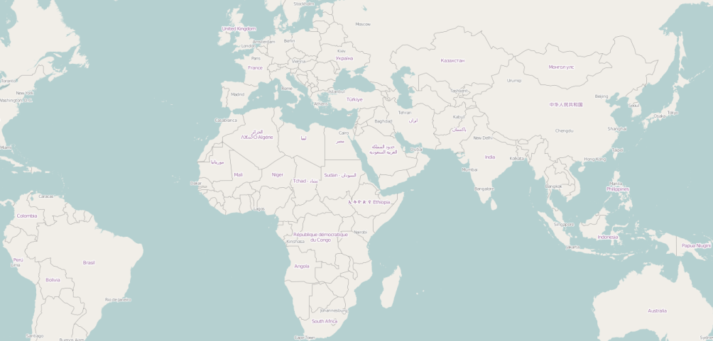
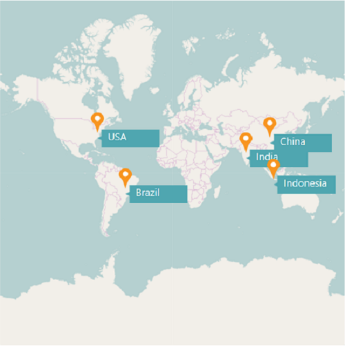
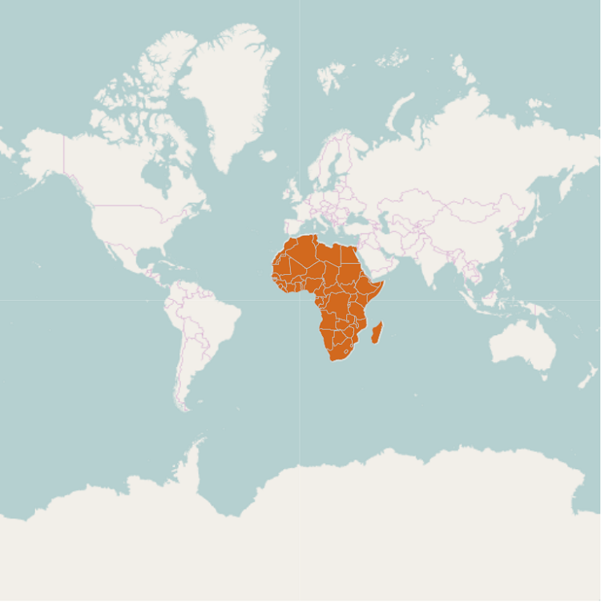
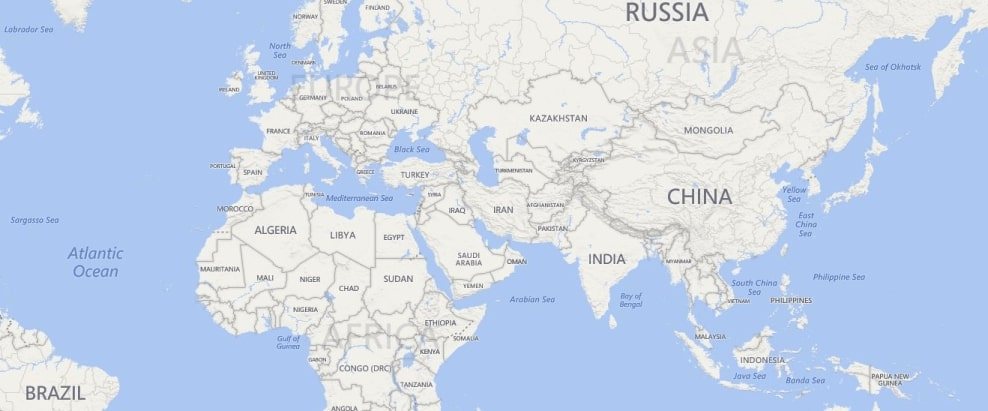
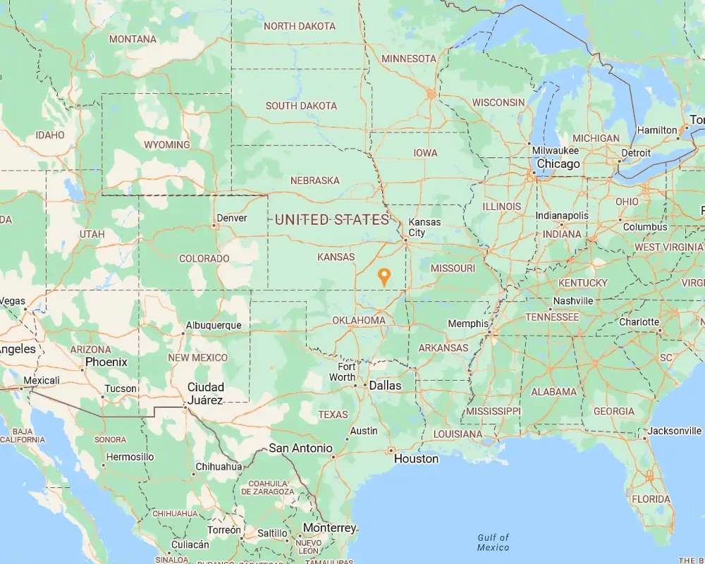
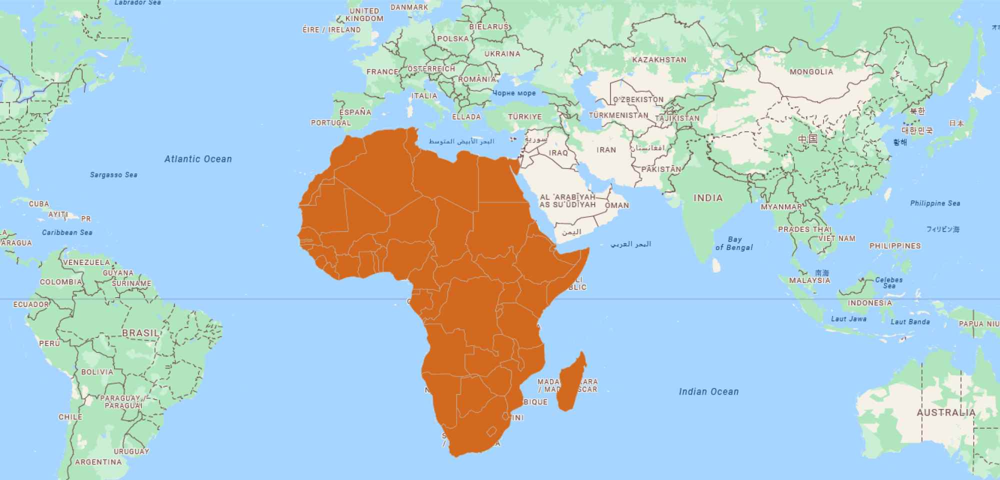

# Map Providers in WPF Maps (SfMap)

The [`SfMap`](https://help.syncfusion.com/cr/wpf/Syncfusion.UI.Xaml.Maps.SfMap.html) control provides support for various map providers, including `OpenStreetMap`, `Google Maps`, `Azure Maps`, and `Bing Maps.` You can also integrate other map providers by adding them as layers.

## Open Street Map

The `OpenStreetMap` (OSM) is a map of the world built by a community of mappers that is free to use under an open license. It allows you to view geographical data in a collaborative way from anywhere on the Earth. It provides small tile images based on our requests and combines those images into a single one to display the map area in our maps control.

### Enable an OSM

You can enable this feature by setting the [`LayerType`](https://help.syncfusion.com/cr/wpf/Syncfusion.UI.Xaml.Maps.ImageryLayer.html#Syncfusion_UI_Xaml_Maps_ImageryLayer_LayerType) property value as [`OSM`](https://help.syncfusion.com/cr/wpf/Syncfusion.UI.Xaml.Maps.LayerType.html#fields).



 
<syncfusion:SfMap ZoomLevel="3">
    <syncfusion:SfMap.Layers>
        <syncfusion:ImageryLayer LayerType="OSM"/>
    </syncfusion:SfMap.Layers>
</syncfusion:SfMap>
       



SfMap map = new SfMap();
map.ZoomLevel = 3;
ImageryLayer layer = new ImageryLayer();
layer.LayerType = LayerType.OSM;
map.Layers.Add(layer);             
this.Content = map;




### Markers

The [`Markers`](https://help.syncfusion.com/cr/wpf/Syncfusion.UI.Xaml.Maps.ImageryLayer.html#Syncfusion_UI_Xaml_Maps_ImageryLayer_Markers) are used to mark important locations on the map and provide contextual information through icons, labels, or messages.




<syncfusion:SfMap x:Name="map">
    <syncfusion:SfMap.Layers>
        <syncfusion:ImageryLayer Markers="{Binding Markers}" LayerType="OSM"/>
    </syncfusion:SfMap.Layers>
    <syncfusion:SfMap.DataContext>
        <local:MapViewModel/>
    </syncfusion:SfMap.DataContext>
</syncfusion:SfMap>




public class Model
{
    public string Name { get; set; }
    public string Longitude { get; set; }
    public string Latitude { get; set; }
}

public class MapViewModel
{
    public ObservableCollection<Model> Markers { get; set; }
    public MapViewModel()
    {
        this.Markers = new ObservableCollection<Model>();
        this.Markers.Add(new Model() { Name = "USA ", Latitude = "38.8833N", Longitude = "77.0167W" });
        this.Markers.Add(new Model() { Name = "Brazil ", Latitude = "15.7833S", Longitude = "47.8667W" });
        this.Markers.Add(new Model() { Name = "India ", Latitude = "21.0000N", Longitude = "78.0000E" });
        this.Markers.Add(new Model() { Name = "China ", Latitude = "35.0000N", Longitude = "103.0000E" });
        this.Markers.Add(new Model() { Name = "Indonesia ", Latitude = "6.1750S", Longitude = "106.8283E" });
    }
}




### Customizing the Marker Template

The default appearance of the Marker can be customized by using the [`MarkerTemplate`](https://help.syncfusion.com/cr/wpf/Syncfusion.UI.Xaml.Maps.ImageryLayer.html#Syncfusion_UI_Xaml_Maps_ImageryLayer_MarkerTemplate) property.




<syncfusion:SfMap x:Name="map">
    <syncfusion:SfMap.Layers>
        <syncfusion:ImageryLayer Markers="{Binding Models}" LayerType="OSM">
            <syncfusion:ImageryLayer.MarkerTemplate>
                <DataTemplate>
                    <Grid Margin="-12,-30,0,0">
                        <Canvas>
                            <Image Source="pin.png" Height="30"/>
                        </Canvas>
                        <Grid DataContext="{Binding Data}" Width="265">
                            <Grid.RowDefinitions>
                                <RowDefinition />
                            </Grid.RowDefinitions>
                            <Grid.ColumnDefinitions>
                                <ColumnDefinition/>
                            </Grid.ColumnDefinitions>
                            <Canvas Grid.Row="0" Grid.Column="0" Margin="0,0,106,0">
                                <Image Source="mappath.png" Width="92" Canvas.Top="25" Canvas.Left="10"/>
                                <TextBlock Foreground="White" HorizontalAlignment="Center" FontSize="15" FontFamily="Segoe UI" Text="{Binding Name}" Canvas.Left="25" Canvas.Top="25" RenderTransformOrigin="0.515,-0.3"/>
                            </Canvas>
                        </Grid>
                    </Grid>
                </DataTemplate>
            </syncfusion:ImageryLayer.MarkerTemplate>
        </syncfusion:ImageryLayer>
    </syncfusion:SfMap.Layers>
</syncfusion:SfMap>  




Refer to this [`link`](https://help.syncfusion.com/wpf/maps/markers) for customizing marker icons, labels, marker alignment, marker selection and events. 

### Adding a multiple layers in OSM

Multiple layers can be added within a single [`ImageryLayer`](https://help.syncfusion.com/cr/wpf/Syncfusion.UI.Xaml.Maps.ImageryLayer.html). To achieve this, add the required layers to the [`SubShapeFileLayers`](https://help.syncfusion.com/cr/wpf/Syncfusion.UI.Xaml.Maps.ImageryLayer.html#Syncfusion_UI_Xaml_Maps_ImageryLayer_SubShapeFileLayers) property of the [`ImageryLayer`](https://help.syncfusion.com/cr/wpf/Syncfusion.UI.Xaml.Maps.ImageryLayer.html).

### SubShapeFileLayers

The [`SubShapeFileLayers`](https://help.syncfusion.com/cr/wpf/Syncfusion.UI.Xaml.Maps.ImageryLayer.html#Syncfusion_UI_Xaml_Maps_ImageryLayer_SubShapeFileLayers) allows you to group multiple [`SubShapeFileLayer`](https://help.syncfusion.com/cr/wpf/Syncfusion.UI.Xaml.Maps.SubShapeFileLayer.html) instances within an [`ImageryLayer`](https://help.syncfusion.com/cr/wpf/Syncfusion.UI.Xaml.Maps.ImageryLayer.html). Each SubShapeFileLayer functions as an independent shapefile layer, enabling you to display multiple shape data sources on the same map imagery.

The following code example demonstrates how to add multiple layers to an [`ImageryLayer`](https://help.syncfusion.com/cr/wpf/Syncfusion.UI.Xaml.Maps.ImageryLayer.html).




<syncfusion:SfMap>
    <syncfusion:SfMap.Layers>
        <syncfusion:ImageryLayer LayerType="OSM" >
            <syncfusion:ImageryLayer.SubShapeFileLayers>                   
                <syncfusion:SubShapeFileLayer Uri="DataMarkers.ShapeFiles.Africa.shp">                            
                    <syncfusion:SubShapeFileLayer.ShapeSettings>                               
                        <syncfusion:ShapeSetting ShapeStroke="#C1C1C1" ShapeStrokeThickness="0.5" ShapeFill="Chocolate"/>                           
                    </syncfusion:SubShapeFileLayer.ShapeSettings>                       
                </syncfusion:SubShapeFileLayer>                   
            </syncfusion:ImageryLayer.SubShapeFileLayers>               
        </syncfusion:ImageryLayer>     
    </syncfusion:SfMap.Layers>
</syncfusion:SfMap>




## Bing Map

The `Bing Maps` is a global mapping service provided by Microsoft. Similar to `OpenStreetMap` (OSM), it delivers map tile images based on user requests and combines them to render the required map area.

### Enable a Bing Map 

You can enable Bing Maps by setting the [`LayerType`](https://help.syncfusion.com/cr/wpf/Syncfusion.UI.Xaml.Maps.ImageryLayer.html#Syncfusion_UI_Xaml_Maps_ImageryLayer_LayerType) property to [`Bing`](https://help.syncfusion.com/cr/wpf/Syncfusion.UI.Xaml.Maps.LayerType.html#fields).

### Bing Map Key

The [`BingMapKey`](https://help.syncfusion.com/cr/wpf/Syncfusion.UI.Xaml.Maps.ImageryLayer.html#Syncfusion_UI_Xaml_Maps_ImageryLayer_BingMapKey) is provided as input to this key property. The Bing Map key can be obtained from 
[https://www.microsoft.com/en-us/maps/create-a-bing-maps-key](https://www.microsoft.com/en-us/maps/bing-maps/create-a-bing-maps-key).

The [`Maps`](https://help.syncfusion.com/cr/wpf/Syncfusion.UI.Xaml.Maps.SfMap.html) control supports the following `Bing Maps` view styles:

1. Aerial
2. AerialWithLabel
3. Road. 

By default, the Bing Maps view style is set to [`Road`](https://help.syncfusion.com/cr/wpf/Syncfusion.UI.Xaml.Maps.BingMapStyle.html#fields).

### Aerial View

The Aerial view shows satellite images with clearly visible roads and landmarks. This view is useful for visually exploring real‑world locations. You can apply this view by setting [`BingMapStyle`](https://help.syncfusion.com/cr/wpf/Syncfusion.UI.Xaml.Maps.ImageryLayer.html#Syncfusion_UI_Xaml_Maps_ImageryLayer_BingMapStyle) to [`Aerial`](https://help.syncfusion.com/cr/wpf/Syncfusion.UI.Xaml.Maps.BingMapStyle.html#fields).



       
<syncfusion:SfMap>
    <syncfusion:SfMap.Layers>
       <syncfusion:ImageryLayer LayerType="Bing" BingMapKey="<Your Bing map key>" BingMapStyle="Aerial" />  
    </syncfusion:SfMap.Layers>
</syncfusion:SfMap >




SfMap map = new SfMap();
ImageryLayer layer = new ImageryLayer();
layer.LayerType = LayerType.Bing;
layer.BingMapKey = "Your Bing map key";
layer.BingMapStyle = BingMapStyle.Aerial;
map.Layers.Add(layer);
this.Content = map;




The following screenshot illustrates the Aerial View.

### Road View

Road view displays the default map view of roads, buildings, and geography. To apply the Road view, you need to set [`BingMapStyle`](https://help.syncfusion.com/cr/wpf/Syncfusion.UI.Xaml.Maps.ImageryLayer.html#Syncfusion_UI_Xaml_Maps_ImageryLayer_BingMapStyle) as [`Road`](https://help.syncfusion.com/cr/wpf/Syncfusion.UI.Xaml.Maps.BingMapStyle.html#fields), as shown in the following code.




<syncfusion:SfMap>
    <syncfusion:SfMap.Layers>
        <syncfusion:ImageryLayer LayerType="Bing" BingMapKey="<Your Bing map key>" BingMapStyle="Road" />     
    </syncfusion:SfMap.Layers>
</syncfusion:SfMap >




SfMap map = new SfMap();
ImageryLayer layer = new ImageryLayer();
layer.LayerType = LayerType.Bing;
layer.BingMapKey = "Your Bing map key";
layer.BingMapStyle = BingMapStyle.Road;
map.Layers.Add(layer);
this.Content = map;




The following screenshot illustrates the Road view.

'

### AerialWithLabelView

The [`AerialWithLabel`](https://help.syncfusion.com/cr/wpf/Syncfusion.UI.Xaml.Maps.BingMapStyle.html#fields) view displays the Aerial map areas with labels for continent, country, ocean, etc., names. To apply this type of view style, you need to set [`BingMapStyle`](https://help.syncfusion.com/cr/wpf/Syncfusion.UI.Xaml.Maps.ImageryLayer.html#Syncfusion_UI_Xaml_Maps_ImageryLayer_BingMapStyle) as [`AerialWithLabel`](https://help.syncfusion.com/cr/wpf/Syncfusion.UI.Xaml.Maps.BingMapStyle.html#fields), as shown in the following code.




<syncfusion:SfMap>
    <syncfusion:SfMap.Layers>
        <syncfusion:ImageryLayer LayerType="Bing" BingMapKey="<Your Bing map key>" BingMapStyle="AerialWithLabels" />    
    </syncfusion:SfMap.Layers>
</syncfusion:SfMap>




SfMap map = new SfMap();
ImageryLayer layer = new ImageryLayer();
layer.LayerType = LayerType.Bing;
layer.BingMapKey = "Your Bing map key";
layer.BingMapStyle = BingMapStyle.AerialWithLabels;
map.Layers.Add(layer);
this.Content = map;




The following screenshot illustrates the AerialWithLabel view.

## Azure Maps

`Azure Maps` is an online map tile provider from Microsoft. Similar to `OSM` and `Bing Maps,` it serves map tile images on request and composites them to display the map area.

### Adding Azure Maps

`Azure Maps` can be rendered by setting the [`UrlTemplate`](https://help.syncfusion.com/cr/wpf/Syncfusion.UI.Xaml.Maps.ImageryLayer.html#Syncfusion_UI_Xaml_Maps_ImageryLayer_UrlTemplate) property with the tile server URL provided by the online map provider. A subscription key is required for `Azure Maps`.

Follow the steps in this [link](https://docs.microsoft.com/en-us/azure/search/search-security-api-keys) to generate an API key, and then add the key to the URL.

N>
* Refer to [Azure Maps Licensing](https://azure.microsoft.com/en-in/support/legal/).




<syncfusion:SfMap>
    <syncfusion:SfMap.Layers>
        <syncfusion:ImageryLayer UrlTemplate="https://atlas.microsoft.com/map/tile?api-version=2024-04-01&amp;tilesetId=microsoft.base.road&amp;zoom={z}&amp;x={x}&amp;y={y}&amp;subscription-key=your-azure-maps-key"/>
    </syncfusion:SfMap.Layers>
</syncfusion:SfMap>




// Azure Maps via UrlTemplate (XYZ tiles)
SfMap map = new SfMap();
ImageryLayer layer = new ImageryLayer();
layer.UrlTemplate = "https://atlas.microsoft.com/map/tile?api-version=2024-04-01&tilesetId=microsoft.base.road&zoom={z}&x={x}&y={y}&subscription-key=your-azure-maps-key";
map.Layers.Add(layer);
this.Content = map;
    



{:width="1000" height="488"}

### Adding sublayer in Azure map

Multiple layers can be added within a single [`ImageryLayer`](https://help.syncfusion.com/cr/wpf/Syncfusion.UI.Xaml.Maps.ImageryLayer.html). To achieve this, add the required layers to the [`SubShapeFileLayers`](https://help.syncfusion.com/cr/wpf/Syncfusion.UI.Xaml.Maps.ImageryLayer.html#Syncfusion_UI_Xaml_Maps_ImageryLayer_SubShapeFileLayers) property of the [`ImageryLayer`](https://help.syncfusion.com/cr/wpf/Syncfusion.UI.Xaml.Maps.ImageryLayer.html).

### SubShapeFileLayers

The [`SubShapeFileLayers`](https://help.syncfusion.com/cr/wpf/Syncfusion.UI.Xaml.Maps.ImageryLayer.html#Syncfusion_UI_Xaml_Maps_ImageryLayer_SubShapeFileLayers) allows you to group multiple [`SubShapeFileLayer`](https://help.syncfusion.com/cr/wpf/Syncfusion.UI.Xaml.Maps.SubShapeFileLayer.html) instances within an [`ImageryLayer`](https://help.syncfusion.com/cr/wpf/Syncfusion.UI.Xaml.Maps.ImageryLayer.html). Each SubShapeFileLayer functions as an independent shapefile layer, enabling you to display multiple shape data sources on the same map imagery.

The following code example demonstrates how to add multiple layers to an [`ImageryLayer`](https://help.syncfusion.com/cr/wpf/Syncfusion.UI.Xaml.Maps.ImageryLayer.html).




<syncfusion:SfMap>
    <syncfusion:SfMap.Layers>
        <syncfusion:ImageryLayer UrlTemplate="https://atlas.microsoft.com/map/tile?api-version=2024-04-01&amp;tilesetId=microsoft.base.road&amp;zoom={z}&amp;x={x}&amp;y={y}&amp;subscription-key=your-azure-maps-key" >
            <syncfusion:ImageryLayer.SubShapeFileLayers>                   
                <syncfusion:SubShapeFileLayer  Uri="DataMarkers.ShapeFiles.Africa.shp">                            
                    <syncfusion:SubShapeFileLayer.ShapeSettings>                               
                        <syncfusion:ShapeSetting  ShapeStroke="#C1C1C1" ShapeStrokeThickness="0.5"  ShapeFill="Chocolate"/>                           
                    </syncfusion:SubShapeFileLayer.ShapeSettings>                       
                </syncfusion:SubShapeFileLayer>                   
            </syncfusion:ImageryLayer.SubShapeFileLayers>               
        </syncfusion:ImageryLayer>     
    </syncfusion:SfMap.Layers>
</syncfusion:SfMap>




N>
* When [`UrlTemplate`](https://help.syncfusion.com/cr/wpf/Syncfusion.UI.Xaml.Maps.ImageryLayer.html#Syncfusion_UI_Xaml_Maps_ImageryLayer_UrlTemplate) is set, the [`ImageryLayer`](https://help.syncfusion.com/cr/wpf/Syncfusion.UI.Xaml.Maps.ImageryLayer.html) gives first preference to loading map tiles from the specified URL and ignores [`LayerType`](https://help.syncfusion.com/cr/wpf/Syncfusion.UI.Xaml.Maps.ImageryLayer.html#Syncfusion_UI_Xaml_Maps_ImageryLayer_LayerType) and `BingMapKey` properties.
 * If [`UrlTemplate`](https://help.syncfusion.com/cr/wpf/Syncfusion.UI.Xaml.Maps.ImageryLayer.html#Syncfusion_UI_Xaml_Maps_ImageryLayer_UrlTemplate) is not set, the layer continues to use the configured [`LayerType`](https://help.syncfusion.com/cr/wpf/Syncfusion.UI.Xaml.Maps.ImageryLayer.html#Syncfusion_UI_Xaml_Maps_ImageryLayer_LayerType) (such as Bing Maps or OpenStreetMap), ensuring full backward compatibility.

 N> You can refer to our [WPF Map](https://www.syncfusion.com/wpf-controls/map) feature tour page for its groundbreaking feature representations. You can also explore our [WPF Map example](https://github.com/syncfusion/wpf-demos/tree/master/map) to know how to render and configure the map.

## See also

[How to show google map in WPF SfMap](https://support.syncfusion.com/kb/article/10441/how-to-show-google-map-in-wpf-map-sfmap)

[How to view bing map using WPF SfMap](https://support.syncfusion.com/kb/article/9564/how-to-view-bing-map-using-wpf-map-control-sfmap)

[How to customize the markers in maps](https://support.syncfusion.com/kb/article/6824/how-to-customize-the-markers-in-maps)

[How to drilldown map layers](https://support.syncfusion.com/kb/article/6771/how-to-drilldown-map-layers-in-wpf-application)