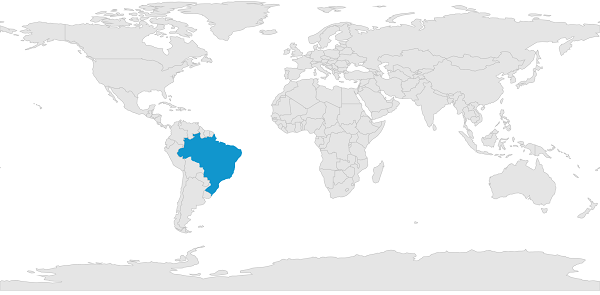
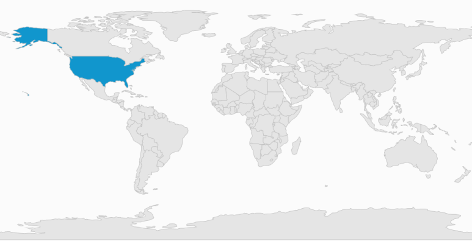

# Map Selection in WPF Maps (SfMap)

Each shape in the map can be selected and unselected when interacted with shapes. There are two ways to select the map shapes:

1. Single Selection 
2. Multi Selection

The selected map shapes is differentiate by its fill. [`SelectedShapeColor`](https://help.syncfusion.com/cr/wpf/Syncfusion.UI.Xaml.Maps.ShapeSetting.html#Syncfusion_UI_Xaml_Maps_ShapeSetting_SelectedShapeColor) of `ShapeSetting` is the API that is used to get or set the selected shape color.

All selected shapes available in the [`SelectedMapShapes`](https://help.syncfusion.com/cr/wpf/Syncfusion.UI.Xaml.Maps.ShapeFileLayer.html#Syncfusion_UI_Xaml_Maps_ShapeFileLayer_SelectedMapShapes) of ShapeFileLayer.

## Single Selection

Single selection allows only one shape to be selected at a time. You can select the shape by clicking or tapping on the shape. Single selection is enabled by the [`EnableSelection`](https://help.syncfusion.com/cr/wpf/Syncfusion.UI.Xaml.Maps.ShapeFileLayer.html#Syncfusion_UI_Xaml_Maps_ShapeFileLayer_EnableSelection) property of ShapeFileLayer. When `EnableSelection` is set to true, then the map can be selected. When it is set to false, the shapes cannot be selected. When any other shape or the map area is selected, then the shape that is already selected is unselected.





        <syncfusion:SfMap >
            <syncfusion:SfMap.Layers>
                <syncfusion:ShapeFileLayer x:Name="shapeLayer" EnableSelection ="True"

                                           Uri="DataMarkers.ShapeFiles.world1.shp">
                    <syncfusion:ShapeFileLayer.ShapeSettings>
                        <syncfusion:ShapeSetting ShapeFill="#E5E5E5" SelectedShapeColor="#1196CD" 
                                                 ShapeStroke="#C1C1C1" ShapeStrokeThickness="1" />
                    </syncfusion:ShapeFileLayer.ShapeSettings>
                </syncfusion:ShapeFileLayer>
            </syncfusion:SfMap.Layers>
        </syncfusion:SfMap>





           SfMap map = new SfMap();
            ShapeFileLayer shapeFileLayer = new ShapeFileLayer();
            shapeFileLayer.EnableSelection = true;
            shapeFileLayer.Uri = "DataMarkers.ShapeFiles.world1.shp";

            ShapeSetting setting = new ShapeSetting();
            setting.ShapeFill = (SolidColorBrush)(new BrushConverter().ConvertFrom("#E5E5E5"));
            setting.ShapeStroke= (SolidColorBrush)(new BrushConverter().ConvertFrom("#C1C1C1"));
            setting.SelectedShapeColor= (SolidColorBrush)(new BrushConverter().ConvertFrom("#1196CD"));
            setting.ShapeStrokeThickness = 1;
            shapeFileLayer.ShapeSettings = setting;

            map.Layers.Add(shapeFileLayer);
            this.Content = map;





## Multi Selection

Multiple shapes in the map can be selected when [`EnableMultiSelection`](https://help.syncfusion.com/cr/wpf/Syncfusion.UI.Xaml.Maps.ShapeFileLayer.html#Syncfusion_UI_Xaml_Maps_ShapeFileLayer_EnableMultiSelection) of ShapeFileLayer is set to true. When EnableMultiSelection is set to true, a cross-hair cursor appears on the map to guide the selection. When you drag on the map, a rectangle appears. The shapes bound that intersect with the rectangle is selected. When EnableMultiSelection is set to true, the panning does not work through interactions.





        <syncfusion:SfMap >
            <syncfusion:SfMap.Layers>
                <syncfusion:ShapeFileLayer x:Name="shapeLayer" CrossCursorStroke="#686868" 
                                           CrossCursorStrokeThickness="0.5" EnableSelection ="True"
                                           EnableMultiSelection="True"
                                           Uri="DataMarkers.ShapeFiles.world1.shp">
                    <syncfusion:ShapeFileLayer.ShapeSettings>
                        <syncfusion:ShapeSetting ShapeFill="#E5E5E5" SelectedShapeColor="#1196CD" 
                                                 ShapeStroke="#C1C1C1" ShapeStrokeThickness="1" />
                    </syncfusion:ShapeFileLayer.ShapeSettings>
                </syncfusion:ShapeFileLayer>
            </syncfusion:SfMap.Layers>
        </syncfusion:SfMap>





            SfMap map = new SfMap();          
            ShapeFileLayer shapeFileLayer = new ShapeFileLayer();
            shapeFileLayer.EnableMultiSelection = true;
            shapeFileLayer.EnableSelection = true;
            shapeFileLayer.CrossCursorStrokeThickness = 0.5;
            shapeFileLayer.CrossCursorStroke= (SolidColorBrush)(new BrushConverter().ConvertFrom("#686868"));
            shapeFileLayer.Uri = "DataMarkers.ShapeFiles.world1.shp";
            map.Layers.Add(shapeFileLayer);
            this.Content = map;





N> You can refer to our [WPF Map](https://www.syncfusion.com/wpf-controls/map) feature tour page for its groundbreaking feature representations. You can also explore our [WPF Map example](https://github.com/syncfusion/wpf-demos/tree/master/map) to know how to render and configure the map.

