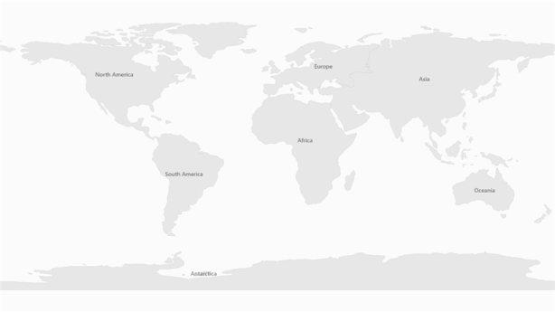

# Map Shape Labels in WPF Maps (SfMap)

Labels for map shapes can be displayed by using the [`LabelPath`](https://help.syncfusion.com/cr/wpf/Syncfusion.UI.Xaml.Maps.ShapeFileLayer.html#Syncfusion_UI_Xaml_Maps_ShapeFileLayer_LabelPath) of ShapeFileLayer. The value of LabelPath must be a field name specified in the .dbf file corresponding to the shapefile. 

<table>
<tr>
<th>
Property</th><th>
Type</th><th>
Description</th></tr>
<tr>
<td>
LabelPath</td><td>
string</td><td>
Gets or sets the field name in the database (.dbf) file.</td></tr>
</table>



      <syncfusion:SfMap>
            <syncfusion:SfMap.Layers>
                <syncfusion:ShapeFileLayer x:Name="shapeFileLayer"   
                                       Uri="DataMarkers.ShapeFiles.world1.shp"                                                               
                                       LabelPath="NAME" FontSize="14">
                </syncfusion:ShapeFileLayer>
            </syncfusion:SfMap.Layers>
        </syncfusion:SfMap>



The labels can also be customized by modifying the [`ItemsTemplate`](https://help.syncfusion.com/cr/wpf/Syncfusion.UI.Xaml.Maps.ShapeFileLayer.html#Syncfusion_UI_Xaml_Maps_ShapeFileLayer_ItemsTemplate) of ShapeFileLayer. The labels can be accessed by using DBFData as follows:



       <syncfusion:SfMap>
            <syncfusion:SfMap.Layers>
                <syncfusion:ShapeFileLayer Uri="DataMarkers.ShapeFiles.world1.shp"
                                       LabelPath="NAME">
                    <syncfusion:ShapeFileLayer.ItemsTemplate>
                        <DataTemplate>
                            <Grid Background="Gray" Opacity="0.75">
                                <TextBlock Text="{Binding DbfData[NAME]}"
                                       FontSize="14" Margin="10 5"/>
                            </Grid>
                        </DataTemplate>
                    </syncfusion:ShapeFileLayer.ItemsTemplate>
                </syncfusion:ShapeFileLayer>
            </syncfusion:SfMap.Layers>
        </syncfusion:SfMap>



