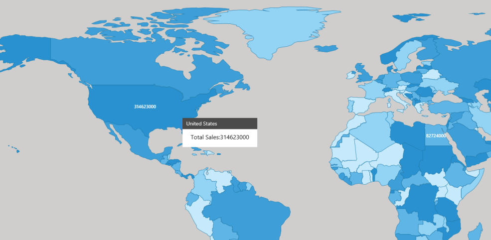

# MapPopup in WPF Maps (SfMap)

MapPopup is a hanging window, displayed when the shape is tapped. It shows additional information from the object bounded with the shape. By default, it takes the property of the bounded object that is referred in the ShapeValuePath and displays its content when the corresponding shape is tapped.

MapPopup is displayed only when [`MapPopupVisibility`](https://help.syncfusion.com/cr/wpf/Syncfusion.UI.Xaml.Maps.ShapeFileLayer.html#Syncfusion_UI_Xaml_Maps_ShapeFileLayer_MapPopupVisibility) set to true in the shape file layer.

It also customizes the MapPopup template. [`PopupCustomTemplate`](https://help.syncfusion.com/cr/wpf/Syncfusion.UI.Xaml.Maps.ShapeFileLayer.html#Syncfusion_UI_Xaml_Maps_ShapeFileLayer_PopupCustomTemplate) is a DataTemplate type API that is used to expose the custom template for the MapPopup.





       <syncfusion:SfMap >
            <syncfusion:SfMap.Layers>
                <syncfusion:ShapeFileLayer TranslateZoomLevel="5"  ShapeIDPath="Name" 
                                           MapPopupVisibility="Visible" Background="#FFCFCECD" 
                                           ShapeIDTableField="NAME"   ItemsSource="{Binding Countries}" 
                                           Uri="DataMarkers.ShapeFiles.world1.shp">
                    <syncfusion:ShapeFileLayer.PopupCustomTemplate>
                        <DataTemplate>
                            <Border>
                                <Grid Width="200">
                                    <Grid.RowDefinitions>
                                        <RowDefinition />
                                        <RowDefinition />
                                        <RowDefinition />
                                    </Grid.RowDefinitions>
                                    <Grid.ColumnDefinitions>
                                        <ColumnDefinition/>
                                    </Grid.ColumnDefinitions>
                                    <Border VerticalAlignment="Center" Padding="10,5,0,0" Height="30" 
                                            Background="#FF4B4A4A"  Grid.ColumnSpan="2">
                                        <TextBlock Foreground="White" FontFamily="Segoe UI" FontSize="14"  
                                                   Text="{Binding Name}"/>
                                    </Border>
                                    <Border Padding="3,10,3,3"  Background="White"  Grid.Row="1" Grid.ColumnSpan="2">
                                        <StackPanel HorizontalAlignment="Center" VerticalAlignment="Center"  
                                                    Height="35" Background="White" Orientation="Horizontal">
                                            <TextBlock  Foreground="Black" FontFamily="Segoe UI"  FontSize="16" 
                                                        Text="Total Sales:" />
                                            <TextBlock Foreground="Black"  FontFamily="Segoe UI" FontSize="16" 
                                                       Text="{Binding Population}"/>
                                        </StackPanel>
                                    </Border>
                                    <Border HorizontalAlignment="Center" Grid.Row="2">
                                        <StackPanel Orientation="Horizontal">
                                            <ItemsControl Background="White" x:Name="ProductName"  
                                                          ItemsSource="{Binding Name}" DisplayMemberPath="Name"/>
                                            <ItemsControl  Background="White"  ItemsSource="{Binding Population}" 
                                                           DisplayMemberPath="Population"/>
                                        </StackPanel>
                                    </Border>
                                </Grid>
                            </Border>
                        </DataTemplate>
                    </syncfusion:ShapeFileLayer.PopupCustomTemplate>

                    <syncfusion:ShapeFileLayer.ShapeSettings>
                        <syncfusion:ShapeSetting  ShapeStroke="#FF1978AA" ShapeValuePath="Population" 
                                                  ColorPalette="CustomPalette" ShapeStrokeThickness="0.5"  >
                            <syncfusion:ShapeSetting.CustomColors>
                                <syncfusion:MapColorPalette FillBrush="#FFC6EAFB"/>
                                <syncfusion:MapColorPalette FillBrush="#FF93D3F4"/>
                                <syncfusion:MapColorPalette FillBrush="#FF5FB5E6"/>
                                <syncfusion:MapColorPalette FillBrush="#FF3E9FD8"/>
                                <syncfusion:MapColorPalette FillBrush="#FF2991CF"/>
                            </syncfusion:ShapeSetting.CustomColors>
                            <syncfusion:ShapeSetting.FillSetting>
                                <syncfusion:ShapeFillSetting AutoFillColors="True"/>
                            </syncfusion:ShapeSetting.FillSetting>
                        </syncfusion:ShapeSetting>
                    </syncfusion:ShapeFileLayer.ShapeSettings>
                </syncfusion:ShapeFileLayer>
            </syncfusion:SfMap.Layers>

        </syncfusion:SfMap >





    public class Country
    {
        private string name;
        public string Name
        {
            get { return name; }
            set { name = value; }
        }

        private double population;

        public double Population
        {
            get { return population; }
            set { population = value; }
        }

    }

    public class ViewModel
    {
        private ObservableCollection<Country> countries;
        public ObservableCollection<Country> Countries
        {
            get { return countries; }
            set { countries = value; }
        }

        public ViewModel()
        {
            Countries = new ObservableCollection<Country>
            {
                new Country { Name = "Russia", Population = 143228300},
                new Country { Name = "China",  Population = 1347350000 },
                new Country { Name = "Australia", Population = 22789701  },
                new Country { Name = "South Africa", Population = 50586757},
                new Country { Name = "United States", Population = 314623000 },
                new Country { Name = "Egypt", Population = 82724000},
            };
        }
    }





