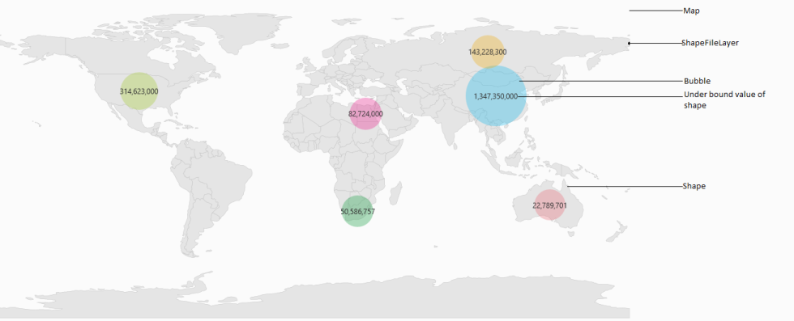
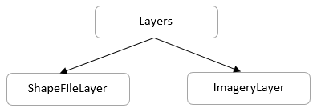

# WPF Maps (SfMap) Overview

A map is a graphical representation of geographical data. It is used to represent the statistical data of a particular geographical area on Earth. By using pan and zoom, the maps can be navigated. Maps supports enhanced data visualization with bubbles and labels. Bubbles visualize the data that is bound to the map.

## Use case scenario

The Maps control can be used in following cases:

1. To visualize weather data.
2. To visualize geographical statistics information.
3. To visualize the density or availability of resources in an area.
4. To visualize political information.
5. To visualize the layout of a building.

## Key Concepts of Map

A map contains a set of elements, including shapes, bubbles, annotations, and data items, that is maintained in layers. ShapeFileLayer is one of the layers that can be used to generate map shapes and bind business objects with them. Bubbles and MapItems enhance the data visualization capabilities of the map with data binding.

Tree map-like support provides rich UI for shapes and bubbles. Annotation and CustomDataBinding items shows additional information on the map.

Maps also provide multilayer support which can be added as a sublayer and shapes such as polygon, polyline, points can be added on it.

Options like zooming, panning, and map selection extend the interactivity of the map.

## Structure of Map

A map is maintained through layers. The shape file layer is one of the layers that consist of vector shapes, bubbles and data visual items. The imagery layer is used to visualize satellite, aerial, street map, or other imagery tiles without using shapefiles.

N> You can refer to our [WPF Map](https://www.syncfusion.com/wpf-controls/map) feature tour page for its groundbreaking feature representations. You can also explore our [WPF Map example](https://github.com/syncfusion/wpf-demos/tree/master/map) to know how to render and configure the map.

