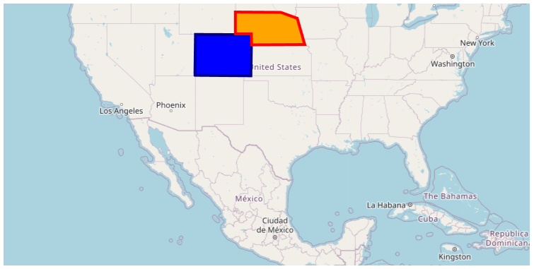
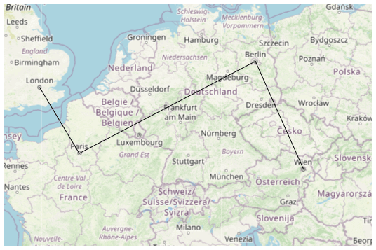
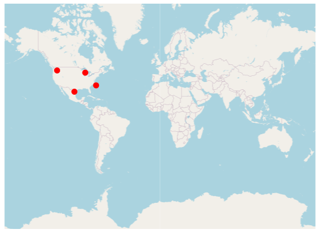

# Shape Types in WPF Maps (SfMaps)

This feature provide supports to draw a polygon, polyline and point icon on the map. We can provide input as the Geo points to draw shapes in two different ways. 

    1.Add shapes using point collection
    2.Add shapes using map elements collection
	

## Add shapes using point collection

We can provide input as the Geo point collection in sample to draw a shape. We can add more number of shapes using [`SubShapeFileLayer`](https://help.syncfusion.com/wpf/maps/multilayer-support#subshapefilelayers) support of Maps. There are three type of shapes available in shape file layer and it can be changed by using [`ShapeType`](https://help.syncfusion.com/cr/wpf/Syncfusion.UI.Xaml.Maps.ShapeFileLayer.html#Syncfusion_UI_Xaml_Maps_ShapeFileLayer_ShapeType) property.

    1.Polyline
    2.Polygon
    3.Point icon
    
### Polygon

Polygon is a two-dimensional surface stored as a sequence of points defining its exterior bounding ring and 0 or more interior rings. Polygons are always simple. Mostly the polygon shape type defines a group of land, water bodies, and other features that have a spatial extent.




       <maps:SfMap x:Name="maps" ZoomLevel="4">
            <maps:SfMap.Layers>
                <maps:ImageryLayer Center="30.9709225,-100.2187212" >
                    <maps:ImageryLayer.SubShapeFileLayers>
                        <maps:SubShapeFileLayer  x:Name="sublayer1" ShapeType="Polygon" Points="{Binding SubLayer1}">
                            <maps:SubShapeFileLayer.ShapeSettings>
                                <maps:ShapeSetting ShapeFill="Blue" ShapeStroke="DarkBlue" 
                                               ShapeStrokeThickness="4" />
                            </maps:SubShapeFileLayer.ShapeSettings>
                        </maps:SubShapeFileLayer>
                        <maps:SubShapeFileLayer  x:Name="sublayer2" ShapeType="Polygon" Points="{Binding SubLayer2}">
                            <maps:SubShapeFileLayer.ShapeSettings>
                                <maps:ShapeSetting ShapeFill="Orange" ShapeStroke="Red"
                                               ShapeStrokeThickness="4" />
                            </maps:SubShapeFileLayer.ShapeSettings>
                        </maps:SubShapeFileLayer>
                    </maps:ImageryLayer.SubShapeFileLayers>
                </maps:ImageryLayer>
            </maps:SfMap.Layers>
        </maps:SfMap>





    public partial class MainPage : ContentPage
    {
        ViewModel obj = new ViewModel();
        public MainPage()
        {
            InitializeComponent();
            this.DataContext = obj;
            SfMap maps = new SfMap();
            maps.ZoomLevel = 4;
            ImageryLayer layer = new ImageryLayer();
            layer.Center = new Point(30.9709225, -100.2187212);
            SubShapeFileLayer subLayer1 = new SubShapeFileLayer();
            subLayer1.ShapeType = ShapeType.Polygon;
            subLayer1.Points = obj.SubLayer1;
            layer.SubShapeFileLayers.Add(subLayer1);
            SubShapeFileLayer subLayer2 = new SubShapeFileLayer();
            subLayer2.ShapeType = ShapeType.Polygon;
            subLayer1.Points = obj.SubLayer2;
            layer.SubShapeFileLayers.Add(subLayer2);
            ShapeSetting subLayerSetting1 = new ShapeSetting();
            subLayerSetting1.ShapeStrokeThickness = 4;
            subLayerSetting1.ShapeFill = new SolidColorBrush(Colors.Blue);
            subLayerSetting1.ShapeStroke = new SolidColorBrush(Colors.DarkBlue);
            subLayer1.ShapeSettings = subLayerSetting1;
            ShapeSetting subLayerSetting2 = new ShapeSetting();
            subLayerSetting2.ShapeStrokeThickness = 4;
            subLayerSetting2.ShapeFill = new SolidColorBrush(Colors.Orange);
            subLayerSetting2.ShapeStroke = new SolidColorBrush(Colors.Red);
            subLayer2.ShapeSettings = subLayerSetting2;
            subLayer1.Points = obj.SubLayer1;
            subLayer2.Points = obj.SubLayer2;
            maps.Layers.Add(layer);
            this.Content = maps;
        }
    }

    public class ViewModel
    {
         public ObservableCollection<Point> SubLayer1
        {
            get;set;
        }

        public ObservableCollection<Point> SubLayer2
        {
            get; set;
        }
        public ViewModel()
        {

            SubLayer1 = new ObservableCollection<Point>()
            {
                new Point(37.042972,-109.085003),
                new Point(40.992567,-109.021030),
                new Point(40.968420,-102.048065),
                new Point(36.991893,-102.144024),
                new Point(37.042972,-109.085003)
            };
            SubLayer2 = new ObservableCollection<Point>()
            {
              new Point(41.04621681452063, -104.0625),
              new Point(41.04621681452063, -102.0849609375),
              new Point(40.01078714046552, -102.041015625),
              new Point(40.04443758460856, -95.44921875),
              new Point(42.48830197960227, -96.3720703125),
              new Point(43.03677585761058, -98.4375),
              new Point(43.068887774169625, -104.0625),
              new Point(41.04621681452063, -104.0625),
            };
        }
    }




### Polyline

The polyline is a shape that has a dimension of 1. It is called a simple line if it does not intersect itself. The polylines are often used to define linear features such as roads, rivers, and power lines. 




    <Grid>
        <Grid.DataContext>
            <local:ViewModel/>
        </Grid.DataContext>
        <maps:SfMap x:Name="Maps" >
            <maps:SfMap.Layers>
                <maps:ImageryLayer  x:Name="layer">
                    <maps:ImageryLayer.SubShapeFileLayers>
                        <maps:SubShapeFileLayer x:Name="subLayer" ShapeType="Polyline"  Markers="{Binding Models}">
                            <maps:SubShapeFileLayer.Points>
                                <Point>
                                    <Point.X>39.6737</Point.X>
                                    <Point.Y>-100.5</Point.Y>
                                </Point>
                                <Point>
                                    <Point.X>61.35</Point.X>
                                    <Point.Y>18.131</Point.Y>
                                </Point>
                                <Point>
                                    <Point.X>-32.259</Point.X>
                                    <Point.Y>145.4214</Point.Y>
                                </Point>

                            </maps:SubShapeFileLayer.Points>
                            <maps:SubShapeFileLayer.ShapeSettings>
                                <maps:ShapeSetting x:Name="settings" ShapeFill="Gray" ShapeStrokeThickness="2"/>
                            </maps:SubShapeFileLayer.ShapeSettings>
                        </maps:SubShapeFileLayer>
                    </maps:ImageryLayer.SubShapeFileLayers>
                </maps:ImageryLayer>
            </maps:SfMap.Layers>
        </maps:SfMap>
    </Grid>        





    public partial class MyPage : ContentPage
    {
        ViewModel obj = new ViewModel();
        public MyPage()
        {
            InitializeComponent();
            this.DataContext = obj;
            SfMap maps = new SfMap();
            ImageryLayer layer = new ImageryLayer();
            SubShapeFileLayer subLayer = new SubShapeFileLayer();
            subLayer.Points.Add(new Point(39.6737, -100.5));
            subLayer.Points.Add(new Point(61.35, 18.131));
            subLayer.Points.Add(new Point(-32.259, 145.4214));
            subLayer.ShapeType = ShapeType.Polyline;
            subLayer.Markers = obj.Models;
            ShapeSetting subLayerSetting = new ShapeSetting();
            subLayerSetting.ShapeStrokeThickness = 2;
            subLayerSetting.ShapeFill = new SolidColorBrush(Colors.Gray);
            subLayer.ShapeSettings = subLayerSetting;
            layer.SubShapeFileLayers.Add(subLayer);
            maps.Layers.Add(layer);
            this.Content = maps;
        }
    }
    
    public class ViewModel
    {
        public ObservableCollection<Model> Models { get; set; }
        public ViewModel()
        {
            this.Models = new ObservableCollection<Model>();
            this.Models.Add(new Model() { Label = "USA ", Latitude = "39.6737", Longitude = "-100.5" });
            this.Models.Add(new Model() { Label = "Swedan ", Latitude = "61.35", Longitude = "18.131" });
            this.Models.Add(new Model() { Label = "Australia ", Latitude = "-32.259", Longitude = "145.4214" });
        }
    }

    public class Model
    {
        public string Label { get; set; }
        public string Longitude { get; set; }
        public string Latitude { get; set; }
    }




### Point icon

A point icon is shape with a dimension of 0 that occupies a single location in coordinate space. A point icon has a single x, y coordinate value. The point icons are often used to define features such as oil wells, landmarks, and elevations.




             <maps:SfMap x:Name="Maps" >
            <maps:SfMap.Layers>
                <maps:ImageryLayer  x:Name="layer">
                    <maps:ImageryLayer.SubShapeFileLayers>
                        <maps:SubShapeFileLayer x:Name="subLayer" MapPointIconSize="10" ShapeType="PointIcon">
                            <maps:SubShapeFileLayer.Points>
                                <Point>
                                    <Point.X>48.95</Point.X>
                                    <Point.Y>-122.68</Point.Y>
                                </Point>
                                <Point>
                                    <Point.X>30.197</Point.X>
                                    <Point.Y>-102.6564</Point.Y>
                                </Point>
                                <Point>
                                    <Point.X>36.3305</Point.X>
                                    <Point.Y>-77.5437</Point.Y>
                                </Point>
                                <Point>
                                    <Point.X>47.2331</Point.X>
                                    <Point.Y>-90.140212</Point.Y>
                                </Point>
                            </maps:SubShapeFileLayer.Points>
                            <maps:ShapeFileLayer.ShapeSettings>
                                <maps:ShapeSetting ShapeFill="Red" ShapeStroke="Red"/>
                            </maps:ShapeFileLayer.ShapeSettings>
                        </maps:SubShapeFileLayer>
                    </maps:ImageryLayer.SubShapeFileLayers>
                </maps:ImageryLayer>
            </maps:SfMap.Layers>
        </maps:SfMap>





    public partial class MyPage : ContentPage
    {
        ViewModel obj = new ViewModel();
        public MyPage()
        {
            InitializeComponent();
            this.DataContext = obj;
            SfMap maps = new SfMap();
            ImageryLayer layer = new ImageryLayer();
            SubShapeFileLayer subLayer = new SubShapeFileLayer();
            subLayer.Points.Add(new Point(48.95, -122.68));
            subLayer.Points.Add(new Point(30.197, -102.6564));
            subLayer.Points.Add(new Point(36.3305, -77.5437));
            subLayer.Points.Add(new Point(47.2331, -90.140212));
            subLayer.MapPointIconSize = 10;
            subLayer.ShapeType = ShapeType.PointIcon;
            ShapeSetting subLayerSetting = new ShapeSetting();
            subLayerSetting.ShapeFill = new SolidColorBrush(Colors.Red);
            subLayerSetting.ShapeStroke = new SolidColorBrush(Colors.Red);
            subLayer.ShapeSettings = subLayerSetting;
            layer.SubShapeFileLayers.Add(subLayer);
            maps.Layers.Add(layer);
            this.Content = maps;
       }
    }




### Customization of points

The size, shape, and position of the map points can be customized using the [`MapPointIconSize`](https://help.syncfusion.com/cr/wpf/Syncfusion.UI.Xaml.Maps.ShapeFileLayer.html#Syncfusion_UI_Xaml_Maps_ShapeFileLayer_MapPointIconSize) , [`MapPointIcon`](https://help.syncfusion.com/cr/wpf/Syncfusion.UI.Xaml.Maps.ShapeFileLayer.html#Syncfusion_UI_Xaml_Maps_ShapeFileLayer_MapPointIcon) , [`MapPointHorizontalAlignment`](https://help.syncfusion.com/cr/wpf/Syncfusion.UI.Xaml.Maps.ShapeFileLayer.html#Syncfusion_UI_Xaml_Maps_ShapeFileLayer_MapPointHorizontalAlignment) and [`MapPointVerticalAlignment`](https://help.syncfusion.com/cr/wpf/Syncfusion.UI.Xaml.Maps.ShapeFileLayer.html#Syncfusion_UI_Xaml_Maps_ShapeFileLayer_MapPointVerticalAlignment) properties of shape file layer.

## Add shapes using map elements collection

We can provide input as the Geo points collection in sample to draw a multiple shapes in single layer. We can add more number of shapes using MapElements property in layer. There are three type of shapes available in map element.

    1.Polyline
    2.Polygon
    3.Circle




              <maps:SfMap x:Name="Maps" >
            <maps:SfMap.Layers>
                <maps:ImageryLayer  x:Name="layer">
                    <maps:ImageryLayer.SubShapeFileLayers>
                        <maps:SubShapeFileLayer x:Name="subLayer" Markers="{Binding Models}">
                            <maps:SubShapeFileLayer.MapElements>                               

                                <maps:MapPolyline Stroke="Black">
                                    <maps:MapPolyline.Points>
                                        <Point>
                                            <Point.X>61.35</Point.X>
                                            <Point.Y>18.131</Point.Y>
                                        </Point>
                                        <Point>
                                            <Point.X>-32.259</Point.X>
                                            <Point.Y>145.4214</Point.Y>
                                        </Point>
                                    </maps:MapPolyline.Points>
                                </maps:MapPolyline>

                                <maps:MapCircle Fill="Red">
                                    <maps:MapCircle.Center>
                                        <Point>
                                            <Point.X>48.95</Point.X>
                                            <Point.Y>-122.68</Point.Y>
                                        </Point>
                                    </maps:MapCircle.Center>
                                </maps:MapCircle>

                                <maps:MapCircle Fill="Red">
                                    <maps:MapCircle.Center>
                                        <Point>
                                            <Point.X>30.197</Point.X>
                                            <Point.Y>-102.6564</Point.Y>
                                        </Point>
                                    </maps:MapCircle.Center>
                                </maps:MapCircle>

                                <maps:MapCircle Fill="Red">
                                    <maps:MapCircle.Center>
                                        <Point>
                                    <Point.X>36.3305</Point.X>
                                    <Point.Y>-77.5437</Point.Y>
                                </Point>
                                    </maps:MapCircle.Center>
                                </maps:MapCircle>

                            </maps:SubShapeFileLayer.MapElements>
                        </maps:SubShapeFileLayer>
                    </maps:ImageryLayer.SubShapeFileLayers>
                </maps:ImageryLayer>
            </maps:SfMap.Layers>
        </maps:SfMap>





    public partial class MyPage : ContentPage
    {
        ViewModel obj = new ViewModel();
        public MyPage()
        {
            InitializeComponent();
            this.DataContext = obj;
            SfMap maps = new SfMap();
            ImageryLayer layer = new ImageryLayer();
            SubShapeFileLayer subLayer = new SubShapeFileLayer();
            subLayer.Markers = obj.Models;

            MapPolyline mapPolyline = new MapPolyline();
            mapPolyline.Stroke = new SolidColorBrush(Colors.Black);
            mapPolyline.Points = new ObservableCollection<Point>()
            {
                new Point(61.35, 18.131),
                new Point(-32.259, 145.4214)
            };
            subLayer.MapElements.Add(mapPolyline);

            MapCircle mapCircle = new MapCircle();
            mapCircle.Center = new Point(48.95, -122.68);
            mapCircle.Fill = new SolidColorBrush(Colors.Red);
            subLayer.MapElements.Add(mapCircle);

            mapCircle = new MapCircle();
            mapCircle.Center = new Point(30.197, -102.6564);
            mapCircle.Fill = new SolidColorBrush(Colors.Red);
            subLayer.MapElements.Add(mapCircle);

            mapCircle = new MapCircle();
            mapCircle.Center = new Point(36.3305, -77.5437);
            mapCircle.Fill = new SolidColorBrush(Colors.Red);
            subLayer.MapElements.Add(mapCircle);

            layer.SubShapeFileLayers.Add(subLayer);
            maps.Layers.Add(layer);
            this.Content = maps;
       }
    }

    public class ViewModel
    {
        public ObservableCollection<Model> Models { get; set; }
        public ViewModel()
        {
            this.Models = new ObservableCollection<Model>();
            this.Models.Add(new Model() { Label = "Swedan ", Latitude = "61.35", Longitude = "18.131" });
            this.Models.Add(new Model() { Label = "Australia ", Latitude = "-32.259", Longitude = "145.4214" });
        }
    }

    public class Model
    {
        public string Label { get; set; }
        public string Longitude { get; set; }
        public string Latitude { get; set; }
    }




### Customization of map elements

The following properties are used to customize `MapPolygon`, `MapPolyline` and `MapCircle`.

<table>
<tr>
<th>
Property</th><th>
Type</th><th>
Description</th></tr>
<tr>
<td>
`Fill` </td><td>
Brush</td><td>
Gets or sets the color used to fill the shape.</td></tr>
<tr>
<td>
Stroke</td><td>
Brush</td><td>
Gets or sets the color used to draw the shape stroke.</td></tr>
<tr>
<td>
StrokeThickness</td><td>
Double</td><td>
Gets or sets the width of the stroke line used to draw the shapes, in logical pixels.</td></tr>
<tr>
<td>
Center</td><td>
Point</td><td>
Gets or sets the point object that defines the center of the circle, in latitude and longitude. This property only for <b>MapCircle</b>. </td></tr>
<tr>
<td>
Radius</td><td>
Double</td><td>
Gets or sets the value that defines the radius of the circle. This property only for <b>MapCircle</b>.</td></tr>
</table>