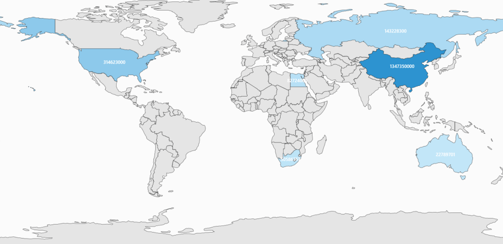

# Shapes Color Customization

Maps highly support the customization of the shape’s color. The shape’s color can be customized by using the following methods:

1. Using the ShapeFill, ShapeStroke and ShapeStrokeThickness properties.
2. Using tree map-like support.
3. Using the color palette.

The important property that makes an impact on shape colors is AutoFillColors. This is a Boolean type property. This property is available in the FillSetting. The use of this property is explained in the following sections.

## Properties

The below mentioned properties are available in the ShapesSetting property of the ShapeFileLayer. ShapeSetting defines the basic customization settings of shapes in the map. 

### ShapeFill

[`ShapeFill`](https://help.syncfusion.com/cr/wpf/Syncfusion.SfMaps.WPF~Syncfusion.UI.Xaml.Maps.ShapeSetting~ShapeFill.html) is a Brush type property that sets the fill color of the shapes in the map.

### ShapeStroke

[`ShapeStroke`](https://help.syncfusion.com/cr/wpf/Syncfusion.SfMaps.WPF~Syncfusion.UI.Xaml.Maps.ShapeSetting~ShapeStroke.html) is also a brush type property that sets the border color of the shape in the map.

### ShapeStrokeThickness

[`ShapeStrokeThickness`](https://help.syncfusion.com/cr/wpf/Syncfusion.SfMaps.WPF~Syncfusion.UI.Xaml.Maps.ShapeSetting~ShapeStrokeThickness.html) is a double type property that sets the border thickness of the shape in the map.

These setting works only when “AutoFillColor” is set as false.



<syncfusion:SfMap>
            <syncfusion:SfMap.Layers>
                <syncfusion:ShapeFileLayer Uri="DataMarkers.ShapeFiles.usa_state.shp">
                    <syncfusion:ShapeFileLayer.ShapeSettings>
                        <syncfusion:ShapeSetting ShapeFill="Gray" ShapeStroke="Black" ShapeStrokeThickness="1">
                            <syncfusion:ShapeSetting.FillSetting>
                                <syncfusion:ShapeFillSetting AutoFillColors="False"/>
                            </syncfusion:ShapeSetting.FillSetting>
                        </syncfusion:ShapeSetting>
                    </syncfusion:ShapeFileLayer.ShapeSettings>
                </syncfusion:ShapeFileLayer>
            </syncfusion:SfMap.Layers>
        </syncfusion:SfMap >



## Tree map-like support

ShapeFill is set based on the under-bound values of the shape. This provides a tree map-like impact on the map UI. The RangeColorMapping property provides a tree map-like fill for the shapes.

## Range Color Mapping

Range color mapping is one of the features used to differentiate the shape’s fill based on its under-bound value and color ranges. Range color mapping contains the following properties:

Property Table

<table>
<tr>
<th>
Property</th><th>
Type</th><th>
Description</th></tr>
<tr>
<td>
From </td><td>
Double</td><td>
Gets or sets the From value of ColorValuePath</td></tr>
<tr>
<td>
To</td><td>
Double</td><td>
Gets or sets the To value of ColorValuePath</td></tr>
<tr>
<td>
Color</td><td>
Color</td><td>
Gets or sets the color values for the given range based on the From and To .</td></tr>
</table>

The fill color of a particular bubble fill is determined by its under-bound value and color range. To provide a Tree Map like impact on the map, the data binding should work properly. For example, consider the following color ranges.





      <syncfusion:SfMap>
            <syncfusion:SfMap.Layers>
                <syncfusion:ShapeFileLayer ItemsSource="{Binding Countries}" 
                                           Uri="DataMarkers.ShapeFiles.world1.shp" 
                                           ShapeIDPath="Name" ShapeIDTableField="NAME">
                    <syncfusion:ShapeFileLayer.ShapeSettings >
                        <syncfusion:ShapeSetting ShapeFill="#E5E5E5" ShapeStroke="Black" 
                                                 ShapeStrokeThickness="1" ShapeColorValuePath="Population" 
                                                 ShapeValuePath="Population">
                            <syncfusion:ShapeSetting.FillSetting>
                                <syncfusion:ShapeFillSetting AutoFillColors="False">
                                    <syncfusion:ShapeFillSetting.ColorMappings>
                                        <syncfusion:RangeColorMapping To="1500000000" From="750000000" Color="#2A91CF"/>
                                        <syncfusion:RangeColorMapping To="750000000" From="0" Color="#3D9FD8"/>
                                        <syncfusion:RangeColorMapping To="0" From="0" Color="#C7E9FA"/>
                                    </syncfusion:ShapeFillSetting.ColorMappings>
                                </syncfusion:ShapeFillSetting>
                            </syncfusion:ShapeSetting.FillSetting>
                        </syncfusion:ShapeSetting>
                    </syncfusion:ShapeFileLayer.ShapeSettings>
                </syncfusion:ShapeFileLayer>
            </syncfusion:SfMap.Layers>
        </syncfusion:SfMap >





    public class Country
    {
        private string name;
        public string Name
        {
            get { return name; }
            set { name = value; }
        }

        private double population;

        public double Population
        {
            get { return population; }
            set { population = value; }
        }

    }

    public class ViewModel
    {
        private ObservableCollection<Country> countries;
        public ObservableCollection<Country> Countries
        {
            get { return countries; }
            set { countries = value; }
        }

        public ViewModel()
        {
            Countries = new ObservableCollection<Country>
            {
                new Country { Name = "Russia", Population = 143228300},
                new Country { Name = "China",  Population = 1347350000 },
                new Country { Name = "Australia", Population = 22789701  },
                new Country { Name = "South Africa", Population = 50586757},
                new Country { Name = "United States", Population = 314623000 },
                new Country { Name = "Egypt", Population = 82724000},
            };
        }
    }





When under-bound object value is 750000000, then the fill color of the corresponding bubble is set to #3D9FD8. As mentioned earlier, the under-bound value of the bubble is set through the ShapeValuePath in the ShapeSetting.

When the under-bound value is under any of the given sorted range or above the sorted range, then the fill is set to Black.

AutoFillColor must be set to false to enable the range color mapping.

N> The shape’s under-bound object value must have numeric property and should be mentioned in ShapeValuePath to work on this. The color between the given ranges is applied only to the shapes that have a proper under-bound values. The color for other shapes is the ShapeFill’s color.

## ColorPalette

[`ColorPalette`](https://help.syncfusion.com/cr/wpf/Syncfusion.SfMaps.WPF~Syncfusion.UI.Xaml.Maps.ShapeSetting~ColorPalette.html) is a set of colors that are applied on the shapes. Map contains two built-in color palettes. They are: 

1. Metro 
2. CoolBlue 

ColorPalette has to be set in the ShapeSetting’s ColorPalette property. ColorPalette is the enum property that accepts Metro, CoolBlue and CustomPalette.



       <syncfusion:SfMap>
            <syncfusion:SfMap.Layers>
                <syncfusion:ShapeFileLayer Uri="DataMarkers.ShapeFiles.usa_state.shp">
                    <syncfusion:ShapeFileLayer.ShapeSettings>
                        <syncfusion:ShapeSetting ColorPalette="Metro">
                            <syncfusion:ShapeSetting.FillSetting>
                                <syncfusion:ShapeFillSetting AutoFillColors="True"/>
                            </syncfusion:ShapeSetting.FillSetting>
                        </syncfusion:ShapeSetting>
                    </syncfusion:ShapeFileLayer.ShapeSettings>
                </syncfusion:ShapeFileLayer>
            </syncfusion:SfMap.Layers>
        </syncfusion:SfMap>



## CustomColorPalette

Besides the built-in the color palettes, the custom colors can be defined for the color palette. The custom colors are defined in the “CustomColors” in “ShapeSetting.” CustomColors is the collection property that accepts the “MapColorPalette.” To apply the custom colors, “ColorPalette” must be set to “CustomPalette” and CustomColors should be defined.

MapColorPalette contains a property named “FillBrush”. This property sets the fill color of the shape when custom palette is set.



       <syncfusion:SfMap>
            <syncfusion:SfMap.Layers>
                <syncfusion:ShapeFileLayer Uri="DataMarkers.ShapeFiles.usa_state.shp">
                    <syncfusion:ShapeFileLayer.ShapeSettings>
                        <syncfusion:ShapeSetting ColorPalette="CustomPalette">
                            <syncfusion:ShapeSetting.CustomColors>
                                <syncfusion:MapColorPalette FillBrush="Gray"/>
                                <syncfusion:MapColorPalette FillBrush="Gold"/>
                                <syncfusion:MapColorPalette FillBrush="LightBlue"/>
                                <syncfusion:MapColorPalette FillBrush="LightCyan"/>
                            </syncfusion:ShapeSetting.CustomColors>
                            <syncfusion:ShapeSetting.FillSetting>
                                <syncfusion:ShapeFillSetting AutoFillColors="True"/>
                            </syncfusion:ShapeSetting.FillSetting>
                        </syncfusion:ShapeSetting>
                    </syncfusion:ShapeFileLayer.ShapeSettings>
                </syncfusion:ShapeFileLayer>
            </syncfusion:SfMap.Layers>
        </syncfusion:SfMap >



