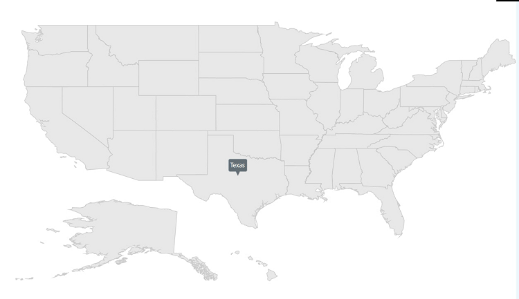
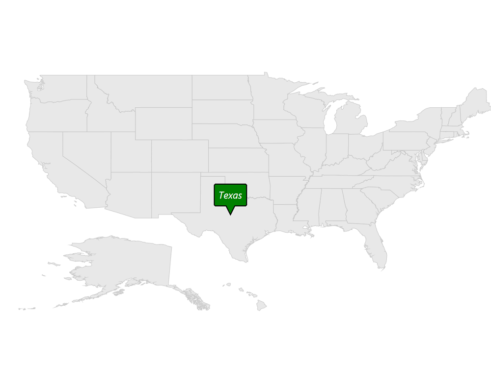
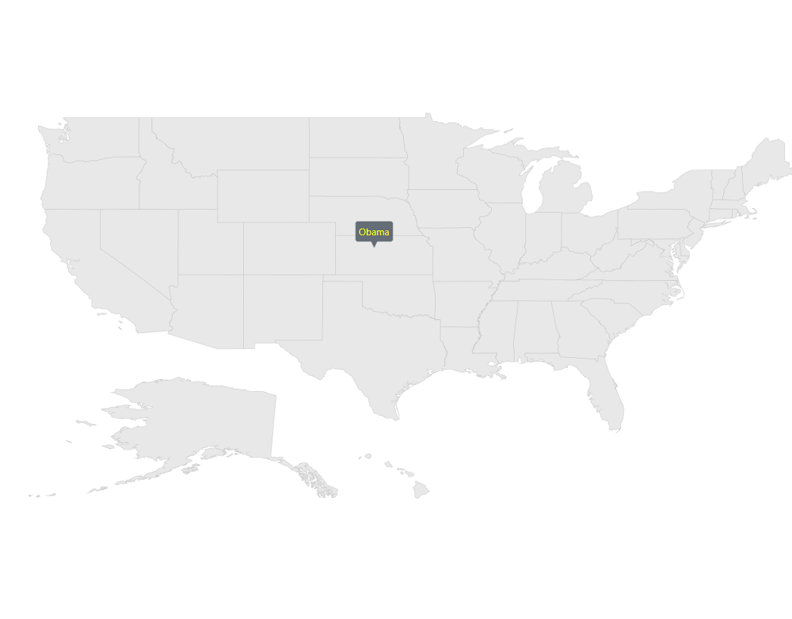
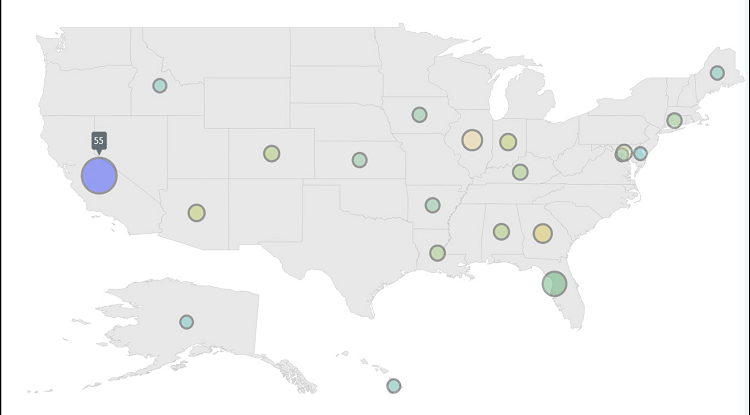
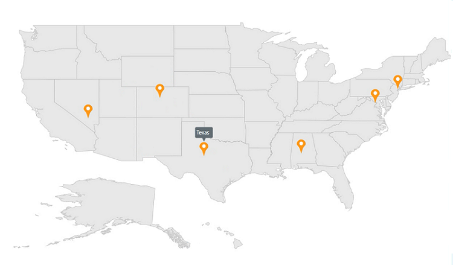
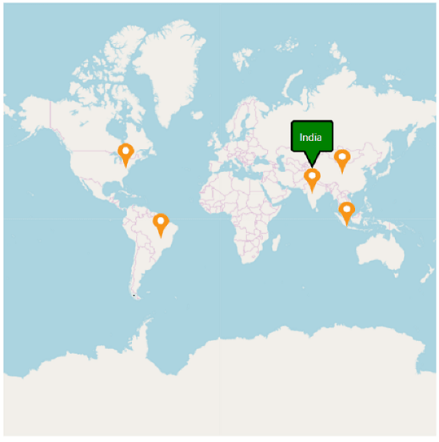

# Tooltip support for SfMaps control

Tooltip provides additional information about the shapes in the maps. To enable tooltip, set the `ShowTooltip` property to true, and set the ValuePath property of tooltip.

Tooltip is displayed by tapping the following elements:
• Shapes
• Bubbles
• Markers

## Enable the tooltip by tapping the shapes in shapeFileLayer





          <maps:SfMap>
            <maps:SfMap.Layers>               
               <maps:ShapeFileLayer Uri="MapsZoom.ShapeFiles.usa_state.shp" ItemsSource="{Binding Data}" ShapeIDPath="State" ShapeIDTableField="STATE_NAME" EnableSelection="False" LabelPath="State">
                  <maps:ShapeFileLayer.ShapeSettings>
                        <maps:ShapeSetting   ShapeStrokeThickness="1" ></maps:ShapeSetting>
                    </maps:ShapeFileLayer.ShapeSettings>
                    <maps:ShapeFileLayer.ToolTipSettings>
                        <maps:ToolTipSetting ValuePath="Candidate" x:Name="shapeTooltipSettings" >
                        </maps:ToolTipSetting>
                    </maps:ShapeFileLayer.ToolTipSettings>
                    <maps:ShapeFileLayer.ItemsTemplate>
                        <DataTemplate>
                            <Border >
                                <TextBlock FontFamily="Segoe UI" FontSize="12" Foreground="#FF333333" Text=""/>
                            </Border>
                        </DataTemplate>
                    </maps:ShapeFileLayer.ItemsTemplate>
                </maps:ShapeFileLayer>
	       </maps:SfMap.Layers>
        </maps:SfMap>





     public class ElectionData
    {
        public ElectionData(string state, string candidate, int electors)
        {
            State = state;
            Candidate = candidate;
            Electors = electors;
        }

        public string State
        {
            get;
            set;
        }

        public string Candidate
        {
            get;
            set;
        }

        public int Electors
        {
            get;
            set;
        }
    }
	
	 public class ViewModel
    { 
        public ObservableCollection<ElectionData> Data { get; set; }
        public ViewModel()
        {
            Data = new ObservableCollection<ElectionData>();
            Data.Add(new ElectionData("Alabama", "Romney", 9));
            Data.Add(new ElectionData("Alaska", "Romney", 3));
            Data.Add(new ElectionData("Arizona", "Romney", 11));
            Data.Add(new ElectionData("Arkansas", "Romney", 6));
            Data.Add(new ElectionData("California", "Romney", 55));
            Data.Add(new ElectionData("Colorado", "Obama", 9));
            Data.Add(new ElectionData("Connecticut", "Obama", 7));
            Data.Add(new ElectionData("Delaware", "Obama", 3));
            Data.Add(new ElectionData("District of Columbia", "Obama", 3));
            Data.Add(new ElectionData("Florida", "Obama", 29));
            Data.Add(new ElectionData("Georgia", "Obama", 16));
            Data.Add(new ElectionData("Hawaii", "Romney", 4));
            Data.Add(new ElectionData("Idaho", "Obama", 4));
            Data.Add(new ElectionData("Illinois", "Romney", 20));
            Data.Add(new ElectionData("Indiana", "Obama", 11));
            Data.Add(new ElectionData("Iowa", "Romney", 6));
            Data.Add(new ElectionData("Kansas", "Obama", 6));
            Data.Add(new ElectionData("Kentucky", "Romney", 8));
            Data.Add(new ElectionData("Louisiana", "Romney", 8));
            Data.Add(new ElectionData("Maine", "Romney", 4));
            Data.Add(new ElectionData("Maryland", "Obama", 10));
        }
    }





### Tooltip customization

The appearance of the tooltip can be customized using the following properties:

[`Foreground`](https://help.syncfusion.com/cr/wpf/Syncfusion.UI.Xaml.Maps.ToolTipSetting.html#Syncfusion_UI_Xaml_Maps_ToolTipSetting_Foreground) : Customizes the text color of tooltip.
[`Background`](https://help.syncfusion.com/cr/wpf/Syncfusion.UI.Xaml.Maps.ToolTipSetting.html#Syncfusion_UI_Xaml_Maps_ToolTipSetting_Background) : Customizes the background color of tooltip.
[`Stroke`](https://help.syncfusion.com/cr/wpf/Syncfusion.UI.Xaml.Maps.ToolTipSetting.html#Syncfusion_UI_Xaml_Maps_ToolTipSetting_Stroke) : Customizes the stroke color of tooltip.
[`StrokeThickness`](https://help.syncfusion.com/cr/wpf/Syncfusion.UI.Xaml.Maps.ToolTipSetting.html#Syncfusion_UI_Xaml_Maps_ToolTipSetting_StrokeThickness) : Customizes the stroke width of tooltip.
[`ShowDuration`](https://help.syncfusion.com/cr/wpf/Syncfusion.UI.Xaml.Maps.ToolTipSetting.html#Syncfusion_UI_Xaml_Maps_ToolTipSetting_ShowDuration) : Specifies the duration of tooltip to be displayed.
[`Margin`](https://help.syncfusion.com/cr/wpf/Syncfusion.UI.Xaml.Maps.ToolTipSetting.html#Syncfusion_UI_Xaml_Maps_ToolTipSetting_Margin) : Sets the margin for tooltip.
[`FontFamily`](https://help.syncfusion.com/cr/wpf/Syncfusion.UI.Xaml.Maps.ToolTipSetting.html#Syncfusion_UI_Xaml_Maps_ToolTipSetting_FontFamily) : Customizes the text font family of tooltip.
[`FontStyle`](https://help.syncfusion.com/cr/wpf/Syncfusion.UI.Xaml.Maps.ToolTipSetting.html#Syncfusion_UI_Xaml_Maps_ToolTipSetting_FontStyle) : Customizes the font style of tooltip text.
[`FontSize`](https://help.syncfusion.com/cr/wpf/Syncfusion.UI.Xaml.Maps.ToolTipSetting.html#Syncfusion_UI_Xaml_Maps_ToolTipSetting_FontSize) : Customizes the font size of tooltip text.
[`PointerLength`](https://help.syncfusion.com/cr/wpf/Syncfusion.UI.Xaml.Maps.ToolTipSetting.html#Syncfusion_UI_Xaml_Maps_ToolTipSetting_PointerLength) : Customizes the tooltip pointer length.

The following code sample shows all the above customizations.





     <maps:ShapeFileLayer.ToolTipSettings>
         <maps:ToolTipSetting ValuePath="State" PointerLength="18" FontFamily="Segoe UI" FontStyle="Italic" FontSize="20" Foreground="White" Margin="10" Background="Green"  Stroke="Black" StrokeThickness="2" ShowDuration="2000" />
     </maps:ShapeFileLayer.ToolTipSettings>





            shapeFileLayer.ToolTipSettings.Background = new SolidColorBrush(Colors.White);
            shapeFileLayer.ToolTipSettings.Background = new SolidColorBrush(Colors.Green);
            shapeFileLayer.ToolTipSettings.Stroke = new SolidColorBrush(Colors.Black);
            shapeFileLayer.ToolTipSettings.StrokeThickness = 2;
            shapeFileLayer.ToolTipSettings.Margin = new Thickness(10);
            shapeFileLayer.ToolTipSettings.ShowDuration = 2000;
            shapeFileLayer.ToolTipSettings.FontSize = 20;
            shapeFileLayer.ToolTipSettings.FontStyle = FontStyles.Italic;
            shapeFileLayer.ToolTipSettings.FontFamily = new FontFamily("Segoe UI");
			shapeFileLayer.ToolTipSettings.PointerLength = 18;





N> Similarly we can customize the bubble and marker tooltip also.

### Custom template for tooltip

The maps control provides options to design your own template for tooltip using the TooltipTemplate property.





        <Grid x:Name="grid">
            <Grid.Resources>
                <DataTemplate x:Key="toolTipTemplate">
                    <TextBlock Foreground="Yellow" Text="{Binding Data.Candidate}"/>
                </DataTemplate>
            </Grid.Resources>
			
            <maps:ShapeFileLayer.ToolTipSettings>
                <maps:ToolTipSetting ShowDuration="3000" ToolTipTemplate="{StaticResource ResourceKey=toolTipTemplate}"/>
            </maps:ShapeFileLayer.ToolTipSettings>
	    </Grid>





            ToolTipSetting toolTipSetting = new ToolTipSetting();
            toolTipSetting.ShowDuration = 3000;
            DataTemplate template = this.grid.Resources["toolTipTemplate"] as DataTemplate;
            toolTipSetting.ToolTipTemplate = template;
            shapeFile.ToolTipSettings = toolTipSetting;





## Enable tooltip by tapping the Bubbles in shapeFileLayer





       <maps:SfMap x:Name="map">
            <maps:SfMap.Layers>
                <maps:ShapeFileLayer Uri="MapsZoom.ShapeFiles.usa_state.shp" ItemsSource="{Binding Data}" ShapeIDPath="State" ShapeIDTableField="STATE_NAME" EnableSelection="False" LabelPath="State">
                    <maps:ShapeFileLayer.ItemsTemplate>
                        <DataTemplate>
                            <Border >
                                <TextBlock FontFamily="Segoe UI" FontSize="12" Foreground="#FF333333"  Text=""/>
                            </Border>
                        </DataTemplate>
                    </maps:ShapeFileLayer.ItemsTemplate>

                    <maps:ShapeFileLayer.BubbleMarkerSetting>
                        <maps:BubbleMarkerSetting  MinSize="20" MaxSize="50" ValuePath="Electors"  ColorValuePath="Electors" Stroke="Black" StrokeThickness="3">
                            <maps:BubbleMarkerSetting.ToolTipSettings >
                                <maps:ToolTipSetting  ValuePath="Electors">
                                </maps:ToolTipSetting>
                            </maps:BubbleMarkerSetting.ToolTipSettings>
                            <maps:BubbleMarkerSetting.ColorMappings>
                                <maps:RangeColorMapping Color="#7F20BCEE" To="0" From="10"/>
                                <maps:RangeColorMapping Color="#7FA7CE38" To="10" From="20"/>
                                <maps:RangeColorMapping Color="#7FF1B21A" To="20" From="30"/>
                                <maps:RangeColorMapping Color="#7F1DA249" To="30" From="40"/>
                                <maps:RangeColorMapping Color="#7FEB737C" To="40" From="50"/>
                                <maps:RangeColorMapping Color="#7FED2D95" To="50" From="60"/>
                            </maps:BubbleMarkerSetting.ColorMappings>
                        </maps:BubbleMarkerSetting>
                    </maps:ShapeFileLayer.BubbleMarkerSetting>
                </maps:ShapeFileLayer>
            </maps:SfMap.Layers>
        </maps:SfMap>





     public class ElectionData
    {
        public ElectionData(string state, string candidate, int electors)
        {
            State = state;
            Candidate = candidate;
            Electors = electors;
        }

        public string State
        {
            get;
            set;
        }

        public string Candidate
        {
            get;
            set;
        }

        public int Electors
        {
            get;
            set;
        }
    }
	
	 public class ViewModel
    { 
        public ObservableCollection<ElectionData> Data { get; set; }
        public ViewModel()
        {
            Data = new ObservableCollection<ElectionData>();
            Data.Add(new ElectionData("Alabama", "Romney", 9));
            Data.Add(new ElectionData("Alaska", "Romney", 3));
            Data.Add(new ElectionData("Arizona", "Romney", 11));
            Data.Add(new ElectionData("Arkansas", "Romney", 6));
            Data.Add(new ElectionData("California", "Romney", 55));
            Data.Add(new ElectionData("Colorado", "Obama", 9));
            Data.Add(new ElectionData("Connecticut", "Obama", 7));
            Data.Add(new ElectionData("Delaware", "Obama", 3));
            Data.Add(new ElectionData("District of Columbia", "Obama", 3));
            Data.Add(new ElectionData("Florida", "Obama", 29));
            Data.Add(new ElectionData("Georgia", "Obama", 16));
            Data.Add(new ElectionData("Hawaii", "Romney", 4));
            Data.Add(new ElectionData("Idaho", "Obama", 4));
            Data.Add(new ElectionData("Illinois", "Romney", 20));
            Data.Add(new ElectionData("Indiana", "Obama", 11));
            Data.Add(new ElectionData("Iowa", "Romney", 6));
            Data.Add(new ElectionData("Kansas", "Obama", 6));
            Data.Add(new ElectionData("Kentucky", "Romney", 8));
            Data.Add(new ElectionData("Louisiana", "Romney", 8));
            Data.Add(new ElectionData("Maine", "Romney", 4));
            Data.Add(new ElectionData("Maryland", "Obama", 10));
        }
    }





## Enable tooltip by tapping the Markers in shapeFileLayer





    <maps:SfMap>
        <maps:SfMap.Layers>
            <maps:ShapeFileLayer Uri="MapsZoom.ShapeFiles.usa_state.shp" Markers="{Binding Models}" >
                <maps:ShapeFileLayer.ItemsTemplate>
                    <DataTemplate>
                        <Border >
                            <TextBlock FontFamily="Segoe UI" FontSize="12" Foreground="#FF333333"  Text=""/>
                        </Border>
                    </DataTemplate>
                </maps:ShapeFileLayer.ItemsTemplate>
                <maps:ShapeFileLayer.MarkerToolTipSettings>
                    <maps:ToolTipSetting  ValuePath="Name"></maps:ToolTipSetting>
                </maps:ShapeFileLayer.MarkerToolTipSettings>
                <maps:ShapeFileLayer.MarkerTemplate>
                    <DataTemplate>
                        <Grid Margin="-12,-30,0,0">
                            <Canvas>
                                <Image Source="pin.png" Height="30"/>
                            </Canvas>
                        </Grid>
                    </DataTemplate>
                </maps:ShapeFileLayer.MarkerTemplate>
            </maps:ShapeFileLayer>
        </maps:SfMap.Layers>
    </maps:SfMap>





   public class ViewModel
    { 
        public ObservableCollection<Model> Models { get; set; }
        public ViewModel()
        {
            this.Models = new ObservableCollection<Model>();
            this.Models.Add(new Model() { Name = "USA ", Latitude = "38.8833N", Longitude = "77.0167W" });
            this.Models.Add(new Model() { Name = "Texas ", Latitude = "31.9686N", Longitude = "99.9018W" });
            this.Models.Add(new Model() { Name = "Colorado ", Latitude = "39.5501N", Longitude = "105.7821W" });
            this.Models.Add(new Model() { Name = "New York ", Latitude = "40.7128N", Longitude = "74.0060W" });
            this.Models.Add(new Model() { Name = "Alabama ", Latitude = "32.3182N", Longitude = "86.9023W" });
            this.Models.Add(new Model() { Name = "Nevada ", Latitude = "36.8797N", Longitude = " 115.3626W" });
        }
    }
	
	public class Model
    {
        public string Name { get; set; }
        public string Longitude { get; set; }
        public string Latitude { get; set; }
    }





## Marker tooltip in imagery layer





     <maps:SfMap>
            <maps:SfMap.Layers>               
                 <maps:ImageryLayer LayerType="OSM" Markers="{Binding Models}" >
                    <maps:ImageryLayer.MarkerToolTipSettings>
                        <maps:ToolTipSetting ValuePath="Name" PointerLength="18" FontFamily="Segoe UI" FontStyle="Italic" FontSize="20" Foreground="White" Margin="10" Background="Green"  Stroke="Black" StrokeThickness="2" ShowDuration="2000">
                            <maps:ToolTipSetting.ToolTipTemplate>
                                <DataTemplate>
                                    <TextBlock  Foreground="White" Text="{Binding Value}"></TextBlock>
                                </DataTemplate>
                            </maps:ToolTipSetting.ToolTipTemplate>
                        </maps:ToolTipSetting>
                    </maps:ImageryLayer.MarkerToolTipSettings>
                    <maps:ImageryLayer.MarkerTemplate>
                        <DataTemplate>
                            <Grid Margin="-12,-30,0,0">
                                <Canvas>
                                    <Image Source="pin.png" Height="30"/>
                                </Canvas>
                            </Grid>
                        </DataTemplate>
                    </maps:ImageryLayer.MarkerTemplate>
                </maps:ImageryLayer>
            </maps:SfMap.Layers>
        </maps:SfMap>





   public class ViewModel
    { 
        public ObservableCollection<Model> Models { get; set; }
        public ViewModel()
        {
            this.Models = new ObservableCollection<Model>();
            this.Models.Add(new Model() { Name = "USA ", Latitude = "38.8833N", Longitude = "77.0167W" });
            this.Models.Add(new Model() { Name = "Brazil ", Latitude = "15.7833S", Longitude = "47.8667W" });
            this.Models.Add(new Model() { Name = "India ", Latitude = "21.0000N", Longitude = "78.0000E" });
            this.Models.Add(new Model() { Name = "China ", Latitude = "35.0000N", Longitude = "103.0000E" });
            this.Models.Add(new Model() { Name = "Indonesia ", Latitude = "6.1750S", Longitude = "106.8283E" });
       }
    }
	
	public class Model
    {
        public string Name { get; set; }
        public string Longitude { get; set; }
        public string Latitude { get; set; }
    }





