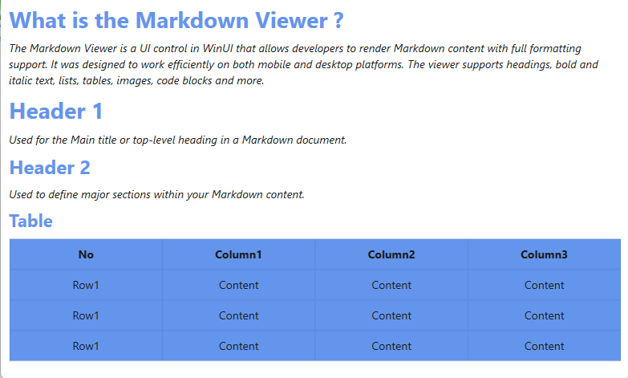

# Customize Appearance in WPF SfMarkdownViewer

The [SfMarkdownViewer](https://help.syncfusion.com/cr/wpf/Syncfusion.UI.Xaml.Markdown.html) control in WPF provides a powerful styling system through the [MarkdownStyleSettings](https://help.syncfusion.com/cr/wpf/Syncfusion.UI.Xaml.Markdown.html) class. This allows developers to customize the visual presentation of Markdown content with precision and flexibility.

## Customization with MarkdownStyleSettings

The appearance of headings and body content in [SfMarkdownViewer](https://help.syncfusion.com/cr/wpf/Syncfusion.UI.Xaml.Markdown.html) can be customized using the [MarkdownStyleSettings]() class.

* [H1Style](https://help.syncfusion.com/cr/wpf/Syncfusion.UI.Xaml.Markdown.html), [H2Style](https://help.syncfusion.com/cr/wpf/Syncfusion.UI.Xaml.Markdown.html), [H3Style](https://help.syncfusion.com/cr/wpf/Syncfusion.UI.Xaml.Markdown.html), [H4Style](https://help.syncfusion.com/cr/wpf/Syncfusion.UI.Xaml.Markdown.html), [H5Style](https://help.syncfusion.com/cr/wpf/Syncfusion.UI.Xaml.Markdown.html), [H6Style](https://help.syncfusion.com/cr/wpf/Syncfusion.UI.Xaml.Markdown.html) – Gets or sets the style for H1 to H6 heading elements respectively.

* [ParagraphStyle](https://help.syncfusion.com/cr/wpf/Syncfusion.UI.Xaml.Markdown.html) – Gets or sets the style for paragraph elements.

* [TableStyle](https://help.syncfusion.com/cr/wpf/Syncfusion.UI.Xaml.Markdown.html) – Gets or sets the style for table elements, including headers and data rows.

* [LinkStyle](https://help.syncfusion.com/cr/wpf/Syncfusion.UI.Xaml.Markdown.html) – Gets or sets the style for hyperlink elements.

* [MermaidStyle](https://help.syncfusion.com/cr/wpf/Syncfusion.UI.Xaml.Markdown.html) – Gets or sets the style for rendering Mermaid diagram content.

* [ListStyle](https://help.syncfusion.com/cr/wpf/Syncfusion.UI.Xaml.Markdown.html) – Gets or sets the style for ordered and unordered list elements.

* [InlineQuoteStyle](https://help.syncfusion.com/cr/wpf/Syncfusion.UI.Xaml.Markdown.html) – Gets or sets the style for inline quote (blockquote within text) elements.

* [CodeBlockStyle](https://help.syncfusion.com/cr/wpf/Syncfusion.UI.Xaml.Markdown.html) – Gets or sets the style for code block elements.

* [ThematicStyle](https://help.syncfusion.com/cr/wpf/Syncfusion.UI.Xaml.Markdown.html) – Gets or sets the style for thematic break (horizontal rule) elements.

* [BlockQuoteStyle](https://help.syncfusion.com/cr/wpf/Syncfusion.UI.Xaml.Markdown.html) – Gets or sets the style for block quote elements.

## Add MarkdownStyleSettings to the SfMarkdownViewer

 


    <Grid>
        <syncfusion:SfMarkdownViewer    x:Name="markdownviewer" Height="550"  MaxWidth="900">
            <syncfusion:SfMarkdownViewer.Source>
                <x:String xml:space="preserve">
                    <![CDATA[

# What is the Markdown Viewer ?
                        
The Markdown Viewer is a UI control in WinUI that allows developers to render Markdown content with full formatting support. It was designed to
work efficiently on both mobile and desktop platforms. The viewer supports headings, bold and italic text, lists, tables, images, code blocks and more.                        

# Header 1
                        
Used for the Main title or top-level heading in a Markdown document.

## Header 2
                        
Used to define major sections within your Markdown content. 

### Table

|  No  | Column1 | Column2 | Column3 | 
|------|---------|---------|---------|
| Row1 | Content | Content | Content | 
| Row1 | Content | Content | Content |
| Row1 | Content | Content | Content |    
                    ]]>
                    </x:String>
            </syncfusion:SfMarkdownViewer.Source>
            <syncfusion:SfMarkdownViewer.Settings>
                <syncfusion:MarkdownStyleSettings>
                    <syncfusion:MarkdownStyleSettings.ParagraphStyle>
                        <syncfusion:ParagraphSettings FontStyle="Italic"/>
                    </syncfusion:MarkdownStyleSettings.ParagraphStyle>
                    <syncfusion:MarkdownStyleSettings.H1Style>
                        <syncfusion:HeaderSettings FontStyle="Normal" Foreground="CornflowerBlue"/>
                    </syncfusion:MarkdownStyleSettings.H1Style>
                    <syncfusion:MarkdownStyleSettings.H2Style>
                        <syncfusion:HeaderSettings FontStyle="Normal" Foreground="CornflowerBlue"/>
                    </syncfusion:MarkdownStyleSettings.H2Style>
                    <syncfusion:MarkdownStyleSettings.H3Style>
                        <syncfusion:HeaderSettings FontStyle="Normal" Foreground="CornflowerBlue"/>
                    </syncfusion:MarkdownStyleSettings.H3Style>
                    <syncfusion:MarkdownStyleSettings.TableStyle>
                    <syncfusion:TableSettings Background="CornflowerBlue"/>
                    </syncfusion:MarkdownStyleSettings.TableStyle>
                </syncfusion:MarkdownStyleSettings>
            </syncfusion:SfMarkdownViewer.Settings>
        </syncfusion:SfMarkdownViewer>
    </Grid>





    public sealed partial class MainWindow : Window
    {
        public MainWindow()
        {
            InitializeComponent();

            SfMarkdownViewer markdownViewer = new SfMarkdownViewer();

            markdownViewer.Source =
@"
# What is the Markdown Viewer ?
                        
The Markdown Viewer is a UI control in WinUI that allows developers to render Markdown content with full formatting support. It was designed to
work efficiently on both mobile and desktop platforms. The viewer supports headings, bold and italic text, lists, tables, images, code blocks and more.                        

# Header 1
                        
Used for the Main title or top-level heading in a Markdown document.

## Header 2
                        
Used to define major sections within your Markdown content. 

### Table

|  No  | Column1 | Column2 | Column3 | 
|------|---------|---------|---------|
| Row1 | Content | Content | Content | 
| Row1 | Content | Content | Content |
| Row1 | Content | Content | Content | 
";
            markdownViewer.Settings = new MarkdownStyleSettings
            {
                H1Style = new HeaderSettings
                {
                    FontStyle = FontStyles.Normal,
                    Foreground = new SolidColorBrush(Colors.CornflowerBlue),
                },

                H2Style = new HeaderSettings
                {
                    FontStyle = FontStyles.Normal,
                    Foreground = new SolidColorBrush(Colors.CornflowerBlue),
                },

                H3Style = new HeaderSettings
                {
                    FontStyle = FontStyles.Normal,
                    Foreground = new SolidColorBrush(Colors.CornflowerBlue),
                },

                ParagraphStyle = new ParagraphSettings
                {
                    FontStyle = FontStyles.Italic,
                },

                TableStyle = new TableSettings
                {
                    Background = new SolidColorBrush(Colors.CornflowerBlue)
                },
            };

            Content = markdownViewer;
        }
    }




The following output shows how these style settings enhance the appearance of rendered Markdown content:

N> Changing values dynamically in Theme studio settings isn't supported.
