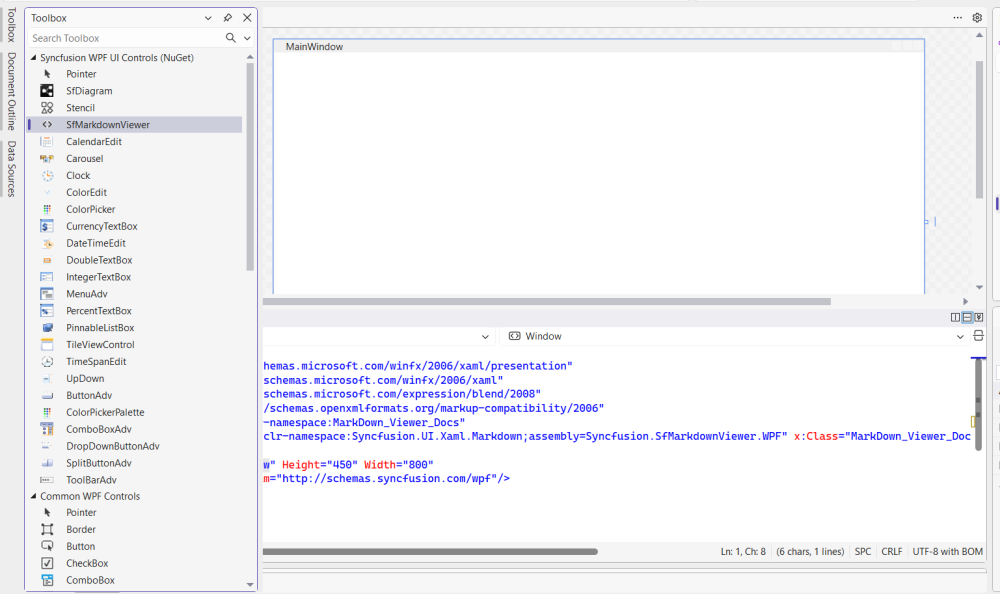
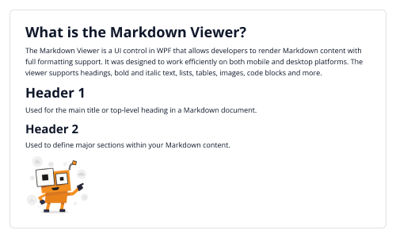

# Getting Started with WPF Markdown Viewer

This section provides a step-by-step guide to integrate and use the [SfMarkdownViewer](https://help.syncfusion.com/cr/wpf/Syncfusion.UI.Xaml.Markdown.SfMarkdownViewer.html) control in your WPF applications.

## Create a New WPF Project

1. Go to **File > New > Project** and choose the **WPF App** template.
2. Name the project, choose a location, and then click **Next**.
3. Select a target framework from the supported list above and click **Create**.

## Install the Syncfusion&reg; WPF MarkdownViewer NuGet Package

1. In **Solution Explorer**, right-click the project and choose **Manage NuGet Packages**.
2. Search for [Syncfusion.SfMarkdownViewer.WPF](https://help.syncfusion.com/cr/wpf/Syncfusion.SfMarkdownViewer.Wpf.html) and install the latest version. The NuGet ID is case-insensitive, but the canonical name is `Syncfusion.SfMarkdownViewer.WPF`.
3. Ensure the required dependencies are installed correctly and that the project has been restored successfully.

> The NuGet package installs `Syncfusion.SfMarkdownViewer.WPF` together with its required dependencies, including `Syncfusion.Markdown` and `Syncfusion.Shared.WPF`. You do not need to add them separately.

## Assembly Deployment

The Markdown Viewer control depends on the following assemblies, which are added automatically when the NuGet package is installed:

- `Syncfusion.SfMarkdownViewer.WPF`
- `Syncfusion.Markdown`
- `Syncfusion.Shared.WPF`

For more information, see the [Control Dependencies](https://help.syncfusion.com/wpf/control-dependencies#sfmarkdownviewer) page. For details about installing NuGet packages in a WPF application, see [Installing NuGet packages](https://help.syncfusion.com/wpf/installation/install-nuget-packages).

## Adding WPF Markdown Viewer via the Designer

This section assumes that you have already created a WPF project and installed the `Syncfusion.SfMarkdownViewer.WPF` NuGet package, as described in the earlier sections. To add the [SfMarkdownViewer](https://help.syncfusion.com/cr/wpf/Syncfusion.UI.Xaml.Markdown.SfMarkdownViewer.html) control through the Visual Studio Designer, follow these steps:

1. Make sure the `SfMarkdownViewer` control is listed in the **Toolbox**. If it is not, rebuild the project, or add the assembly manually by choosing **Tools > Choose Toolbox Items > WPF Components** and browsing to `Syncfusion.SfMarkdownViewer.WPF.dll`.
2. Drag the `SfMarkdownViewer` entry from the Toolbox and drop it onto the designer surface.
3. Resize the control on the design surface. A minimum size of 400 by 300 is recommended so that the rendered Markdown has room to display.

## Adding WPF Markdown Viewer via XAML

This section assumes that you have already created a WPF project and installed the `Syncfusion.SfMarkdownViewer.WPF` NuGet package, as described in the earlier sections. To add the [SfMarkdownViewer](https://help.syncfusion.com/cr/wpf/Syncfusion.UI.Xaml.Markdown.SfMarkdownViewer.html) control in XAML, declare the control inside a layout container and set sizing properties so that it has room to render at run time.

Import the control namespace `Syncfusion.UI.Xaml.Markdown` in XAML, and declare the `SfMarkdownViewer` in XAML page.




<Window
    x:Class="GettingStarted.MainWindow"
    xmlns="http://schemas.microsoft.com/winfx/2006/xaml/presentation"
    xmlns:x="http://schemas.microsoft.com/winfx/2006/xaml"
    xmlns:d="http://schemas.microsoft.com/expression/blend/2008"
    xmlns:mc="http://schemas.openxmlformats.org/markup-compatibility/2006"  
    xmlns:markdown="clr-namespace:Syncfusion.UI.Xaml.Markdown;assembly=Syncfusion.SfMarkdownViewer.WPF"
    xmlns:system="clr-namespace:System;assembly=mscorlib">
    <Grid>
        <markdown:SfMarkdownViewer />
    </Grid>
</Window>
 



## Adding WPF Markdown Viewer via C#

This section assumes that you have already created a WPF project and installed the `Syncfusion.SfMarkdownViewer.WPF` NuGet package, as described in the earlier sections. To add the [SfMarkdownViewer](https://help.syncfusion.com/cr/wpf/Syncfusion.UI.Xaml.Markdown.SfMarkdownViewer.html) control in code-behind, instantiate the control and assign it to the `Content` of a window or a child element.

Import the control namespace `Syncfusion.UI.Xaml.Markdown` in C#, and add the [SfMarkdownViewer](https://help.syncfusion.com/cr/wpf/Syncfusion.UI.Xaml.Markdown.SfMarkdownViewer.html) control in C# page.




using Syncfusion.UI.Xaml.Markdown;

namespace MarkdownViewerGettingStarted
{
    public partial class MainWindow : Window
    {
        public MainWindow()
        {
            InitializeComponent();
            // Creating an instance of the SfMarkdownViewer control
            SfMarkdownViewer markdownViewer = new SfMarkdownViewer();
            this.Content = markdownViewer;
        }
    }
}




## Setting the Source Property

The `Source` property supplies Markdown content to the control. It accepts a raw Markdown string, a file path, or an HTTP/HTTPS URL, and is set after the control has been added to the visual tree.

 


<markdown:SfMarkdownViewer>
    <markdown:SfMarkdownViewer.Source>
        <system:String xml:space="preserve">
            <![CDATA[
# What is the Markdown Viewer?  
The MarkdownViewer control is used to render and preview Markdown files. It converts markdown syntax into a clean, readable format and supports elements such as headings, lists, code blocks, tables, and other common markdown structures.

# Header 1  
Used for the main title or top-level heading in a Markdown document. 

## Header 2  
Used to define major sections within your Markdown content.

            ]]>
        </system:String>
    </markdown:SfMarkdownViewer.Source>
</markdown:SfMarkdownViewer>





public partial class MainWindow : Window
{
        private const string markdownContent = @"
# What is the Markdown Viewer?  
The MarkdownViewer control is used to render and preview Markdown files. It converts markdown syntax into a clean, readable format and supports elements such as headings, lists, code blocks, tables, and other common markdown structures.

# Header 1  
Used for the main title or top-level heading in a Markdown document. 

## Header 2  
Used to define major sections within your Markdown content.

";

    public MainWindow()
    {
        InitializeComponent();  
        SfMarkdownViewer markdownViewer = new SfMarkdownViewer();
        markdownViewer.Source = markdownContent;
        this.Content = markdownViewer;
    }
}  




