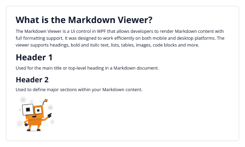

# Getting Started with .NET WPF MarkdownViewer (SfMarkdownViewer)

This guide details the initial setup and basic usage of the SfMarkdownViewer control, offering insight into its ability to render Markdown content with various formatting capabilities across mobile and desktop platforms.

## Prerequisites

Before proceeding, ensure the following are in place:

1. Create a [Wpf desktop app for C# and .NET 6](https://learn.microsoft.com/en-us/dotnet/desktop/wpf/get-started/create-app-visual-studio?view=netdesktop-9.0).

## Step 1: Create a new .NET WPF project

1. Go to **File > New > Project** and choose the **.NET WPF App** template.
2. Name the project and choose a location. Then, click **Next**.
3. Select the .NET version and click **Create**.

## Step 2: Install the Syncfusion® .NET WPF MarkdownViewer NuGet Package

1. In **Solution Explorer**, right-click the project and choose **Manage NuGet Packages**.
2. Search for `Syncfusion.SfMarkdownViewer.WPF` and install the latest version.
3. Ensure the necessary dependencies are installed correctly, and the project is restored.

## Step 3: Initialize the MarkdownViewer Control

1. To initialize the control, import the `Syncfusion.UI.Xaml.Markdown` namespace.
2. Add an SfMarkdownViewer instance to your window.

 



<Window
    . . .    
    xmlns:markdown="clr-namespace:Syncfusion.UI.Xaml.Markdown;assembly=Syncfusion.SfMarkdownViewer.WPF"
    xmlns:system="clr-namespace:System;assembly=mscorlib">

    <markdown:SfMarkdownViewer />
    
</Window>
 




using Syncfusion.UI.Xaml.Markdown;

namespace MarkdownViewerGettingStarted
{
    public partial class MainWindow : Window
    {
        public MainWindow()
        {
            InitializeComponent();
            SfMarkdownViewer markdownViewer = new SfMarkdownViewer();
            HomeGrid.Children.Add(markdownViewer);
        }
    }
}




## Step 4: Add Source to the SfMarkdownViewer

To display Markdown content, assign a string to the Source property of the SfMarkdownViewer control. This string can contain standard Markdown syntax such as headings, bold text, lists, and images.

 


<markdown:SfMarkdownViewer>
    <markdown:SfMarkdownViewer.Source>
        <system:String xml:space="preserve">
            <![CDATA[
# What is the Markdown Viewer?  
The MarkdownViewer control is used to render and preview Markdown files. It converts markdown syntax into a clean, readable format and supports elements such as headings, lists, code blocks, tables, and other common markdown structures.

# Header 1  
Used for the main title or top-level heading in a Markdown document. 

## Header 2  
Used to define major sections within your Markdown content.

### Table 

|              | Column 1 | Column 2 | Column 3 |
|--------------|----------|----------|----------|
| Row 1        | Content  | Content  | Content  |
| Row 2        | Content  | Content  | Content  |
| Row 3        | Content  | Content  | Content  |
            ]]>
        </system:String>
    </markdown:SfMarkdownViewer.Source>
</markdown:SfMarkdownViewer>





public partial class MainWindow : Window
{
        private const string markdownContent = @"
# What is the Markdown Viewer?  
The MarkdownViewer control is used to render and preview Markdown files. It converts markdown syntax into a clean, readable format and supports elements such as headings, lists, code blocks, tables, and other common markdown structures.

# Header 1  
Used for the main title or top-level heading in a Markdown document. 

## Header 2  
Used to define major sections within your Markdown content.

### Table 

|              | Column 1 | Column 2 | Column 3 |
|--------------|----------|----------|----------|
| Row 1        | Content  | Content  | Content  |
| Row 2        | Content  | Content  | Content  |
| Row 3        | Content  | Content  | Content  |";

    public MainWindow()
    {
        InitializeComponent();  
        SfMarkdownViewer markdownViewer = new SfMarkdownViewer();
        markdownViewer.Source = markdownContent;
        HomeGrid.Children.Add(markdownViewer);
    }
}  




