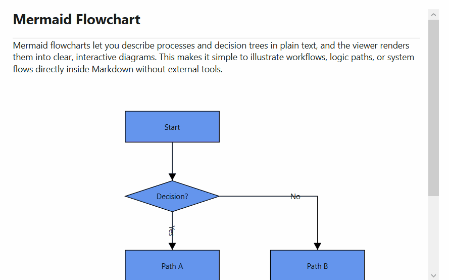

## Mermaid Diagrams in WPF Markdown Viewer
 
The [SfMarkdownViewer](https://help.syncfusion.com/cr/wpf/Syncfusion.SfMarkdownViewer.Wpf.html) control provides built-in support for rendering Mermaid diagrams and flowcharts within Markdown content. Mermaid is a JavaScript-based diagramming and charting tool that uses text-based definitions to create and modify diagrams dynamically.
 
## MermaidBlockTemplate Property
 
The [MermaidBlockTemplate](https://help.syncfusion.com/cr/wpf/Syncfusion.UI.Xaml.Markdown.SfMarkdownViewer.html#Syncfusion_UI_Xaml_Markdown_SfMarkdownViewer_MermaidBlockTemplate) property accepts a `DataTemplate` that defines how Mermaid code blocks should be rendered. When a code block with the language identifier `mermaid` is encountered, the control uses this template instead of the default code block rendering.

 


    <Grid>
        <syncfusion:SfMarkdownViewer>
            <syncfusion:SfMarkdownViewer.MermaidBlockTemplate>
                <DataTemplate x:Key="MermaidBlockTemplate">
                <StackPanel>
                    <diagram:SfDiagram x:Name="mermaidDiagram" Foreground="Black"
                                 Height="600" Width="1000" Focusable="False"
                                 HorizontalAlignment="Left" 
                                 HorizontalContentAlignment="Left"
                                 Loaded="mermaidDiagram_Loaded">
                    </diagram:SfDiagram>
                </StackPanel>
            </DataTemplate>
            </syncfusion:SfMarkdownViewer.MermaidBlockTemplate>
            <syncfusion:SfMarkdownViewer.Source>
                <system:String xml:space="preserve">
                    <![CDATA[

# Mermaid Flowchart

Mermaid flowcharts let you describe processes and decision trees in plain text, and the viewer renders them into clear, interactive diagrams. This makes it simple to illustrate workflows, logic paths, or system flows directly inside Markdown without external tools.  

---

```mermaid
flowchart TD
    A[User Opens App] --> B[MarkdownViewer Loads]
    B --> C{Contains Mermaid?}
    C -->|Yes| D[Render Diagram]
    C -->|No| E[Render Plain Markdown]
    D --> F[Display Enhanced Output]
    E --> F
            ]]>
                </system:String>
            </syncfusion:SfMarkdownViewer.Source>
        </syncfusion:SfMarkdownViewer>

    </Grid>





namespace MarkdownViewerGettingStarted
{
    public partial class MainWindow : Window
    {
        public MainWindow()
        {
            InitializeComponent();
        }

        private void mermaidDiagram_Loaded(object sender, RoutedEventArgs e)
        {
            if (sender is Syncfusion.UI.Xaml.Diagram.SfDiagram diagram)
            {
                diagram.PageSettings = null;
                diagram.ScrollSettings.ScrollLimit = ScrollLimit.Limited;
                var mermaidText = diagram.DataContext as string;
                diagram.LayoutManager = new LayoutManager
                {
                    Layout = new FlowchartLayout
                    {
                        Orientation = FlowchartOrientation.TopToBottom,
                        HorizontalSpacing = 80,
                        VerticalSpacing = 60,
                        Margin = new Thickness(0, 50, 0, 0),
                    }
                };

                diagram.LoadDiagramFromMermaid(mermaidText);
            }
        }
    }
}





