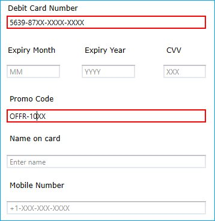

# Overview

The Masked text box is an advanced version of the Entry control that restricts your input of certain types such as characters, text, and numbers by using a mask pattern. This control is used to create a template for providing information such as telephone numbers, IP addresses, product IDs, and so on.

## Key features

Key features are:

* The input can be masked with a fixed or variable length by setting the `MaskType` to `Text` or `RegEx`.
* Custom prompt characters can be set.
* Input validation can be done either during each key press or when the control lost its focus.
* Values and clipboard operations can be used with or without literal and prompt characters.
* Watermark text can be used to display an instruction or important information.
* The UI of the masked text box can be completely customizable.

