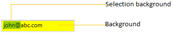

# Appearance in WPF MaskedTextBox (SfMaskedEdit)

This section explains different UI customization and theming options available in [SfMaskedEdit](https://help.syncfusion.com/cr/wpf/Syncfusion.Windows.Controls.Input.SfMaskedEdit.html).

## Setting the background

You can change the default background color and selection color of `SfMaskedEdit` by using the `Background` and `SelectionBrush` property. The default value of `Background` property is `White` and `SelectionBrush` property is `Royal Blue`.




<syncfusion:SfMaskedEdit Background="Yellow"
                         SelectionBrush="Green"
                         Name="sfMaskedEdit"/>




SfMaskedEdit sfMaskedEdit = new SfMaskedEdit();
sfMaskedEdit.Background = Brushes.Yellow;
sfMaskedEdit.SelectionBrush = Brushes.Green;




N> View [Sample](https://github.com/SyncfusionExamples/syncfusion-wpf-maskedtextbox-examples/tree/master/Samples/Appearance) in GitHub

## Setting the foreground

You can change the foreground color by using the `Foreground` property and can change the caret color by using the `CaretBrush` property. The default value of `Foreground` property is `Black` and `CaretBrush` property is `null`.




<syncfusion:SfMaskedEdit Foreground="Blue" 
                         CaretBrush="Red"
                         Name="sfMaskedEdit"/>




SfMaskedEdit sfMaskedEdit = new SfMaskedEdit();
sfMaskedEdit.Foreground = Brushes.Blue;
sfMaskedEdit.CaretBrush = Brushes.Red;




N> View [Sample](https://github.com/SyncfusionExamples/syncfusion-wpf-maskedtextbox-examples/tree/master/Samples/Appearance) in GitHub

## Setting the border color

You can change the default border color of `SfMaskedEdit` by using the `BorderBrush` property. The default value of `BorderBrush` property is `Lavender`.




<syncfusion:SfMaskedEdit BorderBrush="Blue"
                         Name="sfMaskedEdit"/>




SfMaskedEdit sfMaskedEdit = new SfMaskedEdit();
sfMaskedEdit.BorderBrush = Brushes.Blue;




N> View [Sample](https://github.com/SyncfusionExamples/syncfusion-wpf-maskedtextbox-examples/tree/master/Samples/Appearance) in GitHub

## Change flow direction

You can change the flow direction of the `SfMaskedEdit` layout from right to left by setting the `FlowDirection` property value as `RightToLeft`. The default value of `FlowDirection` property is `LeftToRight`.




<syncfusion:SfMaskedEdit FlowDirection="RightToLeft"
                         Name="sfMaskedEdit"/>




SfMaskedEdit sfMaskedEdit = new SfMaskedEdit();
sfMaskedEdit.FlowDirection = FlowDirection.RightToLeft;




N> View [Sample](https://github.com/SyncfusionExamples/syncfusion-wpf-maskedtextbox-examples/tree/master/Samples/Appearance) in GitHub

## Theme

SfMaskedEdit supports various built-in themes. Refer to the below links to apply themes for the SfMaskedEdit,

  * [Apply theme using SfSkinManager](https://help.syncfusion.com/wpf/themes/skin-manager)
	
  * [Create a custom theme using ThemeStudio](https://help.syncfusion.com/wpf/themes/theme-studio#creating-custom-theme)
  
  
