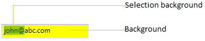
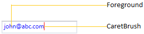

# Appearance in WPF MaskedTextBox (SfMaskedEdit)

This section explains the UI customization and theming options available in the [WPF MaskedTextBox](https://www.syncfusion.com/wpf-controls/maskedtextbox) control. The WPF MaskedTextBox control is implemented through the [SfMaskedEdit](https://help.syncfusion.com/cr/wpf/Syncfusion.Windows.Controls.Input.SfMaskedEdit.html) class.

## Setting the background

You can change the default background and selection colors of `SfMaskedEdit` by using the `Background` and `SelectionBrush` properties. The default value of the `Background` property is `White`, and the default value of the `SelectionBrush` property is `Royal Blue`.




<syncfusion:SfMaskedEdit Background="Yellow"
                         SelectionBrush="Green"
                         Name="sfMaskedEdit"/>




SfMaskedEdit sfMaskedEdit = new SfMaskedEdit();
sfMaskedEdit.Background = Brushes.Yellow;
sfMaskedEdit.SelectionBrush = Brushes.Green;




N> View [Sample](https://github.com/SyncfusionExamples/syncfusion-wpf-maskedtextbox-examples/tree/master/Samples/Appearance) in GitHub

## Setting the foreground

You can change the foreground color by using the `Foreground` property and the caret color by using the `CaretBrush` property. The default value of the `Foreground` property is `Black`, and the default value of the `CaretBrush` property is `null`.




<syncfusion:SfMaskedEdit Foreground="Blue" 
                         CaretBrush="Red"
                         Name="sfMaskedEdit"/>




SfMaskedEdit sfMaskedEdit = new SfMaskedEdit();
sfMaskedEdit.Foreground = Brushes.Blue;
sfMaskedEdit.CaretBrush = Brushes.Red;




N> View [Sample](https://github.com/SyncfusionExamples/syncfusion-wpf-maskedtextbox-examples/tree/master/Samples/Appearance) in GitHub

## Setting the border color

You can change the default border color of `SfMaskedEdit` by using the `BorderBrush` property. The default value of the `BorderBrush` property is `Lavender`.




<syncfusion:SfMaskedEdit BorderBrush="Blue"
                         Name="sfMaskedEdit"/>




SfMaskedEdit sfMaskedEdit = new SfMaskedEdit();
sfMaskedEdit.BorderBrush = Brushes.Blue;




N> View [Sample](https://github.com/SyncfusionExamples/syncfusion-wpf-maskedtextbox-examples/tree/master/Samples/Appearance) in GitHub

## Change flow direction

You can change the flow direction of the `SfMaskedEdit` layout from right to left by setting the `FlowDirection` property to `RightToLeft`. The default value of the `FlowDirection` property is `LeftToRight`.




<syncfusion:SfMaskedEdit FlowDirection="RightToLeft"
                         Name="sfMaskedEdit"/>




SfMaskedEdit sfMaskedEdit = new SfMaskedEdit();
sfMaskedEdit.FlowDirection = FlowDirection.RightToLeft;




N> View [Sample](https://github.com/SyncfusionExamples/syncfusion-wpf-maskedtextbox-examples/tree/master/Samples/Appearance) in GitHub

## Theme

The WPF MaskedTextBox supports various built-in themes. Refer to the following links to apply them:

  * [Apply theme using SfSkinManager](https://help.syncfusion.com/wpf/themes/skin-manager)
	
  * [Create a custom theme using ThemeStudio](https://help.syncfusion.com/wpf/themes/theme-studio#creating-custom-theme)
  
  
