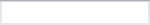
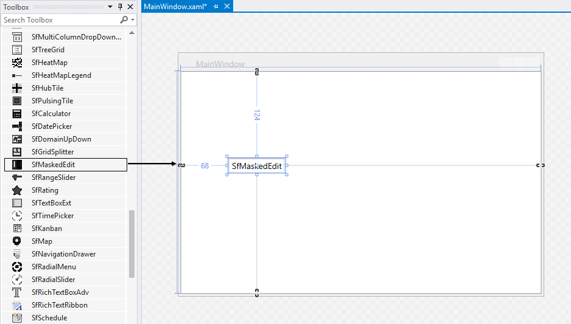
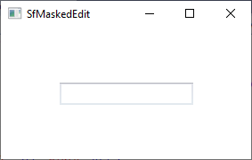
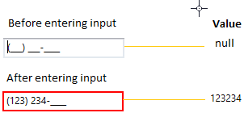

# Getting Started with WPF MaskedTextBox (SfMaskedEdit)

This section explains how to create a WPF [SfMaskedEdit](https://help.syncfusion.com/cr/wpf/Syncfusion.Windows.Controls.Input.SfMaskedEdit.html) and explains about its structure and features.

## Control Structure

## Assembly deployment

Refer to the [control dependencies](https://help.syncfusion.com/wpf/control-dependencies#sfmaskededit) section to get the list of assemblies or NuGet package that needs to be added as reference to use the control in any application.

You can find more details about installing the NuGet package in a WPF application in the following link: 

[How to install nuget packages](https://help.syncfusion.com/wpf/visual-studio-integration/nuget-packages)

## Adding WPF SfMaskedEdit via designer

You can add the `SfMaskedEdit` control to an application by dragging it from the toolbox to a view of the designer. The following dependent assembly will be added automatically.

* Syncfusion.SfInput.WPF
* Syncfusion.SfShared.WPF

 
## Adding WPF SfMaskedEdit via XAML

To add the `SfMaskedEdit` control manually in XAML, follow these steps:
1. Create a new WPF project in Visual Studio.

2. Add the  following assembly references to the project,

  * Syncfusion.SfInput.WPF
  * Syncfusion.SfShared.WPF
 
3. Import Syncfusion WPF schema **http://schemas.syncfusion.com/wpf** and declare the `SfMaskedEdit` control in XAML page.

4.	Declare the `SfMaskedEdit` control in XAML page.




<Window xmlns="http://schemas.microsoft.com/winfx/2006/xaml/presentation"
        xmlns:x="http://schemas.microsoft.com/winfx/2006/xaml"
        xmlns:syncfusion="http://schemas.syncfusion.com/wpf" 
        x:Class="SfMaskedEditSample.MainWindow"
        Title="SfMaskedEdit Sample" Height="350" Width="525">
    <Grid>
        <!--Adding SfMaskedEdit control -->
        <syncfusion:SfMaskedEdit x:Name="sfMaskedEdit" 
                                       Width="100" 
                                       Height="25" />
    </Grid>
</Window>



## Adding WPF SfMaskedEdit via C\#

To add the `SfMaskedEdit` control manually in C#, follow these steps:

1. Create a new WPF application via Visual Studio.

2. Add the  following assembly references to the project,
   * Syncfusion.SfInput.WPF
   * Syncfusion.SfShared.WPF
3. Include the required namespace and create an instance of `SfMaskedEdit` and add it to the window.

4. Declare the `SfMaskedEdit` control using C#.




using Syncfusion.Windows.Controls.Input;

public partial class MainWindow : Window {
    public MainWindow() {
        InitializeComponent();

        //Creating an instance of SfMaskedEdit control
        SfMaskedEdit sfMaskedEdit = new SfMaskedEdit();
        sfMaskedEdit.Width = 100;
        sfMaskedEdit.Height = 25;        

        //Adding SfMaskedEdit as window content
        this.Content = sfMaskedEdit;
    }
}




N> View [Sample](https://github.com/SyncfusionExamples/syncfusion-wpf-maskedtextbox-examples/blob/master/Samples/Getting-Started) in GitHub

## Restrict the user to enter valid data

You can restrict the user to enter the valid input without any custom validation by creating the mask pattern as your requirement. You can enable the mask by setting the mask pattern to the [Mask](https://help.syncfusion.com/cr/wpf/Syncfusion.Windows.Controls.Input.SfMaskedEdit.html#Syncfusion_Windows_Controls_Input_SfMaskedEdit_Mask) property and set the [MaskType](https://help.syncfusion.com/cr/wpf/Syncfusion.Windows.Controls.Input.SfMaskedEdit.html#Syncfusion_Windows_Controls_Input_SfMaskedEdit_MaskType) property value as `Regex`. The default value of `Mask` property is `null` and `MaskType` property is `Simple`.




<syncfusion:SfMaskedEdit Mask="-?\d+\.?\d*"
                         MaskType="RegEx"
                         Name="sfMaskedEdit"/>




SfMaskedEdit sfMaskedEdit = new SfMaskedEdit();
sfMaskedEdit.MaskType = MaskType.RegEx;
sfMaskedEdit.Mask = @"-?\d+\.?\d*";




Here, the `SfMaskedEdit` accept the positive and negative whole or float type numbers.

N> Please refer the [Restrict the user to enter valid data](https://help.syncfusion.com/wpf/maskedtextbox/working-with-sfmaskededit#restrict-the-user-to-enter-valid-data) page to know more about the various mask pattern with examples.

N> View [Sample](https://github.com/SyncfusionExamples/syncfusion-wpf-maskedtextbox-examples/tree/master/Samples/InputOptions) in GitHub

## Setting the value

You can set the value for the `SfMaskedEdit` by using the [Value](https://help.syncfusion.com/cr/wpf/Syncfusion.Windows.Controls.Input.SfMaskedEdit.html#Syncfusion_Windows_Controls_Input_SfMaskedEdit_Value) property. Based on the mask, the value of `Value` property is formatted. The default value of `Value` property is `null`.




<syncfusion:SfMaskedEdit Value="4553456789"
                         Mask="\([0-9]\d{2}\) [0-9]\d{2}-[0-9]\d{3}" 
                         MaskType = "RegEx"
                         Name="sfMaskedEdit"/>




SfMaskedEdit sfMaskedEdit = new SfMaskedEdit();
sfMaskedEdit.Value="4553456789";
sfMaskedEdit.MaskType = MaskType.RegEx;
sfMaskedEdit.Mask = @"\([0-9]\d{2}\) [0-9]\d{2}-[0-9]\d{3}";




N> View [Sample](https://github.com/SyncfusionExamples/syncfusion-wpf-maskedtextbox-examples/tree/master/Samples/InputOptions) in GitHub

## Get the value in various formats

By default, the `Value` property holds your input characters, prompt characters, and the literals defined in the mask. You can modify this and allow the `Value` property to hold the characters without prompt and literals by setting the [ValueMaskFormat](https://help.syncfusion.com/cr/wpf/Syncfusion.Windows.Controls.Input.SfMaskedEdit.html#Syncfusion_Windows_Controls_Input_SfMaskedEdit_ValueMaskFormat) property. The value can be formatted by any one of the following formatting options,

* ExcludePromptAndLiterals
* IncludeLiterals
* IncludePrompt
* IncludePromptAndLiterals




<syncfusion:SfMaskedEdit ValueMaskFormat="ExcludePromptAndLiterals"
                         Mask="\([0-9]\d{2}\) [0-9]\d{2}-[0-9]\d{3}" 
                         MaskType = "RegEx"
                         Name="sfMaskedEdit"/>




SfMaskedEdit sfMaskedEdit = new SfMaskedEdit();
sfMaskedEdit.ValueMaskFormat = MaskFormat.ExcludePromptAndLiterals;
sfMaskedEdit.MaskType = MaskType.RegEx;
sfMaskedEdit.Mask = @"\([0-9]\d{2}\) [0-9]\d{2}-[0-9]\d{3}";




N> View [Sample](https://github.com/SyncfusionExamples/syncfusion-wpf-maskedtextbox-examples/tree/master/Samples/InputOptions) in GitHub

## Indicates error on invalid input

After input validation failed, you can indicate to the user about the invalid input by the showing error border. The error border automatically disappeared when the input validation is succeed. You can change the error border color by using the [ErrorBorderBrush](https://help.syncfusion.com/cr/wpf/Syncfusion.Windows.Controls.Input.SfMaskedEdit.html#Syncfusion_Windows_Controls_Input_SfMaskedEdit_ErrorBorderBrush) property. The default value of `ErrorBorderBrush` property is `Red`.




<syncfusion:SfMaskedEdit ErrorBorderBrush="Yellow" 
                         Name="sfMaskedEdit"/>




SfMaskedEdit sfMaskedEdit = new SfMaskedEdit();
sfMaskedEdit.ErrorBorderBrush = Brushes.Yellow;




N> View [Sample](https://github.com/SyncfusionExamples/syncfusion-wpf-maskedtextbox-examples/tree/master/Samples/InputOptions) in GitHub

## Indicates the missed input

You can indicate to the user to enter the missed input by using the prompt character. You can change the prompt character by using the [PromptChar](https://help.syncfusion.com/cr/wpf/Syncfusion.Windows.Controls.Input.SfMaskedEdit.html#Syncfusion_Windows_Controls_Input_SfMaskedEdit_PromptChar) property. The default prompt character is `_`.




<syncfusion:SfMaskedEdit PromptChar="X"
                         MaskType="RegEx"
                         Mask="\+1 [0-9]\d{2}-[0-9]\d{2}-[0-9]\d{3}"
                         Name="sfMaskedEdit"/>




SfMaskedEdit sfMaskedEdit = new SfMaskedEdit();
sfMaskedEdit.PromptChar = 'X';
sfMaskedEdit.MaskType = MaskType.RegEx;
sfMaskedEdit.Mask = @"\+1 [0-9]\d{2}-[0-9]\d{2}-[0-9]\d{3}";




N> View [Sample](https://github.com/SyncfusionExamples/syncfusion-wpf-maskedtextbox-examples/tree/master/Samples/InputOptions) in GitHub

## Value changed notification

you can notified when changing the value of `SfMaskedEdit.Value` property by using the [ValueChanged](https://help.syncfusion.com/cr/wpf/Syncfusion.Windows.Controls.Input.SfMaskedEdit.html) event.

N> Your valid input character is updated to the `Value` property based on the `ValidationMode` property.
Refer  [Input Validation](https://help.syncfusion.com/wpf/maskedtextbox/working-with-sfmaskededit#input-validation) to know more about the `ValidationMode`.




<syncfusion:SfMaskedEdit ValueChanged="SfMaskedEdit_ValueChanged" 
                         Name="sfMaskedEdit"/>




SfMaskedEdit sfMaskedEdit = new SfMaskedEdit();	
sfMaskedEdit.ValueChanged += SfMaskedEdit_ValueChanged;




You can handle the event as follows,




private void SfMaskedEdit_ValueChanged(object sender, EventArgs e) {
   MessageBox.Show("Value changed");
}




## Theme

SfMaskedEdit supports various built-in themes. Refer to the below links to apply themes for the SfMaskedEdit,

  * [Apply theme using SfSkinManager](https://help.syncfusion.com/wpf/themes/skin-manager)
	
  * [Create a custom theme using ThemeStudio](https://help.syncfusion.com/wpf/themes/theme-studio#creating-custom-theme)

  