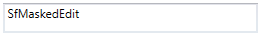
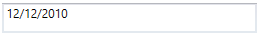
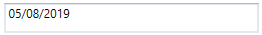

# Getting Started with SfMaskedEdit

## Assembly deployment

Refer to the [control dependencies](https://help.syncfusion.com/wpf/control-dependencies#sfmaskededit) section to get the list of assemblies or details of NuGet package that needs to be added as a reference to use the control in any application.

[Click here](https://help.syncfusion.com/wpf/visual-studio-integration/nuget-packages) to find more details on how to install nuget packages in WPF application.

## Adding SfMaskedEdit control via designer

N> Download demo application from [GitHub](https://github.com/syncfusion/wpf-demos/tree/master/Input%20Controls/Masked%20Text%20Box)

1) Create a new WPF application via Visual Studio.

2) The [SfMaskedEdit](https://help.syncfusion.com/cr/wpf/Syncfusion.SfInput.Wpf~Syncfusion.Windows.Controls.Input.SfMaskedEdit.html) control can be added to an application by dragging it from the toolbox to a designer view. The following dependent assemblies will be added automatically.

* Syncfusion.SfInput.WPF
* Syncfusion.SfShared.WPF

## Adding SfMaskedEdit control via XAML

To add the SfMaskEdit control in XAML, follow these steps:

1) Create a new WPF application in Visual Studio.

2) Add the following required assembly references to the project.

* Syncfusion.SfInput.WPF
* Syncfusion.SfShared.WPF

3) Import Syncfusion WPF schema **http://schemas.syncfusion.com/wpf**, and declare the SfMaskEdit control in XAML page.





<Window x:Class="SfMaskedEdit_Sample.MainWindow"
        xmlns="http://schemas.microsoft.com/winfx/2006/xaml/presentation"
        xmlns:x="http://schemas.microsoft.com/winfx/2006/xaml"
        xmlns:d="http://schemas.microsoft.com/expression/blend/2008"
        xmlns:mc="http://schemas.openxmlformats.org/markup-compatibility/2006"
        xmlns:syncfusion="http://schemas.syncfusion.com/wpf"
        xmlns:local="clr-namespace:SfMaskedEdit_Sample"
        mc:Ignorable="d"
        Title="MainWindow" Height="450" Width="800">

<Grid Name="grid">
    <syncfusion:SfMaskedEdit Width="255" Height="30" Text="SfMaskedEdit" />
</Grid>





## Adding SfMaskedEdit control manually in C#

To add the SfMaskedEdit control manually in C#, follow these steps:

1) Create a new WPF application in Visual Studio.

2) Add the following required assembly references to the project.

* Syncfusion.SfInput.WPF
* Syncfusion.SfShared.WPF

3) Include the required namespace.





using Syncfusion.Windows.Controls.Input;





4) Create an instance of [SfMaskedEdit](https://help.syncfusion.com/cr/wpf/Syncfusion.SfInput.Wpf~Syncfusion.Windows.Controls.Input.SfMaskedEdit.html) control and add it to the main window.





//Creating an instance of the SfMaskedEdit
SfMaskedEdit sfMaskedEdit = new SfMaskedEdit();
sfMaskedEdit.Text = "SfMaskedEdit";

//Setting height and width of SfMaskedEdit
sfMaskedEdit.Height = 30;
sfMaskedEdit.Width = 255;

//Adding control into the main window
grid.Children.Add(sfMaskedEdit);





## Mask

To mask the input of SfMaskedEdit, use the [MaskType](https://help.syncfusion.com/cr/wpf/Syncfusion.SfInput.Wpf~Syncfusion.Windows.Controls.Input.SfMaskedEdit~MaskType.html) and [Mask](https://help.syncfusion.com/cr/wpf/Syncfusion.SfInput.Wpf~Syncfusion.Windows.Controls.Input.SfMaskedEdit~Mask.html) properties.

The `MaskType` property has different set of mask characters that are combined to form a mask expression. Based on the complexity and usage, mask types are classified as Simple, Regular, and RegEx.

The `Mask` property specifies the input without writing any custom validation logic in your application. It can be set based on the `MaskType` elements. The `Mask` property may contain literals and special mask characters. You can use the back-slash character to escape any special mask characters to display as literals.

**Simple:**





<syncfusion:SfMaskedEdit MaskType="Simple" Mask="00/00/0000" />





sfMaskedEdit.MaskType=MaskType.Simple;
sfMaskedEdit.Mask="00/00/0000";





N> This mask expression allows only numeric inputs in the places of 0.

**Regular:**





<syncfusion:SfMaskedEdit MaskType="Regular" />





sfMaskedEdit.MaskType = MaskType.Regular;
sfMaskedEdit.Mask = "\\d\\w\\d";





**RegEx:**





<syncfusion:SfMaskedEdit MaskType="RegEx" Mask="(?=123)\d{3}" Width="255" />





sfMaskedEdit.MaskType = MaskType.RegEx;
sfMaskedEdit.Mask = "(?=123)\\d{3}";





## Value

By default, the value holds the characters without including prompt characters and the literals defined in the mask. To include the prompt characters and literals, use the `ValueMaskFormat` property of the control.

You can set the value by using `Value` property in SfMaskedEdit control.





<syncfusion:SfMaskedEdit Height="30" MaskType="Simple" Mask="00/00/0000"  Value="05/08/2019" Width="255" />





sfMaskedEdit.MaskType=MaskType.Simple;
sfMaskedEdit.Mask="00/00/0000";
sfMaskedEdit.ValueMaskFormat = Syncfusion.Windows.Controls.Input.MaskFormat.IncludeLiterals;
sfMaskedEdit.Value="05/08/2019";





## Watermark

The `Watermark` guides the end user on what should be entered in the text input. It can be shown when the content of the SfMaskedEdit is empty and the control is not focused.

To set watermark for the control, use the `WaterMark` property.





<syncfusion:SfMaskedEdit  MaskType="Simple" Mask="00/00/0000" Watermark="Type here" Width="255" Height="30"/>





sfMaskedEdit.MaskType = MaskType.Simple;
sfMaskedEdit.Mask = "00/00/0000";
sfMaskedEdit.Watermark = "Type here";





