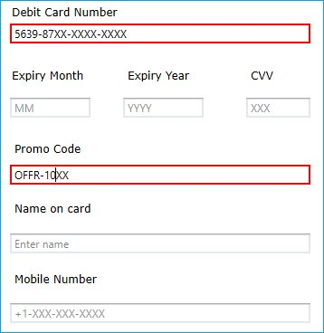

# About Syncfusion® WPF MaskedTextBox (SfMaskedEdit) Control

The [WPF MaskedTextBox](https://www.syncfusion.com/wpf-controls/maskedtextbox) (SfMaskedEdit) is an advanced version of the input control that restricts your input of certain types such as characters, text, and numbers by using a mask pattern. This control is used to create a template for providing information such as telephone numbers, IP addresses, product IDs, and so on.

## Key features

**Mask types** - Provides different set of mask types. The types are Simple, Regular and RegEx.

**PromptChar** - Provides support for setting the prompt characters manually.

**Validation** - Provides support to validate the input values can be done either during each key press or when the control lost its focus.

**Value** - Provides support to enter the Values and clipboard operations can be used with or without literal and prompt characters.

**Watermark** - Provides support to Watermark text can be used to display an instruction or important information.

**Customization** - Provides support to customize the UI of masked text box.

