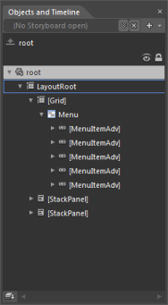
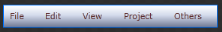
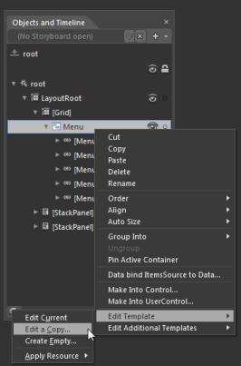
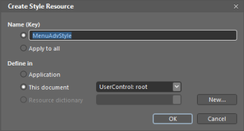
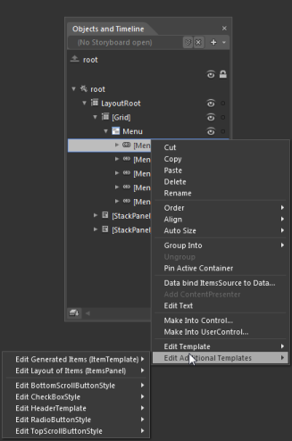
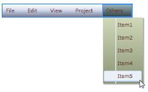

# Blendability Support in WPF Menu (MenuAdv)

You can customize MenuAdv and MenuItemAdv in Expression Blend using the following steps.

1. Open the WPF project containing MenuAdv in Expression Blend.
2. Add MenuAdv and MenuItemAdv to the design view.

After adding MenuAdv and MenuItemAdv to the design view, you can see MenuAdv and MenuItemAdv in the Objects and Timeline window.

3. Right-click MenuAdv and in the **EditTemplate** option select **Edit a Copy** and assign the key name to the resource edited. The following screenshot shows the Edit a Copy option.

The same process can be repeated to edit the MenuItemAdv style.

Users can also customize the appearance of the TopScrollButtonStyle, BottomScrollButtonStyle, CheckBoxStyle and RadioButtonStyle using the **Edit Additional Templates** option by doing right click on the MenuItemAdv and selecting the respective styles from the option.

The following screen shot shows the MenuAdv and MenuItemAdv templates edited and customized by using Expression Blend.

