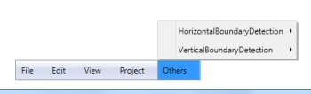

# Boundary Detection in WPF Menu (MenuAdv)

MenuItemAdv detects the boundaries and opens its submenu in the opposite direction, when the submenu crosses the boundary in both horizontal and vertical directions. In the case of Vertical direction, if the MenuItemAdv which opens the submenu is not the item of MenuAdv the submenu will only adjust its position and it will not open in opposite direction.

### Use Case Scenarios

MenuAdv will be very useful when the number of submenu item levels are more and the opening of the submenu crosses the boundary, this feature allows the submenu be always visible by adjusting its position.

### Sample Link

WPF Sample Browser-> Tools -> MenuAdv -> MenuAdv Demo

