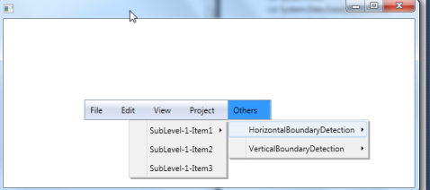
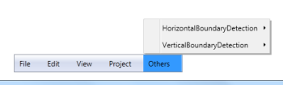
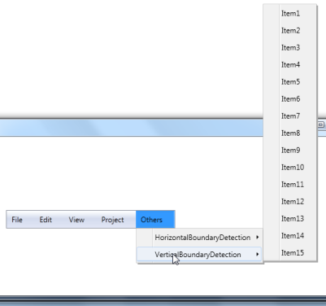

# Boundary Detection in WPF Menu (MenuAdv)

MenuItemAdv detects the screen boundaries and opens its submenu in the opposite direction when the submenu crosses the boundary in both horizontal and vertical directions. In the case of the vertical direction, if the MenuItemAdv that opens the submenu is not an item of MenuAdv, the submenu will only adjust its position, and it will not open in the opposite direction.

## Use Case Scenarios

MenuAdv will be very useful when the number of submenu item levels are more and the opening of the submenu crosses the boundary. This feature allows the submenu to always be visible by adjusting its position.

### Sample Link

WPF Sample Browser-> Tools -> MenuAdv -> MenuAdv Demo

