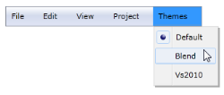
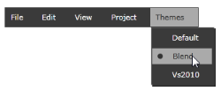
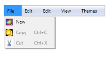

# Command Binding and Command Target Support in WPF Menu (MenuAdv)

Commands are a way to bind the UI to the logic that performs the action, which is to be executed. MenuAdv supports command binding. When users press the Enter key or click to select an item, the command will be triggered. This can be attained by using the Command and CommandParameter properties of MenuItemAdv.

The command target is the element on which the command is to be executed with regards to a RoutedCommand and routing of the Executed and CanExecute starts. This can be attained by using the CommandTarget property of MenuItemAdv.

### Use Case Scenarios

MenuAdv helps users handle any command that can be routed outside the boundaries of the logical tree and do not require handling logic in code behind.

## Using the Command Binding Support in an Application

To use the Command Binding support in an application users have to create a DelegateCommand class, which is obtained from the ICommand interface in the ViewModel sample class, which can be used to bind the command in the sample WPF application. The Command can be bound to MenuItemAdv by using the Command property and the target element can be bound to MenuItemAdv by using the CommandTarget property, as shown in the following code snippets.




<shared:MenuAdv x:Name="Menu">               
 <shared:MenuItemAdv Header="File">           
 <shared:MenuItemAdv Header="New">                
 <shared:MenuItemAdv.Icon>                          
 <Image Source="/MenuControlDemo; component/Images/NewIcon.jpg"/>                     
 </shared:MenuItemAdv.Icon>                   
 </shared:MenuItemAdv>                   
 <shared:MenuItemAdv Command="Copy"     CommandTarget="{Binding ElementName=textbox}">          
 <shared:MenuItemAdv.Icon>                            
 <Image Source="/MenuControlDemo; component/Images/CopyIcon.jpg"/>              
 </shared:MenuItemAdv.Icon>                   
 </shared:MenuItemAdv>                   
 <shared:MenuItemAdv Command="Cut"    CommandTarget="{Binding ElementName=textbox}">         
 <shared:MenuItemAdv.Icon>                            
 <Image Source="/MenuControlDemo;   component/Images/CutIcon.jpg"/>       
 </shared:MenuItemAdv.Icon>                  
 </shared:MenuItemAdv>               
 </shared:MenuItemAdv>                
 <shared:MenuItemAdv Header="Edit"/>    
 <shared:MenuItemAdv Header="View"/>              
 <shared:MenuItemAdv Header="Themes">                   
 <shared:MenuItemAdv IsCheckable="True" Header="Default"  CheckIconType="RadioButton" GroupName="Themes" IsChecked="True" CommandParameter="Default" Command="{Binding ElementName=root, Path=MyCommand}"/>               
 <shared:MenuItemAdv IsCheckable="True" Header="Blend"  CheckIconType="RadioButton" GroupName="Themes" IsChecked="False" CommandParameter="Blend" Command="{Binding ElementName=root, Path=MyCommand}"/>              
 <shared:MenuItemAdv IsCheckable="True" Header="Vs2010"  CheckIconType="RadioButton" GroupName="Themes" IsChecked="False" CommandParameter="Vs2010" Command="{Binding ElementName=root, Path=MyCommand}"/>        
 </shared:MenuItemAdv></shared:MenuAdv><TextBox x:Name="textbox"/>




public partial class MainPage : UserControl
{       
 public MainPage()       
 {            
 InitializeComponent();       
 }        
 private DelegateCommand myCommand;       
 public DelegateCommand MyCommand       
 {            
 get            
 {               
 if (myCommand == null)               
 {                    
 myCommand = new DelegateCommand(ApplyTheme);                
 }                
 return myCommand;           
 }        
 }        
 private void ApplyTheme(object visualStyle)        
 {            
 SkinManager.SetVisualStyle(this,(Syncfusion.Windows.Controls.Theming.VisualStyle)(visualStyle));      
 }
 }

public class DelegateCommand : ICommand  
  {       
  public event EventHandler CanExecuteChanged;       
  readonly Predicate<Object> _canExecute = null;      
 readonly Action<Object> _executeAction = null;       
 public DelegateCommand(Action<object> executeAction, Predicate<Object> canExecute)        
 {           
 _executeAction = executeAction;          
 _canExecute = canExecute;      
 }        
 public DelegateCommand(Action<object> executeAction) : this(executeAction, null)    
 {            
 _executeAction = executeAction;        
 }        
 public void UpdateCanExecute()        
 {          
 if (CanExecuteChanged != null)               
 CanExecuteChanged(this, new EventArgs());    
 }        
 public bool CanExecute(object parameter)      
 {        
 return _canExecute == null || _canExecute(parameter);     
 }        public void Execute(object parameter)       
 {           
 if (_executeAction != null)         
 _executeAction(parameter);          
 UpdateCanExecute();      
 }   
 }



### Properties

The properties for the Command Binding support are described in the following tabulation:

<table>
<tr>
<th>
Property </th><th>
Description </th><th>
Type </th><th>
Data Type </th></tr>
<tr>
<td>
Command</td><td>
Gets or sets the Command of MenuItemAdv.</td><td>
DependencyProperty</td><td>
ICommand(null)</td></tr>
<tr>
<td>
CommandParameter</td><td>
Gets or sets the CommandParameter of MenuItemAdv.</td><td>
DependencyProperty</td><td>
String(null)</td></tr>
<tr>
<td>
CommandTarget</td><td>
Gets or sets the CommandTarget of MenuItemAdv.</td><td>
DependencyProperty</td><td>
IInputElement(null)</td></tr>
</table>

### Sample Link

WPF Sample Browser-> Tools -> MenuAdv -> MenuAdv Demo

