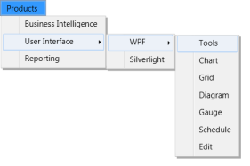

# Data Binding in WPF Menu (MenuAdv)

The topics under this section explain the data binding support for the MenuAdv control.

## Data-Binding to Objects

The MenuAdv control also supports binding to objects. The following example shows this.

1. Create a class that act as a model for MenuAdv.

   ~~~csharp

		public class Model

		{

		public Model()

		{

		SubItems = new ObservableCollection<Model>();

		}

		public string Header { get; set; }

		public ObservableCollection<Model> SubItems { get; set; }

		}

   ~~~

2. Create a ViewModel class and initialize the items.

   ~~~csharp

			public class ViewModel

			{

			public ViewModel()

			{

			MenuItems = new ObservableCollection<Model>();

			PopulateData();

			}

			public ObservableCollection<Model> MenuItems { get; set; }

			private void PopulateData()

			{

			Model product = new Model() { Header = "Products" };

			PopulateSubSubItems(product);

			MenuItems.Add(product);            

			}

			private void PopulateSubSubItems(Model product)

			{

			Model bi = new Model() { Header = "Business Intelligence" };

			Model ui = new Model() { Header = "User Interface" };

			Model wpf = new Model() { Header = "WPF" };

			Model tools = new Model() { Header = "Tools" };

			Model chart = new Model() { Header = "Chart" };

			Model grid = new Model() { Header = "Grid" };

			Model diagram = new Model() { Header = "Diagram" };

			Model gauge = new Model() { Header = "Gauge" };

			Model schedule = new Model() { Header = "Schedule" };

			Model edit = new Model() { Header = "Edit" };

			wpf.SubItems.Add(tools);

			wpf.SubItems.Add(chart);

			wpf.SubItems.Add(grid);

			wpf.SubItems.Add(diagram);

			wpf.SubItems.Add(gauge);

			wpf.SubItems.Add(schedule);

			wpf.SubItems.Add(edit);

			Model sl = new Model() { Header = "Silverlight" };

			ui.SubItems.Add(wpf);

			ui.SubItems.Add(sl);

			Model reporting = new Model() { Header = "Reporting" };

			product.SubItems.Add(bi);

			product.SubItems.Add(ui);

			product.SubItems.Add(reporting);

			}

			}

   ~~~

3. Create a ViewModel instance and use it as DataContext for the root window.

   ~~~xaml

		<Window.DataContext>

		<local:ViewModel/>

		</Window.DataContext>

   ~~~

4. Now configure the ItemsSource and ItemTemplate of MenuAdv.

   ~~~xaml

		<syncfusion:MenuAdv ItemsSource="{Binding MenuItems}">

		<syncfusion:MenuAdv.ItemTemplate>

		<HierarchicalDataTemplate ItemsSource="{Binding SubItems}">

		<TextBlock Text="{Binding Header}" />

		</HierarchicalDataTemplate>

		</syncfusion:MenuAdv.ItemTemplate>

		</syncfusion:MenuAdv>

   ~~~

   Implementing the above code will generate the following control.

   

## Data-Biding with XML

An XML file can also be used as _ItemsSource_ for the MenuAdv control. The following example illustrates this.

1. Create an XML file with the following details as follows and name it as Data.xml.

   ~~~xaml

		<Categories>

		<Root Name="Products" >

		<SubItem Name="User Interface" >

		<SubItem Name="ASP .NET"/>

		<SubItem Name="ASP .NET MVC"/>

		<SubItem Name="WPF">

		<SubItem Name="Tools"/>

		<SubItem Name="Chart"/>

		<SubItem Name="Grid"/>

		<SubItem Name="Diagram"/>

		<SubItem Name="Gauge"/>

		<SubItem Name="Schedule"/>

		<SubItem Name="Edit"/>

		</SubItem>

		<SubItem Name="Silverlight"/>

		<SubItem Name="Mobile MVC"/>

		<SubItem Name="Windows Phone"/>

		<SubItem Name="Windows Forms"/>

		</SubItem>

		<SubItem Name="Business Intelligence">

		<SubItem Name="WPF"/>

		<SubItem Name="ASP.NET"/>

		<SubItem Name="ASP.NET MVC"/>

		<SubItem Name="Silverlight"/>

		</SubItem>

		<SubItem Name="Reporting">

		<SubItem Name="WPF"/>

		<SubItem Name="Windows Forms"/>

		</SubItem>   

		</Root>

		</Categories>

   ~~~

2. Add XmlDataProvider for the above XML document.

   ~~~xaml

		<XmlDataProvider Source="Data.xml" 
		x:Key="xmlSource" XPath="Categories"/> 

   ~~~

3. Set ItemsSource property for the MenuAdv.

   ~~~xaml

		<syncfusion:MenuAdv	ItemsSource="{Binding Source={StaticResource xmlSource}, XPath=Root}" >

		<syncfusion:MenuAdv.ItemTemplate>

		<HierarchicalDataTemplate ItemsSource="{Binding 			XPath=SubItem}">

		<TextBlock Text="{Binding XPath=@Name}" />

		</HierarchicalDataTemplate>

		</syncfusion:MenuAdv.ItemTemplate>

		</syncfusion:MenuAdv>

   ~~~

   This will create the following MenuAdv control.

   

