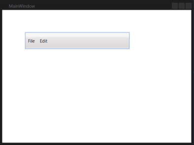

# Getting Started with Menu (MenuAdv)

This section provides a quick overview for working with the Menu ([MenuAdv](https://help.syncfusion.com/cr/wpf/Syncfusion.Windows.Shared.MenuAdv.html)).

## Structure of the MenuAdv Control

## Assembly deployment
Refer to the [control dependencies](https://help.syncfusion.com/wpf/control-dependencies#menuadv) section to get the list of assemblies or NuGet package that needs to be added as a reference to use the [MenuAdv](https://help.syncfusion.com/cr/wpf/Syncfusion.Windows.Shared.MenuAdv.html) control in any application.

You can find more details about installing the NuGet package in a WPF application in the following link:
[How to install nuget packages](https://help.syncfusion.com/wpf/visual-studio-integration/nuget-packages)

>**Important**
Starting with v16.2.0.x, if you refer to Syncfusion assemblies from trial setup or from the NuGet feed, include a license key in your projects. Refer to this [link](https://help.syncfusion.com/common/essential-studio/licensing/license-key) to learn about registering Syncfusion license key in your WPF application to use our components.

## Creating Application with MenuAdv control
In this walk through, user will create a WPF application that contains [MenuAdv](https://help.syncfusion.com/cr/wpf/Syncfusion.Windows.Shared.MenuAdv.html) control.
1. [Creating project](#Creating-the-project)
2. [Adding control via designer](#Adding-control-via-designer)
3. [Adding control manually in XAML](#Adding-control-manually-in-XAML)
4. [Adding control manually in C#](#Adding-control-manually-in-C#)
5. [Creating Data Model for sample application](#Creating-Data-Model-for-sample-application)
6. [Binding to Data ](#Creating-Data-Model-for-sample-application)

## Creating project 
Below section provides detailed information to create new project using [MenuAdv](https://help.syncfusion.com/cr/wpf/Syncfusion.Windows.Shared.MenuAdv.html).

## Adding control via designer
The [MenuAdv](https://help.syncfusion.com/cr/wpf/Syncfusion.Windows.Shared.MenuAdv.html) control can be added to the application in VisualStudio or ExpressionBlend by dragging it from Toolbox and dropping it in designer. The required assembly will be added automatically.

### Through Visual Studio

The following are the steps to create the [MenuAdv](https://help.syncfusion.com/cr/wpf/Syncfusion.Windows.Shared.MenuAdv.html) control using Visual Studio.

1. Drag [MenuAdv](https://help.syncfusion.com/cr/wpf/Syncfusion.Windows.Shared.MenuAdv.html) from the Visual Studio Toolbox and drop it in the designer.

   

2. Select the [MenuAdv](https://help.syncfusion.com/cr/wpf/Syncfusion.Windows.Shared.MenuAdv.html) and go to properties.

3. Click the three dotted button given in Items property. Collection Editor window will open.

   

4. Using the Collection Editor, add the GroupBarItems and configure their properties.

### Through Expression Blend

The [MenuAdv](https://help.syncfusion.com/cr/wpf/Syncfusion.Windows.Shared.MenuAdv.html) control can also be created and configured using Expression Blend by following steps.

1. Create a WPF project in the Expression Blend and refer the following assembly.
    
    * Syncfusion.Shared.Wpf

2. Search for [MenuAdv](https://help.syncfusion.com/cr/wpf/Syncfusion.Windows.Shared.MenuAdv.html) in the Toolbox.

   

3. Drag the [MenuAdv](https://help.syncfusion.com/cr/wpf/Syncfusion.Windows.Shared.MenuAdv.html) to designer to generate an empty menu bar. 

4. To add the [MenuItemAdv](https://help.syncfusion.com/cr/wpf/Syncfusion.Windows.Shared.MenuItemAdv.html) to the [MenuAdv](https://help.syncfusion.com/cr/wpf/Syncfusion.Windows.Shared.MenuAdv.html) control, select the [MenuAdv](https://help.syncfusion.com/cr/wpf/Syncfusion.Windows.Shared.MenuAdv.html) and go to Properties area.

5. Click Items (Collection) under Common Properties.

   

6. Once the Collection Editor opens, click Add another item.  The Select Object window will open.

7. Select [MenuItemAdv](https://help.syncfusion.com/cr/wpf/Syncfusion.Windows.Shared.MenuItemAdv.html) by typing [MenuItemAdv](https://help.syncfusion.com/cr/wpf/Syncfusion.Windows.Shared.MenuItemAdv.html) in the search box, and then click OK.

    

8. Configure the properties (such as header or icon) of the [MenuItemAdv](https://help.syncfusion.com/cr/wpf/Syncfusion.Windows.Shared.MenuItemAdv.html) using the properties in the Collection Editor. This will generate the following control.

	

N> You can customize the appearance of the [MenuItemAdv](https://help.syncfusion.com/cr/wpf/Syncfusion.Windows.Shared.MenuItemAdv.html) using the template-editing feature available in the Expression Blend.

## Adding control manually in XAML
In order to add [MenuAdv](https://help.syncfusion.com/cr/wpf/Syncfusion.Windows.Shared.MenuAdv.html) control manually in XAML, do the below steps,

1. Add the below required assembly references to the project,

   * Syncfusion.Shared.WPF

2. Import Syncfusion WPF schema **http://schemas.syncfusion.com/wpf** in XAML page.

3. Declare [MenuAdv](https://help.syncfusion.com/cr/wpf/Syncfusion.Windows.Shared.MenuAdv.html) in XAML page.



<syncfusion:MenuAdv  Height="25" VerticalAlignment="Top">
    <syncfusion:MenuItemAdv Header="Products" />
    <syncfusion:MenuItemAdv Header="Business Intelligence" />
    <syncfusion:MenuItemAdv Header="User Interface" >
        <syncfusion:MenuItemAdv Header="WPF  ">
            <syncfusion:MenuItemAdv Header="Tools"/>
            <syncfusion:MenuItemAdv Header="Chart"/>
            <syncfusion:MenuItemAdv Header="Grid"/>
            <syncfusion:MenuItemAdv Header="Diagram"/>
            <syncfusion:MenuItemAdv Header="Gauge"/>
            <syncfusion:MenuItemAdv Header="Schedule"/>
            <syncfusion:MenuItemAdv Header="Edit"/>
        </syncfusion:MenuItemAdv>
        <syncfusion:MenuItemAdv Header="Silverlight "/>
        <syncfusion:MenuItemAdv Header="Reporting" />
    </syncfusion:MenuItemAdv>
</syncfusion:MenuAdv>



## Adding control manually in C#
In order to add [MenuAdv](https://help.syncfusion.com/cr/wpf/Syncfusion.Windows.Shared.MenuAdv.html) control manually in C#, do the below steps,

1. Add the below required assembly references to the project,

    * Syncfusion.Shared.WPF

2. Import MenuAdv namespace **Syncfusion.Windows.Shared**.



using Syncfusion.Windows.Shared;



3. Create MenuAdv control instance and add it to the page.



MenuAdv mAdv = new MenuAdv();

MenuItemAdv product = new MenuItemAdv() { Header = "Products" };
MenuItemAdv bi = new MenuItemAdv() { Header = "Business Intelligence" };
MenuItemAdv ui = new MenuItemAdv() { Header = "User Interface" };
MenuItemAdv wpf = new MenuItemAdv() { Header = "WPF" };
MenuItemAdv tools = new MenuItemAdv() { Header = "Tools" };
MenuItemAdv chart = new MenuItemAdv() { Header = "Chart" };
MenuItemAdv grid = new MenuItemAdv() { Header = "Grid" };
MenuItemAdv diagram = new MenuItemAdv() { Header = "Diagram" };
MenuItemAdv gauge = new MenuItemAdv() { Header = "Gauge" };
MenuItemAdv schedule = new MenuItemAdv() { Header = "Schedule" };
MenuItemAdv edit = new MenuItemAdv() { Header = "Edit" };
MenuItemAdv sl = new MenuItemAdv() { Header = "Silverlight" };
MenuItemAdv reporting = new MenuItemAdv() { Header = "Reporting" };

wpf.Items.Add(tools);
wpf.Items.Add(chart);
wpf.Items.Add(grid);
wpf.Items.Add(diagram);
wpf.Items.Add(gauge);
wpf.Items.Add(schedule);
wpf.Items.Add(edit);
ui.Items.Add(wpf);
ui.Items.Add(sl);
product.Items.Add(bi);
product.Items.Add(ui);
product.Items.Add(reporting);
mAdv.Items.Add(product);
    
this.Content = mAdv;



[View sample in GitHub](https://github.com/SyncfusionExamples/WPF-menuadv-getting-started-sample)

## Set icon for Menu item

You can display image on left of the [MenuItemAdv](https://help.syncfusion.com/cr/wpf/Syncfusion.Windows.Shared.MenuItemAdv.html) control by setting the image source as value for [Icon](https://help.syncfusion.com/cr/wpf/Syncfusion.Windows.Shared.MenuItemAdv.html#Syncfusion_Windows_Shared_MenuItemAdv_Icon) property.





<Grid>
    <syncfusion:MenuAdv Height="25" VerticalAlignment="Top">
        <syncfusion:MenuItemAdv Header="File" >
            <syncfusion:MenuItemAdv Header="New">
                <syncfusion:MenuItemAdv.Icon>
                    <Image Source="NewIcon.png" Width="15" Height="15" />
                </syncfusion:MenuItemAdv.Icon>
            </syncfusion:MenuItemAdv>
            <syncfusion:MenuItemAdv Header="Open">
                <syncfusion:MenuItemAdv.Icon>
                    <Image Source="OpenIcon.png" Width="15" Height="15" />
                </syncfusion:MenuItemAdv.Icon>
            </syncfusion:MenuItemAdv>
            <syncfusion:MenuItemAdv Header="Save">
                <syncfusion:MenuItemAdv.Icon>
                    <Image Source="SaveIcon.png" Width="15" Height="15" />
                </syncfusion:MenuItemAdv.Icon>
            </syncfusion:MenuItemAdv>
            <syncfusion:MenuItemAdv Header="Close">
                <syncfusion:MenuItemAdv.Icon>
                    <Image Source="CloseIcon.png" Width="15" Height="15"/>
                </syncfusion:MenuItemAdv.Icon>
            </syncfusion:MenuItemAdv>
        </syncfusion:MenuItemAdv>
        <syncfusion:MenuItemAdv Header="Edit" />
        <syncfusion:MenuItemAdv Header="View" />
        <syncfusion:MenuItemAdv Header="Project" />
    </syncfusion:MenuAdv>
</Grid>



string path;
path = Path.GetFullPath(@"../../" +"NewIcon.png");

MenuAdv menuAdv = new MenuAdv()
{
VerticalAlignment = VerticalAlignment.Top,
Height = 25
};

Image image1 = new Image() { Height=15, Width = 15 };
Image image2= new Image() { Height = 15, Width = 15 };
Image image3 = new Image() { Height = 15, Width = 15 };
Image image4 = new Image() { Height = 15, Width = 15 };

MenuItemAdv File = new MenuItemAdv() { Header = "File"};
MenuItemAdv New = new MenuItemAdv() { Header = "New" };
MenuItemAdv Open = new MenuItemAdv() { Header = "Open" };
MenuItemAdv Save = new MenuItemAdv() { Header = "Save" };
MenuItemAdv Close = new MenuItemAdv() { Header = "Close" };
MenuItemAdv Edit = new MenuItemAdv() { Header = "Edit" };
MenuItemAdv View = new MenuItemAdv() { Header = "View" };
MenuItemAdv Project = new MenuItemAdv() { Header = "Project" };

image1.Source = new BitmapImage(new Uri(path));
New.Icon = image1;

path = Path.GetFullPath(@"../../" + "OpenIcon.png");
image2.Source = new BitmapImage(new Uri(path));
Open.Icon = image2;

path = Path.GetFullPath(@"../../" + "SaveIcon.png");
image3.Source = new BitmapImage(new Uri(path));
            Save.Icon = image3;

path = Path.GetFullPath(@"../../" + "CloseIcon.png");
image4.Source = new BitmapImage(new Uri(path));
Close.Icon = image4;

File.Items.Add(New);
File.Items.Add(Open);
File.Items.Add(Save);
File.Items.Add(Close);
menuAdv.Items.Add(File);
menuAdv.Items.Add(Edit);
menuAdv.Items.Add(View);
menuAdv.Items.Add(Project);



