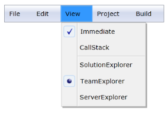

# MenuItemSeparator Support in WPF Menu (MenuAdv)

MenuItemSeparator is a line, which is used to separate MenuItemAdv’s. MenuItemSeparator can be included in the items list of MenuItemAdv.  

### Use Case Scenarios

MenuAdv helps users to separate MenuItemAdv’s by using MenuItemSeparator. In the case of separating the radio button group of items from other items, separator can be used.

## Adding the MenuItemSeparator Support to an Application 

MenuItemSeparator can be added to an application, as shown in the following code snippet.



<Window x:Class="MenuAdv.MainWindow"
        xmlns="http://schemas.microsoft.com/winfx/2006/xaml/presentation"
        xmlns:x="http://schemas.microsoft.com/winfx/2006/xaml"
        xmlns:d="http://schemas.microsoft.com/expression/blend/2008"
        xmlns:mc="http://schemas.openxmlformats.org/markup-compatibility/2006"
        xmlns:local="clr-namespace:Toolbar" xmlns:shared="http://schemas.syncfusion.com/wpf"
        mc:Ignorable="d"
        Title="Window1" Height="450" Width="800">
    <Grid>
        <shared:MenuAdv x:Name="Menu" Margin="10">

            <shared:MenuItemAdv Header="File"/>

            <shared:MenuItemAdv Header="Edit"/>

            <shared:MenuItemAdv Header="View">

                <shared:MenuItemAdv Header="Immediate" IsCheckable="True" CheckIconType="CheckBox" IsChecked="True"/>

                <shared:MenuItemAdv Header="CallStack" IsCheckable="True" CheckIconType="CheckBox" IsChecked="False"/>

                <shared:MenuItemSeparator/>

                <shared:MenuItemAdv Header="SolutionExplorer" IsCheckable="True" CheckIconType="RadioButton" GroupName="group1" IsChecked="False"/>

                <shared:MenuItemAdv Header="TeamExplorer" IsCheckable="True" CheckIconType="RadioButton" GroupName="group1" IsChecked="True"/>

                <shared:MenuItemAdv Header="ServerExplorer" IsCheckable="True" CheckIconType="RadioButton" GroupName="group1" IsChecked="False"/>

            </shared:MenuItemAdv>

            <shared:MenuItemAdv Header="Project"/>

            <shared:MenuItemAdv Header="Build"/>

        </shared:MenuAdv>
    </Grid>
</Window>



### Sample Link

WPF Sample Browser-> Tools -> MenuAdv -> MenuAdv Demo

