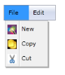

# Orientation Support in WPF Menu (MenuAdv)

The MenuAdv control can align its content vertically and horizontally by using the Orientation property of the MenuAdv class.

When the value of the Orientation property is set to Horizontal, the Items of MenuAdv will be arranged horizontally.

Similarly, when the value of the Orientation property is set to Vertical, the Items of MenuAdv will be arranged vertically.

### Use Case Scenarios

MenuAdv helps users to set the Menu items in Horizontal or Vertical orientations.

## Adding the Orientation Support to an Application

Users can add the Orientation support to MenuAdv used in the application as mentioned in the code snippet below.



<shared:MenuAdv x:Name="Menu"  Orientation="Horizontal”/>

<shared:MenuItemAdv Header="File">

<shared:MenuItemAdv Header="New">

<shared:MenuItemAdv.Icon>

<Image Source="/MenuControlDemo;component/Images/NewIcon.jpg"/>

</shared:MenuItemAdv.Icon>

</shared:MenuItemAdv>

<shared:MenuItemAdv Header="Copy">

<shared:MenuItemAdv.Icon>

<Image Source="/MenuControlDemo;component/Images/CopyIcon.jpg"/>

</shared:MenuItemAdv.Icon>

</shared:MenuItemAdv>

<shared:MenuItemAdv Header="Cut">

<shared:MenuItemAdv.Icon>

<Image Source="/MenuControlDemo;component/Images/CutIcon.jpg"/>

</shared:MenuItemAdv.Icon>

</shared:MenuItemAdv>

</shared:MenuItemAdv>

<shared:MenuItemAdv Header="Edit"/>

</shared:MenuAdv>


### Properties

The property for the Orientation support is described in the following tabulation:

<table>
<tr>
<th>
Property </th><th>
Description </th><th>
Type </th><th>
Data Type </th></tr>
<tr>
<td>
Orientation</td><td>
Gets or sets the Orientation of MenuAdv.</td><td>
DependencyProperty</td><td>
Orientation(Horizontal)</td></tr>
</table>

### Sample Link

WPF Sample Browser-> Tools -> MenuAdv -> MenuAdv Demo

## Expand Modes Support

Expand Modes in MenuAdv is used to open the submenu of each MenuItemAdv, which is added in MenuAdv by doing click to open the submenu or by doing mouse hover to open the submenu. MenuAdv supports two kinds of Expand Modes, namely ExpandOnClick and ExpandOnMouseOver, which can be obtained by using the ExpandMode property. 

### Use Case Scenarios

MenuAdv helps users to use Expand Modes to open the submenu of MenuItemAdv added in MenuAdv.

### Using the Expand Modes Support in an Application 

When the ExpandMode property is set to ExpandOnClick, you can open the submenu of each MenuItemAdv, which is added MenuAdv by clicking it. This type of expand mode is used to open menus in Windows operating system. Similarly, when the ExpandMode property is set to ExpandOnMouseOver, you can open the submenu of each MenuItemAdv, which is added in MenuAdv by moving the mouse pointer over it. Therefore, you need not click to open the submenu. You can achieve this functionality by using the ExpandMode property, as shown in the following code snippet.



<shared:MenuAdv x:Name="Menu"  ExpandMode="ExpandOnMouseOver”/>

<shared:MenuItemAdv Header="File">

<shared:MenuItemAdv Header="New">

<shared:MenuItemAdv.Icon>

<Image Source="/MenuControlDemo;component/Images/NewIcon.jpg"/>

</shared:MenuItemAdv.Icon>

</shared:MenuItemAdv>

<shared:MenuItemAdv Header="Copy">

<shared:MenuItemAdv.Icon>

<Image Source="/MenuControlDemo;component/Images/CopyIcon.jpg"/>

</shared:MenuItemAdv.Icon>

</shared:MenuItemAdv>

<shared:MenuItemAdv Header="Cut">

<shared:MenuItemAdv.Icon>

<Image Source="/MenuControlDemo;component/Images/CutIcon.jpg"/>

</shared:MenuItemAdv.Icon>

</shared:MenuItemAdv>

</shared:MenuItemAdv>

<shared:MenuItemAdv Header="Edit"/>

</shared:MenuAdv>



### Properties

The property for the Expand Modes support is described in the following tabulation:

<table>
<tr>
<th>
Property </th><th>
Description </th><th>
Type </th><th>
Data Type </th></tr>
<tr>
<td>
ExpandMode</td><td>
Gets or sets the ExpandMode of MenuAdv.</td><td>
DependencyProperty</td><td>
ExpandModes(ExpandOnClick)</td></tr>
</table>

### Sample Link

WPF Sample Browser-> Tools -> MenuAdv -> MenuAdv Demo

