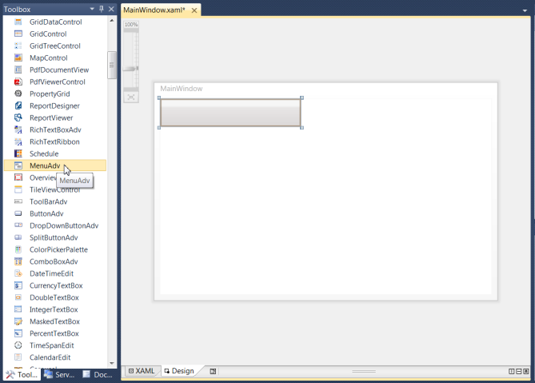
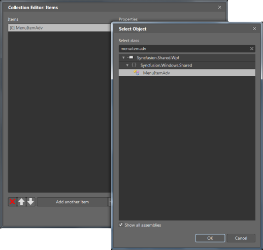

# Getting Started

## Structure of the MenuAdv Control

{  | markdownify }
{:.image }

## Creating the MenuAdv Control 

The MenuAdv control can be created through Visual Studio, Expression Blend, XAML, or C#. The following sections describe this.

### Through Visual Studio

The following are the steps to create the MenuAdv control using Visual Studio.

1. Drag MenuAdv from the Visual Studio Toolbox and drop it in the designer.

{  | markdownify }
{:.image }

2. Select the MenuAdv and go to properties.
3. Click on the button given in Items property. This will open the Collection Editor window.

{  | markdownify }
{:.image }

4. Using the Collection Editor, add the GroupBarItems and configure their properties.
### Through Expression Blend

The MenuAdv control can also be created and configured using Expression Blend. The following are the steps to do so.

1. Create a WPF project in the Expression Blend and reference the following assemblies.
1. Syncfusion.Shared.Wpf
2. Syncfusion.Core
2. Search for MenuAdv in the Toolbox.

{  | markdownify }
{:.image }

3. Drag the MenuAdv to the designer. This will generate an empty menu bar. 
4. To add the MenuItemAdvs to the MenuAdv control, select the MenuAdv and go to Properties area.
5. Click Items (Collection) under Common Properties.

{  | markdownify }
{:.image }

6. Once the Collection Editor opens, click Add another item.  The Select Object window will open.
7. Select MenuItemAdv by typing MenuItemAdv in the search box, and then click OK.

{  | markdownify }
{:.image }

8. Configure the properties (such as header or icon) of the MenuItemAdv using the properties in the Collection Editor. This will generate the following control.

{  | markdownify }
{:.image }

> _Note: You can customize the appearance of the MenuItemAdv using the template-editing feature available in the Expression Blend._

### Through XAML

The MenuAdv control can also be created through XAML. The following code example illustrates this.

[XAML]

&lt;syncfusion:MenuAdv&gt;

            &lt;syncfusion:MenuItemAdv Header="Products" &gt;

              &lt;syncfusion:MenuItemAdv Header="Business Intelligence" /&gt;              

                &lt;syncfusion:MenuItemAdv Header="User Interface" &gt;

                    &lt;syncfusion:MenuItemAdv Header="WPF  "&gt;

                        &lt;syncfusion:MenuItemAdv Header="Tools"/&gt;

                        &lt;syncfusion:MenuItemAdv Header="Chart"/&gt;

                        &lt;syncfusion:MenuItemAdv Header="Grid"/&gt;

                        &lt;syncfusion:MenuItemAdv Header="Diagram"/&gt;

                        &lt;syncfusion:MenuItemAdv Header="Gauge"/&gt;

                        &lt;syncfusion:MenuItemAdv Header="Schedule"/&gt;

                        &lt;syncfusion:MenuItemAdv Header="Edit"/&gt;

                    &lt;/syncfusion:MenuItemAdv&gt;

                    &lt;syncfusion:MenuItemAdv Header="Silverlight "/&gt;               

                &lt;syncfusion:MenuItemAdv Header="Reporting" /&gt;   

&lt;/syncfusion:MenuItemAdv&gt;

&lt;/syncfusion:MenuAdv&gt;

### Through C#

To create the MenuAdv control through C#, include the following namespace to the directives list.

[C#]

using Syncfusion.Windows.Shared;

 Next, create the MenuAdv as follows.

 [C#]

MenuAdv mAdv = new MenuAdv();

     MenuItemAdv product = new MenuItemAdv() { Header = "Products" };

     MenuItemAdv bi = new MenuItemAdv() { Header = "Business Intelligence" };            

       MenuItemAdv ui = new MenuItemAdv() { Header = "User Interface" };

          MenuItemAdv wpf = new MenuItemAdv() { Header = "WPF" };

            MenuItemAdv tools = new MenuItemAdv() { Header = "Tools" };

            MenuItemAdv chart = new MenuItemAdv() { Header = "Chart" };

            MenuItemAdv grid = new MenuItemAdv() { Header = "Grid" };

            MenuItemAdv diagram = new MenuItemAdv() { Header = "Diagram" };

            MenuItemAdv  gauge= new MenuItemAdv() { Header = "Gauge" };

            MenuItemAdv schedule = new MenuItemAdv() { Header = "Schedule" };

            MenuItemAdv edit = new MenuItemAdv() { Header = "Edit" };                         

            wpf.Items.Add(tools);

            wpf.Items.Add(chart);

            wpf.Items.Add(grid);

            wpf.Items.Add(diagram);

            wpf.Items.Add(gauge);

            wpf.Items.Add(schedule);

            wpf.Items.Add(edit);

          MenuItemAdv sl = new MenuItemAdv() { Header = "Silverlight" };

          ui.Items.Add(wpf);

          ui.Items.Add(sl);

        MenuItemAdv reporting = new MenuItemAdv() { Header = "Reporting" };

        product.Items.Add(bi);

        product.Items.Add(ui);                

        product.Items.Add(reporting);

   mAdv.Items.Add(product);

