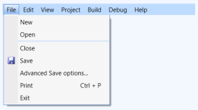

# Styling

Styling can be applied to the MenuAdv control. This control supports the following built-in styles:

1. Office2007Blue
2. Office2007Black
3. Office2007Silver
4. Office2010Blue
5. Office2010Black
6. Office2010Silver
7. Blend
8. VS2010
9. Metro
10. Transparent

These styles can be applied to the control using XAML and C#. The following code example shows how to apply Office2007Blue style to the MenuAdv control.


<syncfusion:MenuAdv        syncfusion:SkinStorage.VisualStyle="Office2010Blue"/>    



SkinStorage.SetVisualStyle(menuAdvinstance, "Office2010Blue");</td></tr>


The following illustrations show the MenuAdv control that is applied with different built-in styles.

