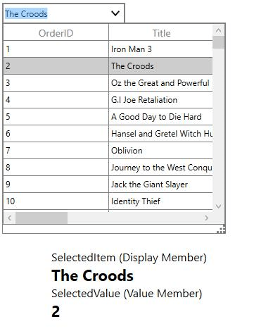
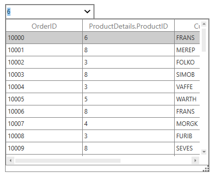
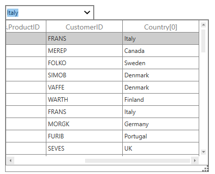

# Data Binding in WPF Multi Column Dropdown (SfMultiColumnDropDown)

You can populate the drop down list for SfMultiColumnDropDownControl by setting [ItemsSource](https://help.syncfusion.com/cr/wpf/Syncfusion.UI.Xaml.Grid.SfMultiColumnDropDownControl.html#Syncfusion_UI_Xaml_Grid_SfMultiColumnDropDownControl_ItemsSource) property.
[DisplayMember](https://help.syncfusion.com/cr/wpf/Syncfusion.UI.Xaml.Grid.SfMultiColumnDropDownControl.html#Syncfusion_UI_Xaml_Grid_SfMultiColumnDropDownControl_DisplayMember) denotes the path to a value on the data object for visual presentation of the Textbox and [ValueMember](https://help.syncfusion.com/cr/wpf/Syncfusion.UI.Xaml.Grid.SfMultiColumnDropDownControl.html#Syncfusion_UI_Xaml_Grid_SfMultiColumnDropDownControl_ValueMember) denotes the path to a value on the data object to get the [SelectedValue](https://help.syncfusion.com/cr/wpf/Syncfusion.UI.Xaml.Grid.SfMultiColumnDropDownControl.html#Syncfusion_UI_Xaml_Grid_SfMultiColumnDropDownControl_SelectedValue). 



<Grid>
    <Grid.RowDefinitions>
        <RowDefinition Height="400" />
        <RowDefinition Height="*" />
    </Grid.RowDefinitions>
<syncfusion:SfMultiColumnDropDownControl x:Name=”sfMultiColumn”
                                         Width=”175”
                                         Height=”30”
                                         Grid.Row="0"
                                         SelectedIndex=”0”
                                         DisplayMember=”Title”
                                         ValueMember=”OrderID”
                                         ItemsSource=”{Binding Orders}” />
<StackPanel Grid.Row="1" Margin="100,0,0,0">
    <TextBlock FontSize="16" Text="SelectedItem (Display Member) " />
    <TextBlock FontSize="22"
               FontWeight="Bold"
               Text="{Binding ElementName= ”sfMultiColumn”,
                              Mode=TwoWay,
                              Path=SelectedItem.Title}" />
    <TextBlock FontSize="16" Text="SelectedValue (Value Member) " />
    <TextBlock FontSize="22"
               FontWeight="Bold"
               Text="{Binding ElementName= ”sfMultiColumn”,
                              Mode=TwoWay,
                              Path=SelectedValue}" />
</StackPanel>
</Grid>



Here, `DisplayMember` is `Title` hence the Title property in underlying data object is displayed in the textbox and the `ValueMember` is `OrderID` hence the OrderID property in underlying data object is considered as the `SelectedValue`.

## Binding with complex and indexer properties

SfMultiColumnDropDownControl provides support to display complex and indexer properties in its columns and also you can set complex and indexer properties as path to `DisplayMember` and `ValueMember` properties.

Binding with complex properties



<syncfusion:SfMultiColumnDropDownControl x:Name=”sfMultiColumn”
                                         Width=”175”
                                         Height=”30”
                                         SelectedIndex=”0”
                                         AutoGenerateColumns=”false”
                                         DisplayMember=”ProductDetails.ProductID”
                                         ValueMember=”ProductDetails.ProductID”
                                         ItemsSource=”{Binding Orders}”>
    <syncfusion:SfMultiColumnDropDownControl.Columns>
        <syncfusion:GridTextColumn MappingName=”OrderID” />
        <syncfusion:GridTextColumn MappingName=”ProductDetails.ProductID” />
        <syncfusion:GridTextColumn MappingName=”CustomerID” />
        <syncfusion:GridTextColumn MappingName=”Country” />
    </syncfusion:SfMultiColumnDropDownControl.Columns>
</syncfusion:SfMultiColumnDropDownControl>



Binding with indexer properties



<syncfusion:SfMultiColumnDropDownControl x:Name=”sfMultiColumn”
                                         Width=”175”
                                         Height=”30”
                                         SelectedIndex=”0”
                                         AutoGenerateColumns=”false”
                                         DisplayMember=”Country[0]”
                                         ValueMember=”Country[0]”
                                         ItemsSource=”{Binding Orders}”>
    <syncfusion:SfMultiColumnDropDownControl.Columns>
        <syncfusion:GridTextColumn MappingName=”OrderID” />
        <syncfusion:GridTextColumn MappingName=”ProductID” />
        <syncfusion:GridTextColumn MappingName=”CustomerID” />
        <syncfusion:GridTextColumn MappingName=”Country[0]” />
    </syncfusion:SfMultiColumnDropDownControl.Columns>
</syncfusion:SfMultiColumnDropDownControl>



