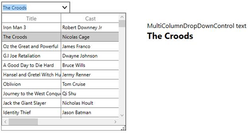

# Editing and AutoComplete in WPF Multi Column Dropdown

SfMultiColumnDropDownControl allows you to edit via TextBox. You can make the editor as read-only by setting [SfMultiColumnDropDownControl.ReadOnly](https://help.syncfusion.com/cr/wpf/Syncfusion.UI.Xaml.Grid.SfMultiColumnDropDownControl.html#Syncfusion_UI_Xaml_Grid_SfMultiColumnDropDownControl_ReadOnly) property as `true`.

## Auto Completion of Text

SfMultiColumnDropDownControl auto append the text based on `ItemsSource` when end-user edits in the TextBox when setting [AllowAutoComplete](https://help.syncfusion.com/cr/wpf/Syncfusion.UI.Xaml.Grid.SfMultiColumnDropDownControl.html#Syncfusion_UI_Xaml_Grid_SfMultiColumnDropDownControl_AllowAutoComplete) to `true`.
 

### Limitations
When setting DataTable as `ItemsSource`, `AllowAutoComplete` is not supported.

## Auto Increment

You can allow end-user to change the SelectedItem while mouse wheel over the control by setting [AllowSpinOnMouseWheel](https://help.syncfusion.com/cr/wpf/Syncfusion.UI.Xaml.Grid.SfMultiColumnDropDownControl.html#Syncfusion_UI_Xaml_Grid_SfMultiColumnDropDownControl_AllowSpinOnMouseWheel) as `true`.
 
## Null Value Support

You can allow the null values in editor by setting [AllowNullInput](https://help.syncfusion.com/cr/wpf/Syncfusion.UI.Xaml.Grid.SfMultiColumnDropDownControl.html#Syncfusion_UI_Xaml_Grid_SfMultiColumnDropDownControl_AllowNullInput) as `true`. While deleting the text in Textbox, then the SelectedItem will be null.

Note: `AllowNullInput` will work only when the underlying property type is nullable.

## Open popup while editing

You can open the popup while typing the value in editor itself by setting [AllowImmediatePopup](https://help.syncfusion.com/cr/wpf/Syncfusion.UI.Xaml.Grid.SfMultiColumnDropDownControl.html#Syncfusion_UI_Xaml_Grid_SfMultiColumnDropDownControl_AllowImmediatePopup) as `true`.
 
## Open popup while loading

You can specify whether the popup is need to open or close by setting [IsDropDownOpen](https://help.syncfusion.com/cr/wpf/Syncfusion.UI.Xaml.Grid.SfMultiColumnDropDownControl.html#Syncfusion_UI_Xaml_Grid_SfMultiColumnDropDownControl_IsDropDownOpen) as `true`. You can open the popup while loading the SfMultiColumnDropDownControl itself by setting `IsDropDownOpen` as `true`.



<syncfusion:SfMultiColumnDropDownControl x:Name="sfmultiColumn"
                                         Width="175"
                                         Height="30"
                                         IsDropDownOpen="True"
                                         AutoGenerateColumns="false"
                                         DisplayMember="OrderID"
                                         ItemsSource="{Binding Orders}"
                                         SelectedIndex="0"
                                         ValueMember="OrderID">
    <syncfusion:SfMultiColumnDropDownControl.Columns>
        <syncfusion:GridCurrencyColumn MappingName="OrderID" />
        <syncfusion:GridTextColumn MappingName="CustomerID" />
        <syncfusion:GridTextColumn MappingName="Country" />
    </syncfusion:SfMultiColumnDropDownControl.Columns>
</syncfusion:SfMultiColumnDropDownControl>


sfMultiColumn.Loaded += sfMultiColumn_Loaded;

void sfMultiColumn_Loaded(object sender, RoutedEventArgs e)
{
      (sender as SfMultiColumnDropDownControl).IsDropDownOpen = true;
}



## Keyboard Interactions
SfMultiColumnDropDownControl provides keyboard support for interaction. You can open the `DropDownGrid` without clicking the toggle button in SfMultiColumnDropDownControl by using the keyboard shortcuts.

<table>
<tr>
<th>
Keyboard shortcut
</th>
<th>
Description
</th>
</tr>
<tr>
<td>
Enter
</td>
<td>
If the popup is opened, then closes the popup and sets the `SelectedItem`.
</td>
</tr>
<tr>
<td>
Esc
</td>
<td>
If the popup is opened, then closes the popup and reverts the modified value. 
</td>
</tr>
<tr>
<td>
F4, ALT + UP, ALT + Down
</td>
<td>
Shortcuts to open and close the popup.
</td>
</tr>
</table>

## Getting editor text

You can access the text displayed in the Textbox by using [SfMultiColumnDropDownControl.Text](https://help.syncfusion.com/cr/wpf/Syncfusion.UI.Xaml.Grid.SfMultiColumnDropDownControl.html#Syncfusion_UI_Xaml_Grid_SfMultiColumnDropDownControl_Text) property.



<Grid>
    <Grid.ColumnDefinitions>
        <ColumnDefinition Width="400" />
            <ColumnDefinition Width="*" />
    </Grid.ColumnDefinitions>
<syncfusion:SfMultiColumnDropDownControl x:Name=”sfmultiColumn”
                                         Width=”175”
                                         Height=”30”
                                         Grid.Column="0"
                                         SelectedIndex=”0”
                                         DisplayMember=”Cast”
                                         ValueMember=”Title”
                                         ItemsSource=”{Binding Orders}” />
        <StackPanel Grid.Column="1" Margin="0,100,0,0">
    <TextBlock FontSize="16" Text="MultiColumnDropDownControl text " />
    <TextBlock FontSize="22"
               FontWeight="Bold"
               Text="{Binding ElementName= sfmultiColumn,
                              Mode=TwoWay,
                              Path=Text}" />    
</StackPanel>
</Grid>


var text = this.sfMultiColumn.Text;



## Selecting text when editor got focus

You can select the text displayed in the textbox when it got the focus from any other control by setting [TextSelectionOnFocus](https://help.syncfusion.com/cr/wpf/Syncfusion.UI.Xaml.Grid.SfMultiColumnDropDownControl.html#Syncfusion_UI_Xaml_Grid_SfMultiColumnDropDownControl_TextSelectionOnFocus) property.
