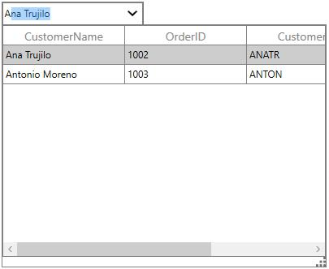
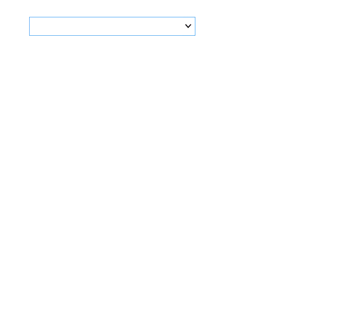
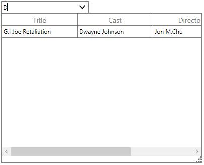

# Filtering in WPF Multi Column Dropdown (SfMultiColumnDropDown)

SfMultiColumnDropDownControl provides support to filter the drop down display list based on typed text by setting [AllowIncrementalFiltering](https://help.syncfusion.com/cr/wpf/Syncfusion.UI.Xaml.Grid.SfMultiColumnDropDownControl.html#Syncfusion_UI_Xaml_Grid_SfMultiColumnDropDownControl_AllowIncrementalFiltering) as `true`. The records are filter based on `DisplayMember`. 

By default, drop down list is filtered based on `SearchCondition.StartsWith` condition. You can change the filtering search condition by setting [SearchCondition](https://help.syncfusion.com/cr/wpf/Syncfusion.UI.Xaml.Grid.SfMultiColumnDropDownControl.html#Syncfusion_UI_Xaml_Grid_SfMultiColumnDropDownControl_SearchCondition) (StartsWith, Contains, Equals options).



<syncfusion:SfMultiColumnDropDownControl x:Name="sfMultiColumn "
                                         Width="175"
                                         Height="30"
                                         AutoGenerateColumns="False"
                                         DisplayMember="CustomerName"
                                         ItemsSource="{Binding Orders}"
                                         SelectedIndex="4"
                                         ValueMember="CustomerName">
    <syncfusion:SfMultiColumnDropDownControl.Columns>
        <syncfusion:GridTextColumn MappingName="CustomerName" />
        <syncfusion:GridTextColumn MappingName="OrderID" />
        <syncfusion:GridTextColumn MappingName="CustomerID" />
        <syncfusion:GridTextColumn MappingName="Country" />
    </syncfusion:SfMultiColumnDropDownControl.Columns>
</syncfusion:SfMultiColumnDropDownControl>



## Case-Sensitive Filtering

You can decides whether the automatic completion of text and the filtering are case-sensitive or not by setting [AllowCaseSensitiveFiltering](https://help.syncfusion.com/cr/wpf/Syncfusion.UI.Xaml.Grid.SfMultiColumnDropDownControl.html#Syncfusion_UI_Xaml_Grid_SfMultiColumnDropDownControl_AllowCaseSensitiveFiltering) as true.

## Ignore Diacritic Sensitivity

By default, SfMultiColumnDropDownControl filter or auto-complete the data based on an input character only. For example, if we type normal character in editor, it will not filter or auto-complete the record containing a diacritic character. You can disable the [AllowDiacriticSensitiveFiltering](https://help.syncfusion.com/cr/wpf/Syncfusion.UI.Xaml.Grid.SfMultiColumnDropDownControl.html#Syncfusion_UI_Xaml_Grid_SfMultiColumnDropDownControl_AllowDiacriticSensitiveFiltering) property if you want to filter or auto-complete data that also contains a diacritic character while typing normal character in the editor.
    


<Syncfusion:SfMultiColumnDropDownControl x:Name="sfMultiColumn"
                                         HorizontalAlignment="Left"
                                         AutoGenerateColumns="False"
                                         AllowIncrementalFiltering="True"
                                         AllowImmediatePopup="True"    
                                         AllowDiacriticSensitiveFiltering="False"   
                                         VerticalAlignment="Top"
                                         DisplayMember="Continent"
                                         ItemsSource="{Binding PopulationDetails}">
</Syncfusion:SfMultiColumnDropDownControl>



## How to filter SfMultiColumnDropDownControl based on various column values

By default, SfMultiColumnDropDownControl filter the text based on `DisplayMember` (considers single column text only). You can also filter the text based on multiple columns by overriding the [FilterRecord](https://help.syncfusion.com/cr/wpf/Syncfusion.UI.Xaml.Grid.SfMultiColumnDropDownControl.html#Syncfusion_UI_Xaml_Grid_SfMultiColumnDropDownControl_FilterRecord_System_Object_) method in `SfMultiColumnDropDownControl` and use the [SearchText](https://help.syncfusion.com/cr/wpf/Syncfusion.UI.Xaml.Grid.SfMultiColumnDropDownControl.html#Syncfusion_UI_Xaml_Grid_SfMultiColumnDropDownControl_SearchText) property to get the entered text in editor.
 


public class CustomMultiColumnControl : SfMultiColumnDropDownControl
{
    /// 

    /// Returns true if the item is displayed in the Filtered List, otherwise returns false.
    /// 

    /// <param name="item"></param>
    /// <returns></returns>
    
    protected override bool FilterRecord(object item)
    {
        var _item = item as GrossingMoviesList;
        var result = (_item.Title.Contains(this.SearchText)) || (_item.Cast.Contains(this.SearchText));
        return result;
        }
      }


<local:CustomMultiColumnControl x:Name="sfMultiColumn"
                                Width="175"
                                Height="25"
                                AutoGenerateColumns="False"
                                DisplayMember="Title"
                                ItemsSource="{Binding MoviesLists}"
                                SelectedIndex="2"
                                ValueMember="Title">
            <local:CustomMultiColumnControl.Columns>
                <syncfusion:GridTextColumn MappingName="Title" />
                <syncfusion:GridTextColumn MappingName="Cast" />
                <syncfusion:GridTextColumn MappingName="Director" />
                <syncfusion:GridTextColumn MappingName="Rating" />
            </local:CustomMultiColumnControl.Columns>
        </local:CustomMultiColumnControl>



Here, `Title` is defined as a `DisplayMember`. But it also searches the match case from the `Cast` column also while filtering.

N> Excel-like filtering is not supported in SfMultiColumnDropDownControl. You can customize the SfMultiColumnDropDownControl ControlTemplate to enable the Excel-like filtering by setting `AllowFiltering` as true in SfDataGrid.

## Filtering Delay
By default, filtering and auto-completion operations performed while typing in the editor will be delayed for a specified amount of time (milliseconds). The period of delaying filtering and auto-completion operations can be specified by the `FilterDelay` property. The default value for the `FilterDelay` property is `500`.


this.sfMultiColumnDropDown.FilterDelay = 2000;


<syncfusion:SfMultiColumnDropDownControl x:Name="sfMultiColumnDropDown"
                                                 Width="175"
                                                 Height="30"
                                                 ItemsSource="{Binding Orders}"
                                                 DisplayMember="OrderID" 
                                                 AutoGenerateColumns="False"
                                                 FilterDelay="2000"
                                                 SelectedIndex="2">
            <syncfusion:SfMultiColumnDropDownControl.Columns>
                <syncfusion:GridTextColumn MappingName="OrderID" />
                <syncfusion:GridTextColumn MappingName="CustomerID" />
                <syncfusion:GridTextColumn MappingName="Country" />
            </syncfusion:SfMultiColumnDropDownControl.Columns>
        </syncfusion:SfMultiColumnDropDownControl>



## Limitations
When setting DataTable as `ItemsSource`, `AllowIncrementalFiltering` is not supported.
