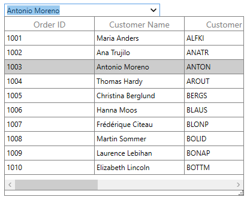
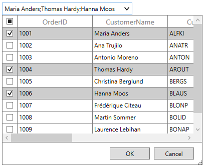
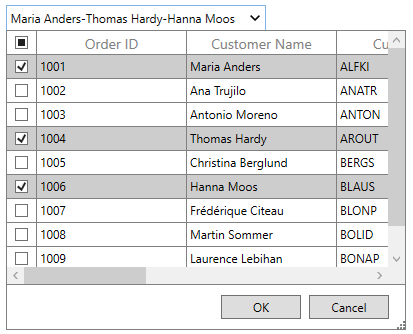
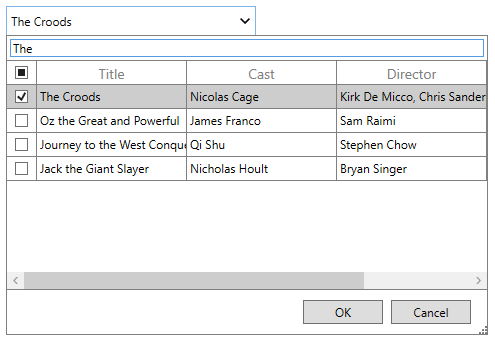

# Selection in WPF Multi Column Dropdown (SfMultiColumnDropDown)

[SfMultiColumnDropDownControl](https://help.syncfusion.com/cr/wpf/Syncfusion.UI.Xaml.Grid.SfMultiColumnDropDownControl.html) allows you to select one or more rows based on the SelectionMode. You can get the selected item in the SfDataGrid by using [SelectedItem](http://help.syncfusion.com/cr/cref_files/wpf/Syncfusion.SfGrid.WPF~Syncfusion.UI.Xaml.Grid.SfMultiColumnDropDownControl~SelectedItem.html) property and the selected index by using [SelectedIndex](http://help.syncfusion.com/cr/cref_files/wpf/Syncfusion.SfGrid.WPF~Syncfusion.UI.Xaml.Grid.SfMultiColumnDropDownControl~SelectedIndex.html) property. 

By using [SelectedValue](http://help.syncfusion.com/cr/cref_files/wpf/Syncfusion.SfGrid.WPF~Syncfusion.UI.Xaml.Grid.SfMultiColumnDropDownControl~SelectedValue.html) property, you can get the selected value from the selected item based on the `ValueMember` property.

Its recommend to use the `SelectedItem` and `SelectedValue` instead of using `SelectedIndex` to get the selected value. 

By default, you can select only one item at a time from the dropdown, as the default value of [SelectionMode](https://help.syncfusion.com/cr/wpf/Syncfusion.UI.Xaml.Grid.SfMultiColumnDropDownControl.html#Syncfusion_UI_Xaml_Grid_SfMultiColumnDropDownControl_SelectionModeProperty) is Single.



<syncfusion:SfMultiColumnDropDownControl x:Name="MultiColumnDropDown"
                         ItemsSource="{Binding Orders}"
						 ValueMember="CustomerID"
                         DisplayMember="CustomerName"
                         SelectionMode="Single">
</syncfusion:SfMultiColumnDropDownControl>


using Syncfusion.UI.Xaml.Grid;

this.MultiColumnDropDown.SelectionMode = DropDownSelectionMode.Single;



## Multi-Selection

You can select multiple rows at same time by setting [SelectionMode](https://help.syncfusion.com/cr/wpf/Syncfusion.UI.Xaml.Grid.SfMultiColumnDropDownControl.html#Syncfusion_UI_Xaml_Grid_SfMultiColumnDropDownControl_SelectionModeProperty) as `Multiple`. Further, you can select multiple rows in the following ways

1. By clicking on the respective rows.
2. By dragging mouse on the dropdown grid.
3. By using `Space` key.
4. By interacting with the checkbox in the `Selector column`.



<syncfusion:SfMultiColumnDropDownControl x:Name="MultiColumnDropDown"
                         ItemsSource="{Binding Orders}"
						 ValueMember="CustomerID"
                         DisplayMember="CustomerName"
                         SelectionMode="Multiple">
</syncfusion:SfMultiColumnDropDownControl>


using Syncfusion.UI.Xaml.Grid;

this.MultiColumnDropDown.SelectionMode = DropDownSelectionMode.Multiple;



N> SelectedItem will be added, only after clicking on `Ok` button in the dropdown or by pressing `Enter` key. `SelectedItem`, `SelectedIndex` and `SelectedValue` denotes the first selected row.

### Separator string customization

By default, selected values in the editor are separated by `;`. You can change this string by setting [SeparatorString](https://help.syncfusion.com/cr/wpf/Syncfusion.UI.Xaml.Grid.SfMultiColumnDropDownControl.html#Syncfusion_UI_Xaml_Grid_SfMultiColumnDropDownControl_SeparatorStringProperty) property.



<syncfusion:SfMultiColumnDropDownControl x:Name="MultiColumnDropDown"
                         ItemsSource="{Binding Orders}"
                         SelectionMode="Multiple"
						 ValueMember="CustomerID"
                         DisplayMember="CustomerName"
                         SeparatorString="-">            
</syncfusion:SfMultiColumnDropDownControl>


using Syncfusion.UI.Xaml.Grid;

this.MultiColumnDropDown.SeparatorString = "-";



### Accessing the selected items

The selected items can be retrieved by using the [SelectedItems](https://help.syncfusion.com/cr/wpf/Syncfusion.UI.Xaml.Grid.SfMultiColumnDropDownControl.html#Syncfusion_UI_Xaml_Grid_SfMultiColumnDropDownControl_SelectedItems) property. The selection can also be added programmatically by using the `SelectedItems` property.

### Load custom control in drop-down

You can add custom header to the dropdown by setting [HeaderTemplate](https://help.syncfusion.com/cr/wpf/Syncfusion.UI.Xaml.Grid.SfMultiColumnDropDownControl.html#Syncfusion_UI_Xaml_Grid_SfMultiColumnDropDownControl_HeaderTemplateProperty) property. For example, you can add textbox at the header of dropdown to search and filter items.



xmlns:interactivity="http://schemas.microsoft.com/expression/2010/interactivity"

<Window.Resources>
    <local:MultiConverter x:Key="multiConverter"/>
    <DataTemplate x:Key="headerTemplate">
        <Border BorderThickness="0,0,0,1" BorderBrush="Gray">
            <TextBox x:Name="searchTextBox" Margin="3" >
                <interactivity:Interaction.Triggers>
                    <interactivity:EventTrigger EventName="TextChanged">
                        <interactivity:InvokeCommandAction Command="{Binding Path=DataContext.TextChanged, Source={x:Reference Name=MultiColumnDropDown}}" >
                            <interactivity:InvokeCommandAction.CommandParameter>
                                <MultiBinding Converter="{StaticResource multiConverter}">
                                    <Binding Source="{x:Reference Name=MultiColumnDropDown}"/>
                                    <Binding RelativeSource="{RelativeSource Mode=FindAncestor, AncestorType=TextBox}"/>
                                </MultiBinding>
                            </interactivity:InvokeCommandAction.CommandParameter>
                        </interactivity:InvokeCommandAction>
                    </interactivity:EventTrigger>
                </interactivity:Interaction.Triggers>
            </TextBox>
        </Border>
    </DataTemplate>
</Window.Resources>
	
<syncfusion:SfMultiColumnDropDownControl x:Name="MultiColumnDropDown"                                        
                                         DisplayMember="Title"
                                         HeaderTemplate="{StaticResource headerTemplate}"
                                         ItemsSource="{Binding MoviesLists}" 
                                         ValueMember="Cast" 
                                         SelectionMode="Multiple">
    <interactivity:Interaction.Triggers>
        <interactivity:EventTrigger EventName="PopupOpening">
            <interactivity:InvokeCommandAction 
			        Command="{Binding Path=DataContext.PopupOpening, ElementName=MultiColumnDropDown}"
                    CommandParameter="{Binding ElementName=MultiColumnDropDown}" />
        </interactivity:EventTrigger>
    </interactivity:Interaction.Triggers>
</syncfusion:SfMultiColumnDropDownControl>


using Syncfusion.UI.Xaml.Grid;
using Syncfusion.UI.Xaml.Utility;

public BaseCommand TextChanged
{
    get
    {
        if (textChanged == null)
            textChanged = new BaseCommand(OnTextChangedExecuted);
        return textChanged;
    }
}

public BaseCommand PopupOpening
{
    get
    {
        if (popupOpeningCommand == null)
            popupOpeningCommand = new BaseCommand(OnPopupOpening);
        return popupOpeningCommand;
    }
}

private void OnTextChangedExecuted(object obj)
{
    var param = (object[])obj;
    var multiColumnDropDown = param[0] as SfMultiColumnDropDownControl;
    searchTextBox = param[1] as TextBox;
    var grid = multiColumnDropDown.GetDropDownGrid();
    if (grid != null && grid.View != null && grid.View.Filter != null)
        grid.View.RefreshFilter();
}

private void OnPopupOpening(object obj)
{
    var multiColumnDropDown = obj as SfMultiColumnDropDownControl;
    var grid = multiColumnDropDown.GetDropDownGrid();
    if (grid != null)
        grid.View.Filter = CustomerFilter;
}

private bool CustomerFilter(object item)
{
    var movie = item as GrossingMoviesList;
    return movie.Title.ToLower().Contains(searchTextBox.Text.ToLower());
}

internal class MultiConverter : IMultiValueConverter
{
    public object Convert(object[] values, Type targetType, object parameter, CultureInfo culture)
    {
        return values.ToArray();
    }

    public object[] ConvertBack(object value, Type[] targetTypes, object parameter, CultureInfo culture)
    {
        throw new NotImplementedException();
    }
}
	



You can refer `Search with TextBox in DropDown` section in this [sample](https://github.com/syncfusion/wpf-demos/tree/master/MultiColumn%20Dropdown/MultiColumnDropDownDemo/CS).

N> You can load custom control in drop-down only when SelectionMode is Multiple.

## Events

You can handle the selection operations in SfMultiColumnDropDownControl by using [SelectionChanged](http://help.syncfusion.com/cr/cref_files/wpf/Syncfusion.SfGrid.WPF~Syncfusion.UI.Xaml.Grid.SfMultiColumnDropDownControl~SelectionChanged_EV.html) event.

### SelectionChanged

[SelectionChanged](https://help.syncfusion.com/cr/wpf/Syncfusion.UI.Xaml.Grid.SfMultiColumnDropDownControl.html) event is fired when select the item in SfDataGrid. You can use this event to get the SelectedItem, SelectedValue. [SelectionChangedEventArgs](http://help.syncfusion.com/cr/cref_files/wpf/Syncfusion.SfGrid.WPF~Syncfusion.UI.Xaml.Grid.SelectionChangedEventArgs.html) provides data for `SelectionChanged` event.



MultiColumnDropDown.SelectionChanged += MultiColumnDropDown_SelectionChanged;

void MultiColumnDropDown_SelectionChanged(object sender, Syncfusion.UI.Xaml.Grid.SelectionChangedEventArgs args)
{
     var selectedValue = (sender as SfMultiColumnDropDownControl).SelectedValue;
}



N> SelectionChanged event will not be triggered when SelectionMode is Multiple.