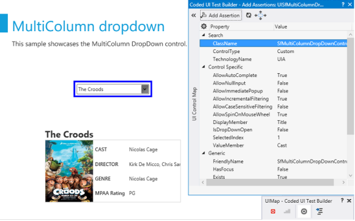
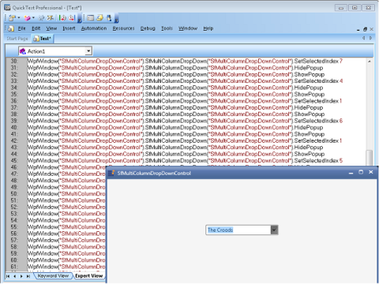

# UIAutomation in WPF MultiColumn Dropdown 

WPF MultiColumn Dropdown Control supports the following UIAutomations,

## Coded UI

WPF MultiColumn Dropdown Control supports CodedUITest automation that enables you to create an automation test with MultiColumn Dropdown Control elements and record the sequence of actions.

There are three level of support in CodedUITest for MultiColumn Dropdown Control.

<table>
<tr>
<th>
Levels</th><th>
Description</th></tr>
<tr>
<td>
Level – 1</td><td>
Record and Detecting the UI Elements when you do the actions in the control.</td></tr>
<tr>
<td>
Level – 2</td><td>
Provide custom properties for UI elements when you drag the Cross hair to any UI element.</td></tr>
<tr>
<td>
Level – 3</td><td>
Coded UI Test Builder generates code from recorded session and custom class is implemented to access custom properties, so the generated code is simplified.</td></tr>
</table>
The following screenshot illustrates the MultiColumn Dropdown Control properties, when you drag the crosshair to the MultiColumn Dropdown control.

Following are the properties for MultiColumn Dropdown Control.

### Property Table

<table>
<tr>
<th>
UI Element</th><th>
Properties</th></tr>
<tr>
<td>
SfMultiColumnDropDownControl</td><td>
* AllowAutoComplete* AllowNullInput* AllowImmediatePopup* AllowIncrementalFiltering* AllowCaseSensitiveFiltering* AllowSpinOnMouseWheel* DisplayMember* IsDropDownOpen* SelectedIndex* ValueMember</td></tr>
</table>

### Quick Test Professional

MultiColumn Dropdown Control supports for QTP test. You can record the actions performed in the control, by mentioning the corresponding method name with Syncfusion® namespace. To know more about QTP test refer to the [link](http://help.syncfusion.com/wpf/sfdatagrid/ui-automation#quick-test-professional-qtp).

The following screenshot illustrates the QTP Test for MultiColumn Dropdown Control.

### Methods Table

<table>
<tr>
<th>
Method</th><th>
Description</th><th>
Parameters </th><th>
Return Type </th></tr>
<tr>
<td>
void SetSelectedIndex(int index);</td><td>
To set the SelectedIndex from the Popup</td><td>
 Int index</td><td>
void</td></tr>
<tr>
<td>
void ShowPopup();</td><td>
To open the Popup</td><td>
NA</td><td>
void</td></tr>
<tr>
<td>
void HidePopup();</td><td>
To close the Popup</td><td>
NA</td><td>
void</td></tr>
</table>

