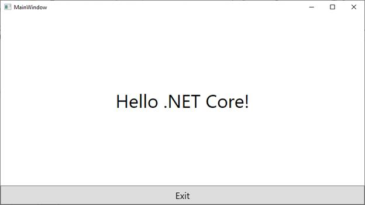

# .NET core support

This section explains how to create the project in .NETcore application.

## Create .NET core project

**Step 1**: Open Visual Studio and click a new project. Next, select WPF App in the available list. Then select C# from language and choose your platform. After that, select **WPF App (.NET core)** template, and click Next.

**Step 2**: Next, you can see `Configure your new project` window and then click create.

**Step 3**: Finally, WPF sample project was created and run the application.

**Step 4**: Next, before adding your controls, you need to remove the default loaded controls as given in below screenshot.

N> If you do not remove the code, you cannot see your control in output window.

**Step 5**: After that, you can add your control by creating an instance. WPF visual designer is not yet available in WPF Core.

## Adding controls in .NET core application

The below section explains how to add controls in .NET core application.

### Assembly deployment

In Solution Explorer, Right click of the dependencies. Select `Add a reference`. Now, open the assembly window. Click browse, you can select your needed assemblies from netcoreapp3.0.

### Add NuGet Package

Find more details regarding how to install the NuGet packages in WinForms application in the following link: [Steps to install NuGet packages](https://help.syncfusion.com/wpf/nuget-packages).

N> You can only get assemblies from `netcoreapp3.0` for .NET core application and assembly is placed in this location. **Location**: C:\Program Files (x86)\Syncfusion\Essential Studio\WPF\17.1.0.38\precompiledassemblies

### Adding controls through code

We are going to demo for how to add the control in .NET core application. For example, using ButtonAdv controls.

**Step 1**: Create the .NET core application for WPF.

**Step 2**:	`ButtonAdv` control is available in following assembly.

•	Syncfusion.Shared.WPF

**Step 3**:	We can add button either using code behind or through XAML code. Both the methods are explained below.

a.	The following code explains how to declare the ButtonAdv control using XAML.




<sync:ButtonAdv Label="Hello World" Height = “35” Width = “150”/>




b.	The `ButtonAdv` control can be added using the following code snippet.




<Grid X:Name = “grid”>

</Grid>







ButtonAdv button = new ButtonAdv();

button.Height = 35;

button.width = 150;

button.Label = “Hello World!”;

grid.children.Add(button);




**Step 4**: Run the application.

