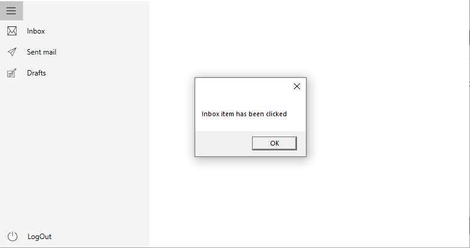

#  Commands and events in SfNavigationDrawer

This section describes the events and command support available in the Navigation Drawer sidebar.

## Opening event

This [Opening](https://help.syncfusion.com/cr/wpf/Syncfusion.UI.Xaml.NavigationDrawer.SfNavigationDrawer.html#Syncfusion_UI_Xaml_NavigationDrawer_SfNavigationDrawer_Opening) event gets triggered when the drawer menu is opening. 

Using the `Cancel` property the opening of the drawer menu can be handled.




<Window x:Class="NavigationDrawerWPF.MainWindow"
        xmlns="http://schemas.microsoft.com/winfx/2006/xaml/presentation"
        xmlns:x="http://schemas.microsoft.com/winfx/2006/xaml"
        xmlns:d="http://schemas.microsoft.com/expression/blend/2008"
        xmlns:mc="http://schemas.openxmlformats.org/markup-compatibility/2006"
        xmlns:syncfusion="http://schemas.syncfusion.com/wpf"
        xmlns:local="clr-namespace:NavigationDrawerWPF"
        mc:Ignorable="d"
        Title="MainWindow" Height="450" Width="800">
    <syncfusion:SfNavigationDrawer x:Name="navigationDrawer"
                                   Opening="NavigationDrawer_Opening">
        <syncfusion:SfNavigationDrawer.DrawerHeaderView>
            <Grid Background="#31ade9">
                <Label Content="Header View" 
                       HorizontalContentAlignment="Center" 
                       VerticalContentAlignment="Center"/>
            </Grid>
        </syncfusion:SfNavigationDrawer.DrawerHeaderView>
    </syncfusion:SfNavigationDrawer>
</Window>





using Syncfusion.UI.Xaml.NavigationDrawer;
using System.Windows;
using System.Windows.Controls;
using System.Windows.Media;

namespace NavigationDrawerWPF
{
    /// 

    /// Interaction logic for MainWindow.xaml
    /// 

    public partial class MainWindow : Window
    {
        public MainWindow()
        {
            InitializeComponent();
            SfNavigationDrawer navigationDrawer = new SfNavigationDrawer()
            {
                IsOpen = true
            };

            navigationDrawer.Opening += NavigationDrawer_Opening;

            Grid grid = new Grid()
            {
                Background = new SolidColorBrush((Color)ColorConverter.ConvertFromString("#31ade9"))
            };

            Label label = new Label()
            {
                Content = "Header View",
                HorizontalContentAlignment = HorizontalAlignment.Center,
                VerticalContentAlignment = VerticalAlignment.Center
            };

            grid.Children.Add(label);
            navigationDrawer.DrawerHeaderView = grid;

            this.Content = navigationDrawer;
        }

        private void NavigationDrawer_Opening(object sender, System.ComponentModel.CancelEventArgs e)
        {
            // To restrict drawer opening, by setting the e.Cancel value true.
        }
    }
}
	




## Opened event

This [Opened](https://help.syncfusion.com/cr/wpf/Syncfusion.UI.Xaml.NavigationDrawer.SfNavigationDrawer.html#Syncfusion_UI_Xaml_NavigationDrawer_SfNavigationDrawer_Opened) event gets triggered once the drawer menu is fully animated and opened.




<Window x:Class="NavigationDrawerWPF.MainWindow"
        xmlns="http://schemas.microsoft.com/winfx/2006/xaml/presentation"
        xmlns:x="http://schemas.microsoft.com/winfx/2006/xaml"
        xmlns:d="http://schemas.microsoft.com/expression/blend/2008"
        xmlns:mc="http://schemas.openxmlformats.org/markup-compatibility/2006"
        xmlns:syncfusion="http://schemas.syncfusion.com/wpf"
        xmlns:local="clr-namespace:NavigationDrawerWPF"
        mc:Ignorable="d"
        Title="MainWindow" Height="450" Width="800">
    <syncfusion:SfNavigationDrawer x:Name="navigationDrawer"
                                   Opened="NavigationDrawer_Opened">
        <syncfusion:SfNavigationDrawer.DrawerHeaderView>
            <Grid Background="#31ade9">
                <Label Content="Header View" 
                       HorizontalContentAlignment="Center" 
                       VerticalContentAlignment="Center"/>
            </Grid>
        </syncfusion:SfNavigationDrawer.DrawerHeaderView>
    </syncfusion:SfNavigationDrawer>
</Window>





using Syncfusion.UI.Xaml.NavigationDrawer;
using System.Windows;
using System.Windows.Controls;
using System.Windows.Media;

namespace NavigationDrawerWPF
{
    /// 

    /// Interaction logic for MainWindow.xaml
    /// 

    public partial class MainWindow : Window
    {
        public MainWindow()
        {
            InitializeComponent();
            SfNavigationDrawer navigationDrawer = new SfNavigationDrawer()
            {
                IsOpen = true
            };

            navigationDrawer.Opened += NavigationDrawer_Opened;

            Grid grid = new Grid()
            {
                Background = new SolidColorBrush((Color)ColorConverter.ConvertFromString("#31ade9"))
            };

            Label label = new Label()
            {
                Content = "Header View",
                HorizontalContentAlignment = HorizontalAlignment.Center,
                VerticalContentAlignment = VerticalAlignment.Center
            };

            grid.Children.Add(label);
            navigationDrawer.DrawerHeaderView = grid;

            this.Content = navigationDrawer;
        }

        private void NavigationDrawer_Opened(object sender, System.EventArgs e)
        {
            //Necessary action perform here
        }
    }
}
	




## Closing event

This[Closing](https://help.syncfusion.com/cr/wpf/Syncfusion.UI.Xaml.NavigationDrawer.SfNavigationDrawer.html#Syncfusion_UI_Xaml_NavigationDrawer_SfNavigationDrawer_Closing) event gets triggered when the drawer is about to close.

Closing of the drawer menu can be handled using the `Cancel` property.




<Window x:Class="NavigationDrawerWPF.MainWindow"
        xmlns="http://schemas.microsoft.com/winfx/2006/xaml/presentation"
        xmlns:x="http://schemas.microsoft.com/winfx/2006/xaml"
        xmlns:d="http://schemas.microsoft.com/expression/blend/2008"
        xmlns:mc="http://schemas.openxmlformats.org/markup-compatibility/2006"
        xmlns:syncfusion="http://schemas.syncfusion.com/wpf"
        xmlns:local="clr-namespace:NavigationDrawerWPF"
        mc:Ignorable="d"
        Title="MainWindow" Height="450" Width="800">
    <syncfusion:SfNavigationDrawer x:Name="navigationDrawer"
                                   Closing="NavigationDrawer_Closing">
        <syncfusion:SfNavigationDrawer.DrawerHeaderView>
            <Grid Background="#31ade9">
                <Label Content="Header View" 
                       HorizontalContentAlignment="Center" 
                       VerticalContentAlignment="Center"/>
            </Grid>
        </syncfusion:SfNavigationDrawer.DrawerHeaderView>
    </syncfusion:SfNavigationDrawer>
</Window>





using Syncfusion.UI.Xaml.NavigationDrawer;
using System.Windows;
using System.Windows.Controls;
using System.Windows.Media;

namespace NavigationDrawerWPF
{
    /// 

    /// Interaction logic for MainWindow.xaml
    /// 

    public partial class MainWindow : Window
    {
        public MainWindow()
        {
            InitializeComponent();
            SfNavigationDrawer navigationDrawer = new SfNavigationDrawer()
            {
                IsOpen = true
            };

            navigationDrawer.Closing += NavigationDrawer_Closing;

            Grid grid = new Grid()
            {
                Background = new SolidColorBrush((Color)ColorConverter.ConvertFromString("#31ade9"))
            };

            Label label = new Label()
            {
                Content = "Header View",
                HorizontalContentAlignment = HorizontalAlignment.Center,
                VerticalContentAlignment = VerticalAlignment.Center
            };

            grid.Children.Add(label);
            navigationDrawer.DrawerHeaderView = grid;

            this.Content = navigationDrawer;
        }

        private void NavigationDrawer_Closing(object sender, System.ComponentModel.CancelEventArgs e)
        {
           // To restrict drawer closing, by setting the e.Cancel value to true.
        }
    }
}
	




## Closed event

This [Closed](https://help.syncfusion.com/cr/wpf/Syncfusion.UI.Xaml.NavigationDrawer.SfNavigationDrawer.html#Syncfusion_UI_Xaml_NavigationDrawer_SfNavigationDrawer_Closed) event gets triggered once the drawer menu is Closed.




<Window x:Class="NavigationDrawerWPF.MainWindow"
        xmlns="http://schemas.microsoft.com/winfx/2006/xaml/presentation"
        xmlns:x="http://schemas.microsoft.com/winfx/2006/xaml"
        xmlns:d="http://schemas.microsoft.com/expression/blend/2008"
        xmlns:mc="http://schemas.openxmlformats.org/markup-compatibility/2006"
        xmlns:syncfusion="http://schemas.syncfusion.com/wpf"
        xmlns:local="clr-namespace:NavigationDrawerWPF"
        mc:Ignorable="d"
        Title="MainWindow" Height="450" Width="800">
    <syncfusion:SfNavigationDrawer x:Name="navigationDrawer"
                                   Closed="NavigationDrawer_Closed">
        <syncfusion:SfNavigationDrawer.DrawerHeaderView>
            <Grid Background="#31ade9">
                <Label Content="Header View" 
                       HorizontalContentAlignment="Center" 
                       VerticalContentAlignment="Center"/>
            </Grid>
        </syncfusion:SfNavigationDrawer.DrawerHeaderView>
    </syncfusion:SfNavigationDrawer>
</Window>





using Syncfusion.UI.Xaml.NavigationDrawer;
using System.Windows;
using System.Windows.Controls;
using System.Windows.Media;

namespace NavigationDrawerWPF
{
    /// 

    /// Interaction logic for MainWindow.xaml
    /// 

    public partial class MainWindow : Window
    {
        public MainWindow()
        {
            InitializeComponent();
            SfNavigationDrawer navigationDrawer = new SfNavigationDrawer()
            {
                IsOpen = true
            };

            navigationDrawer.Closed += NavigationDrawer_Closed;

            Grid grid = new Grid()
            {
                Background = new SolidColorBrush((Color)ColorConverter.ConvertFromString("#31ade9"))
            };

            Label label = new Label()
            {
                Content = "Header View",
                HorizontalContentAlignment = HorizontalAlignment.Center,
                VerticalContentAlignment = VerticalAlignment.Center
            };

            grid.Children.Add(label);
            navigationDrawer.DrawerHeaderView = grid;

            this.Content = navigationDrawer;
        }

        private void NavigationDrawer_Closed(object sender, System.EventArgs e)
        {
            // Necessary action perform here
        }
    }
}
	




## ItemClicked event

The [ItemClicked](https://help.syncfusion.com/cr/wpf/Syncfusion.UI.Xaml.NavigationDrawer.SfNavigationDrawer.html#Syncfusion_UI_Xaml_NavigationDrawer_SfNavigationDrawer_ItemClicked) event gets triggered when the item in the navigation menu is clicked. 

N> This event will get triggered only when the display mode is either compact or expanded.




    <syncfusion:SfNavigationDrawer x:Name="navigationDrawer" DisplayMode="Compact" ItemClicked="NavigationDrawer_ItemClicked">
        <syncfusion:NavigationItem Header="Inbox">
            <syncfusion:NavigationItem.Icon>
                <Path
                    Data="M32.032381, 16.445429 L25.410999,...... />
            </syncfusion:NavigationItem.Icon>
        </syncfusion:NavigationItem>
        <syncfusion:NavigationItem Header="Sent mail">
            <syncfusion:NavigationItem.Icon>
                <Path Data="M42.128046,6.7269681 L18.53705,..../>
            </syncfusion:NavigationItem.Icon>
        </syncfusion:NavigationItem>
        <syncfusion:NavigationItem Header="Drafts">
            <syncfusion:NavigationItem.Icon>
                <Path Data="M6.9999996,48.353 L19,48.353 19,....../>
            </syncfusion:NavigationItem.Icon>
        </syncfusion:NavigationItem>
        <syncfusion:SfNavigationDrawer.ContentView>
            <Label
                Width="150"
                Height="30"
                HorizontalAlignment="Center"
                VerticalAlignment="Center"
                Content="Content View" />
        </syncfusion:SfNavigationDrawer.ContentView>
    </syncfusion:SfNavigationDrawer>





            SfNavigationDrawer navigationDrawer = new SfNavigationDrawer();
            navigationDrawer.DisplayMode = DisplayMode.Compact;
            navigationDrawer.ItemClicked += NavigationDrawer_ItemClicked;
            navigationDrawer.Items.Add(new NavigationItem()
            {
                Header = "Inbox",
                Icon = new Path()
                {
                    Data = Geometry.Parse("M32.032381, 16.445429 L25.410999,......), 
                    ...........
                }
            });
            navigationDrawer.Items.Add(new NavigationItem()
            {
                Header = "Sent mail",
                Icon = new Path()
                {
                    Data = Geometry.Parse("M42.128046,6.7269681 L18.53705,......),
                    ...........
                }
            });
            navigationDrawer.Items.Add(new NavigationItem()
            {
                Header = "Drafts",
                Icon = new Path()
                {
                    Data = Geometry.Parse("M6.9999996,48.353 L19,48.353 19,.....),
                    ...........
                }
            });
            Label label = new Label();
            label.Content = "Content View";
            label.HorizontalAlignment = HorizontalAlignment.Center;
            label.VerticalAlignment = VerticalAlignment.Center;
            label.Height = 30;
            label.Width = 150;
            navigationDrawer.ContentView = label;
            this.Content = navigationDrawer;








        private void NavigationDrawer_ItemClicked(object sender, NavigationItemClickedEventArgs e)
        {
            var clickedItem = e.Item;
        }




## ItemCollapsed event

The [ItemCollapsed](https://help.syncfusion.com/cr/wpf/Syncfusion.UI.Xaml.NavigationDrawer.SfNavigationDrawer.html#Syncfusion_UI_Xaml_NavigationDrawer_SfNavigationDrawer_ItemCollapsed) event gets triggered when the sub items gets collapsed.

N> This event will get triggered only when the display mode is either compact or expanded.




    <syncfusion:SfNavigationDrawer
        x:Name="navigationDrawer"
        DisplayMode="Compact"
        ItemCollapsed="NavigationDrawer_ItemCollapsed">
        <syncfusion:NavigationItem Header="Inbox">
            <syncfusion:NavigationItem.Icon>
                <Path
                    Data="M32.032381, 16.445429 L25.410999,..../>
            </syncfusion:NavigationItem.Icon>
            <syncfusion:NavigationItem Header="Primary">
                <syncfusion:NavigationItem.Icon>
                    <Path
                        Data="M9.5189972,7.3780194C8.3389893,........ />
                </syncfusion:NavigationItem.Icon>
            </syncfusion:NavigationItem>
            <syncfusion:NavigationItem Header="Social">
                <syncfusion:NavigationItem.Icon>
                    <Path
                        Data="M22.133972,14.194015C17.582977,....../>
                </syncfusion:NavigationItem.Icon>
            </syncfusion:NavigationItem>
            <syncfusion:NavigationItem Header="Promotions">
                <syncfusion:NavigationItem.Icon>
                    <Path
                        Data="M9.4614787,7.2521966C8.897512,......../>
                </syncfusion:NavigationItem.Icon>
            </syncfusion:NavigationItem>
        </syncfusion:NavigationItem>
        <syncfusion:NavigationItem Header="Sent mail">
            <syncfusion:NavigationItem.Icon>
                <Path
                    Data="M42.128046,6.7269681 L18.53705,...../>
            </syncfusion:NavigationItem.Icon>
        </syncfusion:NavigationItem>
        <syncfusion:NavigationItem Header="Drafts">
            <syncfusion:NavigationItem.Icon>
                <Path
                    Data="M6.9999996,48.353 L19,...../>
            </syncfusion:NavigationItem.Icon>
        </syncfusion:NavigationItem>
        <syncfusion:SfNavigationDrawer.ContentView>
            <Label
                Width="150"
                Height="30"
                HorizontalAlignment="Center"
                VerticalAlignment="Center"
                Content="Content View" />
        </syncfusion:SfNavigationDrawer.ContentView>
    </syncfusion:SfNavigationDrawer>





            SfNavigationDrawer navigationDrawer = new SfNavigationDrawer();
            navigationDrawer.DisplayMode = DisplayMode.Compact;
            navigationDrawer.ItemCollapsed += NavigationDrawer_ItemCollapsed;
            NavigationItemsCollection navigationSubItems = new NavigationItemsCollection();
            navigationSubItems.Add(new NavigationItem()
            {
                Header = "Primary",
                Icon = new Path()
                {
                    Data = Geometry.Parse("M9.5189972,7.3780194C8.3389893,.....),
                    ............
                },

            });
            navigationSubItems.Add(new NavigationItem()
            {
                Header = "Social",
                Icon = new Path()
                {
                    Data = Geometry.Parse("M22.133972,14.194015C17.582977,......),
                    ............
                },

            });
            navigationSubItems.Add(new NavigationItem()
            {
                Header = "Promotions",
                Icon = new Path()
                {
                    Data = Geometry.Parse("M9.4614787,7.2521966C8.897512,........),
                    ............
                },

            });
            navigationDrawer.Items.Add(new NavigationItem()
            {
                Header = "Inbox",
                Icon = new Path()
                {
                    Data = Geometry.Parse("M32.032381, 16.445429 L25.410999, ........),
                    ............
                },
                Items= navigationSubItems
            });
            navigationDrawer.Items.Add(new NavigationItem()
            {
                Header = "Sent mail",
                Icon = new Path()
                {
                    Data = Geometry.Parse("M42.128046,6.7269681 L18.53705,.......),
                    ............
                }
            });
            navigationDrawer.Items.Add(new NavigationItem()
            {
                Header = "Drafts",
                Icon = new Path()
                {
                    Data = Geometry.Parse("M6.9999996,48.353 L19,.......),
                    ............
                }
            });
            Label label = new Label();
            label.Content = "Content View";
            label.HorizontalAlignment = HorizontalAlignment.Center;
            label.VerticalAlignment = VerticalAlignment.Center;
            label.Height = 30;
            label.Width = 150;
            navigationDrawer.ContentView = label;
            this.Content = navigationDrawer;








        private void NavigationDrawer_ItemCollapsed(object sender, NavigationItemCollapsedEventArgs e)
        {
            var collapsedItem = e.Item;
        }




## ItemExpanded event

The [ItemExpanded](https://help.syncfusion.com/cr/wpf/Syncfusion.UI.Xaml.NavigationDrawer.SfNavigationDrawer.html#Syncfusion_UI_Xaml_NavigationDrawer_SfNavigationDrawer_ItemExpanded) event gets triggered when the sub items gets expanded.

N> This event will get triggered only when the display mode is either compact or expanded.




    <syncfusion:SfNavigationDrawer
        x:Name="navigationDrawer"
        DisplayMode="Compact"
        ItemExpanded="NavigationDrawer_ItemExpanded">
        <syncfusion:NavigationItem Header="Inbox">
            <syncfusion:NavigationItem.Icon>
                <Path Data="M32.032381, 16.445429 L25.410999,...../>
            </syncfusion:NavigationItem.Icon>
            <syncfusion:NavigationItem Header="Primary">
                <syncfusion:NavigationItem.Icon>
                    <Path Data="M9.5189972,7.3780194C8.3389893,....../>
                </syncfusion:NavigationItem.Icon>
            </syncfusion:NavigationItem>
            <syncfusion:NavigationItem Header="Social">
                <syncfusion:NavigationItem.Icon>
                    <Path Data="M22.133972,14.194015C17.582977,......./>
                </syncfusion:NavigationItem.Icon>
            </syncfusion:NavigationItem>
            <syncfusion:NavigationItem Header="Promotions">
                <syncfusion:NavigationItem.Icon>
                    <Path Data="M9.4614787,7.2521966C8.897512,..../>
                </syncfusion:NavigationItem.Icon>
            </syncfusion:NavigationItem>
        </syncfusion:NavigationItem>
        <syncfusion:NavigationItem Header="Sent mail">
            <syncfusion:NavigationItem.Icon>
                <Path Data="M42.128046,6.7269681 L18.53705,30.3...../>
            </syncfusion:NavigationItem.Icon>
        </syncfusion:NavigationItem>
        <syncfusion:NavigationItem Header="Drafts">
            <syncfusion:NavigationItem.Icon>
                <Path Data="M6.9999996,48.353 L19,48.353 19,...../>
            </syncfusion:NavigationItem.Icon>
        </syncfusion:NavigationItem>
        <syncfusion:SfNavigationDrawer.ContentView>
            <Label
                Width="150"
                Height="30"
                HorizontalAlignment="Center"
                VerticalAlignment="Center"
                Content="Content View" />
        </syncfusion:SfNavigationDrawer.ContentView>
    </syncfusion:SfNavigationDrawer>




            SfNavigationDrawer navigationDrawer = new SfNavigationDrawer();
            navigationDrawer.DisplayMode = DisplayMode.Compact;
            navigationDrawer.ItemExpanded += NavigationDrawer_ItemExpanded;
            NavigationItemsCollection navigationSubItems = new NavigationItemsCollection();
            navigationSubItems.Add(new NavigationItem()
            {
                Header = "Primary",
                Icon = new Path()
                {
                    Data = Geometry.Parse("M9.5189972,7.3780194C8.3389893,.....),
                    .............
                },

            });
            navigationSubItems.Add(new NavigationItem()
            {
                Header = "Social",
                Icon = new Path()
                {
                    Data = Geometry.Parse("M22.133972,14.194015C17.582977,..........),
                    .............
                },

            });
            navigationSubItems.Add(new NavigationItem()
            {
                Header = "Promotions",
                Icon = new Path()
                {
                    Data = Geometry.Parse("M9.4614787,7.2521966C8.897512,.........),
                    .............
                },

            });
            navigationDrawer.Items.Add(new NavigationItem()
            {
                Header = "Inbox",
                Icon = new Path()
                {
                    Data = Geometry.Parse("M32.032381, 16.445429 L25.410999,............),
                    .............
                },
                Items= navigationSubItems
            });
            navigationDrawer.Items.Add(new NavigationItem()
            {
                Header = "Sent mail",
                Icon = new Path()
                {
                    Data = Geometry.Parse("M42.128046,6.7269681 L18.53705,.......),
                    .............
                }
            });
            navigationDrawer.Items.Add(new NavigationItem()
            {
                Header = "Drafts",
                Icon = new Path()
                {
                    Data = Geometry.Parse("M6.9999996,48.353 L19,48.353 19,........),
                    .............
                }
            });
            Label label = new Label();
            label.Content = "Content View";
            label.HorizontalAlignment = HorizontalAlignment.Center;
            label.VerticalAlignment = VerticalAlignment.Center;
            label.Height = 30;
            label.Width = 150;
            navigationDrawer.ContentView = label;
            this.Content = navigationDrawer;








        private void NavigationDrawer_ItemExpanded(object sender, NavigationItemExpandedEventArgs e)
        {
            var expandedItem = e.Item;
        }




## Commands

The command binds to the `NavigationItem`, and will be executed while the items gets clicked. 

The `Tab` and `Button` navigation item types alone executes the [Command](https://help.syncfusion.com/cr/wpf/Syncfusion.UI.Xaml.NavigationDrawer.NavigationItem.html#Syncfusion_UI_Xaml_NavigationDrawer_NavigationItem_Command). [CommandParameter](https://help.syncfusion.com/cr/wpf/Syncfusion.UI.Xaml.NavigationDrawer.NavigationItem.html#Syncfusion_UI_Xaml_NavigationDrawer_NavigationItem_CommandParameter) is user defined data value that can be passed to the `Command` when it is executed.

### DelegateCommand class




public class DelegateCommand<T> : ICommand
    {
        private Predicate<T> _canExecute;
        private Action<T> _method;
        bool _canExecuteCache = true;

        /// 

        /// Initializes a new instance of the <see cref="DelegateCommand"/> class.
        /// 

        /// <param name="method">The method.</param>
        public DelegateCommand(Action<T> method)
            : this(method, null)
        {
        }

        /// 

        /// Initializes a new instance of the <see cref="DelegateCommand"/> class.
        /// 

        /// <param name="method">The method.</param>
        /// <param name="canExecute">The can execute.</param>
        public DelegateCommand(Action<T> method, Predicate<T> canExecute)
        {
            _method = method;
            _canExecute = canExecute;
        }

        /// 

        /// Defines the method that determines whether the command can execute in its current state.
        /// 

        /// <param name="parameter">Data used by the command.  If the command does not require data to be passed, this object can be set to null.</param>
        /// <returns>
        /// true if this command can be executed; otherwise, false.
        /// </returns>
        public bool CanExecute(object parameter)
        {
            if (_canExecute != null)
            {
                bool tempCanExecute = _canExecute((T)parameter);

                if (_canExecuteCache != tempCanExecute)
                {
                    _canExecuteCache = tempCanExecute;
                    this.RaiseCanExecuteChanged();
                }
            }

            return _canExecuteCache;
        }

        /// 

        /// Raises CanExecuteChanged event to notify changes in command status.
        /// 

        public void RaiseCanExecuteChanged()
        {
            if (CanExecuteChanged != null)
            {
                CanExecuteChanged(this, new EventArgs());
            }
        }

        /// 

        /// Defines the method to be called when the command is invoked.
        /// 

        /// <param name="parameter">Data used by the command.  If the command does not require data to be passed, this object can be set to null.</param>
        public void Execute(object parameter)
        {
            if (_method != null)
                _method.Invoke((T)parameter);
        }

        #region ICommand Members

        /// 

        /// 
        /// 

        public event EventHandler CanExecuteChanged;

        #endregion
    }
	



### ViewModel




    public class ViewModel:INotifyPropertyChanged
    {
        private bool _canperformaction = true;
        public event PropertyChangedEventHandler PropertyChanged;
        public void OnPropertyChanged(string name)
        {
            PropertyChangedEventHandler handler = PropertyChanged;
            if (handler != null)
            {
                handler(this, new PropertyChangedEventArgs(name));
            }
        }
        public ViewModel()
        {
            ClickCommand = new DelegateCommand<object>(ClickAction, CanPerformClickAction);
        }
        public bool CanPerformAction
        {
            get
            {
                return _canperformaction;
            }
            set
            {
                _canperformaction = value;
                this.ClickCommand.RaiseCanExecuteChanged();
                this.OnPropertyChanged("CanPerformAction");
            }
        }

        private bool CanPerformClickAction(object parameter)
        {
            return CanPerformAction;
        }

        public DelegateCommand<object> ClickCommand { get; set; }

        private void ClickAction(object parameter)
        {
            MessageBox.Show(parameter.ToString() + " item has been clicked");
        }

    }







    <Window.DataContext>
        <local:ViewModel />
    </Window.DataContext>
    <syncfusion:SfNavigationDrawer
        x:Name="navigationDrawer"
        DisplayMode="Compact">
        <syncfusion:NavigationItem
            Command="{Binding ClickCommand}"
            CommandParameter="Inbox"
            Header="Inbox">
            <syncfusion:NavigationItem.Icon>
                <Path Data="M32.032381, 16.445429 L25.410999, 23 22.598995,...../>
            </syncfusion:NavigationItem.Icon>
        </syncfusion:NavigationItem>
        <syncfusion:NavigationItem Header="Sent mail">
            <syncfusion:NavigationItem.Icon>
                <Path Data="M42.128046,6.7269681 L18.53705,......./>
            </syncfusion:NavigationItem.Icon>
        </syncfusion:NavigationItem>
        <syncfusion:NavigationItem Header="Drafts">
            <syncfusion:NavigationItem.Icon>
                <Path Data="M6.9999996,48.353 L19,..../>
            </syncfusion:NavigationItem.Icon>
        </syncfusion:NavigationItem>
        <syncfusion:SfNavigationDrawer.FooterItems>
            <syncfusion:NavigationItem
                Command="{Binding ClickCommand}"
                CommandParameter="LogOut"
                Header="LogOut"
                ItemType="Button">
                <syncfusion:NavigationItem.Icon>
                    <Path
                        Data="M13.999999,3.9500002 L13.999999,...../>
                </syncfusion:NavigationItem.Icon>
            </syncfusion:NavigationItem>
        </syncfusion:SfNavigationDrawer.FooterItems>

        <syncfusion:SfNavigationDrawer.ContentView>
            <Label
                Width="150"
                Height="30"
                HorizontalAlignment="Center"
                VerticalAlignment="Center"
                Content="Content View" />
        </syncfusion:SfNavigationDrawer.ContentView>
    </syncfusion:SfNavigationDrawer>





N> The `Command` execution is only applicable for compact and expanded display mode.

N> View [sample](https://github.com/SyncfusionExamples/wpf-sfnavigationdrawer-samples/tree/main/Commands) in GitHub