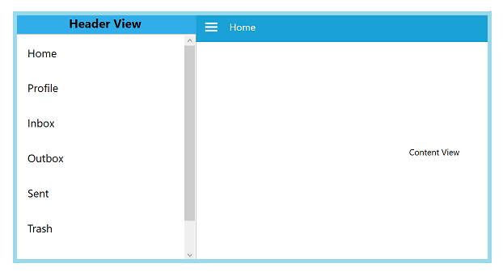

# Custom views in WPF Navigation Drawer (SfNavigationDrawer)

## Populating the with custom views

The WPF Navigation Drawer sidebar can be populated with custom views by setting the [DisplayMode](https://help.syncfusion.com/cr/wpf/Syncfusion.UI.Xaml.NavigationDrawer.SfNavigationDrawer.html#Syncfusion_UI_Xaml_NavigationDrawer_SfNavigationDrawer_DisplayMode) as [Default](https://help.syncfusion.com/cr/wpf/Syncfusion.UI.Xaml.NavigationDrawer.DisplayMode.html). In this mode the sidebar can be customized as three parts.

Basically the sidebar will be in hidden state and can be displayed by swipe gestures.

   * DrawerHeaderView - A custom view can be provided to be displayed as a header part of the navigation menu. This can be set to the [DrawerHeaderView]() property.
   
   * DrawerContentView - A custom view can be provided to be displayed in the body of the navigation menu. This can be set to the [DrawerContentView]() property.
   
   * DrawerFooterView - A custom view can be provided to be displayed as a footer part of the navigation menu. This can be set to the [DrawerFooterView]() property. 




	<Window x:Class="NavigationDrawerWPF.MainWindow"
        xmlns="http://schemas.microsoft.com/winfx/2006/xaml/presentation"
        xmlns:x="http://schemas.microsoft.com/winfx/2006/xaml"
        xmlns:d="http://schemas.microsoft.com/expression/blend/2008"
        xmlns:mc="http://schemas.openxmlformats.org/markup-compatibility/2006"
        xmlns:syncfusion="http://schemas.syncfusion.com/wpf"
        xmlns:local="clr-namespace:NavigationDrawerWPF"
        mc:Ignorable="d"
        Title="MainWindow" Height="450" Width="800">
    <Window.DataContext>
        <local:ViewModel/>
    </Window.DataContext>
    <syncfusion:SfNavigationDrawer x:Name="navigationDrawer" DrawerWidth="300">
        <syncfusion:SfNavigationDrawer.ContentView>
            <Grid x:Name="mainContentView" 
                  Background="White">
                <Grid.RowDefinitions>
                    <RowDefinition Height="auto"/>
                    <RowDefinition/>
                </Grid.RowDefinitions>
                <StackPanel Background="#1aa1d6" 
                            Orientation="Horizontal">
                    <Button x:Name="hamburgerButton" 
                            BorderBrush="Transparent" 
                            Height="50" Width="50" 
                            Background="#1aa1d6" Foreground="White" 
                            Click="HamburgerButton_Click">
                        <Image Source="hamburger_icon.png" 
                               Height="20" 
                               Width="20" 
                               HorizontalAlignment="Center" 
                               VerticalAlignment="Center"/>
                    </Button>
                    <Label x:Name="headerLabel" 
                           Height="50" 
                           HorizontalContentAlignment="Center" 
                           VerticalContentAlignment="Center" 
                           Content="Home"    
                           Foreground="White" 
                           Background="#1aa1d6"/>
                </StackPanel>
                <Label Grid.Row="1" 
                       x:Name="contentLabel" 
                       VerticalContentAlignment="Center" 
                       HorizontalContentAlignment="Center" 
                       Content="Content View" 
                       Foreground="Black"/>
            </Grid>
        </syncfusion:SfNavigationDrawer.ContentView>
        <syncfusion:SfNavigationDrawer.DrawerHeaderView>
            <Grid Background="#31ade9">
                <Label Content="Header View" 
                       HorizontalContentAlignment="Center" 
                       VerticalContentAlignment="Center"/>
            </Grid>
        </syncfusion:SfNavigationDrawer.DrawerHeaderView>
        <syncfusion:SfNavigationDrawer.DrawerContentView>
            <Grid>
                <ListBox x:Name="list" 
                         ItemsSource="{Binding Contents}">
                    <ListBox.ItemTemplate>
                        <DataTemplate>
                            <TextBlock  Text="{Binding Name}" 
                                        Foreground="Black"/>
                        </DataTemplate>
                    </ListBox.ItemTemplate>
                </ListBox>
            </Grid>
        </syncfusion:SfNavigationDrawer.DrawerContentView>
        <syncfusion:SfNavigationDrawer.DrawerFooterView>
            <Grid Background="#31ade9">
                <Label Content="Footer View" 
                       HorizontalContentAlignment="Center" 
                       VerticalContentAlignment="Center"/>
            </Grid>
        </syncfusion:SfNavigationDrawer.DrawerFooterView>
    </syncfusion:SfNavigationDrawer>
</Window>
    




using System.Collections.Generic;
using System.Windows;

namespace NavigationDrawerWPF
{
    /// 

    /// Interaction logic for MainWindow.xaml
    /// 

    public partial class MainWindow : Window
    {
        public MainWindow()
        {
            InitializeComponent();
        }

        private void HamburgerButton_Click(object sender, RoutedEventArgs e)
        {
            navigationDrawer.ToggleDrawer();
        }
    }

    public class ViewModel
    {
        public ViewModel()
        {
            Contents = new List<Model>();

            Contents.Add(new Model() { Name = "Home" });
            Contents.Add(new Model() { Name = "Profile" });
            Contents.Add(new Model() { Name = "Inbox" });
            Contents.Add(new Model() { Name = "Outbox" });
            Contents.Add(new Model() { Name = "Sent" });
            Contents.Add(new Model() { Name = "Trash" });
            Contents.Add(new Model() { Name = "Sign Out" });
        }

        public List<Model> Contents { get; set; }
    }

    public class Model
    {
        public string Name { get; set; }
    }
}





                                      

## Customizing the drawer

## Customize Panel size

The size of sidebar can be adjusted using the `DrawerHeight` and `DrawerWidth` properties.

### DrawerHeight

The `DrawerHeight` property is used to change the height of side pane when the Position is Top or Bottom.

N> The DrawerHeight property is applicable only when the DisplayMode is Default.




<Window x:Class="NavigationDrawerWPF.MainWindow"
        xmlns="http://schemas.microsoft.com/winfx/2006/xaml/presentation"
        xmlns:x="http://schemas.microsoft.com/winfx/2006/xaml"
        xmlns:d="http://schemas.microsoft.com/expression/blend/2008"
        xmlns:mc="http://schemas.openxmlformats.org/markup-compatibility/2006"
        xmlns:syncfusion="http://schemas.syncfusion.com/wpf"
        xmlns:local="clr-namespace:NavigationDrawerWPF"
        mc:Ignorable="d"
        Title="MainWindow" Height="450" Width="800">
    <syncfusion:SfNavigationDrawer x:Name="navigationDrawer" 
                                   DrawerHeight="200" 
                                   Position="Top">
        <syncfusion:SfNavigationDrawer.DrawerHeaderView>
            <Grid Background="#31ade9">
                <Label Content="This is a very short content used to demonstrate the DrawerHeight property "/>
            </Grid>
        </syncfusion:SfNavigationDrawer.DrawerHeaderView>
    </syncfusion:SfNavigationDrawer>
</Window>





using Syncfusion.UI.Xaml.NavigationDrawer;
using System.Windows;
using System.Windows.Controls;
using System.Windows.Media;

namespace NavigationDrawerWPF
{
    /// 

    /// Interaction logic for MainWindow.xaml
    /// 

    public partial class MainWindow : Window
    {
        public MainWindow()
        {
            InitializeComponent();
            SfNavigationDrawer navigationDrawer = new SfNavigationDrawer()
            {
                DrawerHeight = 200,
                Position = Position.Top
            };

            Grid grid = new Grid()
            {
                Background = new SolidColorBrush((Color)ColorConverter.ConvertFromString("#31ade9"))
            };

            Label label = new Label()
            {
                Content = "This is a very short content used to demonstrate the DrawerHeight property "
            };

            grid.Children.Add(label);
            navigationDrawer.DrawerHeaderView = grid;

            this.Content = navigationDrawer;
        }
    }
}
	




### DrawerWidth

The `DrawerWidth` property is used to change the width of side pane when the Position is Left or Right.

N> The DrawerWidth property is applicable only when the DisplayMode is Default.




<Window x:Class="NavigationDrawerWPF.MainWindow"
        xmlns="http://schemas.microsoft.com/winfx/2006/xaml/presentation"
        xmlns:x="http://schemas.microsoft.com/winfx/2006/xaml"
        xmlns:d="http://schemas.microsoft.com/expression/blend/2008"
        xmlns:mc="http://schemas.openxmlformats.org/markup-compatibility/2006"
        xmlns:syncfusion="http://schemas.syncfusion.com/wpf"
        xmlns:local="clr-namespace:NavigationDrawerWPF"
        mc:Ignorable="d"
        Title="MainWindow" Height="450" Width="800">
    <syncfusion:SfNavigationDrawer x:Name="navigationDrawer" 
                                   DrawerWidth="200" 
                                   Position="Left">
        <syncfusion:SfNavigationDrawer.DrawerHeaderView>
            <Grid Background="#31ade9">
                <TextBlock Text="This is a very short content used to demonstrate the DrawerHeight property "
                           TextWrapping="Wrap"/>
            </Grid>
        </syncfusion:SfNavigationDrawer.DrawerHeaderView>
    </syncfusion:SfNavigationDrawer>
</Window>





using Syncfusion.UI.Xaml.NavigationDrawer;
using System.Windows;
using System.Windows.Controls;
using System.Windows.Media;

namespace NavigationDrawerWPF
{
    /// 

    /// Interaction logic for MainWindow.xaml
    /// 

    public partial class MainWindow : Window
    {
        public MainWindow()
        {
            InitializeComponent();
            SfNavigationDrawer navigationDrawer = new SfNavigationDrawer()
            {
                DrawerWidth = 200,
                Position = Position.Left,
                IsOpen = true
            };

            Grid grid = new Grid()
            {
                Background = new SolidColorBrush((Color)ColorConverter.ConvertFromString("#31ade9"))
            };

            TextBlock label = new TextBlock()
            {
                Text = "This is a very short content used to demonstrate the DrawerHeight property",
                TextWrapping = TextWrapping.Wrap
            };

            grid.Children.Add(label);
            navigationDrawer.DrawerHeaderView = grid;

            this.Content = navigationDrawer;
        }
    }
}
	


 

 
## Navigation Pane Sides

The supplemental pane can be drawn in and out from all the four sides. The `Position` property is used to change the side of pane and the values are:

* Left
* Right
* Top
* Bottom

N> The Position property is applicable only when the DisplayMode is Default.

The default position is Left.  





<Window x:Class="NavigationDrawerWPF.MainWindow"
        xmlns="http://schemas.microsoft.com/winfx/2006/xaml/presentation"
        xmlns:x="http://schemas.microsoft.com/winfx/2006/xaml"
        xmlns:d="http://schemas.microsoft.com/expression/blend/2008"
        xmlns:mc="http://schemas.openxmlformats.org/markup-compatibility/2006"
        xmlns:syncfusion="http://schemas.syncfusion.com/wpf"
        xmlns:local="clr-namespace:NavigationDrawerWPF"
        mc:Ignorable="d"
        Title="MainWindow" Height="450" Width="800">
    <Window.DataContext>
        <local:ViewModel/>
    </Window.DataContext>
    <syncfusion:SfNavigationDrawer x:Name="navigationDrawer" 
                                   DrawerWidth="300"
                                   Position="Left">
        <syncfusion:SfNavigationDrawer.ContentView>
            <Grid x:Name="mainContentView" 
                  Background="White">
                <Grid.RowDefinitions>
                    <RowDefinition Height="auto"/>
                    <RowDefinition/>
                </Grid.RowDefinitions>
                <StackPanel Background="#1aa1d6" 
                            Orientation="Horizontal">
                    <Button x:Name="hamburgerButton" 
                            BorderBrush="Transparent" 
                            Height="50" Width="50" 
                            HorizontalAlignment="Left"  
                            Background="#1aa1d6" Foreground="White" 
                            Click="HamburgerButton_Click">
                        <Image Source="hamburger_icon.png" 
                               Height="20" 
                               Width="20" 
                               HorizontalAlignment="Center" 
                               VerticalAlignment="Center"/>
                    </Button>
                    <Label x:Name="headerLabel" 
                           Height="50" 
                           HorizontalContentAlignment="Center" 
                           VerticalContentAlignment="Center" 
                           Content="Home" 
                           Foreground="White" 
                           Background="#1aa1d6"/>
                </StackPanel>
                <Label Grid.Row="1" 
                       x:Name="contentLabel" 
                       VerticalContentAlignment="Center" 
                       HorizontalContentAlignment="Center" 
                       Content="Content View" 
                       Foreground="Black"/>
            </Grid>
        </syncfusion:SfNavigationDrawer.ContentView>
        <syncfusion:SfNavigationDrawer.DrawerHeaderView>
            <Grid Background="#31ade9">
                <Label Content="Header View"  
                       HorizontalContentAlignment="Center" 
                       VerticalContentAlignment="Center"/>
            </Grid>
        </syncfusion:SfNavigationDrawer.DrawerHeaderView>
        <syncfusion:SfNavigationDrawer.DrawerContentView>
            <Grid>
                <ListBox x:Name="list" 
                         ItemsSource="{Binding Contents}">
                    <ListBox.ItemTemplate>
                        <DataTemplate>
                            <TextBlock  Text="{Binding Name}" 
                                        Foreground="Black"/>
                        </DataTemplate>
                    </ListBox.ItemTemplate>
                </ListBox>
            </Grid>
        </syncfusion:SfNavigationDrawer.DrawerContentView>
        <syncfusion:SfNavigationDrawer.DrawerFooterView>
            <Grid Background="#31ade9">
                <Label Content="Footer View" 
                       HorizontalContentAlignment="Center" 
                       VerticalContentAlignment="Center"/>
            </Grid>
        </syncfusion:SfNavigationDrawer.DrawerFooterView>
    </syncfusion:SfNavigationDrawer>
</Window>





using System.Collections.Generic;
using System.Windows;

namespace NavigationDrawerWPF
{
    /// 

    /// Interaction logic for MainWindow.xaml
    /// 

    public partial class MainWindow : Window
    {
        public MainWindow()
        {
            InitializeComponent();
            navigationDrawer.Position = Syncfusion.UI.Xaml.NavigationDrawer.Position.Left;
        }

        private void HamburgerButton_Click(object sender, RoutedEventArgs e)
        {
            navigationDrawer.ToggleDrawer();
        }
    }

    public class ViewModel
    {
        public ViewModel()
        {
            Contents = new List<Model>();

            Contents.Add(new Model() { Name = "Home" });
            Contents.Add(new Model() { Name = "Profile" });
            Contents.Add(new Model() { Name = "Inbox" });
            Contents.Add(new Model() { Name = "Outbox" });
            Contents.Add(new Model() { Name = "Sent" });
            Contents.Add(new Model() { Name = "Trash" });
            Contents.Add(new Model() { Name = "Sign Out" });
        }

        public List<Model> Contents { get; set; }
    }

    public class Model
    {
        public string Name { get; set; }
    }
}





                                            

The following code example shows how to set the SfNavigationDrawer to the right.  




<Window x:Class="NavigationDrawerWPF.MainWindow"
        xmlns="http://schemas.microsoft.com/winfx/2006/xaml/presentation"
        xmlns:x="http://schemas.microsoft.com/winfx/2006/xaml"
        xmlns:d="http://schemas.microsoft.com/expression/blend/2008"
        xmlns:mc="http://schemas.openxmlformats.org/markup-compatibility/2006"
        xmlns:syncfusion="http://schemas.syncfusion.com/wpf"
        xmlns:local="clr-namespace:NavigationDrawerWPF"
        mc:Ignorable="d"
        Title="MainWindow" Height="450" Width="800">
    <Window.DataContext>
        <local:ViewModel/>
    </Window.DataContext>
    <syncfusion:SfNavigationDrawer x:Name="navigationDrawer" 
                                   DrawerWidth="300"
                                   Position="Right">
        <syncfusion:SfNavigationDrawer.ContentView>
            <Grid x:Name="mainContentView" 
                  Background="White">
                <Grid.RowDefinitions>
                    <RowDefinition Height="auto"/>
                    <RowDefinition/>
                </Grid.RowDefinitions>
                <StackPanel Background="#1aa1d6" 
                            Orientation="Horizontal">
                    <Button x:Name="hamburgerButton" 
                            BorderBrush="Transparent" 
                            Height="50" Width="50" 
                            HorizontalAlignment="Left"  
                            Background="#1aa1d6" Foreground="White" 
                            Click="HamburgerButton_Click">
                        <Image Source="hamburger_icon.png" 
                               Height="20" 
                               Width="20" 
                               HorizontalAlignment="Center" 
                               VerticalAlignment="Center"/>
                    </Button>
                    <Label x:Name="headerLabel" 
                           Height="50" 
                           HorizontalContentAlignment="Center" 
                           VerticalContentAlignment="Center" 
                           Content="Home" 
                           Foreground="White" 
                           Background="#1aa1d6"/>
                </StackPanel>
                <Label Grid.Row="1" 
                       x:Name="contentLabel" 
                       VerticalContentAlignment="Center" 
                       HorizontalContentAlignment="Center" 
                       Content="Content View" 
                       Foreground="Black"/>
            </Grid>
        </syncfusion:SfNavigationDrawer.ContentView>
        <syncfusion:SfNavigationDrawer.DrawerHeaderView>
            <Grid Background="#31ade9">
                <Label Content="Header View"  
                       HorizontalContentAlignment="Center" 
                       VerticalContentAlignment="Center"/>
            </Grid>
        </syncfusion:SfNavigationDrawer.DrawerHeaderView>
        <syncfusion:SfNavigationDrawer.DrawerContentView>
            <Grid>
                <ListBox x:Name="list" 
                         ItemsSource="{Binding Contents}">
                    <ListBox.ItemTemplate>
                        <DataTemplate>
                            <TextBlock  Text="{Binding Name}" 
                                        Foreground="Black"/>
                        </DataTemplate>
                    </ListBox.ItemTemplate>
                </ListBox>
            </Grid>
        </syncfusion:SfNavigationDrawer.DrawerContentView>
        <syncfusion:SfNavigationDrawer.DrawerFooterView>
            <Grid Background="#31ade9">
                <Label Content="Footer View" 
                       HorizontalContentAlignment="Center" 
                       VerticalContentAlignment="Center"/>
            </Grid>
        </syncfusion:SfNavigationDrawer.DrawerFooterView>
    </syncfusion:SfNavigationDrawer>
</Window>





using System.Collections.Generic;
using System.Windows;

namespace NavigationDrawerWPF
{
    /// 

    /// Interaction logic for MainWindow.xaml
    /// 

    public partial class MainWindow : Window
    {
        public MainWindow()
        {
            InitializeComponent();
            navigationDrawer.Position = Syncfusion.UI.Xaml.NavigationDrawer.Position.Right;
        }

        private void HamburgerButton_Click(object sender, RoutedEventArgs e)
        {
            navigationDrawer.ToggleDrawer();
        }
    }

    public class ViewModel
    {
        public ViewModel()
        {
            Contents = new List<Model>();

            Contents.Add(new Model() { Name = "Home" });
            Contents.Add(new Model() { Name = "Profile" });
            Contents.Add(new Model() { Name = "Inbox" });
            Contents.Add(new Model() { Name = "Outbox" });
            Contents.Add(new Model() { Name = "Sent" });
            Contents.Add(new Model() { Name = "Trash" });
            Contents.Add(new Model() { Name = "Sign Out" });
        }

        public List<Model> Contents { get; set; }
    }

    public class Model
    {
        public string Name { get; set; }
    }
}





The following code example shows how to set the SfNavigationDrawer at the top.  




<Window x:Class="NavigationDrawerWPF.MainWindow"
        xmlns="http://schemas.microsoft.com/winfx/2006/xaml/presentation"
        xmlns:x="http://schemas.microsoft.com/winfx/2006/xaml"
        xmlns:d="http://schemas.microsoft.com/expression/blend/2008"
        xmlns:mc="http://schemas.openxmlformats.org/markup-compatibility/2006"
        xmlns:syncfusion="http://schemas.syncfusion.com/wpf"
        xmlns:local="clr-namespace:NavigationDrawerWPF"
        mc:Ignorable="d"
        Title="MainWindow" Height="450" Width="800">
    <Window.DataContext>
        <local:ViewModel/>
    </Window.DataContext>
    <syncfusion:SfNavigationDrawer x:Name="navigationDrawer" 
                                   DrawerHeight="200"
                                   Position="Top">
        <syncfusion:SfNavigationDrawer.ContentView>
            <Grid x:Name="mainContentView" 
                  Background="White">
                <Grid.RowDefinitions>
                    <RowDefinition Height="auto"/>
                    <RowDefinition/>
                </Grid.RowDefinitions>
                <StackPanel Background="#1aa1d6" 
                            Orientation="Horizontal">
                    <Button x:Name="hamburgerButton" 
                            BorderBrush="Transparent" 
                            Height="50" Width="50" 
                            HorizontalAlignment="Left"  
                            Background="#1aa1d6" Foreground="White" 
                            Click="HamburgerButton_Click">
                        <Image Source="hamburger_icon.png" 
                               Height="20" 
                               Width="20" 
                               HorizontalAlignment="Center" 
                               VerticalAlignment="Center"/>
                    </Button>
                    <Label x:Name="headerLabel" 
                           Height="50" 
                           HorizontalContentAlignment="Center" 
                           VerticalContentAlignment="Center" 
                           Content="Home" 
                           Foreground="White" 
                           Background="#1aa1d6"/>
                </StackPanel>
                <Label Grid.Row="1" 
                       x:Name="contentLabel" 
                       VerticalContentAlignment="Center" 
                       HorizontalContentAlignment="Center" 
                       Content="Content View" 
                       Foreground="Black"/>
            </Grid>
        </syncfusion:SfNavigationDrawer.ContentView>
        <syncfusion:SfNavigationDrawer.DrawerHeaderView>
            <Grid Background="#31ade9">
                <Label Content="Header View" 
                       HorizontalContentAlignment="Center" 
                       VerticalContentAlignment="Center"/>
            </Grid>
        </syncfusion:SfNavigationDrawer.DrawerHeaderView>
        <syncfusion:SfNavigationDrawer.DrawerContentView>
            <Grid>
                <ListBox x:Name="list" 
                         ItemsSource="{Binding Contents}">
                    <ListBox.ItemTemplate>
                        <DataTemplate>
                            <TextBlock  Text="{Binding Name}" 
                                        Foreground="Black"/>
                        </DataTemplate>
                    </ListBox.ItemTemplate>
                </ListBox>
            </Grid>
        </syncfusion:SfNavigationDrawer.DrawerContentView>
        <syncfusion:SfNavigationDrawer.DrawerFooterView>
            <Grid Background="#31ade9">
                <Label Content="Footer View" 
                       HorizontalContentAlignment="Center" 
                       VerticalContentAlignment="Center"/>
            </Grid>
        </syncfusion:SfNavigationDrawer.DrawerFooterView>
    </syncfusion:SfNavigationDrawer>
</Window>





using System.Collections.Generic;
using System.Windows;

namespace NavigationDrawerWPF
{
    /// 

    /// Interaction logic for MainWindow.xaml
    /// 

    public partial class MainWindow : Window
    {
        public MainWindow()
        {
            InitializeComponent();
            navigationDrawer.Position = Syncfusion.UI.Xaml.NavigationDrawer.Position.Top;
        }

        private void HamburgerButton_Click(object sender, RoutedEventArgs e)
        {
            navigationDrawer.ToggleDrawer();
        }
    }

    public class ViewModel
    {
        public ViewModel()
        {
            Contents = new List<Model>();

            Contents.Add(new Model() { Name = "Home" });
            Contents.Add(new Model() { Name = "Profile" });
            Contents.Add(new Model() { Name = "Inbox" });
            Contents.Add(new Model() { Name = "Outbox" });
            Contents.Add(new Model() { Name = "Sent" });
            Contents.Add(new Model() { Name = "Trash" });
            Contents.Add(new Model() { Name = "Sign Out" });
        }

        public List<Model> Contents { get; set; }
    }

    public class Model
    {
        public string Name { get; set; }
    }
}





   

The following code example shows how to set the SfNavigationDrawer at the bottom.  




<Window x:Class="NavigationDrawerWPF.MainWindow"
        xmlns="http://schemas.microsoft.com/winfx/2006/xaml/presentation"
        xmlns:x="http://schemas.microsoft.com/winfx/2006/xaml"
        xmlns:d="http://schemas.microsoft.com/expression/blend/2008"
        xmlns:mc="http://schemas.openxmlformats.org/markup-compatibility/2006"
        xmlns:syncfusion="http://schemas.syncfusion.com/wpf"
        xmlns:local="clr-namespace:NavigationDrawerWPF"
        mc:Ignorable="d"
        Title="MainWindow" Height="450" Width="800">
    <Window.DataContext>
        <local:ViewModel/>
    </Window.DataContext>
    <syncfusion:SfNavigationDrawer x:Name="navigationDrawer" 
                                   DrawerHeight="150"
                                   Position="Bottom">
        <syncfusion:SfNavigationDrawer.ContentView>
            <Grid x:Name="mainContentView" 
                  Background="White">
                <Grid.RowDefinitions>
                    <RowDefinition Height="auto"/>
                    <RowDefinition/>
                </Grid.RowDefinitions>
                <StackPanel Background="#1aa1d6" 
                            Orientation="Horizontal">
                    <Button x:Name="hamburgerButton" 
                            BorderBrush="Transparent" 
                            Height="50" Width="50" 
                            HorizontalAlignment="Left"  
                            Background="#1aa1d6" Foreground="White" 
                            Click="HamburgerButton_Click">
                        <Image Source="hamburger_icon.png" 
                               Height="20" 
                               Width="20" 
                               HorizontalAlignment="Center" 
                               VerticalAlignment="Center"/>
                    </Button>
                    <Label x:Name="headerLabel" 
                           Height="50" 
                           HorizontalContentAlignment="Center" 
                           VerticalContentAlignment="Center" 
                           Content="Home" 
                           Foreground="White" 
                           Background="#1aa1d6"/>
                </StackPanel>
                <Label Grid.Row="1" 
                       x:Name="contentLabel" 
                       VerticalContentAlignment="Center" 
                       HorizontalContentAlignment="Center" 
                       Content="Content View" 
                       Foreground="Black"/>
            </Grid>
        </syncfusion:SfNavigationDrawer.ContentView>
        <syncfusion:SfNavigationDrawer.DrawerHeaderView>
            <Grid Background="#31ade9">
                <Label Content="Header View" 
                       HorizontalContentAlignment="Center" 
                       VerticalContentAlignment="Center"/>
            </Grid>
        </syncfusion:SfNavigationDrawer.DrawerHeaderView>
        <syncfusion:SfNavigationDrawer.DrawerContentView>
            <Grid>
                <ListBox x:Name="list" 
                         ItemsSource="{Binding Contents}">
                    <ListBox.ItemTemplate>
                        <DataTemplate>
                            <TextBlock  Text="{Binding Name}" 
                                        Foreground="Black"/>
                        </DataTemplate>
                    </ListBox.ItemTemplate>
                </ListBox>
            </Grid>
        </syncfusion:SfNavigationDrawer.DrawerContentView>
        <syncfusion:SfNavigationDrawer.DrawerFooterView>
            <Grid Background="#31ade9">
                <Label Content="Footer View" 
                       HorizontalContentAlignment="Center" 
                       VerticalContentAlignment="Center"/>
            </Grid>
        </syncfusion:SfNavigationDrawer.DrawerFooterView>
    </syncfusion:SfNavigationDrawer>
</Window>





using System.Collections.Generic;
using System.Windows;

namespace NavigationDrawerWPF
{
    /// 

    /// Interaction logic for MainWindow.xaml
    /// 

    public partial class MainWindow : Window
    {
        public MainWindow()
        {
            InitializeComponent();
            navigationDrawer.Position = Syncfusion.UI.Xaml.NavigationDrawer.Position.Bottom;
        }

        private void HamburgerButton_Click(object sender, RoutedEventArgs e)
        {
            navigationDrawer.ToggleDrawer();
        }
    }

    public class ViewModel
    {
        public ViewModel()
        {
            Contents = new List<Model>();

            Contents.Add(new Model() { Name = "Home" });
            Contents.Add(new Model() { Name = "Profile" });
            Contents.Add(new Model() { Name = "Inbox" });
            Contents.Add(new Model() { Name = "Outbox" });
            Contents.Add(new Model() { Name = "Sent" });
            Contents.Add(new Model() { Name = "Trash" });
            Contents.Add(new Model() { Name = "Sign Out" });
        }

        public List<Model> Contents { get; set; }
    }

    public class Model
    {
        public string Name { get; set; }
    }
}





   

## Swipe gesture and sensitivity                              

The NavigationDrawer supports swipe gesture for opening and closing the drawer. 

### Enabling swipe gesture

It can be enabled or disabled using the `EnableSwipeGesture` property.

N> This property is applicable only when the DisplayMode is Default.





<Window x:Class="NavigationDrawerWPF.MainWindow"
        xmlns="http://schemas.microsoft.com/winfx/2006/xaml/presentation"
        xmlns:x="http://schemas.microsoft.com/winfx/2006/xaml"
        xmlns:d="http://schemas.microsoft.com/expression/blend/2008"
        xmlns:mc="http://schemas.openxmlformats.org/markup-compatibility/2006"
        xmlns:syncfusion="http://schemas.syncfusion.com/wpf"
        xmlns:local="clr-namespace:NavigationDrawerWPF"
        mc:Ignorable="d"
        Title="MainWindow" Height="450" Width="800">
    <syncfusion:SfNavigationDrawer x:Name="navigationDrawer" 
                                   EnableSwipeGesture="True">
        <syncfusion:SfNavigationDrawer.DrawerHeaderView>
            <Grid Background="#31ade9">
                <Label Content="Header View" 
                       HorizontalContentAlignment="Center" 
                       VerticalContentAlignment="Center"/>
            </Grid>
        </syncfusion:SfNavigationDrawer.DrawerHeaderView>
    </syncfusion:SfNavigationDrawer>
</Window>

	
	
 

using Syncfusion.UI.Xaml.NavigationDrawer;
using System.Windows;
using System.Windows.Controls;
using System.Windows.Media;

namespace NavigationDrawerWPF
{
    /// 

    /// Interaction logic for MainWindow.xaml
    /// 

    public partial class MainWindow : Window
    {
        public MainWindow()
        {
            InitializeComponent();
            SfNavigationDrawer navigationDrawer = new SfNavigationDrawer()
            {
                EnableSwipeGesture = true
            };

            Grid grid = new Grid()
            {
                Background = new SolidColorBrush((Color)ColorConverter.ConvertFromString("#31ade9"))
            };

            Label label = new Label()
            {
                Content = "Header View",
                HorizontalContentAlignment = HorizontalAlignment.Center,
                VerticalContentAlignment = VerticalAlignment.Center
            };

            grid.Children.Add(label);
            navigationDrawer.DrawerHeaderView = grid;

            this.Content = navigationDrawer;
        }
    }
}





### Swipe sensitivity

In smaller screens, may find it difficult to swipe the drawer from the edge, in such cases it can increase the swipe region using the `TouchThreshold` property. It can be set as below:

N> The TouchThreshold property is applicable only when the DisplayMode is Default.





<Window x:Class="NavigationDrawerWPF.MainWindow"
        xmlns="http://schemas.microsoft.com/winfx/2006/xaml/presentation"
        xmlns:x="http://schemas.microsoft.com/winfx/2006/xaml"
        xmlns:d="http://schemas.microsoft.com/expression/blend/2008"
        xmlns:mc="http://schemas.openxmlformats.org/markup-compatibility/2006"
        xmlns:syncfusion="http://schemas.syncfusion.com/wpf"
        xmlns:local="clr-namespace:NavigationDrawerWPF"
        mc:Ignorable="d"
        Title="MainWindow" Height="450" Width="800">
    <syncfusion:SfNavigationDrawer x:Name="navigationDrawer" 
                                   EnableSwipeGesture="True"
                                   TouchThreshold="70">
        <syncfusion:SfNavigationDrawer.DrawerHeaderView>
            <Grid Background="#31ade9">
                <Label Content="Header View" 
                       HorizontalContentAlignment="Center" 
                       VerticalContentAlignment="Center"/>
            </Grid>
        </syncfusion:SfNavigationDrawer.DrawerHeaderView>
    </syncfusion:SfNavigationDrawer>
</Window>

	
	
 

using Syncfusion.UI.Xaml.NavigationDrawer;
using System.Windows;
using System.Windows.Controls;
using System.Windows.Media;

namespace NavigationDrawerWPF
{
    /// 

    /// Interaction logic for MainWindow.xaml
    /// 

    public partial class MainWindow : Window
    {
        public MainWindow()
        {
            InitializeComponent();
            SfNavigationDrawer navigationDrawer = new SfNavigationDrawer()
            {
                EnableSwipeGesture = true,
                TouchThreshold = 70
            };

            Grid grid = new Grid()
            {
                Background = new SolidColorBrush((Color)ColorConverter.ConvertFromString("#31ade9"))
            };

            Label label = new Label()
            {
                Content = "Header View",
                HorizontalContentAlignment = HorizontalAlignment.Center,
                VerticalContentAlignment = VerticalAlignment.Center
            };

            grid.Children.Add(label);
            navigationDrawer.DrawerHeaderView = grid;

            this.Content = navigationDrawer;
        }
    }
}




                   
## Customize animations

The Transition property specifies the animations for the DrawerView panel. The [Transition](https://help.syncfusion.com/cr/wpf/Syncfusion.UI.Xaml.NavigationDrawer.SfNavigationDrawer.html#Syncfusion_UI_Xaml_NavigationDrawer_SfNavigationDrawer_Transition) property has the following options:

* SlideOnTop
* Push
* Reveal

The default transition is [SlideOnTop](https://help.syncfusion.com/cr/wpf/Syncfusion.UI.Xaml.NavigationDrawer.Transition.html) that draws the DrawerContent on top of the main content.

N> The Transition property is applicable only when the DisplayMode is Default.




<Window x:Class="NavigationDrawerWPF.MainWindow"
        xmlns="http://schemas.microsoft.com/winfx/2006/xaml/presentation"
        xmlns:x="http://schemas.microsoft.com/winfx/2006/xaml"
        xmlns:d="http://schemas.microsoft.com/expression/blend/2008"
        xmlns:mc="http://schemas.openxmlformats.org/markup-compatibility/2006"
        xmlns:syncfusion="http://schemas.syncfusion.com/wpf"
        xmlns:local="clr-namespace:NavigationDrawerWPF"
        mc:Ignorable="d"
        Title="MainWindow" Height="450" Width="800">
    <Window.DataContext>
        <local:ViewModel/>
    </Window.DataContext>
    <syncfusion:SfNavigationDrawer x:Name="navigationDrawer" 
                                   Transition="SlideOnTop"
                                   DrawerWidth="300"
                                   IsOpen="True">
        <syncfusion:SfNavigationDrawer.ContentView>
            <Grid x:Name="mainContentView" 
                  Background="White">
                <Grid.RowDefinitions>
                    <RowDefinition Height="auto"/>
                    <RowDefinition/>
                </Grid.RowDefinitions>
                <StackPanel Background="#1aa1d6" 
                            Orientation="Horizontal">
                    <Button x:Name="hamburgerButton" 
                            BorderBrush="Transparent" 
                            Height="50" Width="50" 
                            HorizontalAlignment="Left"  
                            Background="#1aa1d6" Foreground="White" 
                            Click="HamburgerButton_Click">
                        <Image Source="hamburger_icon.png" 
                               Height="20" 
                               Width="20" 
                               HorizontalAlignment="Center" 
                               VerticalAlignment="Center"/>
                    </Button>
                    <Label x:Name="headerLabel" 
                           Height="50" 
                           HorizontalContentAlignment="Center" 
                           VerticalContentAlignment="Center" 
                           Content="Home" 
                           Foreground="White" 
                           Background="#1aa1d6"/>
                </StackPanel>
                <Label Grid.Row="1" 
                       x:Name="contentLabel" 
                       VerticalContentAlignment="Center" 
                       HorizontalContentAlignment="Center" 
                       Content="Content View" 
                       Foreground="Black"/>
            </Grid>
        </syncfusion:SfNavigationDrawer.ContentView>
        <syncfusion:SfNavigationDrawer.DrawerHeaderView>
            <Grid Background="#31ade9">
                <Label Content="Header View" 
                       HorizontalContentAlignment="Center" 
                       VerticalContentAlignment="Center"/>
            </Grid>
        </syncfusion:SfNavigationDrawer.DrawerHeaderView>
        <syncfusion:SfNavigationDrawer.DrawerContentView>
            <Grid>
                <ListBox x:Name="list" 
                         ItemsSource="{Binding Contents}">
                    <ListBox.ItemTemplate>
                        <DataTemplate>
                            <TextBlock  Text="{Binding Name}" 
                                        Foreground="Black"/>
                        </DataTemplate>
                    </ListBox.ItemTemplate>
                </ListBox>
            </Grid>
        </syncfusion:SfNavigationDrawer.DrawerContentView>
    </syncfusion:SfNavigationDrawer>
</Window>





using Syncfusion.UI.Xaml.NavigationDrawer;
using System.Collections.Generic;
using System.Windows;
using System.Windows.Controls;
using System.Windows.Media;

namespace NavigationDrawerWPF
{
    /// 

    /// Interaction logic for MainWindow.xaml
    /// 

    public partial class MainWindow : Window
    {
        public MainWindow()
        {
            InitializeComponent();
            navigationDrawer.Transition = Transition.SlideOnTop;
        }

        private void HamburgerButton_Click(object sender, RoutedEventArgs e)
        {
            navigationDrawer.ToggleDrawer();
        }
    }

    public class ViewModel
    {
        public ViewModel()
        {
            Contents = new List<Model>();

            Contents.Add(new Model() { Name = "Home" });
            Contents.Add(new Model() { Name = "Profile" });
            Contents.Add(new Model() { Name = "Inbox" });
            Contents.Add(new Model() { Name = "Outbox" });
            Contents.Add(new Model() { Name = "Sent" });
            Contents.Add(new Model() { Name = "Trash" });
            Contents.Add(new Model() { Name = "Sign Out" });
        }

        public List<Model> Contents { get; set; }
    }

    public class Model
    {
        public string Name { get; set; }
    }
}





The following code example shows how to set [Transition](https://help.syncfusion.com/cr/wpf/Syncfusion.UI.Xaml.NavigationDrawer.SfNavigationDrawer.html#Syncfusion_UI_Xaml_NavigationDrawer_SfNavigationDrawer_Transition) as [Push](https://help.syncfusion.com/cr/wpf/Syncfusion.UI.Xaml.NavigationDrawer.Transition.html) to SfNavigationDrawer. This transition moves the Drawer and main content simultaneously.




<Window x:Class="NavigationDrawerWPF.MainWindow"
        xmlns="http://schemas.microsoft.com/winfx/2006/xaml/presentation"
        xmlns:x="http://schemas.microsoft.com/winfx/2006/xaml"
        xmlns:d="http://schemas.microsoft.com/expression/blend/2008"
        xmlns:mc="http://schemas.openxmlformats.org/markup-compatibility/2006"
        xmlns:syncfusion="http://schemas.syncfusion.com/wpf"
        xmlns:local="clr-namespace:NavigationDrawerWPF"
        mc:Ignorable="d"
        Title="MainWindow" Height="450" Width="800">
    <Window.DataContext>
        <local:ViewModel/>
    </Window.DataContext>
    <syncfusion:SfNavigationDrawer x:Name="navigationDrawer" 
                                   Transition="Push"
                                   DrawerWidth="300"
                                   IsOpen="True">
        <syncfusion:SfNavigationDrawer.ContentView>
            <Grid x:Name="mainContentView" 
                  Background="White">
                <Grid.RowDefinitions>
                    <RowDefinition Height="auto"/>
                    <RowDefinition/>
                </Grid.RowDefinitions>
                <StackPanel Background="#1aa1d6" 
                            Orientation="Horizontal">
                    <Button x:Name="hamburgerButton" 
                            BorderBrush="Transparent" 
                            Height="50" Width="50" 
                            HorizontalAlignment="Left"  
                            Background="#1aa1d6" Foreground="White" 
                            Click="HamburgerButton_Click">
                        <Image Source="hamburger_icon.png" 
                               Height="20" 
                               Width="20" 
                               HorizontalAlignment="Center" 
                               VerticalAlignment="Center"/>
                    </Button>
                    <Label x:Name="headerLabel" 
                           Height="50" 
                           HorizontalContentAlignment="Center" 
                           VerticalContentAlignment="Center" 
                           Content="Home" 
                           Foreground="White" 
                           Background="#1aa1d6"/>
                </StackPanel>
                <Label Grid.Row="1" 
                       x:Name="contentLabel" 
                       VerticalContentAlignment="Center" 
                       HorizontalContentAlignment="Center" 
                       Content="Content View" 
                       Foreground="Black"/>
            </Grid>
        </syncfusion:SfNavigationDrawer.ContentView>
        <syncfusion:SfNavigationDrawer.DrawerHeaderView>
            <Grid Background="#31ade9">
                <Label Content="Header View" 
                       HorizontalContentAlignment="Center" 
                       VerticalContentAlignment="Center"/>
            </Grid>
        </syncfusion:SfNavigationDrawer.DrawerHeaderView>
        <syncfusion:SfNavigationDrawer.DrawerContentView>
            <Grid>
                <ListBox x:Name="list" 
                         ItemsSource="{Binding Contents}">
                    <ListBox.ItemTemplate>
                        <DataTemplate>
                            <TextBlock  Text="{Binding Name}" 
                                        Foreground="Black"/>
                        </DataTemplate>
                    </ListBox.ItemTemplate>
                </ListBox>
            </Grid>
        </syncfusion:SfNavigationDrawer.DrawerContentView>
    </syncfusion:SfNavigationDrawer>
</Window>





using Syncfusion.UI.Xaml.NavigationDrawer;
using System.Collections.Generic;
using System.Windows;
using System.Windows.Controls;
using System.Windows.Media;

namespace NavigationDrawerWPF
{
    /// 

    /// Interaction logic for MainWindow.xaml
    /// 

    public partial class MainWindow : Window
    {
        public MainWindow()
        {
            InitializeComponent();
            navigationDrawer.Transition = Transition.Push;
        }

        private void HamburgerButton_Click(object sender, RoutedEventArgs e)
        {
            navigationDrawer.ToggleDrawer();
        }
    }

    public class ViewModel
    {
        public ViewModel()
        {
            Contents = new List<Model>();

            Contents.Add(new Model() { Name = "Home" });
            Contents.Add(new Model() { Name = "Profile" });
            Contents.Add(new Model() { Name = "Inbox" });
            Contents.Add(new Model() { Name = "Outbox" });
            Contents.Add(new Model() { Name = "Sent" });
            Contents.Add(new Model() { Name = "Trash" });
            Contents.Add(new Model() { Name = "Sign Out" });
        }

        public List<Model> Contents { get; set; }
    }

    public class Model
    {
        public string Name { get; set; }
    }
}





                                              

The following code example shows how to set [Transition](https://help.syncfusion.com/cr/wpf/Syncfusion.UI.Xaml.NavigationDrawer.SfNavigationDrawer.html#Syncfusion_UI_Xaml_NavigationDrawer_SfNavigationDrawer_Transition) as [Reveal](https://help.syncfusion.com/cr/wpf/Syncfusion.UI.Xaml.NavigationDrawer.Transition.html) to SfNavigationDrawer. In this transition, the Drawer content is stable and the main content is moved to reveal the drawer content.




<Window x:Class="NavigationDrawerWPF.MainWindow"
        xmlns="http://schemas.microsoft.com/winfx/2006/xaml/presentation"
        xmlns:x="http://schemas.microsoft.com/winfx/2006/xaml"
        xmlns:d="http://schemas.microsoft.com/expression/blend/2008"
        xmlns:mc="http://schemas.openxmlformats.org/markup-compatibility/2006"
        xmlns:syncfusion="http://schemas.syncfusion.com/wpf"
        xmlns:local="clr-namespace:NavigationDrawerWPF"
        mc:Ignorable="d"
        Title="MainWindow" Height="450" Width="800">
    <Window.DataContext>
        <local:ViewModel/>
    </Window.DataContext>
    <syncfusion:SfNavigationDrawer x:Name="navigationDrawer" 
                                   Transition="Reveal"
                                   DrawerWidth="300"
                                   IsOpen="True">
        <syncfusion:SfNavigationDrawer.ContentView>
            <Grid x:Name="mainContentView" 
                  Background="White">
                <Grid.RowDefinitions>
                    <RowDefinition Height="auto"/>
                    <RowDefinition/>
                </Grid.RowDefinitions>
                <StackPanel Background="#1aa1d6" 
                            Orientation="Horizontal">
                    <Button x:Name="hamburgerButton" 
                            BorderBrush="Transparent" 
                            Height="50" Width="50" 
                            HorizontalAlignment="Left"  
                            Background="#1aa1d6" Foreground="White" 
                            Click="HamburgerButton_Click">
                        <Image Source="hamburger_icon.png" 
                               Height="20" 
                               Width="20" 
                               HorizontalAlignment="Center" 
                               VerticalAlignment="Center"/>
                    </Button>
                    <Label x:Name="headerLabel" 
                           Height="50" 
                           HorizontalContentAlignment="Center" 
                           VerticalContentAlignment="Center" 
                           Content="Home" 
                           Foreground="White" 
                           Background="#1aa1d6"/>
                </StackPanel>
                <Label Grid.Row="1" 
                       x:Name="contentLabel" 
                       VerticalContentAlignment="Center" 
                       HorizontalContentAlignment="Center" 
                       Content="Content View" 
                       Foreground="Black"/>
            </Grid>
        </syncfusion:SfNavigationDrawer.ContentView>
        <syncfusion:SfNavigationDrawer.DrawerHeaderView>
            <Grid Background="#31ade9">
                <Label Content="Header View" 
                       HorizontalContentAlignment="Center" 
                       VerticalContentAlignment="Center"/>
            </Grid>
        </syncfusion:SfNavigationDrawer.DrawerHeaderView>
        <syncfusion:SfNavigationDrawer.DrawerContentView>
            <Grid>
                <ListBox x:Name="list" 
                         ItemsSource="{Binding Contents}">
                    <ListBox.ItemTemplate>
                        <DataTemplate>
                            <TextBlock  Text="{Binding Name}" 
                                        Foreground="Black"/>
                        </DataTemplate>
                    </ListBox.ItemTemplate>
                </ListBox>
            </Grid>
        </syncfusion:SfNavigationDrawer.DrawerContentView>
    </syncfusion:SfNavigationDrawer>
</Window>





using Syncfusion.UI.Xaml.NavigationDrawer;
using System.Collections.Generic;
using System.Windows;
using System.Windows.Controls;
using System.Windows.Media;

namespace NavigationDrawerWPF
{
    /// 

    /// Interaction logic for MainWindow.xaml
    /// 

    public partial class MainWindow : Window
    {
        public MainWindow()
        {
            InitializeComponent();
            navigationDrawer.Transition = Transition.Reveal;
        }

        private void HamburgerButton_Click(object sender, RoutedEventArgs e)
        {
            navigationDrawer.ToggleDrawer();
        }
    }

    public class ViewModel
    {
        public ViewModel()
        {
            Contents = new List<Model>();

            Contents.Add(new Model() { Name = "Home" });
            Contents.Add(new Model() { Name = "Profile" });
            Contents.Add(new Model() { Name = "Inbox" });
            Contents.Add(new Model() { Name = "Outbox" });
            Contents.Add(new Model() { Name = "Sent" });
            Contents.Add(new Model() { Name = "Trash" });
            Contents.Add(new Model() { Name = "Sign Out" });
        }

        public List<Model> Contents { get; set; }
    }

    public class Model
    {
        public string Name { get; set; }
    }
}





  

### Animation duration

The [AnimationDuration](https://help.syncfusion.com/cr/wpf/Syncfusion.UI.Xaml.NavigationDrawer.SfNavigationDrawer.html#Syncfusion_UI_Xaml_NavigationDrawer_SfNavigationDrawer_AnimationDuration) property sets the time span value, by which the DrawerContent can be brought to view.

N> The AnimationDuration property is applicable only when the DisplayMode is Default.




<Window x:Class="NavigationDrawerWPF.MainWindow"
        xmlns="http://schemas.microsoft.com/winfx/2006/xaml/presentation"
        xmlns:x="http://schemas.microsoft.com/winfx/2006/xaml"
        xmlns:d="http://schemas.microsoft.com/expression/blend/2008"
        xmlns:mc="http://schemas.openxmlformats.org/markup-compatibility/2006"
        xmlns:syncfusion="http://schemas.syncfusion.com/wpf"
        xmlns:local="clr-namespace:NavigationDrawerWPF"
        mc:Ignorable="d"
        Title="MainWindow" Height="450" Width="800">
    <syncfusion:SfNavigationDrawer x:Name="navigationDrawer"
                                   AnimationDuration="100">
        <syncfusion:SfNavigationDrawer.DrawerHeaderView>
            <Grid Background="#31ade9">
                <Label Content="Header View" 
                       HorizontalContentAlignment="Center" 
                       VerticalContentAlignment="Center"/>
            </Grid>
        </syncfusion:SfNavigationDrawer.DrawerHeaderView>
    </syncfusion:SfNavigationDrawer>
</Window>





using Syncfusion.UI.Xaml.NavigationDrawer;
using System.Windows;
using System.Windows.Controls;
using System.Windows.Media;

namespace NavigationDrawerWPF
{
    /// 

    /// Interaction logic for MainWindow.xaml
    /// 

    public partial class MainWindow : Window
    {
        public MainWindow()
        {
            InitializeComponent();
            SfNavigationDrawer navigationDrawer = new SfNavigationDrawer()
            {
                AnimationDuration = new System.TimeSpan(100)
            };

            Grid grid = new Grid()
            {
                Background = new SolidColorBrush((Color)ColorConverter.ConvertFromString("#31ade9"))
            };

            Label label = new Label()
            {
                Content = "Header View",
                HorizontalContentAlignment = HorizontalAlignment.Center,
                VerticalContentAlignment = VerticalAlignment.Center
            };

            grid.Children.Add(label);
            navigationDrawer.DrawerHeaderView = grid;

            this.Content = navigationDrawer;
        }
    }
}




N> View [sample](https://github.com/SyncfusionExamples/wpf-sfnavigationdrawer-samples/tree/main/Custom_View) in GitHub
